<!-- HANDWRITE-BEGIN gap="missing-generator:logic:aw-goal-unified-loop-verb" tracker="#1899" reason="Verb re-homing, retirement, and read-time migration is hand-authored admission/dispatch policy, not a generated CRUD surface." -->

# AW Goal Unified Loop Verb

`aw goal` is aw's single loop verb. Every invocation names a root and a
verifier; this spec covers the two re-homed lifecycle root types (`wi`,
`capability`) plus the new `backlog` drain root type, and the retirement of
the two verbs they replace. The `adhoc` root type's own state model and gate
semantics remain owned by `aw-goal-condition-loop.md`.

## Root-type re-homing map
<!-- type: doc lang: markdown -->

| retired verb | goal-namespace replacement | engine (unchanged) |
|---|---|---|
| `aw wi run <id>` | `aw goal wi <id>` | `run_wi_root` |
| `aw capability run <capability-id> --project <p>` | `aw goal capability <capability-id> --project <p>` | `run_capability_root` |
| `aw capability run --project <p>` (no capability id, project-wide rollup) | `aw goal capability --project <p>` | `run_capability_root` project-wide loop |
| (new: no prior verb) | `aw goal backlog --project <p>` | `run_backlog_root` (#1899 R7) |

`GoalWiArgs`/`GoalCapabilityArgs`/`GoalBacklogArgs` (`src/cli/goal.rs`) are
thin, standalone arg structs -- deliberately not re-exports of the retired
verbs' arg types, so the retired clap leaves can keep parsing for their
redirect envelopes independently of the canonical goal form. Each dispatches
straight into the existing runner engine (`run.rs`): this is a re-homing of
the caller surface, not a rewrite of the engine.

## Envelope parity contract (R1)
<!-- type: doc lang: markdown -->

Envelope semantics carry over unchanged between the retired verbs and their
`aw goal` replacements on the same root:

- `aw.cli.v1` schema version, `invoke.command`, `agent_prompt`, additive
  `prompt_contract` (`aw.prompt.v1`),
  `completion.workflow_complete`, `completion.requires_hitl`,
  `hitl_question`, progress JSONL, and the re-run-same-root convention are
  byte-identical except for the command strings themselves (`aw wi run ...`
  vs `aw goal wi ...`).
- Every emission site that used to print `aw wi run`/`aw capability run`
  (`wi_run_command`, `capability_run_command`,
  `project_capability_rollup_command`, self-hosting policy prose, capability
  HITL prompts, `project_health_next_command`) now prints the `aw goal ...`
  form; `chain.rs`'s `EMIT_REGISTRY` proves no emitted `next.command` /
  `invoke.command` anywhere in the binary still names a retired verb
  (`emit_registry_entries_are_all_chain_valid`).

## Verb retirement (R3)
<!-- type: doc lang: markdown -->

- `aw capability run` is fully retired: its clap leaf calls
  `run::emit_retired_verb_redirect("aw capability run", ..., replacement,
  print)`, which prints an `aw.cli.v1` `status: "error"`, `action:
  "retired_verb"` envelope naming the exact `aw goal capability` replacement
  and exits non-zero, without re-entering the runner engine.
  `VERB_LIFECYCLE_REGISTRY` classifies `capability.run` as `Migration`
  (non-mutating) with a populated `sunset_criterion`.
- `aw wi run <id>` also retires the same way via `issues.rs`'s clap leaf
  calling the same `emit_retired_verb_redirect` helper, naming `aw goal wi
  <id>` as the replacement; `VERB_LIFECYCLE_REGISTRY` classifies `wi.run` as
  `Migration` alongside `capability.run`.
- `aw goal backlog`, `aw goal wi`, and `aw goal capability` are registered in
  `VERB_LIFECYCLE_REGISTRY` as the mutating `Core` lifecycle-root leaves that
  replace them.

## Read-time migration (R4)
<!-- type: doc lang: markdown -->

`chain.rs::normalize_legacy_wi_capability_run_command` rewrites a persisted
`next_action` string that still reads `aw wi run <id>` or `aw capability run
[<capability-id>] --project <project>` to the equivalent `aw goal wi` /
`aw goal capability` form before dispatch, reusing the same command-string
builders (`run::wi_run_command`, `run::capability_run_command`,
`run::project_capability_rollup_command`) the emit sites use -- one place
that knows what the retired forms look like. This runs inside
`normalize_legacy_next_action`, which a persisted loop-state read always
calls before dispatching `next_action` verbatim: a workflow whose loop state
was written before the flip (with the old verb string) still resumes and
completes correctly after it, because the string is rewritten before
`validate_aw_command_string` and dispatch ever see it.

## Backlog drain root type (R7)
<!-- type: doc lang: markdown -->

`aw goal backlog --project <p>` (`run_backlog_root`) consumes only the current
completed `aw.wi.project-plan.v2` verify-stage graph and its digest-bound
zero-mutation verification checkpoint. A legacy reviewed publication remains
readable for compatibility, but new project-plan roots establish scheduling
authority only when `completion.workflow_complete=true`. The shared
ready-leaf selector orders epics first by explicit epic priority, then orders
ready children within that epic by dependency readiness and explicit or
inherited child priority. `aw goal wi <epic>` uses the same loader and selector,
so both roots name the same next change for the same reviewed graph.

A selected change whose own root is HITL-blocked or hard-blocked is **parked**
(its reason recorded in project-scoped ephemeral backlog state), after which
the selector continues across remaining ready leaves. A blocked high-priority
change therefore does not hide a ready sibling or a ready leaf under the next
epic. When every reviewed child of an open epic is closed, the epic root reuses
the terminal child-rollup contract and emits `aw wi close <epic> --push`; it
never re-atomizes the reviewed epic. Terminal backlog output reports the parked
set for human follow-up.

Graph ownership/parent invariants, unresolved dependencies, stale review or
transaction provenance, and graph-label drift all fail closed with an exact
planning or issue-inspection command. Lifecycle state, body evidence, and
non-graph labels may advance after publication without invalidating the plan.

## Self-hosting admission parity (R6)
<!-- type: doc lang: markdown -->

The `aw-self-hosting-runner-policy.md` (#2446) contract applies identically to
every goal-namespace lifecycle root: `run_wi_root`, `run_capability_root`, and
`run_backlog_root` admit Agentic Workflow through the same normal Python-first
runner used by other projects. Identity, reviewed-graph, EC, TD, CB,
persistence, and completion failures remain fail-closed. Bounded direct repair
is reserved for the exact current worker verb that is broken and must resume
the original goal root afterward.

## Skill and docs convergence (R5)
<!-- type: doc lang: markdown -->

The `/aw:goal` skill (`templates/cli/mainthread/skills/aw-goal/SKILL.md`)
dispatches all four goal kinds via a closed decision tree (see
`aw-goal-condition-loop.md`'s Unified Namespace section for the shared
table). Root-doc templates (`CLAUDE.md.tmpl`/`CLAUDE.md`/`AGENTS.md`),
`aw llm` (`outline`/`wi`/`capability`/new `goal` topics), and the `aw-dev`
fleet agent template no longer instruct agents to run the retired verbs.

## Scenarios
<!-- type: scenarios lang: yaml -->

```yaml
id: aw-goal-unified-loop-verb-scenarios
scenarios:
  - id: S1
    title: aw goal wi produces an envelope stream identical to the retired aw wi run
    given:
      - "a fixture project with one open change WI"
    when:
      - "aw goal wi <id> and (pre-retirement) aw wi run <id> are each run against the same fixture"
    then:
      - "the two envelope JSON streams are identical except for invoke.command/next.command naming aw goal wi instead of aw wi run"
  - id: S2
    title: aw goal capability with no capability id runs the project-wide rollup
    given:
      - "a fixture project with multiple capability work roots"
    when:
      - "an agent invokes aw goal capability --project <p> with no capability id"
    then:
      - "the project-wide bounded-tick rollup loop runs, identical to the retired aw capability run --project <p> form"
  - id: S3
    title: retired verbs redirect instead of re-entering the engine
    given:
      - "a fixture project"
    when:
      - "an agent invokes aw wi run <id> or aw capability run [<id>] --project <p>"
    then:
      - "an aw.cli.v1 status=error action=retired_verb envelope is printed naming the exact aw goal replacement"
      - "the process exits non-zero without touching loop state or the runner engine"
  - id: S4
    title: a pre-flip persisted next_action resumes under the goal form
    given:
      - "loop state whose next_action field is a retired aw wi run <id> or aw capability run ... string"
    when:
      - "the workflow is resumed after the flip"
    then:
      - "normalize_legacy_next_action rewrites the string to the equivalent aw goal wi / aw goal capability form before dispatch"
      - "the workflow completes normally, never hitting the retired-verb redirect bail"
  - id: S5
    title: epic and backlog roots select from the same reviewed graph
    given:
      - "an accepted published project graph with a high-priority epic, one HITL-blocked child, and one runnable sibling"
      - "a lower-priority epic whose child has a stronger explicit child priority"
    when:
      - "an agent invokes aw goal backlog --project <p> and aw goal wi <high-priority-epic>"
    then:
      - "the blocked WI is parked with its reason and the drain continues"
      - "both roots select the runnable sibling from the high-priority epic"
      - "child priority is compared only after epic direction is chosen"
      - "once every reviewed child closes, the epic emits its terminal close command and is never re-atomized"
  - id: S7
    title: stale or invalid reviewed graph fails closed
    given:
      - "an accepted published project graph"
    when:
      - "graph ownership, priority, dependency, or transaction provenance changes afterward"
    then:
      - "epic and backlog roots dispatch no change"
      - "the blocked envelope names the exact issue inspection or project replanning command"
  - id: S6
    title: self-hosting admission enables every goal lifecycle root type identically
    given:
      - "a WI, capability, or project root that resolves to the agentic-workflow project itself"
    when:
      - "aw goal wi, aw goal capability, or aw goal backlog is invoked against that root"
    then:
      - "the root enters normal Python-first lifecycle routing"
      - "normal fail-closed gates return machine-actionable remediation instead of a policy rejection"
```

## CLI
<!-- type: cli lang: yaml -->

```yaml
commands:
  - name: aw
    subcommands:
      - name: goal
        class: utility
        children:
          - name: wi
            class: lifecycle
            mutates_lifecycle: true
            args:
              - name: id
                kind: positional
              - name: --human
                kind: flag
              - name: --pretty
                kind: flag
              - name: --goal
                kind: flag
          - name: capability
            class: lifecycle
            mutates_lifecycle: true
            args:
              - name: capability_id
                kind: positional
                optional: true
              - name: --project
                kind: flag
                value_name: PROJECT
                required: true
              - name: --cap-path
                kind: flag
                optional: true
              - name: --non-interactive
                kind: flag
              - name: --max-ticks
                kind: flag
                default: "1"
              - name: --include-issue-inventory
                kind: flag
              - name: --skip-issue-inventory
                kind: flag
              - name: --human
                kind: flag
              - name: --pretty
                kind: flag
          - name: backlog
            class: lifecycle
            mutates_lifecycle: true
            args:
              - name: --project
                kind: flag
                value_name: PROJECT
                required: true
              - name: --human
                kind: flag
              - name: --pretty
                kind: flag
      - name: wi
        class: migration
        deprecated: true
        children:
          - name: run
            class: migration
            mutates_lifecycle: false
            replacement: "aw goal wi <id>"
      - name: capability
        class: migration
        deprecated: true
        children:
          - name: run
            class: migration
            mutates_lifecycle: false
            replacement: "aw goal capability [<capability-id>] --project <project>"
```

## Unit Test

```mermaid
---
id: aw-goal-unified-loop-verb-unit-test
coverage_kind: unit
evidence:
  command: "cargo test -p agentic-workflow --lib cli::chain:: -- --nocapture"
---
requirementDiagram
  requirement no_dangling_emit {
    id: UT1
    text: "emit_registry_entries_are_all_chain_valid: no EMIT_REGISTRY sample names a retired verb"
    risk: high
    verifymethod: test
  }
  requirement legacy_wi_capability_run_normalizes {
    id: UT2
    text: "normalize_legacy_wi_capability_run_command rewrites aw wi run / aw capability run next_action strings to their aw goal equivalents"
    risk: high
    verifymethod: test
  }
  requirement wi_identity_never_reenters_root_runner {
    id: UT3
    text: "self_hosting_wi_identity_and_rollup_never_reenter_root_runner: self-AW WI identity and rollup routing never re-enters the root runner"
    risk: high
    verifymethod: test
  }
```

<!-- type: unit-test lang: mermaid -->



## E2E Test
<!-- type: e2e-test lang: yaml -->

```yaml
e2e_tests:
  - id: goal-backlog-drain
    capability_id: workflow-root-runner
    claim_id: goal-unified-loop-verb
    command: cargo test -p agentic-workflow --test cli_tests goal_backlog -- --nocapture
    assertions:
      - "a reviewed epic graph parks one blocked child and dispatches its ready sibling deterministically"
      - "the terminal envelope names the still-parked WI and its reason with no spinning or premature completion"
      - "an already-reviewed epic is never redispatched for atomization"
  - id: reviewed-graph-root-parity
    capability_id: workflow-root-runner
    claim_id: goal-unified-loop-verb
    command: cargo test -p agentic-workflow --test wi_reviewed_graph_goal_cli_test -- --nocapture
    assertions:
      - "epic and backlog roots select the same ready leaf after epic-first priority ordering"
      - "terminal child rollup closes the epic without re-atomizing"
      - "stale or invalid graph metadata fails closed with issue-specific remediation"
  - id: self-hosting-goal-root-parity
    capability_id: workflow-root-runner
    claim_id: goal-unified-loop-verb
    command: python3 apps/agentic-workflow/external-contracts/src/runner.py --case self-hosting-capability-admission
    assertions:
      - "self-AW WI, capability, and backlog roots use normal lifecycle admission"
      - "no root returns the retired self_hosting_policy envelope"
```

## Changes
<!-- type: changes lang: yaml -->

```yaml
changes:
  - path: apps/agentic-workflow/src/cli/goal.rs
    action: modify
    section: cli
    impl_mode: hand-written
    description: "#1899 R1/R7: add GoalCommand::Wi/Capability/Backlog thin-shell variants plus their standalone arg structs, delegating into run_wi_root/run_capability_root/run_backlog_root."
  - path: apps/agentic-workflow/src/cli/run.rs
    action: modify
    section: logic
    impl_mode: hand-written
    description: "#1899 R1/R3/R6/R7 and #2389: re-home every next/resume_command/agent_prompt emission site onto the aw goal form; run backlog and epic roots through one accepted-graph ready-leaf selector with parked-leaf continuation and terminal epic rollup; self-hosting admission covers all three goal lifecycle roots."
  - path: apps/agentic-workflow/src/cli/capability.rs
    action: modify
    section: cli
    impl_mode: hand-written
    description: "#1899 R3: CapabilityCommand::Run's clap leaf calls emit_retired_verb_redirect instead of re-entering the runner engine."
  - path: apps/agentic-workflow/src/cli/issues.rs
    action: modify
    section: cli
    impl_mode: hand-written
    description: "#1899 R3: the wi.run clap leaf calls emit_retired_verb_redirect naming aw goal wi <id> as the replacement."
  - path: apps/agentic-workflow/src/cli/chain.rs
    action: modify
    section: logic
    impl_mode: hand-written
    description: "#1899 R3/R4: VERB_LIFECYCLE_REGISTRY reclassifies wi.run/capability.run as Migration and registers goal.wi/goal.capability/goal.backlog as Core; normalize_legacy_wi_capability_run_command implements R4 read-time migration."
  - path: apps/agentic-workflow/tests/cli/tests/goal_backlog_test.rs
    action: create
    section: e2e-test
    impl_mode: hand-written
    description: "#1899 R7 AC6 and #2389: real-binary fixture proof for reviewed-graph selection, parked-leaf continuation, and no re-atomization."
  - path: apps/agentic-workflow/tests/wi_reviewed_graph_goal_cli_test.rs
    action: create
    section: e2e-test
    impl_mode: hand-written
    description: "#2389: compiled epic/backlog parity, terminal rollup, stale-plan, and invalid-graph proof."
  - path: apps/agentic-workflow/templates/cli/mainthread/skills/aw-goal/SKILL.md
    action: modify
    section: cli
    impl_mode: hand-written
    description: "#1899 R5: closed four-leaf decision tree covering wi/capability/backlog/adhoc, hand-synced to .claude/skills and .agents/skills."
  - path: apps/agentic-workflow/templates/cli/mainthread/CLAUDE.md.tmpl
    action: modify
    section: cli
    impl_mode: hand-written
    description: "#1899 R5: root-doc runner paragraph, wi-section run-to-end sentence, and goal-boundary paragraph converge onto aw goal wi/aw goal capability/aw goal backlog; hand-synced to root CLAUDE.md and AGENTS.md."
  - path: apps/agentic-workflow/src/cli/llm.rs
    action: modify
    section: cli
    impl_mode: hand-written
    description: "#1899 R5: wi/capability topic prose re-homed onto aw goal forms; new goal topic documents the four-leaf enum and verifier mental model."
  - path: apps/agentic-workflow/templates/cli/mainthread/agents/aw-dev.md
    action: modify
    section: cli
    impl_mode: hand-written
    description: "#1899 R5: aw-dev fleet template's current-work-context re-homed from the completed #914 runner re-homing onto #1899's goal unification; re-projected via aw new app_aw --sync-agents."
  - path: apps/agentic-workflow/tech-design/surface/specs/aw-self-hosting-runner-policy.md
    action: modify
    section: logic
    impl_mode: hand-written
    description: "#1899 R6: prose names the aw goal lifecycle root types instead of the retired runner verbs; Changes gains goal.rs."
  - path: apps/agentic-workflow/CAPABILITIES.md
    action: modify
    section: changes
    impl_mode: hand-written
    description: "#1899 AC5: Workflow Root Runner surfaces/promise re-homed onto aw goal forms; new Unified loop verb (goal root types) work root registers gap/claim goal-unified-loop-verb."
```
<!-- HANDWRITE-END -->
