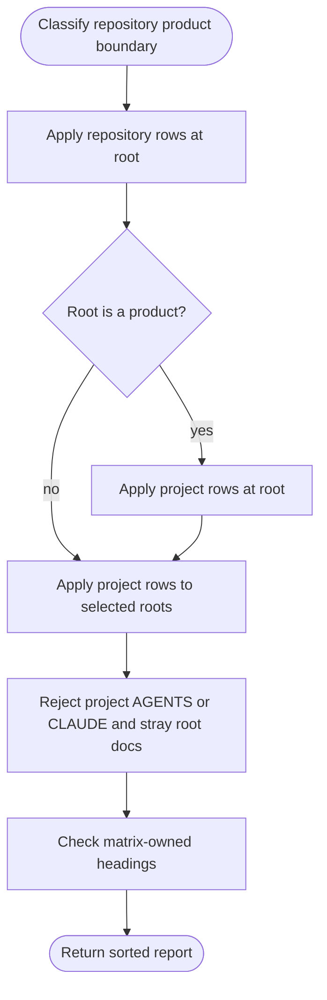

<!-- HANDWRITE-BEGIN gap="missing-generator:schema:aw-meta-doc-ownership-matrix" tracker="#1497" reason="Ownership and inheritance semantics require an explicit owner-approved matrix." -->

# META-Doc Ownership Matrix

## Scenarios
<!-- type: scenarios lang: yaml -->

```yaml
id: aw-meta-doc-ownership-matrix-scenarios
scenarios:
  - id: S1
    title: monorepo separates repository and project facts
    given:
      - "the repository root is not itself a product"
      - "one or more app/project roots are selected"
    then:
      - "AGENTS.md and CLAUDE.md exist only at repository root"
      - "each selected project owns README.md, CONTRIBUTING.md, and CAPABILITIES.md"
      - "root CAPABILITIES.md is rejected"
  - id: S2
    title: single-product repository composes both layers at root
    given:
      - "the repository root is declared as a product"
    then:
      - "repository AGENTS.md and CLAUDE.md remain root-only"
      - "README.md and CONTRIBUTING.md satisfy both repo and project contracts"
      - "root CAPABILITIES.md is required as the product goal contract"
  - id: S3
    title: project-local agent docs fail actionably
    given:
      - "a selected project contains AGENTS.md or CLAUDE.md"
    then:
      - "validation emits project_agent_doc_forbidden"
      - "remediation points to project CONTRIBUTING.md or generated CLI guidance"
  - id: S4
    title: canonical sections are matrix-owned
    given:
      - "a required META-doc heading is absent"
    then:
      - "validation names the exact file and heading"
      - "the remediation tells the agent to use the layer skeleton and link inherited facts"
  - id: S5
    title: documentation projection cannot drift
    when:
      - "the CONTRIBUTING META-doc matrix block is checked"
    then:
      - "its bytes equal the renderer output from the ownership matrix"
```

## Schema
<!-- type: schema lang: yaml -->

```yaml
$schema: "https://json-schema.org/draft/2020-12/schema"
$id: aw-meta-doc-ownership-matrix
type: array
minItems: 7
items:
  type: object
  additionalProperties: false
  required: [layer, filename, fact_owner, required_headings, inherits_from]
  properties:
    layer:
      type: string
      enum: [repository, project]
    filename:
      type: string
      enum: [AGENTS.md, CLAUDE.md, README.md, CONTRIBUTING.md, CAPABILITIES.md]
    fact_owner:
      type: string
      minLength: 1
    required_headings:
      type: array
      items:
        type: string
        pattern: '^#{2,3} '
    inherits_from:
      type: string
      minLength: 1
```

## Logic
<!-- type: logic lang: mermaid -->



## Unit Test

```mermaid
---
id: aw-meta-doc-ownership-matrix-unit-test
coverage_kind: unit
evidence:
  command: "cargo test -p agentic-workflow --lib meta_doc_ownership -- --nocapture"
---
requirementDiagram
  requirement monorepo_matrix {
    id: UT1
    text: "a valid monorepo plus project layout passes"
    risk: high
    verifymethod: test
  }
  requirement single_product_matrix {
    id: UT2
    text: "a single-product root composes repository and project contracts"
    risk: high
    verifymethod: test
  }
  requirement agent_doc_placement {
    id: UT3
    text: "project-local AGENTS or CLAUDE files fail with deterministic remediation"
    risk: high
    verifymethod: test
  }
  requirement root_capability_boundary {
    id: UT4
    text: "root CAPABILITIES requires repository product classification"
    risk: medium
    verifymethod: test
  }
  requirement matrix_projection {
    id: UT5
    text: "CONTRIBUTING ownership documentation is rendered from the matrix"
    risk: medium
    verifymethod: test
  }
```

<!-- type: unit-test lang: mermaid -->



## Changes
<!-- type: changes lang: yaml -->

```yaml
changes:
  - path: apps/agentic-workflow/src/cli/meta_docs.rs
    action: create
    section: logic
    impl_mode: codegen
    description: Define the serializable ownership matrix, renderer, deterministic findings, and repo/project layout validator.
  - path: apps/agentic-workflow/src/cli/mod.rs
    action: modify
    section: logic
    impl_mode: codegen
    description: Export the shared META-doc contract for current validators and the dependent producer issue.
  - path: CONTRIBUTING.md
    action: modify
    section: schema
    impl_mode: hand-written
    description: Replace parallel hand-maintained ownership tables with one marker-owned matrix projection and explicit single-product behavior.
  - path: apps/agentic-workflow/tests/cli/tests/root_doc_allowlist_test.rs
    action: modify
    section: unit-test
    impl_mode: codegen
    description: Derive the root allowlist and project-agent-doc names from the shared matrix and validate Agentic Workflow's real project layout.
  - path: apps/agentic-workflow/tests/cli/tests/root_doc_mirror_test.rs
    action: modify
    section: unit-test
    impl_mode: codegen
    description: Assert the mirrored agent docs retain repository-only ownership in the same matrix.
  - path: CLAUDE.md
    action: modify
    section: scenarios
    impl_mode: hand-written
    description: Repair pre-existing branch-allocation drift against the AGENTS projection exposed by the shared validator tests.
  - path: apps/agentic-workflow/templates/cli/mainthread/CLAUDE.md.tmpl
    action: modify
    section: scenarios
    impl_mode: hand-written
    description: Keep the semantic root-agent template aligned with the repaired live projection.
  - path: apps/agentic-workflow/CAPABILITIES.md
    action: modify
    section: scenarios
    impl_mode: hand-written
    description: Register the #1497 capability work root and verification evidence.
  - path: apps/agentic-workflow/tech-design/surface/specs/aw-meta-doc-ownership-matrix.md
    action: create
    section: schema
    impl_mode: hand-written
    description: Record the owner-approved layer, placement, inheritance, and diagnostics contract.
```
<!-- HANDWRITE-END -->
