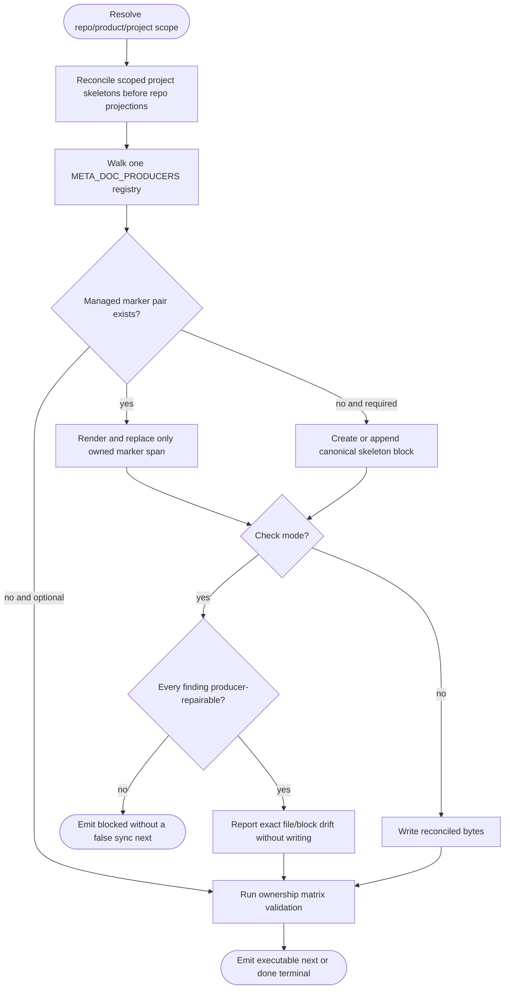

<!-- HANDWRITE-BEGIN gap="missing-generator:logic:aw-meta-doc-producer" tracker="#1498" reason="Marker preservation and legacy projector convergence require an explicit owner-approved producer registry." -->

# META-Doc Producer Control Plane

## Scenarios
<!-- type: scenarios lang: yaml -->

```yaml
id: aw-meta-doc-producer-scenarios
scenarios:
  - id: S1
    title: initialize a fresh repository and project
    given:
      - "a configured project-local aw.toml may exist before its README.md"
    when:
      - "an agent runs aw meta init with a project path or configured project"
    then:
      - "repo AGENTS.md, CLAUDE.md, README.md, and CONTRIBUTING.md skeletons exist"
      - "project README.md, CONTRIBUTING.md, and CAPABILITIES.md skeletons exist"
      - "scoped project skeletons exist before the repo Projects table reads their Brief sections (#2186)"
      - "stdout names an executable aw meta check command"
  - id: S2
    title: synchronize marker-owned blocks without touching human bytes
    given:
      - "human content exists before or after an AW marker pair"
    when:
      - "aw meta sync reconciles the document"
    then:
      - "only bytes from the owned start marker through the owned end marker change"
      - "a second sync is byte-idempotent"
  - id: S3
    title: check detects exact drift without writing
    given:
      - "one or more registered managed blocks are stale or malformed"
    when:
      - "aw meta check runs"
    then:
      - "the command exits non-zero"
      - "each finding names the file, block id, and aw meta sync remediation"
      - "no file byte changes"
      - "only producer-repairable findings emit aw meta sync; non-syncable layout findings emit a blocked terminal without a next-command loop (#2188)"
      - "an explicitly project-scoped check excludes unrelated repository allowlist findings while the no-scope global check retains them (#2188)"
  - id: S4
    title: root agent guidance has one semantic source
    when:
      - "CLAUDE.md and AGENTS.md are initialized or synchronized"
    then:
      - "both derive from the compiled CLAUDE template"
      - "AGENTS.md differs only by the explicit Codex whitelist projection"
  - id: S5
    title: legacy initialization delegates instead of competing
    when:
      - "aw new installs or refreshes project assets"
    then:
      - "the same META_DOC_PRODUCERS registry writes all single-product META-docs"
      - "legacy projects-table, trait-table, and ownership-matrix blocks use the registry"
  - id: S6
    title: stale-binary reprojection never destroys newer projection content (#1912)
    given:
      - "the checkout contains its own copy of templates/cli/mainthread/CLAUDE.md.tmpl"
    when:
      - "aw meta init or aw meta sync renders the repo-claude or repo-agents block"
    then:
      - "the live checkout template copy is rendered, never the binary's embedded include_str! snapshot"
      - "projection content already matching the checkout template is left byte-unchanged"
  - id: S7
    title: content-regression guard blocks a destructive stale-binary rewrite
    given:
      - "no live checkout template copy is available so rendering falls back to the embedded snapshot"
      - "the installed binary is provably behind the checkout's declared source version"
      - "the fallback render would delete existing projection lines"
    when:
      - "aw meta sync runs without --force-stale"
    then:
      - "the write is refused with a content_regression_blocked finding naming the rebuild/upgrade remediation"
      - "the existing projection file is left byte-unchanged"
      - "--force-stale overrides the guard and lets the rewrite proceed"
  - id: S8
    title: check distinguishes binary-stale drift from genuine drift (#1912 R4)
    given:
      - "the embedded template snapshot is stale relative to the checkout, or the binary is behind the checkout's declared source version"
    when:
      - "aw meta check finds a resulting projection mismatch"
    then:
      - "the output's binary_stale field names the checkout source version or checkout HEAD"
      - "every finding's remediation names rebuild (cargo install) or aw upgrade, never aw meta sync"
      - "next names cargo install --path apps/agentic-workflow instead of aw meta sync"
```

## Schema
<!-- type: schema lang: yaml -->

```yaml
$schema: "https://json-schema.org/draft/2020-12/schema"
$id: aw-meta-doc-producer
type: object
additionalProperties: false
required: [schema_version, action, status, repository_root, projects, changes, findings, next, terminal]
properties:
  schema_version:
    const: aw.meta.v1
  action:
    enum: [meta_init, meta_sync, meta_check]
  status:
    enum: [initialized, synchronized, clean, drift, binary_stale, blocked]
  repository_root:
    type: string
  repository_is_product:
    type: boolean
  binary_stale:
    description: >-
      #1912 R4: set to the checkout's declared source version (semver-behind
      signal) or the literal "checkout HEAD" (content-precise signal — the
      embedded CLAUDE template snapshot differs from the checkout's live
      copy) when the installed binary is provably behind the checkout.
      Absent when the binary is not stale.
    type: string
  projects:
    type: array
    items: { type: string }
  changes:
    type: array
    items:
      type: object
      additionalProperties: false
      required: [path, block, status]
      properties:
        path: { type: string }
        block: { type: string, minLength: 1 }
        status: { enum: [created, updated, unchanged] }
  findings:
    type: array
    items:
      type: object
      required: [code, path, message, remediation]
      properties:
        code:
          enum: [managed_block_missing, managed_block_stale, managed_block_malformed, meta_doc_missing, meta_doc_unreadable, meta_doc_repository_unreadable, meta_doc_section_missing, project_agent_doc_forbidden, root_capabilities_requires_product, unexpected_root_meta_doc, content_regression_blocked]
        path: { type: string }
        message: { type: string }
        remediation: { type: string }
  next:
    oneOf:
      - type: "null"
      - type: object
        required: [command]
        properties:
          # #1912 R4: `binary_stale` findings emit a rebuild command instead
          # of `aw meta sync`/`aw meta check`.
          command: { type: string, pattern: '^(aw meta (check|sync)|cargo install --path apps/agentic-workflow)' }
  terminal:
    oneOf:
      - type: "null"
      - type: object
        required: [status]
        properties:
          status: { enum: [done, blocked] }
```

## Logic
<!-- type: logic lang: mermaid -->



## Unit Test

```mermaid
---
id: aw-meta-doc-producer-unit-test
coverage_kind: unit
evidence:
  command: "cargo test -p agentic-workflow --lib cli::meta::tests:: -- --nocapture"
---
requirementDiagram
  requirement fresh_init {
    id: UT1
    text: "fresh path-selected and configured projects receive all layer skeletons before the repo Projects table reads their Brief sections (#2186)"
    risk: high
    verifymethod: test
  }
  requirement idempotent_sync {
    id: UT2
    text: "sync is byte-idempotent and preserves human-owned regions"
    risk: high
    verifymethod: test
  }
  requirement drift_repair {
    id: UT3
    text: "tampered managed blocks are detected by check and repaired by sync"
    risk: high
    verifymethod: test
  }
  requirement read_only_check {
    id: UT4
    text: "check never mutates a drifting document"
    risk: high
    verifymethod: test
  }
  requirement shared_agent_projection {
    id: UT5
    text: "aw new and aw meta use one root-agent template plus runtime whitelist"
    risk: medium
    verifymethod: test
  }
  requirement chain_surface {
    id: UT6
    text: "meta init, sync, and check are classified in the real CLI leaf registry"
    risk: medium
    verifymethod: test
  }
  requirement checkout_template_sourcing {
    id: UT7
    text: "repo-claude/repo-agents rendering prefers a live checkout template copy over the binary's embedded snapshot, and the 2026-07-17 destructive-reprojection shape survives byte-for-byte (#1912 R2/AC1)"
    risk: high
    verifymethod: test
  }
  requirement content_regression_guard {
    id: UT8
    text: "a fallback-embedded rewrite that would delete existing content while the binary is provably behind the checkout is refused unless --force-stale is set (#1912 R3)"
    risk: high
    verifymethod: test
  }
  requirement binary_stale_diagnosis {
    id: UT9
    text: "aw meta check names rebuild/upgrade remediation, not aw meta sync, when the embedded template snapshot is stale (#1912 R4/AC3)"
    risk: high
    verifymethod: test
  }
  requirement non_syncable_terminal {
    id: UT10
    text: "non-syncable layout findings never emit aw meta sync, and scoped project checks ignore unrelated root allowlist findings (#2188)"
    risk: high
    verifymethod: test
  }
```

<!-- type: unit-test lang: mermaid -->



## Changes
<!-- type: changes lang: yaml -->

```yaml
changes:
  - path: apps/agentic-workflow/src/cli/meta.rs
    action: create
    section: logic
    impl_mode: codegen
    description: Register and implement the init/sync/check producer engine, reconcile scoped project skeletons before repo table projections (#2186), distinguish producer-repairable drift from blocked non-syncable layout findings (#2188), preserve marker-owned regions, emit structured output, and cover greenfield configured projects.
  - path: apps/agentic-workflow/src/cli/commands.rs
    action: modify
    section: logic
    impl_mode: codegen
    description: Register and dispatch the public aw meta namespace.
  - path: apps/agentic-workflow/src/cli/init.rs
    action: modify
    section: logic
    impl_mode: codegen
    description: Delete the independent root-doc projectors and delegate aw new to the shared META-doc registry.
  - path: apps/agentic-workflow/src/cli/doc_mirror.rs
    action: modify
    section: schema
    impl_mode: codegen
    description: Include aw meta in the generated workflow command table.
  - path: apps/agentic-workflow/src/cli/chain.rs
    action: modify
    section: schema
    impl_mode: codegen
    description: Classify meta init/sync as mutating core verbs and meta check as read-only.
  - path: AGENTS.md
    action: modify
    section: scenarios
    impl_mode: hand-written
    description: Project the new public META-doc surface into Codex guidance.
  - path: CLAUDE.md
    action: modify
    section: scenarios
    impl_mode: hand-written
    description: Project the new public META-doc surface into Claude guidance.
  - path: apps/agentic-workflow/templates/cli/mainthread/CLAUDE.md.tmpl
    action: modify
    section: scenarios
    impl_mode: hand-written
    description: Keep the semantic root-agent template aligned with both runtime projections.
  - path: CONTRIBUTING.md
    action: modify
    section: schema
    impl_mode: hand-written
    description: Name aw meta as the sole writer/checker for the ownership matrix contract.
  - path: apps/agentic-workflow/README.md
    action: modify
    section: scenarios
    impl_mode: hand-written
    description: Start greenfield and brownfield lifecycle guidance at the META-doc control plane.
  - path: apps/agentic-workflow/CONTRIBUTING.md
    action: modify
    section: schema
    impl_mode: hand-written
    description: Classify aw meta as part of the core CLI lifecycle surface.
  - path: apps/agentic-workflow/CAPABILITIES.md
    action: modify
    section: scenarios
    impl_mode: hand-written
    description: Register issue 1498 and its verification evidence under the agent-first CLI capability.
  - path: apps/agentic-workflow/src/cli/meta.rs
    action: modify
    section: logic
    impl_mode: codegen
    description: |
      Issue #1912: source repo-claude/repo-agents rendering from the live
      checkout copy of CLAUDE.md.tmpl when present instead of the binary's
      embedded include_str! snapshot (R2); add a content-regression guard
      that refuses a fallback-embedded rewrite that would delete existing
      content while the binary is provably behind the checkout, with a
      --force-stale override (R3); and add a binary_stale output field so
      aw meta check routes to rebuild/upgrade remediation instead of aw meta
      sync when the embedded snapshot itself is the source of drift (R4).
  - path: apps/agentic-workflow/src/cli/drift.rs
    action: modify
    section: logic
    impl_mode: codegen
    description: |
      Issue #1912 R1/R4: confirm meta.sync/meta.init are already classified
      mutating in the #1417 skew gate (regression test), and add a
      read-only binary_behind_checkout_source_version accessor reused by
      aw meta check's stale-binary diagnosis.
```
<!-- HANDWRITE-END -->
