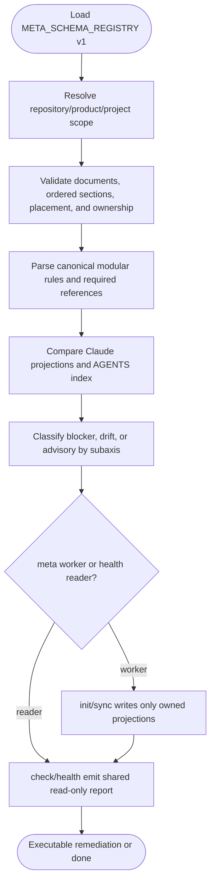

<!-- HANDWRITE-BEGIN gap="missing-generator:meta-schema-rules-health" tracker="#1816" reason="Cross-runtime META projection and severity policy need an explicit typed contract." -->

# META-Doc Schema, Rules, and Health Axis

## Scenarios
<!-- type: scenarios lang: yaml -->

```yaml
id: aw-meta-doc-schema-rules-health-scenarios
scenarios:
  - id: S1
    title: discover one live META schema
    when:
      - "an agent runs aw meta schema agent-rule"
    then:
      - "stdout reports the version, audience, semantic path, frontmatter fields, ordered sections, projection, validator, and example"
      - "the result carries an explicit terminal marker"
  - id: S2
    title: validate one canonical rule concern
    given:
      - "a Markdown file lives below .agents/rules/<domain>"
    then:
      - "its stable id equals the semantic path id"
      - "frontmatter declares scope, activation, targets, and enforcement"
      - "Intent, Rules, Verification, and References appear exactly once in order"
      - "invalid globs, duplicate ids, unknown fields or sections, and unresolved required references are blockers"
  - id: S3
    title: project runtime views deterministically
    when:
      - "aw meta sync runs"
    then:
      - "Claude-targeted rules are generated below .claude/rules with supported paths metadata"
      - "AGENTS.md receives a generated semantic rule index for Codex"
      - "AGY consumes the canonical .agents/rules tree"
      - "a second sync is byte-identical"
  - id: S4
    title: keep runtime facts single-owned
    then:
      - "AGENTS.md is a compact authority bootstrap and generated rule index"
      - "CLAUDE.md imports @AGENTS.md and contains only Claude-specific loading behavior"
      - ".codex/rules is never an instruction projection target"
      - "skills remain human-facing triggers and the CLI owns mid-loop agent guidance"
  - id: S5
    title: focused health reuses META validation
    when:
      - "aw health --project <project> meta runs"
    then:
      - "documents, schema, ownership, rules, projections, references, placement, and coverage subaxes come from the same validation report as aw meta check"
      - "blocker and drift findings name aw meta init, sync, or schema remediation"
      - "health performs no writes"
  - id: S6
    title: preserve the capability boundary
    then:
      - "META validates CAPABILITIES.md location, basic shape, and references"
      - "aw capability remains responsible for promises, work roots, EC, TD, and verification closure"
      - "self-AW keeps META visible but advisory to its capability and configured-EC hard gates"
```

## Schema
<!-- type: schema lang: yaml -->

```yaml
$schema: "https://json-schema.org/draft/2020-12/schema"
$id: aw-meta-doc-schema-rules-health-axis
type: object
additionalProperties: false
required: [schema_version, clean, blocker_count, drift_count, advisory_count, coverage_percent, axes, findings, next_command]
properties:
  schema_version:
    const: aw.meta.schema.v1
  clean:
    type: boolean
  blocker_count:
    type: integer
    minimum: 0
  drift_count:
    type: integer
    minimum: 0
  advisory_count:
    type: integer
    minimum: 0
  coverage_percent:
    type: integer
    minimum: 0
    maximum: 100
  axes:
    type: object
    required: [documents, schema, ownership, rules, projections, references, placement, coverage]
  findings:
    type: array
    items:
      type: object
      additionalProperties: false
      required: [code, axis, severity, path, message, remediation]
      properties:
        code: { type: string }
        axis: { enum: [documents, schema, ownership, rules, projections, references, placement, coverage] }
        severity: { enum: [blocker, drift, advisory] }
        path: { type: string }
        message: { type: string }
        remediation: { type: string }
  next_command:
    oneOf:
      - type: "null"
      - type: string
        pattern: "^aw meta (init|sync|schema)"
```

## Logic
<!-- type: logic lang: mermaid -->



## Unit Test

```mermaid
---
id: aw-meta-doc-schema-rules-health-unit-test
coverage_kind: unit
evidence:
  command: "cargo test -p agentic-workflow --lib cli::meta -- --nocapture && cargo test -p agentic-workflow --test cli_tests root_doc_mirror_test -- --nocapture"
---
requirementDiagram
  requirement schema_registry {
    id: UT1
    text: "every supported kind has one versioned audience and shape contract"
    risk: high
    verifymethod: test
  }
  requirement canonical_rule {
    id: UT2
    text: "canonical rule validation rejects invalid identity, metadata, glob, section, and reference shapes"
    risk: high
    verifymethod: test
  }
  requirement idempotent_projection {
    id: UT3
    text: "Claude projections and the AGENTS index reach a byte-identical second sync"
    risk: high
    verifymethod: test
  }
  requirement runtime_adapter {
    id: UT4
    text: "AGENTS stays compact while CLAUDE imports it and contains only its runtime delta"
    risk: high
    verifymethod: test
  }
  requirement focused_health {
    id: UT5
    text: "focused META health returns the shared report and exact remediation without writing"
    risk: high
    verifymethod: test
  }
```

<!-- type: unit-test lang: mermaid -->



## Changes
<!-- type: changes lang: yaml -->

```yaml
files:
  - path: apps/agentic-workflow/src/cli/meta_schema.rs
    action: create
    purpose: "Own the typed registry, rule parser, projection renderer, severity policy, and shared report."
  - path: apps/agentic-workflow/src/cli/meta.rs
    action: modify
    purpose: "Add schema discovery and make init/sync/check consume the shared registry/report."
  - path: apps/agentic-workflow/src/cli/project.rs
    action: modify
    purpose: "Expose the focused and full-rollup META health axis without mutating."
  - path: .agents/rules
    action: create
    purpose: "Own reusable agent instructions one concern per semantic path."
  - path: .claude/rules
    action: generate
    purpose: "Project only Claude-targeted canonical rules using supported path metadata."
  - path: AGENTS.md
    action: modify
    purpose: "Keep a compact authority bootstrap and generated Codex routing index."
  - path: CLAUDE.md
    action: modify
    purpose: "Import AGENTS and retain only Claude-specific runtime behavior."
```
<!-- HANDWRITE-END -->
