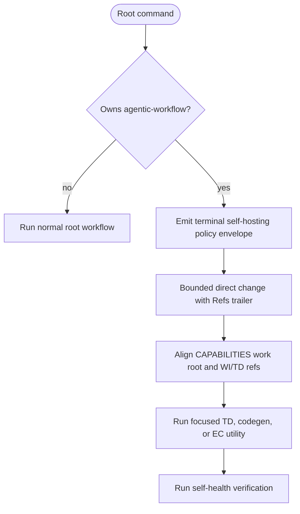

<!-- HANDWRITE-BEGIN gap="missing-generator:logic:self-hosting-runner-policy" tracker="#1501" reason="Admission policy couples tracker ownership, runner envelopes, and self-health gate classification." -->

# Self-hosting Root-runner Policy

## Schema
<!-- type: schema lang: yaml -->

```yaml
policy_envelope:
  schema_version: aw.cli.v1
  status: blocked
  action: self_hosting_policy
  root: { kind: project|capability|wi, id: non-empty }
  completion:
    root_complete: false
    workflow_complete: false
    requires_hitl: false
  next:
    kind: policy
    command: null
  policy_mode: sanctioned_direct_commit
  hard_gates:
    - capability_work_root_alignment
    - closing_work_item_and_td_refs
    - configured_ec_claim_verification
  advisory_axes: [managed, semantic, traceability, td_lock, cb_verify, cold_rebuild, tests, regenerable]
  remediation:
    - bounded direct commit with Refs trailer
    - CAPABILITIES.md work-root alignment
    - focused TD/codegen or EC verification when in scope
    - aw health verification
health_output:
  when: project in [agentic-workflow, aw]
  fields: [policy_mode, hard_gates, advisory_axes]
```

## Logic
<!-- type: logic lang: mermaid -->



`aw capability run --project agentic-workflow`, its capability-scoped form,
and `aw wi run <id>` for a WI labelled `project:`, `app:`, or `lib:`
`agentic-workflow` stop at admission before they can execute a lifecycle tick.
Self-AW rollup uses `aw health --project agentic-workflow claims`; health never
emits the forbidden root-runner command for the self project.

## Unit Test
<!-- type: unit-test lang: mermaid -->

```mermaid
---
id: self-hosting-runner-policy-unit
coverage_kind: unit
evidence:
  command: cargo test -p agentic-workflow --lib cli::run::tests::self_hosting_ -- --nocapture
---
requirementDiagram
  requirement terminal_policy { id: UT1 text: "Self policy envelope has no next command or invoke" risk: high verifymethod: test }
  requirement safe_rollup { id: UT2 text: "Self work-item identity routes rollup to read-only health" risk: high verifymethod: test }
```

## E2E Test
<!-- type: e2e-test lang: yaml -->

```yaml
e2e_tests:
  - id: self-hosting-capability-admission
    capability_id: workflow-root-runner
    claim_id: self-hosting-root-runner-policy
    command: cargo test -p agentic-workflow --test self_hosting_runner_policy_cli_test self_hosting_project_and_capability_roots_are_rejected_before_mutation -- --nocapture
    assertions:
      - "project and capability root commands emit aw.cli.v1 blocked policy envelopes"
      - "the fixture tree is byte-for-byte unchanged"
  - id: self-hosting-wi-admission
    capability_id: workflow-root-runner
    claim_id: self-hosting-root-runner-policy
    command: cargo test -p agentic-workflow --test self_hosting_runner_policy_cli_test self_hosting_work_item_root_is_rejected_before_loop_state_or_dispatch -- --nocapture
    assertions:
      - "a locally resolved app:agentic-workflow work item is rejected before loop-state access or dispatch"
      - "the local issue store is unchanged"
  - id: self-hosting-health-policy
    capability_id: workflow-root-runner
    claim_id: self-hosting-root-runner-policy
    command: cargo test -p agentic-workflow --test self_hosting_runner_policy_cli_test self_hosting_health_reports_policy_and_never_points_back_to_root_runner -- --nocapture
    assertions:
      - "health emits policy_mode, hard_gates, and advisory_axes"
      - "health next never re-enters aw capability run for the self project"
```

## Changes
<!-- type: changes lang: yaml -->

```yaml
changes:
  - path: apps/agentic-workflow/src/cli/run.rs
    action: modify
    impl_mode: hand-written
  - path: apps/agentic-workflow/src/cli/capability.rs
    action: modify
    impl_mode: hand-written
  - path: apps/agentic-workflow/src/cli/project.rs
    action: modify
    impl_mode: hand-written
  - path: apps/agentic-workflow/src/cli/chain.rs
    action: modify
    impl_mode: hand-written
  - path: apps/agentic-workflow/tests/self_hosting_runner_policy_cli_test.rs
    action: create
    impl_mode: hand-written
```

<!-- HANDWRITE-END -->
