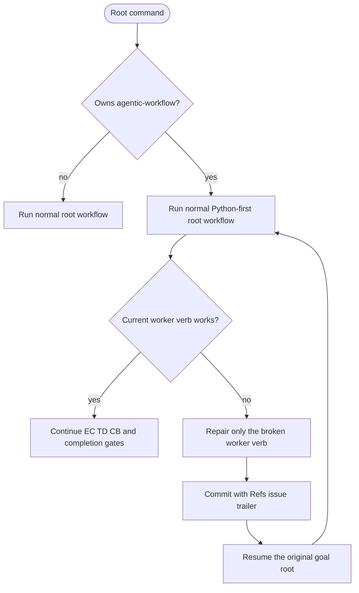

<!-- HANDWRITE-BEGIN gap="missing-generator:logic:self-hosting-runner-policy" tracker="#1501" reason="Admission policy couples tracker ownership, runner envelopes, and self-health gate classification." -->

# Python-first Self-hosting Policy

## Schema
<!-- type: schema lang: yaml -->

```yaml
self_hosting:
  policy_mode: python_first_lifecycle
  root_runner_allowed: true
  admitted_roots: [wi, capability, backlog]
  direct_repair_default: false
  direct_repair_fallback: bounded_direct_repair
  fallback_trigger: current_worker_verb_broken
  required_trailer: "Refs #<issue>"
  hard_gates:
    - capability_work_root_alignment
    - closing_work_item_and_td_refs
    - configured_ec_claim_verification
  advisory_axes: [managed, semantic, traceability, td_lock, cb_verify, cold_rebuild, tests, regenerable]
  fallback:
    - prove the exact worker verb is broken
    - repair only that bounded verb
    - commit with a Refs trailer
    - resume the original goal root
health_output:
  when: project in [agentic-workflow, aw]
  fields: [policy_mode, required_trailer, root_runner_allowed, direct_repair_default, direct_repair_fallback, fallback_trigger, hard_gates, advisory_axes]
```

## Logic
<!-- type: logic lang: mermaid -->



`aw goal capability --project agentic-workflow`, its capability-scoped form,
`aw goal wi <id>` for a WI owned by `agentic-workflow`, and `aw goal backlog
--project agentic-workflow` use the normal root runner. Identity, reviewed
graph, Python EC/TD, CB, persistence, and completion failures remain
fail-closed. `aw health` reports the complete policy field set. Direct repair
is not a root-admission alternative: it is allowed only after the exact
worker verb required by the current envelope is shown to be broken, stays
bounded to that verb, carries `Refs #<issue>`, and resumes the original root.

## Unit Test
<!-- type: unit-test lang: mermaid -->

```mermaid
---
id: self-hosting-runner-policy-unit
coverage_kind: unit
evidence:
  command: cargo test -p agentic-workflow --lib cli::run::tests::self_hosting_ -- --nocapture
---
requirementDiagram
  requirement admitted_roots { id: UT1 text: "Self WI, capability, and backlog roots use normal lifecycle admission" risk: high verifymethod: test }
  requirement fallback_policy { id: UT2 text: "Health enables roots and scopes direct repair to a broken current worker verb" risk: high verifymethod: test }
```

## E2E Test
<!-- type: e2e-test lang: yaml -->

```yaml
e2e_tests:
  - id: self-hosting-capability-admission
    capability_id: workflow-root-runner
    claim_id: self-hosting-root-runner-policy
    category: behavior
    command: python3 apps/agentic-workflow/external-contracts/src/runner.py --case self-hosting-capability-admission
    assertions:
      - "capability and backlog roots use normal self-hosted lifecycle admission"
      - "normal graph and capability gates remain fail-closed and machine-actionable"
  - id: self-hosting-wi-admission
    capability_id: workflow-root-runner
    claim_id: self-hosting-root-runner-policy
    category: behavior
    command: python3 apps/agentic-workflow/external-contracts/src/runner.py --case self-hosting-wi-admission
    assertions:
      - "the self-hosted WI root enters the normal EC-first lifecycle"
      - "the envelope exposes a machine-actionable worker command"
  - id: self-hosting-bounded-admission
    capability_id: workflow-root-runner
    claim_id: self-hosting-root-runner-policy
    category: efficiency
    command: python3 apps/agentic-workflow/external-contracts/src/runner.py --case self-hosting-bounded-admission
    assertions:
      - "backlog admission reaches reviewed-graph preflight instead of a self-hosting rejection"
      - "repeat WI admission is byte-stable and does not mutate lifecycle state"
  - id: self-hosting-identity-stability
    capability_id: workflow-root-runner
    claim_id: self-hosting-root-runner-policy
    category: stability
    command: python3 apps/agentic-workflow/external-contracts/src/runner.py --case self-hosting-identity-stability
    assertions:
      - "a malformed self-hosting WI identity returns a normal blocked envelope"
      - "the failed resolution leaves repository and runtime state byte-identical"
  - id: self-hosting-health-policy
    capability_id: workflow-root-runner
    claim_id: self-hosting-root-runner-policy
    category: behavior
    command: cargo test -p agentic-workflow --lib self_hosting_health_allows_python_roots_and_scopes_direct_repair_to_fallback -- --nocapture
    assertions:
      - "health reports python_first_lifecycle with root_runner_allowed true"
      - "direct repair is non-default and requires current_worker_verb_broken"
```

## Changes
<!-- type: changes lang: yaml -->

```yaml
changes:
  - path: apps/agentic-workflow/src/cli/run.rs
    action: modify
    impl_mode: hand-written
  - path: apps/agentic-workflow/src/cli/capability.rs
    action: modify
    impl_mode: hand-written
  - path: apps/agentic-workflow/src/cli/project.rs
    action: modify
    impl_mode: hand-written
  - path: apps/agentic-workflow/src/cli/chain.rs
    action: modify
    impl_mode: hand-written
  - path: apps/agentic-workflow/src/cli/goal.rs
    action: modify
    impl_mode: hand-written
    description: "#1899: aw goal wi/capability/backlog thin shells delegate into run_wi_root/run_capability_root/run_backlog_root, so this policy's admission check runs for every goal-namespace root exactly as it did for the retired runner verbs."
  - path: apps/agentic-workflow/external-contracts/src/migration_clusters/self_hosting_admission.py
    action: modify
    impl_mode: hand-written
```

<!-- HANDWRITE-END -->
