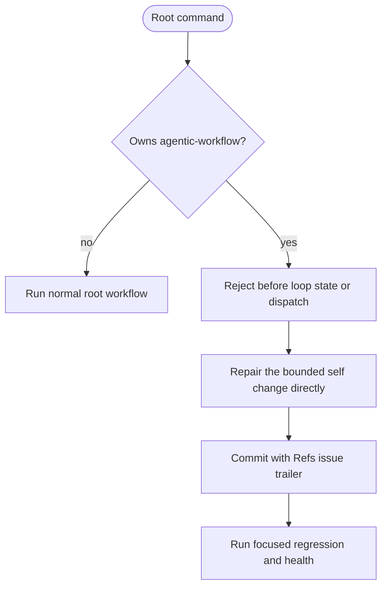

<!-- HANDWRITE-BEGIN gap="missing-generator:logic:self-hosting-runner-policy" tracker="#1501" reason="Admission policy couples tracker ownership, runner envelopes, and self-health gate classification." -->

# Sanctioned Direct-commit Self-hosting Policy

## Schema
<!-- type: schema lang: yaml -->

```yaml
self_hosting:
  policy_mode: sanctioned_direct_commit
  root_runner_allowed: false
  rejected_roots: [wi, capability, backlog]
  direct_repair_default: true
  required_trailer: "Refs #<issue>"
  hard_gates:
    - capability_work_root_alignment
    - closing_work_item_and_td_refs
    - configured_ec_claim_verification
  advisory_axes: [managed, semantic, traceability, td_lock, cb_verify, cold_rebuild, tests, regenerable]
  remediation:
    - bounded direct commit with Refs trailer
    - CAPABILITIES.md work-root alignment
    - focused TD/codegen or EC verification when in scope
    - aw health verification
health_output:
  when: project in [agentic-workflow, aw]
  fields: [policy_mode, required_trailer, root_runner_allowed, direct_repair_default, hard_gates, advisory_axes]
```

## Logic
<!-- type: logic lang: mermaid -->



`aw goal capability --project agentic-workflow`, its capability-scoped form,
`aw goal wi <id>` for a WI owned by `agentic-workflow`, and `aw goal backlog
--project agentic-workflow` are rejected before loop state, tracker mutation,
graph loading, or worker dispatch. Identity-resolution errors fail closed
instead of entering the normal root runner. `aw health` reports the complete
policy field set and may name focused remediation, but it never routes
self-repair back into any `aw goal` root. Repository authoring rules separately
require bounded direct commits, `Refs #<issue>` trailers, capability work-root
alignment, and focused verification.

## Unit Test
<!-- type: unit-test lang: mermaid -->

```mermaid
---
id: self-hosting-runner-policy-unit
coverage_kind: unit
evidence:
  command: cargo test -p agentic-workflow --lib cli::run::tests::self_hosting_ -- --nocapture
---
requirementDiagram
  requirement rejected_roots { id: UT1 text: "Self WI, capability, and backlog roots reject before mutation or dispatch" risk: high verifymethod: test }
  requirement direct_policy { id: UT2 text: "Health identifies sanctioned direct commit mode and never routes to a self root" risk: high verifymethod: test }
```

## E2E Test
<!-- type: e2e-test lang: yaml -->

```yaml
e2e_tests:
  # Contract ids retain their published names for lock compatibility; the
  # assertions below are the authoritative rejection semantics.
  - id: self-hosting-capability-admission
    capability_id: workflow-root-runner
    claim_id: self-hosting-root-runner-policy
    category: behavior
    command: cargo test -p agentic-workflow --test self_hosting_runner_policy_cli_test self_hosting_project_capability_and_backlog_roots_are_rejected_before_mutation -- --nocapture
    assertions:
      - "project, capability, and backlog roots emit action self_hosting_policy and policy_mode sanctioned_direct_commit"
      - "the envelopes expose no invoke command and both the repository tree and resolved runtime workspace remain byte-identical"
  - id: self-hosting-wi-admission
    capability_id: workflow-root-runner
    claim_id: self-hosting-root-runner-policy
    category: behavior
    command: cargo test -p agentic-workflow --test self_hosting_runner_policy_cli_test self_hosting_work_item_root_is_rejected_before_loop_state_or_dispatch -- --nocapture
    assertions:
      - "the WI root emits action self_hosting_policy before loop state or dispatch"
      - "the envelope exposes no invoke command and both the repository tree and resolved runtime workspace remain byte-identical"
  - id: self-hosting-bounded-admission
    capability_id: workflow-root-runner
    claim_id: self-hosting-root-runner-policy
    category: efficiency
    command: cargo test -p agentic-workflow --test self_hosting_runner_policy_cli_test self_hosting_backlog_rejects_before_reviewed_graph_or_state_io -- --nocapture
    assertions:
      - "backlog admission succeeds without a reviewed graph and never creates backlog state"
      - "repeated invocations emit byte-identical envelopes and leave both the repository tree and sentinel-seeded resolved runtime workspace byte-identical"
  - id: self-hosting-identity-stability
    capability_id: workflow-root-runner
    claim_id: self-hosting-root-runner-policy
    category: stability
    command: cargo test -p agentic-workflow --test self_hosting_runner_policy_cli_test self_hosting_wi_identity_resolution_errors_fail_closed_without_mutation -- --nocapture
    assertions:
      - "a malformed self-hosting WI identity returns a process error instead of entering the root runner"
      - "the failed resolution creates no loop state and leaves both the repository tree and resolved runtime workspace byte-identical"
  - id: self-hosting-health-policy
    capability_id: workflow-root-runner
    claim_id: self-hosting-root-runner-policy
    category: behavior
    command: cargo test -p agentic-workflow --test self_hosting_runner_policy_cli_test self_hosting_health_reports_policy_and_never_points_back_to_root_runner -- --nocapture
    assertions:
      - "health pins policy_mode, required_trailer, root_runner_allowed, direct_repair_default, and exact complete ordered hard_gates and advisory_axes arrays"
      - "health never emits any aw goal command as remediation"
```

## Changes
<!-- type: changes lang: yaml -->

```yaml
changes:
  - path: apps/agentic-workflow/src/cli/run.rs
    action: modify
    impl_mode: hand-written
  - path: apps/agentic-workflow/src/cli/capability.rs
    action: modify
    impl_mode: hand-written
  - path: apps/agentic-workflow/src/cli/project.rs
    action: modify
    impl_mode: hand-written
  - path: apps/agentic-workflow/src/cli/chain.rs
    action: modify
    impl_mode: hand-written
  - path: apps/agentic-workflow/src/cli/goal.rs
    action: modify
    impl_mode: hand-written
    description: "#1899: aw goal wi/capability/backlog thin shells delegate into run_wi_root/run_capability_root/run_backlog_root, so this policy's admission check runs for every goal-namespace root exactly as it did for the retired runner verbs."
  - path: apps/agentic-workflow/tests/self_hosting_runner_policy_cli_test.rs
    action: create
    impl_mode: hand-written
```

<!-- HANDWRITE-END -->
