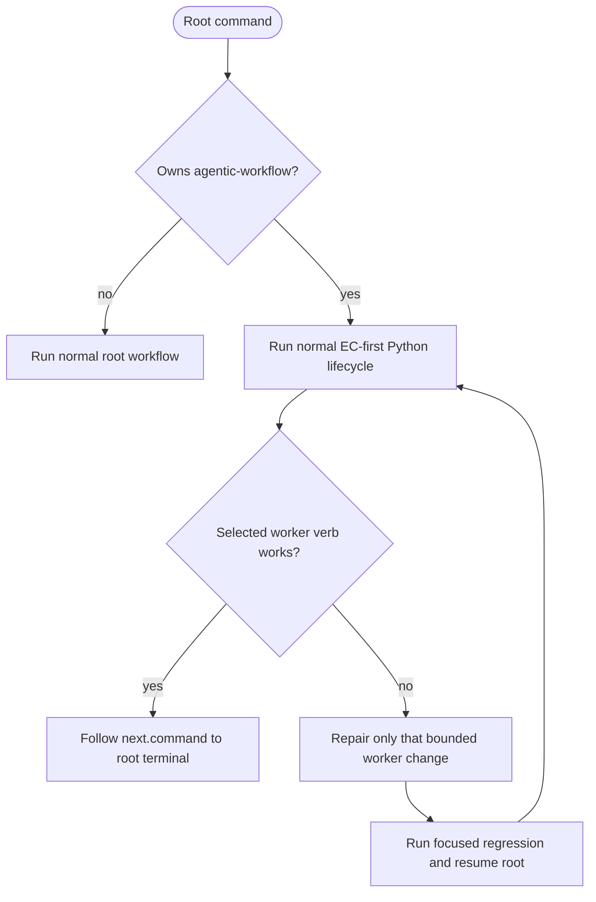

<!-- HANDWRITE-BEGIN gap="missing-generator:logic:self-hosting-runner-policy" tracker="#1501" reason="Admission policy couples tracker ownership, runner envelopes, and self-health gate classification." -->

# Python-first Self-hosting Root-runner Policy

## Schema
<!-- type: schema lang: yaml -->

```yaml
self_hosting:
  policy_mode: python_first_lifecycle
  admitted_roots: [wi, capability, backlog]
  authored_artifacts: [EC, TD]
  generated_artifact: CB
  fallback:
    mode: bounded_direct_repair
    trigger: selected_worker_verb_is_broken
    scope: current_change_only
    required_trailer: "Refs #<issue>"
  hard_gates:
    - capability_work_root_alignment
    - closing_work_item_and_td_refs
    - configured_ec_claim_verification
  advisory_axes: [managed, semantic, traceability, td_lock, cb_verify, cold_rebuild, tests, regenerable]
  remediation:
    - bounded direct commit with Refs trailer
    - CAPABILITIES.md work-root alignment
    - focused TD/codegen or EC verification when in scope
    - aw health verification
health_output:
  when: project in [agentic-workflow, aw]
  fields: [policy_mode, fallback_mode, hard_gates, advisory_axes]
```

## Logic
<!-- type: logic lang: mermaid -->



`aw goal capability --project agentic-workflow`, its capability-scoped form,
`aw goal wi <id>` for a WI owned by `agentic-workflow`, and `aw goal backlog
--project agentic-workflow` enter the same root engine as other projects.
EC and TD are hand-authored, executable project artifacts; they do not require
the broken implementation to generate its own repair contract. TD then drives
CB generation and verification. If the exact worker verb selected by the root
is broken, the agent may repair only that bounded change directly, prove the
focused regression, and resume the root. Direct commits are a recovery
mechanism, not the default self-hosting mode.

## Unit Test
<!-- type: unit-test lang: mermaid -->

```mermaid
---
id: self-hosting-runner-policy-unit
coverage_kind: unit
evidence:
  command: cargo test -p agentic-workflow --lib cli::run::tests::self_hosting_ -- --nocapture
---
requirementDiagram
  requirement admitted_roots { id: UT1 text: "Self WI, capability, and backlog roots use normal lifecycle envelopes" risk: high verifymethod: test }
  requirement bounded_fallback { id: UT2 text: "Health identifies Python-first mode and bounded direct fallback" risk: high verifymethod: test }
```

## E2E Test
<!-- type: e2e-test lang: yaml -->

```yaml
e2e_tests:
  - id: self-hosting-capability-admission
    capability_id: workflow-root-runner
    claim_id: python-first-self-hosting-admission
    command: cargo test -p agentic-workflow --test self_hosting_runner_policy_cli_test python_first_self_hosting_capability_and_backlog_enter_normal_verifiers -- --nocapture
    assertions:
      - "the capability root emits status blocked, action blocked, root kind capability, workflow_complete false, next kind blocked with no command, and reason capability root is not runnable: failed to parse capability map"
      - "the backlog root emits status blocked, action blocked, root backlog:agentic-workflow, workflow_complete false, next kind run_command, and exact command aw wi plan --project agentic-workflow --json because the reviewed_graph_missing blocker is the only admitted fixture outcome"
      - "neither envelope contains action self_hosting_policy or policy_mode sanctioned_direct_commit"
  - id: self-hosting-wi-admission
    capability_id: workflow-root-runner
    claim_id: python-first-self-hosting-admission
    command: cargo test -p agentic-workflow --test self_hosting_runner_policy_cli_test python_first_self_hosting_wi_enters_ec_first_lifecycle -- --nocapture
    assertions:
      - "the Agentic Workflow WI emits status continue, action dispatch, root wi:2446, current change:#2446, workflow_complete false, next kind run_command, and exact command aw ec check --project agentic-workflow --wi 2446"
      - "the envelope contains neither action self_hosting_policy nor a non-EC transition"
  - id: self-hosting-health-policy
    capability_id: workflow-root-runner
    claim_id: python-first-self-hosting-admission
    command: cargo test -p agentic-workflow --test self_hosting_runner_policy_cli_test python_first_self_hosting_health_reports_bounded_fallback -- --nocapture
    assertions:
      - "health emits policy_mode python_first_lifecycle and fallback_mode bounded_direct_repair"
      - "health pins fallback_trigger selected_worker_verb_is_broken, fallback_scope current_change_only, fallback_required_trailer Refs #<issue>, and direct_repair_default false"
```

## Changes
<!-- type: changes lang: yaml -->

```yaml
changes:
  - path: apps/agentic-workflow/src/cli/run.rs
    action: modify
    impl_mode: hand-written
  - path: apps/agentic-workflow/src/cli/capability.rs
    action: modify
    impl_mode: hand-written
  - path: apps/agentic-workflow/src/cli/project.rs
    action: modify
    impl_mode: hand-written
  - path: apps/agentic-workflow/src/cli/chain.rs
    action: modify
    impl_mode: hand-written
  - path: apps/agentic-workflow/src/cli/goal.rs
    action: modify
    impl_mode: hand-written
    description: "#1899: aw goal wi/capability/backlog thin shells delegate into run_wi_root/run_capability_root/run_backlog_root, so this policy's admission check runs for every goal-namespace root exactly as it did for the retired runner verbs."
  - path: apps/agentic-workflow/tests/self_hosting_runner_policy_cli_test.rs
    action: create
    impl_mode: hand-written
```

<!-- HANDWRITE-END -->
