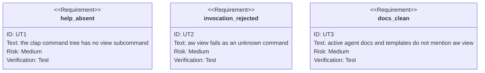

<!-- HANDWRITE-BEGIN gap="missing-generator:schema:aw-view-removal" tracker="#1502" reason="Bounded deletion contract for a retired product surface." -->

# AW View Removal

## Scenarios
<!-- type: scenarios lang: yaml -->

```yaml
id: aw-view-removal-scenarios
scenarios:
  - id: S1
    title: help omits the retired product
    given:
      - "the current aw command tree"
    when:
      - "an agent renders aw --help"
    then:
      - "view is not listed as a subcommand"
  - id: S2
    title: old invocations fail as unknown
    given:
      - "an old caller invokes aw view"
    when:
      - "clap parses the command"
    then:
      - "the invocation fails as an unrecognized subcommand"
      - "no compatibility alias or replacement UI is started"
  - id: S3
    title: active product artifacts stay CLI-only
    given:
      - "AW docs, capabilities, TDs, and dependencies are inspected"
    then:
      - "no active artifact advertises the Repo View desktop product"
      - "view-only native, browser, screenshot, and app-bundle code is absent"
```

## CLI
<!-- type: cli lang: yaml -->

```yaml
commands:
  - name: aw
    removed_subcommands:
      - name: view
        compatibility_alias: none
        replacement: none
    retained_agent_surface:
      - wi
      - capability
      - td
      - ec
      - health
      - conf
```

## Unit Test
<!-- type: unit-test lang: mermaid -->



## Changes
<!-- type: changes lang: yaml -->

```yaml
changes:
  - path: apps/agentic-workflow/src/cli/commands.rs
    action: modify
    section: cli
    impl_mode: codegen
    description: Remove View from top-level parsing and dispatch.
  - path: apps/agentic-workflow/src/cli/view.rs
    action: delete
    section: cli
    impl_mode: hand-written
    description: Delete the Repo View snapshot, screenshot, and app-bundle implementation.
  - path: apps/agentic-workflow/src/ui/native_view.rs
    action: delete
    section: cli
    impl_mode: hand-written
    description: Delete the native macOS Repo View renderer.
  - path: apps/agentic-workflow/src/ui/viewer
    action: delete
    section: cli
    impl_mode: hand-written
    description: Delete the unconsumed browser viewer server and bundled assets.
  - path: apps/agentic-workflow/packages/@sdd
    action: delete
    section: cli
    impl_mode: hand-written
    description: Delete the unconsumed Repo View web application and its private component packages.
  - path: apps/agentic-workflow/tests/sdd_viewer_test.rs
    action: delete
    section: unit-test
    impl_mode: codegen
    description: Delete the view-only integration fixture after its product surface is retired.
  - path: pnpm-workspace.yaml
    action: delete
    section: cli
    impl_mode: hand-written
    description: Delete the workspace declaration that existed only for the retired AW web packages.
  - path: pnpm-lock.yaml
    action: delete
    section: cli
    impl_mode: hand-written
    description: Delete the lockfile whose only live importers were the retired AW web packages.
  - path: apps/agentic-workflow/Cargo.toml
    action: modify
    section: cli
    impl_mode: hand-written
    description: Remove view-only renderer, image, font, native-window, and browser-opening dependencies.
  - path: apps/agentic-workflow/tests/cli/tests/legacy_cli_removal_test.rs
    action: modify
    section: unit-test
    impl_mode: codegen
    description: Add view to the permanent deleted-command and active-doc contracts.
  - path: apps/agentic-workflow/tech-design/surface/specs/aw-view-removal.md
    action: create
    section: scenarios
    impl_mode: hand-written
    description: Record the bounded deletion contract and verification evidence.
  - action: annotate
    section: unit-test
    impl_mode: hand-written
    description: "Traceability edge for the deleted-command contract."
```
<!-- HANDWRITE-END -->
