<!-- HANDWRITE-BEGIN gap="missing-generator:schema:aw-wi-crrr-removal" tracker="#1504" reason="Bounded deletion contract for a retired generic semantic-review lifecycle." -->

# WI CRRR Removal

## Scenarios
<!-- type: scenarios lang: yaml -->

```yaml
id: aw-wi-crrr-removal-scenarios
scenarios:
  - id: S1
    title: WI help exposes only linear authoring
    given:
      - "the current aw wi command tree"
    when:
      - "an agent renders aw wi --help and aw wi draft --help"
    then:
      - "review and arbitrate are absent"
      - "draft review is absent"
      - "fill-section and validate remain available"
  - id: S2
    title: removed invocations fail at parse time
    given:
      - "an old caller invokes aw wi review, aw wi arbitrate, or aw wi draft review"
    then:
      - "clap rejects the invocation as an unrecognized subcommand"
      - "no compatibility alias or runtime retirement response is emitted"
  - id: S3
    title: runtime authoring terminates at validation
    given:
      - "a local WI skeleton with queued sections"
    when:
      - "the Author fills each queued section"
    then:
      - "aw wi validate is the only next lifecycle verb"
      - "no reviewer, reviser, arbitration, or merge task is routed"
  - id: S4
    title: legacy tracker fields are passive compatibility data
    given:
      - "an older tracker record contains review_count or flagged_sections"
    then:
      - "the fields may be decoded and round-tripped"
      - "current WI authoring never writes them as phase transitions"
  - id: S5
    title: ambiguity requires human direction
    given:
      - "validation cannot determine a bounded WI correction"
    then:
      - "the workflow requires HITL instead of starting a generic semantic review loop"
```

## CLI
<!-- type: cli lang: yaml -->

```yaml
commands:
  - name: aw wi
    authoring_sequence: [skeleton, fill-section, validate]
    removed_subcommands: [review, arbitrate]
    terminal: validate
  - name: aw wi draft
    authoring_sequence: [init, fill, validate]
    removed_subcommands: [review]
runtime_roles: [mainthread, author]
semantic_approval_owner: aw ec review
```

## Unit Test

```mermaid
---
id: aw-wi-crrr-removal-unit-test
coverage_kind: unit
evidence:
  command: "cargo test -p agentic-workflow --test cli_tests legacy_cli_removal_test -- --nocapture"
---
requirementDiagram
  requirement commands_absent {
    id: UT1
    text: "WI review, arbitration, and draft review are absent from clap"
    risk: high
    verifymethod: test
  }
  requirement docs_clean {
    id: UT2
    text: "active docs, templates, and skills do not invoke removed WI commands"
    risk: medium
    verifymethod: test
  }
  requirement runtime_linear {
    id: UT3
    text: "runtime routing supports Author fill and validate without review, revise, or merge"
    risk: high
    verifymethod: test
  }
  requirement legacy_passive {
    id: UT4
    text: "legacy tracker review fields remain decode-only compatibility state"
    risk: medium
    verifymethod: test
  }
```

<!-- type: unit-test lang: mermaid -->



## Changes
<!-- type: changes lang: yaml -->

```yaml
changes:
  - path: apps/agentic-workflow/src/cli/issues.rs
    action: modify
    section: cli
    impl_mode: codegen
    description: Remove WI review, arbitration, and draft-review parsing, dispatch, apply, and helper logic.
  - path: apps/agentic-workflow/src/cli/chain.rs
    action: modify
    section: cli
    impl_mode: codegen
    description: Remove generic WI review and arbitration lifecycle entries.
  - path: apps/agentic-workflow/src/agents/crr.rs
    action: delete
    section: scenarios
    impl_mode: codegen
    description: Delete the generic CRR coordinator.
  - path: apps/agentic-workflow/src/agents/review
    action: delete
    section: scenarios
    impl_mode: codegen
    description: Delete generic review agents and verdict types.
  - path: apps/agentic-workflow/src/agents
    action: modify
    section: scenarios
    impl_mode: codegen
    description: Keep code and spec generation linear and reject retired reviser inputs.
  - path: apps/agentic-workflow/src/runtime
    action: modify
    section: scenarios
    impl_mode: codegen
    description: Retain only Mainthread and Author routing plus fill and validate application.
  - path: apps/agentic-workflow/src/issues/types.rs
    action: modify
    section: scenarios
    impl_mode: codegen
    description: Mark review_count and flagged_sections as passive legacy compatibility fields.
  - path: apps/agentic-workflow/tests/cli/tests/legacy_cli_removal_test.rs
    action: modify
    section: unit-test
    impl_mode: codegen
    description: Permanently assert parser and active-document absence for the removed commands.
  - path: apps/agentic-workflow/tests/cli/tests/hooks/hook1_post_apply_validate.sh
    action: modify
    section: unit-test
    impl_mode: hand-written
    description: Route the fixture hook directly from fill application to WI validation.
  - path: AGENTS.md
    action: modify
    section: cli
    impl_mode: hand-written
    description: Describe bounded linear WI authoring and EC-only semantic approval.
  - path: CLAUDE.md
    action: modify
    section: cli
    impl_mode: hand-written
    description: Mirror the current agent-facing lifecycle contract.
  - path: apps/agentic-workflow/templates/cli/mainthread
    action: modify
    section: cli
    impl_mode: hand-written
    description: Remove generic WI CRRR instructions from projected docs, skills, and agent prompts.
  - path: apps/agentic-workflow/tech-design/surface/specs/aw-wi-crrr-removal.md
    action: create
    section: scenarios
    impl_mode: hand-written
    description: Record the linear WI contract and passive legacy-field boundary.
  - action: annotate
    section: unit-test
    impl_mode: hand-written
    description: Traceability edge for deleted-command and linear-runtime evidence.
```
<!-- HANDWRITE-END -->
