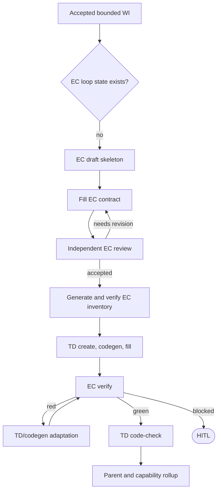

<!-- HANDWRITE-BEGIN gap="missing-generator:logic:wi-ec-td-root-loop" tracker="#1500" reason="Root admission joins EC artifact progress, persisted loop-state, TD phases, and parent rollup routing." -->

# WI to EC to TD Root Loop

## Schema
<!-- type: schema lang: yaml -->

```yaml
fresh_work_item:
  preconditions: [accepted, bounded, project_labeled, no_ec_loop_state]
  next: "aw ec draft <wi> --project <project> --wi <wi>"
ec_transitions:
  draft: "aw ec fill --project <project> <path> --section e2e-test --wi <wi>"
  fill: "aw ec review --project <project> --wi <wi>"
  accepted_review: "aw ec gen --project <project> --verify --wi <wi>"
  generated: "aw td create <wi>"
  implementation_candidate: "aw ec verify --project <project> --wi <wi>"
ec_verdicts:
  red: "aw td gen <wi>"
  green: "aw td code-check <wi>"
  blocked: hitl
root_invariants:
  - every root tick has one valid next command or terminal/HITL/error state
  - capability schedules work-root WIs and does not create a second lifecycle
  - health is read-only rollup and never an authoring transition
```

## Logic
<!-- type: logic lang: mermaid -->



`aw ec draft/fill/gen --wi` stores the owning WI's next action in its local
loop-state. This keeps `aw wi run` and `aw capability run` on the same
decision table while EC artifacts themselves remain project-scoped. Existing
WIs that already carry a TD phase retain their phase-safe resumption path. On
first admission, a tracker-backed WI is copied into the local lifecycle ledger
before an EC command is emitted, so its follow-up transition is resumable.

## Unit Test
<!-- type: unit-test lang: mermaid -->

```mermaid
---
id: wi-ec-td-root-loop-unit
coverage_kind: unit
evidence:
  command: cargo test -p agentic-workflow --lib phase_less_project_wi_enters_ec_before_td -- --nocapture
---
requirementDiagram
  requirement ec_first { id: UT1 text: "A phase-less project WI routes to EC draft rather than TD create" risk: high verifymethod: test }
  requirement verdict_routes { id: UT2 text: "EC red targets slugged TD generation and green targets slugged terminal code-check" risk: high verifymethod: test }
  requirement local_ledger { id: UT3 text: "A remote WI receives a local lifecycle copy before EC state is persisted" risk: medium verifymethod: test }
```

## E2E Test
<!-- type: e2e-test lang: yaml -->

```yaml
e2e_tests:
  - id: wi-ec-td-root-loop-fixture
    capability_id: workflow-root-runner
    claim_id: wi-ec-td-root-loop
    command: cargo test -p agentic-workflow --test cli_tests fixture_loop -- --nocapture
    assertions:
      - "fixture root follows emitted commands until completion.workflow_complete=true"
      - "no retired lifecycle command or hidden agent-only step is required"
  - id: wi-ec-td-root-loop-self-hosted-unit
    capability_id: workflow-root-runner
    claim_id: wi-ec-td-root-loop
    command: cargo test -p agentic-workflow --lib ec_red_and_green_loop_states_route_to_adaptation_or_terminal_check -- --nocapture
    assertions:
      - "red and green EC loop states expose exact bounded TD commands"
      - "a tracker-backed root has a local lifecycle ledger before EC transitions write next_action"
```

## Changes
<!-- type: changes lang: yaml -->

```yaml
changes:
  - path: apps/agentic-workflow/src/cli/run.rs
    action: modify
    impl_mode: hand-written
  - path: apps/agentic-workflow/src/cli/capability.rs
    action: modify
    impl_mode: hand-written
  - path: apps/agentic-workflow/src/cli/ec.rs
    action: modify
    impl_mode: hand-written
  - path: apps/agentic-workflow/src/cli/loop_state.rs
    action: modify
    impl_mode: hand-written
  - path: apps/agentic-workflow/src/cli/chain.rs
    action: modify
    impl_mode: hand-written
  - path: apps/agentic-workflow/src/cli/llm.rs
    action: modify
    impl_mode: hand-written
  - path: apps/agentic-workflow/src/cli/generator.rs
    action: modify
    impl_mode: hand-written
  - path: apps/agentic-workflow/README.md
    action: modify
    impl_mode: hand-written
  - path: apps/agentic-workflow/CONTRIBUTING.md
    action: modify
    impl_mode: hand-written
  - path: apps/agentic-workflow/CAPABILITIES.md
    action: modify
    impl_mode: hand-written
```

<!-- HANDWRITE-END -->
