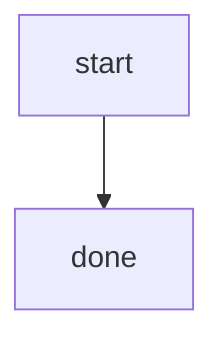
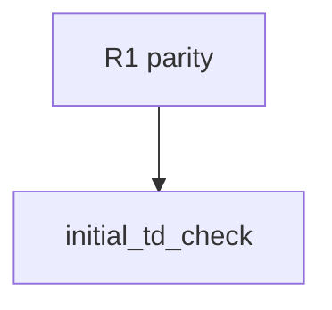
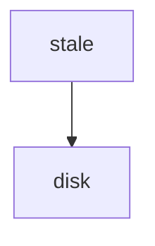

# Standardized apps/agentic-workflow/tests/cli/tests/inplace_mode_test.rs

## Overview
<!-- type: overview lang: markdown -->

Public API manifest for `apps/agentic-workflow/tests/cli/tests/inplace_mode_test.rs` generated from AST during Score force-regeneration standardization. The TD create replay fixture asserts the default `logic` to `changes` to `unit-test` queue, and the #1598 fixture applies both passes through the real CLI before proving `aw td gen` consumes the explicit Changes target plan, creates the named Logic target, and preserves the hand-written Unit Test target. The #1602 fixtures prove rewritten lifecycle history gets one safe reset and fresh init/projection, while an exact reachable init resumes with no reset or duplicate init and ordinary phase `created` still provisions. The #1580 fixtures prove fresh and recovered skeletons are committed exactly once while authored, non-exact status, sibling-dirty, post-gen, and terminal states remain immutable.

The #1586 fixture starts from stale plain Mermaid on disk. It proves a malformed
Mermaid Plus candidate fails the complete registry without changing spec,
payload, phase, projection, or HEAD, then proves a valid LogicSpec with a
signature and loop is written, consumes its payload, and advances to Changes.

### Symbols

No public AST symbols.
## Source
<!-- type: source lang: rust -->
<!-- source-from-target: strip-handwrite -->

<!-- source-snapshot: path=apps/agentic-workflow/tests/cli/tests/inplace_mode_test.rs -->
````rust
// SPEC-MANAGED: apps/agentic-workflow/tech-design/surface/validate/tests/inplace_mode_test.md#source
// CODEGEN-BEGIN
//! End-to-end smoke tests for `[agentic_workflow.workspace] mode = "in_place"`.
//!
//! In-place branch lifecycle tests:
//! verb conversion lets the aw binary run CRRR on the host repo's
//! branches instead of provisioning sibling worktree directories.
//!
//! These tests require the `score` binary; cargo wires `CARGO_BIN_EXE_aw`
//! automatically when the binary target is part of the same package.

use agentic_workflow::issues::LocalBackend;
use std::process::Command;

fn skip_unless_ready() -> Option<(std::path::PathBuf, String)> {
    let git = agentic_workflow::git::find_git_bin()?;
    let bin = std::env::var("CARGO_BIN_EXE_aw").ok().or_else(|| {
        let exe = std::env::current_exe().ok()?;
        let debug_dir = exe.parent()?.parent()?;
        let bin = debug_dir.join(format!("aw{}", std::env::consts::EXE_SUFFIX));
        bin.exists().then(|| bin.display().to_string())
    })?;
    Some((git, bin))
}

fn bootstrap_repo(git: &std::path::Path, root: &std::path::Path) {
    Command::new(git)
        .arg("-C")
        .arg(root)
        .args(["init", "-b", "main"])
        .status()
        .expect("git init");
    Command::new(git)
        .arg("-C")
        .arg(root)
        .args(["config", "user.email", "t@t"])
        .status()
        .unwrap();
    Command::new(git)
        .arg("-C")
        .arg(root)
        .args(["config", "user.name", "t"])
        .status()
        .unwrap();
    Command::new(git)
        .arg("-C")
        .arg(root)
        .args(["config", "commit.gpgsign", "false"])
        .status()
        .unwrap();
    std::fs::write(root.join("README.md"), "seed\n").unwrap();
    Command::new(git)
        .arg("-C")
        .arg(root)
        .args(["add", "."])
        .status()
        .unwrap();
    Command::new(git)
        .arg("-C")
        .arg(root)
        .args(["commit", "-m", "seed"])
        .status()
        .unwrap();
}

fn current_branch(git: &std::path::Path, root: &std::path::Path) -> String {
    let out = Command::new(git)
        .arg("-C")
        .arg(root)
        .args(["rev-parse", "--abbrev-ref", "HEAD"])
        .output()
        .unwrap();
    String::from_utf8_lossy(&out.stdout).trim().to_string()
}

fn branch_exists(git: &std::path::Path, root: &std::path::Path, branch: &str) -> bool {
    Command::new(git)
        .arg("-C")
        .arg(root)
        .args(["rev-parse", "--verify", &format!("refs/heads/{}", branch)])
        .output()
        .map(|o| o.status.success())
        .unwrap_or(false)
}

fn git_status(git: &std::path::Path, root: &std::path::Path) -> String {
    let out = Command::new(git)
        .arg("-C")
        .arg(root)
        .args(["status", "--porcelain"])
        .output()
        .unwrap();
    String::from_utf8_lossy(&out.stdout).to_string()
}

fn issue_path(root: &std::path::Path, slug: &str) -> std::path::PathBuf {
    LocalBackend::from_project_root(root)
        .issues_dir()
        .join("open")
        .join(format!("{slug}.md"))
}

fn write_issue_fixture(root: &std::path::Path, slug: &str, body: impl AsRef<str>) {
    let path = issue_path(root, slug);
    std::fs::create_dir_all(path.parent().unwrap()).unwrap();
    std::fs::write(path, body.as_ref()).unwrap();
}

fn read_issue_fixture(root: &std::path::Path, slug: &str) -> String {
    std::fs::read_to_string(issue_path(root, slug)).unwrap()
}

fn commit_all_with_message(git: &std::path::Path, root: &std::path::Path, message: &str) {
    assert!(Command::new(git)
        .arg("-C")
        .arg(root)
        .args(["add", "."])
        .status()
        .unwrap()
        .success());
    assert!(Command::new(git)
        .arg("-C")
        .arg(root)
        .args(["commit", "--allow-empty", "-m", message])
        .status()
        .unwrap()
        .success());
}

fn git_log_messages(git: &std::path::Path, root: &std::path::Path) -> String {
    let output = Command::new(git)
        .arg("-C")
        .arg(root)
        .args(["log", "--format=%B%x1e", "HEAD"])
        .output()
        .unwrap();
    assert!(output.status.success());
    String::from_utf8_lossy(&output.stdout).into_owned()
}

/// `td init` in InPlace mode should switch the host repo from `main` to branch
/// `td-<slug>` and NOT provision a `.aw/worktrees/td-<slug>/` dir.
#[test]
fn inplace_td_init_switches_branch_no_worktree_dir() {
    let Some((git, bin)) = skip_unless_ready() else {
        eprintln!("skipping: git or CARGO_BIN_EXE_aw missing");
        return;
    };
    let tmp = tempfile::tempdir().unwrap();
    let root = tmp.path();
    bootstrap_repo(&git, root);

    // Bootstrap .aw/ with InPlace mode enabled.
    std::fs::create_dir_all(root.join(".aw/tech-design")).unwrap();
    std::fs::write(
        root.join("aw.toml"),
        r#"
[agentic_workflow.workspace]
mode = "in_place"

[[projects]]
name = "agentic-workflow"
path = "."
"#,
    )
    .unwrap();

    // Open issue with state: open + a recognized project label so
    // `default_spec_path_for_issue_in_project` (#1403) can resolve it
    // through the aw.toml project row above.
    let slug = "demo-inplace";
    let issue_body = format!(
        "---\n\
         slug: {slug}\n\
         title: demo inplace flow\n\
         state: open\n\
         type: enhancement\n\
         labels: [\"crate:sdd\"]\n\
         review_count: 1\n\
         flagged_sections: [scope]\n\
         fill_retry_count: 1\n\
         ---\n\n# Body\n",
    );
    write_issue_fixture(root, slug, issue_body);
    Command::new(&git)
        .arg("-C")
        .arg(root)
        .args(["add", "."])
        .status()
        .unwrap();
    Command::new(&git)
        .arg("-C")
        .arg(root)
        .args(["commit", "-m", "bootstrap"])
        .status()
        .unwrap();

    // Run `aw td create <slug>`.
    let out = Command::new(&bin)
        .arg("td")
        .arg("create")
        .arg(slug)
        .current_dir(root)
        .output()
        .expect("run aw td create");
    assert!(
        out.status.success(),
        "td create should succeed:\nstdout={}\nstderr={}",
        String::from_utf8_lossy(&out.stdout),
        String::from_utf8_lossy(&out.stderr),
    );

    // Branch must exist.
    let branch = format!("td-{}", slug);
    assert!(
        branch_exists(&git, root, &branch),
        "branch '{}' should exist after td create",
        branch,
    );

    // Host repo must be ON the new branch (in-place steady state).
    assert_eq!(
        current_branch(&git, root),
        branch,
        "in-place mode should leave HEAD on td-<slug>",
    );

    // No worktree dir should be created.
    let worktree_dir = root.join(format!(".aw/worktrees/td-{}", slug));
    assert!(
        !worktree_dir.exists(),
        "InPlace mode must NOT provision {}",
        worktree_dir.display(),
    );

    let updated_issue = read_issue_fixture(root, slug);
    assert!(
        !updated_issue.contains("review_count:"),
        "td create should reset inherited issue review_count before TD review:\n{updated_issue}"
    );
    assert!(
        !updated_issue.contains("flagged_sections:"),
        "td create should reset inherited issue flagged_sections before TD review:\n{updated_issue}"
    );
    assert!(
        !updated_issue.contains("fill_retry_count:"),
        "td create should reset inherited issue fill_retry_count before TD review:\n{updated_issue}"
    );
}

/// `td create` should stay on a persistent project branch. Only `main` uses
/// the dedicated `td-<slug>` branch split.
#[test]
fn td_create_on_project_branch_stays_on_current_branch() {
    let Some((git, bin)) = skip_unless_ready() else {
        eprintln!("skipping: git or CARGO_BIN_EXE_aw missing");
        return;
    };
    let tmp = tempfile::tempdir().unwrap();
    let root = tmp.path();
    bootstrap_repo(&git, root);

    std::fs::create_dir_all(root.join(".aw/tech-design")).unwrap();
    std::fs::write(
        root.join("aw.toml"),
        r#"
[agentic_workflow.workspace]
mode = "in_place"

[[projects]]
name = "agentic-workflow"
path = "."
"#,
    )
    .unwrap();

    let slug = "demo-project-branch";
    let issue_body = format!(
        "---\n\
         slug: {slug}\n\
         title: demo project branch flow\n\
         state: open\n\
         type: enhancement\n\
         labels: [\"app:agentic-workflow\"]\n\
         phase: created\n\
         review_count: 1\n\
         flagged_sections: [scope]\n\
         fill_retry_count: 1\n\
         ---\n\n# Body\n",
    );
    write_issue_fixture(root, slug, issue_body);
    Command::new(&git)
        .arg("-C")
        .arg(root)
        .args(["add", "."])
        .status()
        .unwrap();
    Command::new(&git)
        .arg("-C")
        .arg(root)
        .args(["commit", "-m", "bootstrap"])
        .status()
        .unwrap();
    Command::new(&git)
        .arg("-C")
        .arg(root)
        .args(["switch", "-c", "project-score"])
        .status()
        .unwrap();

    let out = Command::new(&bin)
        .arg("td")
        .arg("create")
        .arg(slug)
        .current_dir(root)
        .output()
        .expect("run aw td create");
    assert!(
        out.status.success(),
        "td create should succeed on project branch:\nstdout={}\nstderr={}",
        String::from_utf8_lossy(&out.stdout),
        String::from_utf8_lossy(&out.stderr),
    );

    assert_eq!(current_branch(&git, root), "project-score");
    assert!(
        !branch_exists(&git, root, &format!("td-{}", slug)),
        "project branch mode should not create a td branch"
    );
    let updated_issue = read_issue_fixture(root, slug);
    assert!(
        updated_issue.contains("phase: td_inited"),
        "{updated_issue}"
    );
    assert!(
        updated_issue.contains("branch: project-score"),
        "{updated_issue}"
    );
    assert!(
        !updated_issue.contains("review_count:")
            && !updated_issue.contains("flagged_sections:")
            && !updated_issue.contains("fill_retry_count:"),
        "td create should clear inherited issue review state:\n{updated_issue}"
    );
}

/// Issue #1602: after history rewriting removes the exact Td-Init commit,
/// `aw td create` clears the stale phase/projection and re-provisions a fresh
/// baseline without touching existing spec or source bytes.
#[test]
fn td_create_rebased_lifecycle_reprovisions_unreachable_exact_td_init() {
    use agentic_workflow::cli::workflow_guard::{
        parse_projection, upsert_projection, WorkflowProjection,
    };

    let Some((git, bin)) = skip_unless_ready() else {
        eprintln!("skipping: git or CARGO_BIN_EXE_aw missing");
        return;
    };
    let tmp = tempfile::tempdir().unwrap();
    let root = tmp.path();
    bootstrap_repo(&git, root);
    std::fs::write(
        root.join("aw.toml"),
        "[[projects]]\nname = \"agentic-workflow\"\npath = \".\"\n",
    )
    .unwrap();

    let slug = "1602-rebased-recovery";
    let spec_path = "tech-design/logic/rebase-recovery.md";
    let spec_bytes = "---\nid: rebase-recovery\nfill_sections: [logic]\n---\n\n# Rebase recovery\n";
    let source_bytes = "pub fn preserved_by_td_recovery() {}\n";
    std::fs::create_dir_all(root.join("tech-design/logic")).unwrap();
    std::fs::create_dir_all(root.join("src")).unwrap();
    std::fs::write(root.join(spec_path), spec_bytes).unwrap();
    std::fs::write(root.join("src/preserved.rs"), source_bytes).unwrap();
    write_issue_fixture(
        root,
        slug,
        format!(
            "---\nslug: {slug}\ntitle: rebased TD recovery\nstate: open\ntype: bug\nlabels: [\"app:agentic-workflow\"]\n---\n\n# Body\n"
        ),
    );
    commit_all_with_message(&git, root, "bootstrap #1602 fixture");
    assert!(Command::new(&git)
        .arg("-C")
        .arg(root)
        .args(["switch", "-c", "app/fixture"])
        .status()
        .unwrap()
        .success());

    let stale_projection = WorkflowProjection {
        version: 1,
        issue_id: slug.to_string(),
        locked: true,
        owner: Some("td".to_string()),
        active_phase: Some("td_contract_created".to_string()),
        active_branch: Some("app/fixture".to_string()),
        expected_payload: Some("/tmp/aw/stale/contract/unit-test.json".to_string()),
        expected_command: Some("aw td create stale --apply".to_string()),
        current_section: Some("unit-test".to_string()),
        remaining_sections: Vec::new(),
        dirty_paths: vec!["stale/spec.md".to_string()],
        blocker_summary: None,
        updated_at: None,
    };
    let stale_body = upsert_projection("# Body\n", &stale_projection).unwrap();
    let active_issue = format!(
        "---\nslug: {slug}\ntitle: rebased TD recovery\nstate: open\ntype: bug\nlabels: [\"app:agentic-workflow\", \"score:locked\", \"score:lock:td\"]\nphase: td_created\nbranch: app/fixture\n---\n\n{stale_body}"
    );
    write_issue_fixture(root, slug, &active_issue);
    commit_all_with_message(
        &git,
        root,
        &format!("initial lifecycle\n\nLifecycle-Slug: {slug}\nLifecycle-Stage: Td-Init"),
    );

    assert!(Command::new(&git)
        .arg("-C")
        .arg(root)
        .args(["reset", "--hard", "HEAD^"])
        .status()
        .unwrap()
        .success());
    write_issue_fixture(root, slug, &active_issue);
    commit_all_with_message(
        &git,
        root,
        &format!(
            "rebased remote phase projection\n\nLifecycle-Slug: {slug}\nLifecycle-Stage: Td-Queue-Start"
        ),
    );

    let output = Command::new(&bin)
        .args(["td", "create", slug, "--spec-path", spec_path])
        .current_dir(root)
        .output()
        .expect("recover rebased TD lifecycle");
    assert!(
        output.status.success(),
        "recovery should succeed:\nstdout={}\nstderr={}",
        String::from_utf8_lossy(&output.stdout),
        String::from_utf8_lossy(&output.stderr)
    );

    let recovered_issue = read_issue_fixture(root, slug);
    let projection = parse_projection(&recovered_issue).expect("fresh workflow projection");
    assert!(projection.locked);
    assert_eq!(projection.current_section.as_deref(), Some("logic"));
    assert!(projection
        .expected_payload
        .as_deref()
        .is_some_and(|path| path.ends_with("/applicability/logic.json")));
    assert!(projection
        .expected_command
        .as_deref()
        .is_some_and(|command| command.contains(slug) && command.contains(spec_path)));
    assert!(!recovered_issue.contains("aw td create stale --apply"));
    assert!(recovered_issue.contains("phase: td_inited"));
    assert!(recovered_issue.contains("branch: app/fixture"));
    assert_eq!(
        std::fs::read_to_string(root.join(spec_path)).unwrap(),
        spec_bytes
    );
    assert_eq!(
        std::fs::read_to_string(root.join("src/preserved.rs")).unwrap(),
        source_bytes
    );

    let log = git_log_messages(&git, root);
    assert!(log.contains("Lifecycle-Stage: Td-Reset"));
    assert!(log.contains("Reset-Reason: unreachable-td-init"));
    assert!(log.contains("Reset-History-State: slug-history-without-init"));
    assert_eq!(log.matches("Lifecycle-Stage: Td-Init").count(), 1);
}

/// Issue #1602 negative: an active lifecycle with an exact reachable Td-Init
/// is an ordinary resume, with neither Td-Reset nor a second Td-Init.
#[test]
fn td_create_rebased_lifecycle_preserves_reachable_exact_td_init() {
    let Some((git, bin)) = skip_unless_ready() else {
        eprintln!("skipping: git or CARGO_BIN_EXE_aw missing");
        return;
    };
    let tmp = tempfile::tempdir().unwrap();
    let root = tmp.path();
    bootstrap_repo(&git, root);
    std::fs::write(
        root.join("aw.toml"),
        "[[projects]]\nname = \"agentic-workflow\"\npath = \".\"\n",
    )
    .unwrap();
    let slug = "1602-valid-resume";
    let spec_path = "tech-design/logic/valid-resume.md";
    write_issue_fixture(
        root,
        slug,
        format!(
            "---\nslug: {slug}\ntitle: valid TD resume\nstate: open\ntype: bug\nlabels: [\"app:agentic-workflow\"]\n---\n\n# Body\n"
        ),
    );
    commit_all_with_message(&git, root, "bootstrap valid #1602 resume");
    assert!(Command::new(&git)
        .arg("-C")
        .arg(root)
        .args(["switch", "-c", "app/fixture"])
        .status()
        .unwrap()
        .success());
    write_issue_fixture(
        root,
        slug,
        format!(
            "---\nslug: {slug}\ntitle: valid TD resume\nstate: open\ntype: bug\nlabels: [\"app:agentic-workflow\"]\nphase: td_inited\nbranch: app/fixture\n---\n\n# Body\n"
        ),
    );
    commit_all_with_message(
        &git,
        root,
        &format!("valid init\n\nLifecycle-Slug: {slug}\nLifecycle-Stage: Td-Init"),
    );

    let output = Command::new(&bin)
        .args(["td", "create", slug, "--spec-path", spec_path])
        .current_dir(root)
        .output()
        .expect("resume reachable TD lifecycle");
    assert!(
        output.status.success(),
        "reachable resume should succeed:\nstdout={}\nstderr={}",
        String::from_utf8_lossy(&output.stdout),
        String::from_utf8_lossy(&output.stderr)
    );
    let log = git_log_messages(&git, root);
    assert!(!log.contains("Lifecycle-Stage: Td-Reset"));
    assert_eq!(log.matches("Lifecycle-Stage: Td-Init").count(), 1);
    assert!(read_issue_fixture(root, slug).contains("phase: td_inited"));
}

/// Issue #1580: the first queue-start commit owns the numeric-id skeleton it
/// creates, leaves a clean checkout, and a repeated brief is history-idempotent.
#[test]
fn td_create_commits_fresh_numeric_skeleton_once() {
    let Some((git, bin)) = skip_unless_ready() else {
        eprintln!("skipping: git or CARGO_BIN_EXE_aw missing");
        return;
    };
    let tmp = tempfile::tempdir().unwrap();
    let root = tmp.path();
    bootstrap_repo(&git, root);
    std::fs::write(
        root.join("aw.toml"),
        "[[projects]]\nname = \"agentic-workflow\"\npath = \".\"\n",
    )
    .unwrap();
    let slug = "1580";
    let spec_path = "tech-design/logic/1580.md";
    write_issue_fixture(
        root,
        slug,
        format!(
            "---\nslug: \"{slug}\"\ntitle: commit TD skeleton\nstate: open\ntype: bug\nlabels: [\"app:agentic-workflow\"]\n---\n\n# Body\n"
        ),
    );
    commit_all_with_message(&git, root, "bootstrap #1580 fresh fixture");
    assert!(Command::new(&git)
        .arg("-C")
        .arg(root)
        .args(["switch", "-c", "app/fixture"])
        .status()
        .unwrap()
        .success());

    let first = Command::new(&bin)
        .args(["td", "create", slug, "--spec-path", spec_path])
        .current_dir(root)
        .output()
        .expect("create fresh numeric TD");
    assert!(
        first.status.success(),
        "fresh create should succeed:\nstdout={}\nstderr={}",
        String::from_utf8_lossy(&first.stdout),
        String::from_utf8_lossy(&first.stderr)
    );
    assert!(git_status(&git, root).is_empty());
    let skeleton = std::fs::read_to_string(root.join(spec_path)).unwrap();
    let frontmatter = skeleton.splitn(3, "---").nth(1).unwrap();
    let parsed: serde_yaml::Value = serde_yaml::from_str(frontmatter).unwrap();
    assert_eq!(
        parsed.get("id").and_then(|value| value.as_str()),
        Some(slug)
    );
    assert!(skeleton.contains("fill_sections: [logic, changes, unit-test]"));

    let show = Command::new(&git)
        .arg("-C")
        .arg(root)
        .args(["show", "--format=", "--name-only", "HEAD"])
        .output()
        .unwrap();
    assert!(show.status.success());
    assert_eq!(String::from_utf8_lossy(&show.stdout).trim(), spec_path);
    let first_head = Command::new(&git)
        .arg("-C")
        .arg(root)
        .args(["rev-parse", "HEAD"])
        .output()
        .unwrap();
    let first_head = String::from_utf8_lossy(&first_head.stdout)
        .trim()
        .to_string();

    let second = Command::new(&bin)
        .args(["td", "create", slug, "--spec-path", spec_path])
        .current_dir(root)
        .output()
        .expect("repeat fresh numeric TD brief");
    assert!(
        second.status.success(),
        "repeat brief should succeed:\nstdout={}\nstderr={}",
        String::from_utf8_lossy(&second.stdout),
        String::from_utf8_lossy(&second.stderr)
    );
    assert_eq!(
        current_branch(&git, root),
        "app/fixture",
        "project branch must remain active"
    );
    assert_eq!(
        Command::new(&git)
            .arg("-C")
            .arg(root)
            .args(["rev-parse", "HEAD"])
            .output()
            .map(|out| String::from_utf8_lossy(&out.stdout).trim().to_string())
            .unwrap(),
        first_head,
        "repeat brief must not create a second queue-start commit"
    );
    assert!(git_status(&git, root).is_empty());
}

/// Issue #1580: a reachable old lock may carry the exact pre-#1521 untracked
/// skeleton through activation, canonicalize it, and add one recovery
/// queue-start commit that stages only that file.
#[test]
fn td_create_recovers_reachable_locked_legacy_skeleton_once() {
    use agentic_workflow::cli::workflow_guard::{upsert_projection, WorkflowProjection};

    let Some((git, bin)) = skip_unless_ready() else {
        eprintln!("skipping: git or CARGO_BIN_EXE_aw missing");
        return;
    };
    let tmp = tempfile::tempdir().unwrap();
    let root = tmp.path();
    bootstrap_repo(&git, root);
    std::fs::write(
        root.join("aw.toml"),
        "[[projects]]\nname = \"agentic-workflow\"\npath = \".\"\n",
    )
    .unwrap();
    commit_all_with_message(&git, root, "bootstrap #1580 locked fixture");
    assert!(Command::new(&git)
        .arg("-C")
        .arg(root)
        .args(["switch", "-c", "app/fixture"])
        .status()
        .unwrap()
        .success());

    let slug = "1580";
    let spec_path = "tech-design/logic/1580.md";
    let projection = WorkflowProjection {
        version: 1,
        issue_id: slug.to_string(),
        locked: true,
        owner: Some("td".to_string()),
        active_phase: Some("td_applicability_in_progress".to_string()),
        active_branch: Some("app/fixture".to_string()),
        expected_payload: Some("/tmp/aw/1580/applicability/logic.json".to_string()),
        expected_command: Some(format!(
            "aw td create {slug} --apply --phase applicability --section logic --spec-path {spec_path}"
        )),
        current_section: Some("logic".to_string()),
        remaining_sections: vec!["changes".to_string(), "unit-test".to_string()],
        dirty_paths: vec![spec_path.to_string()],
        blocker_summary: None,
        updated_at: None,
    };
    let body = upsert_projection("# Body\n", &projection).unwrap();
    write_issue_fixture(
        root,
        slug,
        format!(
            "---\nslug: \"{slug}\"\ntitle: recover locked skeleton\nstate: open\ntype: bug\nlabels: [\"app:agentic-workflow\", \"score:locked\", \"score:lock:td\"]\nphase: td_inited\nbranch: app/fixture\n---\n\n{body}"
        ),
    );
    commit_all_with_message(
        &git,
        root,
        &format!("valid init\n\nLifecycle-Slug: {slug}\nLifecycle-Stage: Td-Init"),
    );
    std::fs::create_dir_all(root.join("tech-design/logic")).unwrap();
    let legacy = format!("---\nid: {slug}\nsummary: (fill)\nfill_sections: []\n---\n");
    std::fs::write(root.join(spec_path), &legacy).unwrap();

    let output = Command::new(&bin)
        .args(["td", "create", slug, "--spec-path", spec_path])
        .current_dir(root)
        .output()
        .expect("recover reachable locked skeleton");
    assert!(
        output.status.success(),
        "locked recovery should succeed:\nstdout={}\nstderr={}",
        String::from_utf8_lossy(&output.stdout),
        String::from_utf8_lossy(&output.stderr)
    );
    assert!(git_status(&git, root).is_empty());
    let recovered = std::fs::read_to_string(root.join(spec_path)).unwrap();
    assert!(recovered.contains("id: '1580'"), "{recovered}");
    assert!(recovered.contains("fill_sections: [logic, changes, unit-test]"));
    let show = Command::new(&git)
        .arg("-C")
        .arg(root)
        .args(["show", "--format=", "--name-only", "HEAD"])
        .output()
        .unwrap();
    assert_eq!(String::from_utf8_lossy(&show.stdout).trim(), spec_path);
    let log = git_log_messages(&git, root);
    assert_eq!(log.matches("Lifecycle-Stage: Td-Queue-Start").count(), 1);
    assert_eq!(log.matches("Lifecycle-Stage: Td-Init").count(), 1);
    assert!(!log.contains("Lifecycle-Stage: Td-Reset"));
    let recovered_head = Command::new(&git)
        .arg("-C")
        .arg(root)
        .args(["rev-parse", "HEAD"])
        .output()
        .map(|out| String::from_utf8_lossy(&out.stdout).trim().to_string())
        .unwrap();

    let repeat = Command::new(&bin)
        .args(["td", "create", slug, "--spec-path", spec_path])
        .current_dir(root)
        .output()
        .expect("repeat locked recovery");
    assert!(repeat.status.success());
    assert_eq!(
        Command::new(&git)
            .arg("-C")
            .arg(root)
            .args(["rev-parse", "HEAD"])
            .output()
            .map(|out| String::from_utf8_lossy(&out.stdout).trim().to_string())
            .unwrap(),
        recovered_head
    );
    assert!(git_status(&git, root).is_empty());
}

/// Combined #1602/#1580 regression: an unreachable old lifecycle may carry
/// only the exact untracked legacy skeleton across Reset and fresh Init; the
/// fresh Queue-Start then owns the canonicalized file.
#[test]
fn td_create_rebased_lifecycle_reprovisions_untracked_legacy_skeleton() {
    use agentic_workflow::cli::workflow_guard::{
        parse_projection, upsert_projection, WorkflowProjection,
    };

    let Some((git, bin)) = skip_unless_ready() else {
        eprintln!("skipping: git or CARGO_BIN_EXE_aw missing");
        return;
    };
    let tmp = tempfile::tempdir().unwrap();
    let root = tmp.path();
    bootstrap_repo(&git, root);
    std::fs::write(
        root.join("aw.toml"),
        "[[projects]]\nname = \"agentic-workflow\"\npath = \".\"\n",
    )
    .unwrap();
    commit_all_with_message(&git, root, "bootstrap combined recovery fixture");
    assert!(Command::new(&git)
        .arg("-C")
        .arg(root)
        .args(["switch", "-c", "app/fixture"])
        .status()
        .unwrap()
        .success());

    let slug = "1580-rebased";
    let spec_path = "tech-design/logic/1580-rebased.md";
    let stale_projection = WorkflowProjection {
        version: 1,
        issue_id: slug.to_string(),
        locked: true,
        owner: Some("td".to_string()),
        active_phase: Some("td_contract_created".to_string()),
        active_branch: Some("app/fixture".to_string()),
        expected_payload: Some("/tmp/aw/stale/unit-test.json".to_string()),
        expected_command: Some("aw td create stale --apply".to_string()),
        current_section: Some("unit-test".to_string()),
        remaining_sections: Vec::new(),
        dirty_paths: vec!["stale/spec.md".to_string()],
        blocker_summary: None,
        updated_at: None,
    };
    let stale_body = upsert_projection("# Body\n", &stale_projection).unwrap();
    write_issue_fixture(
        root,
        slug,
        format!(
            "---\nslug: {slug}\ntitle: combined lifecycle recovery\nstate: open\ntype: bug\nlabels: [\"app:agentic-workflow\", \"score:locked\", \"score:lock:td\"]\nphase: td_created\nbranch: app/fixture\n---\n\n{stale_body}"
        ),
    );
    commit_all_with_message(
        &git,
        root,
        &format!("old init\n\nLifecycle-Slug: {slug}\nLifecycle-Stage: Td-Init"),
    );
    assert!(Command::new(&git)
        .arg("-C")
        .arg(root)
        .args(["reset", "--hard", "HEAD^"])
        .status()
        .unwrap()
        .success());
    commit_all_with_message(
        &git,
        root,
        &format!("rebased queue\n\nLifecycle-Slug: {slug}\nLifecycle-Stage: Td-Queue-Start"),
    );
    std::fs::create_dir_all(root.join("tech-design/logic")).unwrap();
    let legacy = format!("---\nid: {slug}\nsummary: (fill)\nfill_sections: []\n---\n");
    std::fs::write(root.join(spec_path), &legacy).unwrap();

    let output = Command::new(&bin)
        .args(["td", "create", slug, "--spec-path", spec_path])
        .current_dir(root)
        .output()
        .expect("run combined lifecycle recovery");
    assert!(
        output.status.success(),
        "combined recovery should succeed:\nstdout={}\nstderr={}",
        String::from_utf8_lossy(&output.stdout),
        String::from_utf8_lossy(&output.stderr)
    );
    assert!(git_status(&git, root).is_empty());
    let recovered = std::fs::read_to_string(root.join(spec_path)).unwrap();
    assert!(recovered.contains("fill_sections: [logic, changes, unit-test]"));
    let issue = read_issue_fixture(root, slug);
    let projection = parse_projection(&issue).expect("fresh queue projection");
    assert!(projection.locked);
    assert_eq!(projection.current_section.as_deref(), Some("logic"));
    assert!(!issue.contains("aw td create stale --apply"));
    let log = git_log_messages(&git, root);
    assert!(log.contains("Lifecycle-Stage: Td-Reset"));
    assert!(log.contains("Reset-Reason: unreachable-td-init"));
    assert_eq!(log.matches("Lifecycle-Stage: Td-Init").count(), 1);
    assert_eq!(log.matches("Lifecycle-Stage: Td-Queue-Start").count(), 2);
    let head_message = Command::new(&git)
        .arg("-C")
        .arg(root)
        .args(["show", "-s", "--format=%B", "HEAD"])
        .output()
        .unwrap();
    assert!(
        String::from_utf8_lossy(&head_message.stdout).contains("Lifecycle-Stage: Td-Queue-Start")
    );
    let changed = Command::new(&git)
        .arg("-C")
        .arg(root)
        .args(["show", "--format=", "--name-only", "HEAD"])
        .output()
        .unwrap();
    assert_eq!(String::from_utf8_lossy(&changed.stdout).trim(), spec_path);
}

/// Real CLI fail-closed matrix for the status classes #1580 must never absorb.
/// Each fixture has a reachable Td-Init, so failure comes from skeleton
/// admission rather than stale-history reset.
#[test]
fn td_create_rejects_authored_tracked_staged_and_sibling_skeleton_states() {
    let Some((git, bin)) = skip_unless_ready() else {
        eprintln!("skipping: git or CARGO_BIN_EXE_aw missing");
        return;
    };
    for case in [
        "authored",
        "tracked",
        "staged",
        "sibling",
        "sibling-tracked",
    ] {
        let tmp = tempfile::tempdir().unwrap();
        let root = tmp.path();
        bootstrap_repo(&git, root);
        std::fs::write(
            root.join("aw.toml"),
            "[[projects]]\nname = \"agentic-workflow\"\npath = \".\"\n",
        )
        .unwrap();
        commit_all_with_message(&git, root, "bootstrap negative #1580 fixture");
        assert!(Command::new(&git)
            .arg("-C")
            .arg(root)
            .args(["switch", "-c", "app/fixture"])
            .status()
            .unwrap()
            .success());

        let slug = format!("1580-{case}");
        let spec_path = format!("tech-design/logic/{slug}.md");
        let spec_abs = root.join(&spec_path);
        std::fs::create_dir_all(spec_abs.parent().unwrap()).unwrap();
        if case == "tracked" {
            std::fs::write(&spec_abs, "authored tracked TD\n").unwrap();
        }
        if case == "sibling-tracked" {
            std::fs::write(root.join("unrelated.txt"), "tracked base\n").unwrap();
        }
        write_issue_fixture(
            root,
            &slug,
            format!(
                "---\nslug: {slug}\ntitle: negative skeleton state\nstate: open\ntype: bug\nlabels: [\"app:agentic-workflow\"]\nphase: td_inited\nbranch: app/fixture\n---\n\n# Body\n"
            ),
        );
        commit_all_with_message(
            &git,
            root,
            &format!("valid init\n\nLifecycle-Slug: {slug}\nLifecycle-Stage: Td-Init"),
        );

        let canonical = format!(
            "---\nid: {slug}\nsummary: (fill)\nfill_sections: [logic, changes, unit-test]\n---\n"
        );
        let expected_target = match case {
            "authored" => format!("{canonical}\n## Logic\nauthored\n"),
            _ => canonical.clone(),
        };
        std::fs::write(&spec_abs, &expected_target).unwrap();
        if case == "staged" {
            assert!(Command::new(&git)
                .arg("-C")
                .arg(root)
                .args(["add", &spec_path])
                .status()
                .unwrap()
                .success());
        }
        if case == "sibling" {
            std::fs::write(root.join("unrelated.txt"), "unrelated\n").unwrap();
        }
        if case == "sibling-tracked" {
            std::fs::write(root.join("unrelated.txt"), "tracked modified\n").unwrap();
        }
        let before = Command::new(&git)
            .arg("-C")
            .arg(root)
            .args(["rev-parse", "HEAD"])
            .output()
            .map(|out| String::from_utf8_lossy(&out.stdout).trim().to_string())
            .unwrap();

        let output = Command::new(&bin)
            .args(["td", "create", &slug, "--spec-path", &spec_path])
            .current_dir(root)
            .output()
            .expect("run negative skeleton state");
        assert!(
            !output.status.success(),
            "{case} state must fail closed:\nstdout={}\nstderr={}",
            String::from_utf8_lossy(&output.stdout),
            String::from_utf8_lossy(&output.stderr)
        );
        assert_eq!(std::fs::read_to_string(&spec_abs).unwrap(), expected_target);
        assert_eq!(
            Command::new(&git)
                .arg("-C")
                .arg(root)
                .args(["rev-parse", "HEAD"])
                .output()
                .map(|out| String::from_utf8_lossy(&out.stdout).trim().to_string())
                .unwrap(),
            before,
            "{case} state must not create recovery history"
        );
        assert!(read_issue_fixture(root, &slug).contains("phase: td_inited"));
    }
}

/// #1580 must not mutate a reachable pre-queue `td_created` issue or turn
/// post-gen/terminal retries into skeleton recovery. Every rejected phase
/// preserves both history and the exact untracked bytes.
#[test]
fn td_create_post_gen_and_terminal_phases_reject_untracked_skeleton() {
    let Some((git, bin)) = skip_unless_ready() else {
        eprintln!("skipping: git or CARGO_BIN_EXE_aw missing");
        return;
    };
    for phase in [
        "td_created",
        "cb_genned",
        "cb_filled",
        "td_gen_coded",
        "td_merged",
    ] {
        let tmp = tempfile::tempdir().unwrap();
        let root = tmp.path();
        bootstrap_repo(&git, root);
        std::fs::write(
            root.join("aw.toml"),
            "[[projects]]\nname = \"agentic-workflow\"\npath = \".\"\n",
        )
        .unwrap();
        commit_all_with_message(&git, root, "bootstrap strict phase fixture");
        assert!(Command::new(&git)
            .arg("-C")
            .arg(root)
            .args(["switch", "-c", "app/fixture"])
            .status()
            .unwrap()
            .success());
        let slug = format!("1580-{phase}");
        let spec_path = format!("tech-design/logic/{slug}.md");
        write_issue_fixture(
            root,
            &slug,
            format!(
                "---\nslug: {slug}\ntitle: strict phase\nstate: open\ntype: bug\nlabels: [\"app:agentic-workflow\"]\nphase: {phase}\nbranch: app/fixture\n---\n\n# Body\n"
            ),
        );
        commit_all_with_message(
            &git,
            root,
            &format!("reachable init\n\nLifecycle-Slug: {slug}\nLifecycle-Stage: Td-Init"),
        );
        std::fs::create_dir_all(root.join("tech-design/logic")).unwrap();
        let bytes = if phase == "td_created" {
            format!("---\nid: {slug}\nsummary: (fill)\nfill_sections: []\n---\n")
        } else {
            format!(
                "---\nid: {slug}\nsummary: (fill)\nfill_sections: [logic, changes, unit-test]\n---\n"
            )
        };
        std::fs::write(root.join(&spec_path), &bytes).unwrap();
        let before = Command::new(&git)
            .arg("-C")
            .arg(root)
            .args(["rev-parse", "HEAD"])
            .output()
            .map(|out| String::from_utf8_lossy(&out.stdout).trim().to_string())
            .unwrap();

        let output = Command::new(&bin)
            .args(["td", "create", &slug, "--spec-path", &spec_path])
            .current_dir(root)
            .output()
            .expect("run strict post-gen phase");
        assert!(
            !output.status.success(),
            "phase {phase} must reject recovery:\nstdout={}\nstderr={}",
            String::from_utf8_lossy(&output.stdout),
            String::from_utf8_lossy(&output.stderr)
        );
        assert_eq!(
            std::fs::read_to_string(root.join(&spec_path)).unwrap(),
            bytes
        );
        assert_eq!(
            Command::new(&git)
                .arg("-C")
                .arg(root)
                .args(["rev-parse", "HEAD"])
                .output()
                .map(|out| String::from_utf8_lossy(&out.stdout).trim().to_string())
                .unwrap(),
            before
        );
        assert!(read_issue_fixture(root, &slug).contains(&format!("phase: {phase}")));
    }
}

#[test]
fn td_create_numeric_id_uses_tracker_id_branch_with_legacy_cache_file() {
    let Some((git, bin)) = skip_unless_ready() else {
        eprintln!("skipping: git or CARGO_BIN_EXE_aw missing");
        return;
    };
    let tmp = tempfile::tempdir().unwrap();
    let root = tmp.path();
    bootstrap_repo(&git, root);

    std::fs::create_dir_all(root.join(".aw/tech-design")).unwrap();
    std::fs::write(
        root.join("aw.toml"),
        "[[projects]]\nname = \"agentic-workflow\"\npath = \".\"\n",
    )
    .unwrap();

    let legacy_slug = "bug-slug-round-trip-broken-local-cache-slug-d";
    let issue_body = format!(
        "---\n\
         title: bug score slug round trip\n\
         state: open\n\
         type: bug\n\
         github_id: 1887\n\
         labels: [\"type:bug\", \"app:agentic-workflow\"]\n\
         ---\n\n# Body\n",
    );
    write_issue_fixture(root, legacy_slug, issue_body);
    Command::new(&git)
        .arg("-C")
        .arg(root)
        .args(["add", "."])
        .status()
        .unwrap();
    Command::new(&git)
        .arg("-C")
        .arg(root)
        .args(["commit", "-m", "bootstrap legacy cache"])
        .status()
        .unwrap();

    let out = Command::new(&bin)
        .arg("td")
        .arg("create")
        .arg("1887")
        .current_dir(root)
        .output()
        .expect("run aw td create");
    assert!(
        out.status.success(),
        "td create should resolve numeric tracker id through legacy cache:\nstdout={}\nstderr={}",
        String::from_utf8_lossy(&out.stdout),
        String::from_utf8_lossy(&out.stderr),
    );

    assert!(
        branch_exists(&git, root, "td-1887"),
        "td create should provision the tracker-id branch"
    );
    assert_eq!(current_branch(&git, root), "td-1887");
    assert!(
        !issue_path(root, "1887").exists(),
        "td create should update the existing cache file instead of inventing a second one"
    );
    let updated = read_issue_fixture(root, legacy_slug);
    assert!(updated.contains("branch: td-1887"), "{updated}");
}

/// Issue #939: `aw td create` must record the spec path it provisions/locates
/// for the issue in `Issue.implements`, so `cb.rs`'s tier-1
/// `Issue.implements` scope resolution (#854) has real data instead of
/// always falling through to tier-3 derived-path guessing. Uses an explicit
/// `--spec-path` so the recorded value is deterministic rather than
/// depending on `default_spec_path_for_issue_in_project`'s derivation.
#[test]
fn td_create_records_spec_path_in_issue_implements() {
    let Some((git, bin)) = skip_unless_ready() else {
        eprintln!("skipping: git or CARGO_BIN_EXE_aw missing");
        return;
    };
    let tmp = tempfile::tempdir().unwrap();
    let root = tmp.path();
    bootstrap_repo(&git, root);

    std::fs::create_dir_all(root.join(".aw/tech-design")).unwrap();
    std::fs::write(root.join("aw.toml"), "").unwrap();

    let slug = "demo-939-implements-test";
    let issue_body = format!(
        "---\n\
         slug: {slug}\n\
         title: demo 939 implements flow\n\
         state: open\n\
         type: enhancement\n\
         labels: [\"app:agentic-workflow\"]\n\
         ---\n\n# Body\n",
    );
    write_issue_fixture(root, slug, issue_body);
    Command::new(&git)
        .arg("-C")
        .arg(root)
        .args(["add", "."])
        .status()
        .unwrap();
    Command::new(&git)
        .arg("-C")
        .arg(root)
        .args(["commit", "-m", "bootstrap"])
        .status()
        .unwrap();

    let spec_path = "custom/td-939-implements-test.md";
    let out = Command::new(&bin)
        .arg("td")
        .arg("create")
        .arg(slug)
        .arg("--spec-path")
        .arg(spec_path)
        .current_dir(root)
        .output()
        .expect("run aw td create");
    assert!(
        out.status.success(),
        "td create should succeed:\nstdout={}\nstderr={}",
        String::from_utf8_lossy(&out.stdout),
        String::from_utf8_lossy(&out.stderr),
    );

    let updated_issue = read_issue_fixture(root, slug);
    assert!(
        updated_issue.contains("implements:") && updated_issue.contains(spec_path),
        "td create must record --spec-path in Issue.implements:\n{}",
        updated_issue
    );
}

/// Issue #939 idempotency: an issue that already carries the target spec
/// path in `Issue.implements` (e.g. adopted from a prior partial run) must
/// not gain a duplicate entry when `aw td create` provisions it. Pre-seeds
/// `implements` directly in the fixture rather than issuing two live CLI
/// calls, since a bare (non-`--apply`) repeat `aw td create` call requires a
/// fully clean tree that the first call's own uncommitted section payload
/// file would otherwise trip.
#[test]
fn td_create_does_not_duplicate_existing_implements_entry() {
    let Some((git, bin)) = skip_unless_ready() else {
        eprintln!("skipping: git or CARGO_BIN_EXE_aw missing");
        return;
    };
    let tmp = tempfile::tempdir().unwrap();
    let root = tmp.path();
    bootstrap_repo(&git, root);

    std::fs::create_dir_all(root.join(".aw/tech-design")).unwrap();
    std::fs::write(root.join("aw.toml"), "").unwrap();

    let slug = "demo-939-implements-idempotent-test";
    let spec_path = "custom/td-939-implements-idempotent-test.md";
    let issue_body = format!(
        "---\n\
         slug: {slug}\n\
         title: demo 939 implements idempotency\n\
         state: open\n\
         type: enhancement\n\
         labels: [\"app:agentic-workflow\"]\n\
         implements: [\"{spec_path}\"]\n\
         ---\n\n# Body\n",
    );
    write_issue_fixture(root, slug, issue_body);
    Command::new(&git)
        .arg("-C")
        .arg(root)
        .args(["add", "."])
        .status()
        .unwrap();
    Command::new(&git)
        .arg("-C")
        .arg(root)
        .args(["commit", "-m", "bootstrap"])
        .status()
        .unwrap();

    let out = Command::new(&bin)
        .arg("td")
        .arg("create")
        .arg(slug)
        .arg("--spec-path")
        .arg(spec_path)
        .current_dir(root)
        .output()
        .expect("run aw td create");
    assert!(
        out.status.success(),
        "td create should succeed:\nstdout={}\nstderr={}",
        String::from_utf8_lossy(&out.stdout),
        String::from_utf8_lossy(&out.stderr),
    );

    let updated_issue = read_issue_fixture(root, slug);
    // Scope the count to the YAML frontmatter only: the issue body also
    // carries a `<!-- score:workflow-state -->` comment block whose
    // `expected_command`/`dirty_paths` fields legitimately echo the same
    // `--spec-path` string, which would otherwise inflate a whole-file
    // substring count without any `implements` duplication at all.
    let frontmatter = updated_issue.splitn(3, "---").nth(1).unwrap_or("");
    assert_eq!(
        frontmatter.matches(spec_path).count(),
        1,
        "implements must not duplicate a spec path the issue already carried:\n{}",
        updated_issue
    );
}

/// In InPlace mode, repeated `enter_workspace_for_verb(provision_if_missing=false)`
/// calls (which is what the verb-side activate helper does) must bail loudly
/// if the branch was never provisioned. We exercise that via `aw td check`
/// (slug mode), which expects the workspace to already exist. Formerly
/// exercised via `aw td validate`, retired by #1277 and folded into `aw td
/// check` — both routed through the same `td_activate_inplace_if_present`
/// bail path.
#[test]
fn inplace_verb_bails_without_init() {
    let Some((git, bin)) = skip_unless_ready() else {
        eprintln!("skipping: git or CARGO_BIN_EXE_aw missing");
        return;
    };
    let tmp = tempfile::tempdir().unwrap();
    let root = tmp.path();
    bootstrap_repo(&git, root);

    std::fs::create_dir_all(root.join(".aw/tech-design")).unwrap();
    std::fs::write(
        root.join("aw.toml"),
        "[agentic_workflow.workspace]\nmode = \"in_place\"\n",
    )
    .unwrap();
    Command::new(&git)
        .arg("-C")
        .arg(root)
        .args(["add", "."])
        .status()
        .unwrap();
    Command::new(&git)
        .arg("-C")
        .arg(root)
        .args(["commit", "-m", "bootstrap"])
        .status()
        .unwrap();

    // No `td init` ran; from `main`, `td check` (slug mode) should bail
    // because branch td-missing does not exist locally.
    let out = Command::new(&bin)
        .arg("td")
        .arg("check")
        .arg("missing")
        .current_dir(root)
        .output()
        .expect("run aw td check");
    assert!(
        !out.status.success(),
        "td check without init should fail:\nstdout={}",
        String::from_utf8_lossy(&out.stdout),
    );
    let combined = format!(
        "{}{}",
        String::from_utf8_lossy(&out.stdout),
        String::from_utf8_lossy(&out.stderr),
    );
    assert!(
        combined.contains("workspace not found") || combined.contains("does not exist"),
        "expected 'workspace not found' / 'does not exist'; got:\n{}",
        combined,
    );
}

#[test]
fn wi_validate_accepts_apply_dirty_issue_file_on_issue_branch() {
    let Some((git, bin)) = skip_unless_ready() else {
        eprintln!("skipping: git or CARGO_BIN_EXE_aw missing");
        return;
    };
    let tmp = tempfile::tempdir().unwrap();
    let root = tmp.path();
    bootstrap_repo(&git, root);

    std::fs::create_dir_all(root.join(".aw")).unwrap();
    std::fs::write(root.join("aw.toml"), "").unwrap();

    let slug = "demo";
    write_issue_fixture(
        root,
        slug,
        format!(
            "---\n\
             type: enhancement\n\
             title: demo\n\
             state: open\n\
             labels: [\"type:enhancement\", \"app:agentic-workflow\"]\n\
             phase: created\n\
             ---\n\n\
             ## Problem\n\n\
             Initial stub.\n"
        ),
    );
    Command::new(&git)
        .arg("-C")
        .arg(root)
        .args(["add", "."])
        .status()
        .unwrap();
    Command::new(&git)
        .arg("-C")
        .arg(root)
        .args(["commit", "-m", "bootstrap issue"])
        .status()
        .unwrap();
    Command::new(&git)
        .arg("-C")
        .arg(root)
        .args(["switch", "-c", "issue-demo"])
        .status()
        .unwrap();

    write_issue_fixture(
        root,
        slug,
        format!(
            "---\n\
             type: enhancement\n\
             title: demo\n\
             state: open\n\
             labels: [\"type:enhancement\", \"app:agentic-workflow\"]\n\
             phase: created\n\
             ---\n\n\
             ## Problem\n\n\
             Filled body from apply.\n\n\
             ## Capability Alignment\n\n\
             Capability: Issue branch validation\n\
             Capability Gap: apply-produced issue body diffs were rejected before validation handoff\n\
             Progress Evidence: this fixture keeps issue state in the temp backend while the checkout stays clean\n\n\
             ## Requirements\n\n\
             - R1: Validate accepts the apply-produced issue body diff.\n\n\
             ## Scope\n\n\
             ### In Scope\n\
             - Validate temp-backed issue state without checkout-hosted issue files.\n\n\
             ### Out of Scope\n\
             - Allowing unrelated dirty files.\n\n\
             ## Acceptance Criteria\n\n\
             - AC1: wi validate accepts the matching temp issue working copy without dirtying the checkout.\n\n\
             ## Agent Estimate\n\n\
             agent_minutes: 30\n\
             confidence: medium\n\
             risk: low\n\
             human_attention: none\n\n\
             ## Reference Context\n\n\
             ### Related Specs\n\
             | Spec | Relevance |\n\
             |------|-----------|\n\
             | issue-cli-envelope.md | Owns apply/validate handoff. |\n\n\
             ### Spec Plan\n\
             | Spec ID | Action | Main Spec Ref |\n\
             |---------|--------|---------------|\n\
             | score-validate-apply-handoff | update | issue-cli-envelope.md |\n"
        ),
    );

    let out = Command::new(&bin)
        .arg("wi")
        .arg("validate")
        .arg(slug)
        .current_dir(root)
        .output()
        .expect("run aw wi validate");
    assert!(
        out.status.success(),
        "wi validate should accept apply-produced temp issue working copy:\nstdout={}\nstderr={}",
        String::from_utf8_lossy(&out.stdout),
        String::from_utf8_lossy(&out.stderr),
    );
    let stdout = String::from_utf8_lossy(&out.stdout);
    assert!(
        stdout.contains("Validation passed for 'demo'.") || stdout.contains("\"passed\":true"),
        "WI validate should use backend projection rather than issue-branch CRRR:\n{}",
        stdout,
    );
    assert!(
        git_status(&git, root).trim().is_empty(),
        "WI validate must keep checkout state clean when issue state lives in the temp backend",
    );
}

/// Pull a `"field":"value"` string out of a JSON envelope's raw stdout
/// without a full JSON parse (matches this test file's existing
/// string-search style).
fn extract_json_string_field(stdout: &str, field: &str) -> Option<String> {
    let needle = format!("\"{field}\":\"");
    let start = stdout.find(&needle)? + needle.len();
    let end = stdout[start..].find('"')? + start;
    Some(stdout[start..end].replace("\\/", "/"))
}

fn td_dispatch_envelope(output: &std::process::Output, context: &str) -> serde_json::Value {
    assert!(
        output.status.success(),
        "{context} should succeed:\nstdout={}\nstderr={}",
        String::from_utf8_lossy(&output.stdout),
        String::from_utf8_lossy(&output.stderr),
    );
    serde_json::from_slice(&output.stdout)
        .unwrap_or_else(|error| panic!("{context} should emit one JSON envelope: {error}"))
}

fn run_td_section_apply(
    bin: &str,
    root: &std::path::Path,
    slug: &str,
    pass: &str,
    section: &str,
    spec_path: &str,
) -> serde_json::Value {
    let output = Command::new(bin)
        .args([
            "td",
            "create",
            slug,
            "--apply",
            "--phase",
            pass,
            "--section",
            section,
            "--spec-path",
            spec_path,
        ])
        .current_dir(root)
        .output()
        .unwrap_or_else(|error| panic!("run {pass} {section} apply: {error}"));
    td_dispatch_envelope(&output, &format!("{pass} {section} apply"))
}

fn dispatched_payload_path(envelope: &serde_json::Value) -> std::path::PathBuf {
    std::path::PathBuf::from(
        envelope["invoke"]["args"]["payload_path"]
            .as_str()
            .unwrap_or_else(|| panic!("dispatch is missing payload_path: {envelope}")),
    )
}

fn assert_td_projection(
    root: &std::path::Path,
    slug: &str,
    pass: &str,
    section: &str,
    payload_suffix: &str,
    remaining: &[&str],
) {
    let issue = read_issue_fixture(root, slug);
    let projection = agentic_workflow::cli::workflow_guard::parse_projection(&issue)
        .unwrap_or_else(|| panic!("{pass} {section} dispatch must project a workflow lock"));
    assert!(
        projection.locked,
        "projection should be locked: {projection:?}"
    );
    assert_eq!(projection.owner.as_deref(), Some("td"));
    assert_eq!(projection.current_section.as_deref(), Some(section));
    let active_phase = format!("td_{pass}_in_progress");
    assert_eq!(
        projection.active_phase.as_deref(),
        Some(active_phase.as_str())
    );
    assert!(
        projection
            .expected_payload
            .as_deref()
            .is_some_and(|path| path.ends_with(payload_suffix)),
        "projection must expose the editable {pass} {section} payload: {projection:?}"
    );
    assert!(
        projection
            .expected_command
            .as_deref()
            .is_some_and(|command| command.contains(&format!(
                "--phase {pass} --section {section}"
            ))),
        "projection must expose the exact apply command: {projection:?}"
    );
    assert_eq!(
        projection.remaining_sections,
        remaining
            .iter()
            .map(|section| section.to_string())
            .collect::<Vec<_>>()
    );
}

fn td_1598_logic_payload(id: &str) -> serde_json::Value {
    serde_json::json!({
        "body": format!(
            "```mermaid\n---\nid: {id}\nentry: start\nnodes:\n  start: {{ kind: start }}\n  done: {{ kind: terminal }}\nedges:\n  - {{ from: start, to: done }}\n---\nflowchart TD\n  start --> done\n```\n"
        )
    })
}

fn td_1598_changes_payload(target: &str, test_target: &str) -> serde_json::Value {
    serde_json::json!({
        "body": format!(
            "```yaml\nchanges:\n  - path: {target}\n    action: create\n    section: logic\n    impl_mode: codegen\n  - path: {test_target}\n    action: modify\n    section: unit-test\n    impl_mode: hand-written\n```\n"
        )
    })
}

fn td_1598_unit_test_payload(id: &str) -> serde_json::Value {
    serde_json::json!({
        "id": format!("{id}-verification"),
        "requirements": {
            "explicit_target": {
                "id": "R1",
                "text": "The default Changes payload supplies a concrete codegen target.",
                "kind": "regression",
                "risk": "high",
                "verify": "td_create_default_changes_queue_applies_both_passes_then_gen_uses_explicit_target"
            }
        }
    })
}

fn td_1598_changes_skeleton_body(path: &std::path::Path) -> String {
    let payload: serde_json::Value = serde_json::from_str(
        &std::fs::read_to_string(path)
            .unwrap_or_else(|error| panic!("read Changes skeleton {}: {error}", path.display())),
    )
    .unwrap_or_else(|error| panic!("parse Changes skeleton {}: {error}", path.display()));
    payload["body"]
        .as_str()
        .unwrap_or_else(|| panic!("Changes skeleton {} is missing JSON body", path.display()))
        .to_string()
}

/// Issue #1598: a fresh TD must author a concrete Changes target plan between
/// Logic and Unit Test in both passes. This real-binary lifecycle edits the
/// initialized Changes skeleton through `aw td create --apply`, proves every
/// transition is represented by the projection lock (including the first
/// contract section), and finally runs `aw td gen` to create a brand-new target
/// that target inference could never discover.
#[test]
fn td_create_default_changes_queue_applies_both_passes_then_gen_uses_explicit_target() {
    let Some((git, bin)) = skip_unless_ready() else {
        eprintln!("skipping: git or CARGO_BIN_EXE_aw missing");
        return;
    };
    let tmp = tempfile::tempdir().unwrap();
    let root = tmp.path();
    bootstrap_repo(&git, root);

    std::fs::write(
        root.join("aw.toml"),
        r#"
[agentic_workflow.workspace]
mode = "in_place"

[[projects]]
name = "agentic-workflow"
path = "."
"#,
    )
    .unwrap();
    std::fs::create_dir_all(root.join("tests")).unwrap();
    let hand_written_test_target = "// hand-written fixture test target\n";
    std::fs::write(
        root.join("tests/default_target_plan_test.rs"),
        hand_written_test_target,
    )
    .unwrap();

    let slug = "1598-default-target-plan";
    write_issue_fixture(
        root,
        slug,
        format!(
            "---\n\
             slug: {slug}\n\
             title: default TD target plan\n\
             state: open\n\
             type: bug\n\
             labels: [\"app:agentic-workflow\"]\n\
             ---\n\n# Body\n"
        ),
    );
    Command::new(&git)
        .arg("-C")
        .arg(root)
        .args(["add", "."])
        .status()
        .unwrap();
    Command::new(&git)
        .arg("-C")
        .arg(root)
        .args(["commit", "-m", "bootstrap #1598 fixture"])
        .status()
        .unwrap();
    Command::new(&git)
        .arg("-C")
        .arg(root)
        .args(["switch", "-c", "app/fixture"])
        .status()
        .unwrap();

    let spec_path = "tech-design/logic/default-target-plan.md";
    let target_path = "src/generated_1598.rs";
    let test_target_path = "tests/default_target_plan_test.rs";

    let brief = Command::new(&bin)
        .args(["td", "create", slug, "--spec-path", spec_path])
        .current_dir(root)
        .output()
        .expect("initialize fresh TD lifecycle");
    let mut envelope = td_dispatch_envelope(&brief, "fresh TD brief");
    assert_eq!(envelope["invoke"]["args"]["section"], "logic");
    assert_td_projection(
        root,
        slug,
        "applicability",
        "logic",
        "/applicability/logic.json",
        &["changes", "unit-test"],
    );

    std::fs::write(
        dispatched_payload_path(&envelope),
        td_1598_logic_payload("default_target_applicability").to_string(),
    )
    .unwrap();
    envelope = run_td_section_apply(&bin, root, slug, "applicability", "logic", spec_path);
    assert_eq!(envelope["invoke"]["args"]["section"], "changes");
    assert_td_projection(
        root,
        slug,
        "applicability",
        "changes",
        "/applicability/changes.json",
        &["unit-test"],
    );

    let applicability_changes = dispatched_payload_path(&envelope);
    let changes_skeleton = td_1598_changes_skeleton_body(&applicability_changes);
    assert!(changes_skeleton.contains("repo-relative target path"));
    assert!(changes_skeleton.contains("action: \"(fill: create|modify)\""));
    assert!(changes_skeleton.contains("artifact-driving section id"));
    std::fs::write(
        &applicability_changes,
        td_1598_changes_payload(target_path, test_target_path).to_string(),
    )
    .unwrap();
    envelope = run_td_section_apply(&bin, root, slug, "applicability", "changes", spec_path);
    assert_eq!(envelope["invoke"]["args"]["section"], "unit-test");
    assert_td_projection(
        root,
        slug,
        "applicability",
        "unit-test",
        "/applicability/unit-test.json",
        &[],
    );

    std::fs::write(
        dispatched_payload_path(&envelope),
        td_1598_unit_test_payload("default-target-applicability").to_string(),
    )
    .unwrap();
    envelope = run_td_section_apply(&bin, root, slug, "applicability", "unit-test", spec_path);
    assert_eq!(envelope["invoke"]["args"]["phase"], "contract");
    assert_eq!(envelope["invoke"]["args"]["section"], "logic");
    assert_td_projection(
        root,
        slug,
        "contract",
        "logic",
        "/contract/logic.json",
        &["changes", "unit-test"],
    );

    std::fs::write(
        dispatched_payload_path(&envelope),
        td_1598_logic_payload("default_target_contract").to_string(),
    )
    .unwrap();
    envelope = run_td_section_apply(&bin, root, slug, "contract", "logic", spec_path);
    assert_eq!(envelope["invoke"]["args"]["section"], "changes");
    assert_td_projection(
        root,
        slug,
        "contract",
        "changes",
        "/contract/changes.json",
        &["unit-test"],
    );

    let contract_changes = dispatched_payload_path(&envelope);
    assert!(
        td_1598_changes_skeleton_body(&contract_changes).contains("repo-relative target path"),
        "contract Changes must receive its own editable initialized skeleton"
    );
    std::fs::write(
        &contract_changes,
        td_1598_changes_payload(target_path, test_target_path).to_string(),
    )
    .unwrap();
    envelope = run_td_section_apply(&bin, root, slug, "contract", "changes", spec_path);
    assert_eq!(envelope["invoke"]["args"]["section"], "unit-test");
    assert_td_projection(
        root,
        slug,
        "contract",
        "unit-test",
        "/contract/unit-test.json",
        &[],
    );

    std::fs::write(
        dispatched_payload_path(&envelope),
        td_1598_unit_test_payload("default-target-contract").to_string(),
    )
    .unwrap();
    envelope = run_td_section_apply(&bin, root, slug, "contract", "unit-test", spec_path);
    assert_eq!(envelope["invoke"]["command"], "aw td gen");
    let projection =
        agentic_workflow::cli::workflow_guard::parse_projection(&read_issue_fixture(root, slug))
            .expect("terminal contract apply should retain an unlocked projection record");
    assert!(
        !projection.locked,
        "contract completion must unlock: {projection:?}"
    );

    let spec = std::fs::read_to_string(root.join(spec_path)).unwrap();
    assert!(spec.contains("fill_sections: [logic, changes, unit-test]"));
    assert!(spec.contains(&format!("path: {target_path}")));
    assert_eq!(spec.matches("<!-- type: changes lang: yaml -->").count(), 1);

    let final_check = Command::new(&bin)
        .args(["td", "check", spec_path])
        .current_dir(root)
        .output()
        .expect("check fully authored #1598 TD");
    assert!(
        final_check.status.success(),
        "both-pass target plan must produce a valid TD before lock/gen:\nstdout={}\nstderr={}",
        String::from_utf8_lossy(&final_check.stdout),
        String::from_utf8_lossy(&final_check.stderr),
    );

    let lock = Command::new(&bin)
        .args(["td", "lock", "--project", "agentic-workflow"])
        .current_dir(root)
        .output()
        .expect("write fixture TD IR lock");
    assert!(
        lock.status.success(),
        "fixture TD lock should succeed:\nstdout={}\nstderr={}",
        String::from_utf8_lossy(&lock.stdout),
        String::from_utf8_lossy(&lock.stderr),
    );
    Command::new(&git)
        .arg("-C")
        .arg(root)
        .args(["add", "tech-design/td.lock"])
        .status()
        .unwrap();
    Command::new(&git)
        .arg("-C")
        .arg(root)
        .args(["commit", "-m", "lock #1598 fixture TD"])
        .status()
        .unwrap();

    let gen = Command::new(&bin)
        .args(["td", "gen", slug, "--spec-path", spec_path])
        .current_dir(root)
        .output()
        .expect("run emitted aw td gen");
    let gen_stdout = String::from_utf8_lossy(&gen.stdout);
    let gen_stderr = String::from_utf8_lossy(&gen.stderr);
    assert!(
        gen.status.success(),
        "td gen should consume the explicit Changes target:\nstdout={gen_stdout}\nstderr={gen_stderr}"
    );
    assert!(!gen_stdout.contains("No target files inferred"));
    assert!(!gen_stderr.contains("No target files inferred"));
    assert_eq!(
        std::fs::read_to_string(root.join(test_target_path)).unwrap(),
        hand_written_test_target,
        "td gen must preserve the explicit hand-written Unit Test target",
    );
    let generated = std::fs::read_to_string(root.join(target_path))
        .expect("explicit Changes target should be created");
    assert!(
        generated.contains(&format!("SPEC-MANAGED: {spec_path}#logic")),
        "generated target must be owned by the authored Logic section:\n{generated}"
    );
    assert!(
        generated.contains(&format!(
            "SPEC-REF: {spec_path}#default_target_contract-body"
        )),
        "generated block must trace to the final contract Logic payload:\n{generated}"
    );
    assert!(
        read_issue_fixture(root, slug).contains("phase: cb_genned"),
        "successful generation must advance the lifecycle"
    );
}

/// Issue #813 (incident #799): a replayed `aw td create --apply` must never
/// clobber an already-authored TD section with a missing or still-`(fill)`
/// placeholder payload. Exercises the exact wedge scenario — a completed
/// `## Logic` section, then a stale/replayed apply call against it — via the
/// real CLI end to end (not just the pure decision function unit tests in
/// `td.rs`).
#[test]
fn td_create_replay_does_not_clobber_authored_logic_section() {
    let Some((git, bin)) = skip_unless_ready() else {
        eprintln!("skipping: git or CARGO_BIN_EXE_aw missing");
        return;
    };
    let tmp = tempfile::tempdir().unwrap();
    let root = tmp.path();
    bootstrap_repo(&git, root);

    std::fs::create_dir_all(root.join(".aw/tech-design")).unwrap();
    std::fs::write(
        root.join("aw.toml"),
        r#"
[agentic_workflow.workspace]
mode = "in_place"

[[projects]]
name = "agentic-workflow"
path = "."
"#,
    )
    .unwrap();

    let slug = "demo-813-replay";
    let issue_body = format!(
        "---\n\
         slug: {slug}\n\
         title: demo 813 replay flow\n\
         state: open\n\
         type: bug\n\
         labels: [\"app:agentic-workflow\"]\n\
         ---\n\n# Body\n",
    );
    write_issue_fixture(root, slug, issue_body);
    Command::new(&git)
        .arg("-C")
        .arg(root)
        .args(["add", "."])
        .status()
        .unwrap();
    Command::new(&git)
        .arg("-C")
        .arg(root)
        .args(["commit", "-m", "bootstrap"])
        .status()
        .unwrap();
    Command::new(&git)
        .arg("-C")
        .arg(root)
        .args(["switch", "-c", "project-score"])
        .status()
        .unwrap();

    let spec_path = "custom/td-813-replay.md";

    // 1) `aw td create <slug> --spec-path <path>` (brief, no --apply):
    // writes the skeleton and initializes the first section (`logic`)
    // payload with the blank template.
    let brief = Command::new(&bin)
        .arg("td")
        .arg("create")
        .arg(slug)
        .arg("--spec-path")
        .arg(spec_path)
        .current_dir(root)
        .output()
        .expect("run aw td create (brief)");
    assert!(
        brief.status.success(),
        "td create brief should succeed:\nstdout={}\nstderr={}",
        String::from_utf8_lossy(&brief.stdout),
        String::from_utf8_lossy(&brief.stderr),
    );
    let brief_stdout = String::from_utf8_lossy(&brief.stdout).into_owned();
    let payload_path = extract_json_string_field(&brief_stdout, "payload_path")
        .expect("brief envelope should carry payload_path");
    let payload_abs = std::path::PathBuf::from(&payload_path);

    // 2) Author the `logic` section for real (a completed section).
    let real_logic_body = concat!(
        "## Logic\n",
        "<!-- type: logic lang: mermaid -->\n\n",
        "```mermaid\n",
        "---\n",
        "id: real-logic-813\n",
        "entry: start\n",
        "nodes:\n",
        "  start: { kind: start }\n",
        "edges: []\n",
        "---\n",
        "flowchart TD\n",
        "```\n",
    );
    let real_payload_json = serde_json::json!({ "body": real_logic_body }).to_string();
    std::fs::write(&payload_abs, &real_payload_json).unwrap();

    let apply_logic = Command::new(&bin)
        .arg("td")
        .arg("create")
        .arg(slug)
        .arg("--apply")
        .arg("--phase")
        .arg("applicability")
        .arg("--section")
        .arg("logic")
        .arg("--spec-path")
        .arg(spec_path)
        .current_dir(root)
        .output()
        .expect("run aw td create --apply --section logic");
    assert!(
        apply_logic.status.success(),
        "authoring the logic section should succeed:\nstdout={}\nstderr={}",
        String::from_utf8_lossy(&apply_logic.stdout),
        String::from_utf8_lossy(&apply_logic.stderr),
    );
    let apply_envelope: serde_json::Value = serde_json::from_slice(&apply_logic.stdout)
        .expect("logic applicability apply should emit one JSON dispatch envelope");
    assert_eq!(
        apply_envelope["invoke"]["args"]["phase"], "applicability",
        "the default queue must finish applicability before contract authoring: {apply_envelope}"
    );
    assert_eq!(
        apply_envelope["invoke"]["args"]["section"], "changes",
        "logic applicability must dispatch the target-owning Changes section next: {apply_envelope}"
    );
    assert!(
        apply_envelope["invoke"]["args"]["payload_path"]
            .as_str()
            .is_some_and(|path| path.ends_with("/applicability/changes.json")),
        "the next payload must remain in the applicability pass: {apply_envelope}"
    );

    let spec_abs = root.join(spec_path);
    let spec_after_authoring = std::fs::read_to_string(&spec_abs).unwrap();
    assert!(
        spec_after_authoring.contains("fill_sections: [logic, changes, unit-test]"),
        "the first merge must retain the complete default queue:\n{spec_after_authoring}"
    );
    assert!(
        spec_after_authoring.contains("real-logic-813"),
        "spec should carry the authored logic content:\n{spec_after_authoring}"
    );
    assert!(!spec_after_authoring.contains("```mermaid\n(fill)\n```"));
    // The section-apply loop removes the payload file on success, and the
    // queue has moved on to the next section (unit-test) — this reproduces
    // the #799 setup where a stale/replayed dispatch still names the old
    // `logic` apply command.
    assert!(!payload_abs.exists());

    // 3) Simulate the replay: something re-writes a placeholder payload at
    // the (now-stale) `logic` payload path and re-runs the exact same
    // apply command #799 replayed.
    let placeholder_payload_json =
        serde_json::json!({ "body": "## Logic\n<!-- type: logic lang: mermaid -->\n\n```mermaid\n(fill)\n```\n" })
            .to_string();
    std::fs::create_dir_all(payload_abs.parent().unwrap()).unwrap();
    std::fs::write(&payload_abs, &placeholder_payload_json).unwrap();

    let replay = Command::new(&bin)
        .arg("td")
        .arg("create")
        .arg(slug)
        .arg("--apply")
        .arg("--phase")
        .arg("applicability")
        .arg("--section")
        .arg("logic")
        .arg("--spec-path")
        .arg(spec_path)
        .current_dir(root)
        .output()
        .expect("run replayed aw td create --apply --section logic");

    // The replay must be rejected (actionable message, non-mutating) —
    // never silently succeed by clobbering the spec.
    assert!(
        !replay.status.success(),
        "replayed placeholder apply against an authored section must fail, not silently \
         succeed:\nstdout={}\nstderr={}",
        String::from_utf8_lossy(&replay.stdout),
        String::from_utf8_lossy(&replay.stderr),
    );

    // The spec must be byte-identical to what authoring produced — the core
    // #813/#799 regression: replay must never clobber authored content with
    // `(fill)`.
    let spec_after_replay = std::fs::read_to_string(&spec_abs).unwrap();
    assert_eq!(
        spec_after_replay, spec_after_authoring,
        "replay must not mutate the spec at all"
    );
    assert!(!spec_after_replay.contains("\n(fill)\n```\n"));

    // The payload file must have been reseeded from the existing section
    // content instead of being left as (or re-initialized to) a blank
    // placeholder — so a follow-up review/edit has real starting content.
    let reseeded_payload = std::fs::read_to_string(&payload_abs).unwrap();
    assert!(
        reseeded_payload.contains("real-logic-813"),
        "payload should be reseeded from the existing authored section:\n{reseeded_payload}"
    );

    // No wedge: the issue's lifecycle phase is untouched by the rejected
    // replay (still whatever authoring the logic section left it at, not
    // reset/corrupted by the failed apply).
    let issue_after_replay = read_issue_fixture(root, slug);
    assert!(
        issue_after_replay.contains("phase: td_applicability_in_progress"),
        "phase must remain the in-progress applicability phase, not wedge into an unexpected \
         state:\n{issue_after_replay}"
    );
}

/// Issue #1562 / pgpool #1561: an already-valid TD may be re-authored through
/// the initialized per-section payload using a generic JSON `body` that holds
/// only the Mermaid fence. Applying that payload must preserve/restore the
/// requested typed wrapper, then advance to the structured Unit Test payload.
/// Malformed body-only input must fail before changing one byte of the spec.
#[test]
fn td_create_apply_normalizes_body_only_logic_then_advances_structured_unit_test() {
    let Some((git, bin)) = skip_unless_ready() else {
        eprintln!("skipping: git or CARGO_BIN_EXE_aw missing");
        return;
    };
    let tmp = tempfile::tempdir().unwrap();
    let root = tmp.path();
    bootstrap_repo(&git, root);

    std::fs::write(
        root.join("aw.toml"),
        r#"
[agentic_workflow.workspace]
mode = "in_place"

[[projects]]
name = "agentic-workflow"
path = "apps/agentic-workflow"
"#,
    )
    .unwrap();

    let project_root = root.join("apps/agentic-workflow");
    std::fs::create_dir_all(project_root.join("tech-design/semantic")).unwrap();
    std::fs::write(
        project_root.join("README.md"),
        r#"# Agentic Workflow Fixture

## Brief

Fixture for TD section apply parity.

## Capabilities

### Capability Index

| Capability | Root WI | Impl | Verification | Maturity | Production | Notes |
|---|---:|---|---|---|---|---|
| TD Apply Parity | #1562 | implemented | verified | smoke | ready | typed section payload parity |

### TD Apply Parity

ID: td-apply-parity
Type: DeveloperTool
Surfaces:
- CLI: `aw td create --apply` - applies exactly one initialized TD section payload.
Root WI: #1562
Status: verified
Required Verification: smoke
Promise:
Valid typed TD sections can be re-authored through initialized payload paths without losing their wrapper.
Gate Inventory:
- real CLI fixture

| Work Root | Kind | WI | Impl | Verification | Maturity | Gate / Evidence |
|---|---|---:|---|---|---|---|
| Body-only Logic apply parity | change | #1562 | implemented | verified | smoke | real CLI fixture |
"#,
    )
    .unwrap();

    let slug = "1562";
    write_issue_fixture(
        root,
        slug,
        format!(
            "---\n\
             slug: '{slug}'\n\
             title: td apply section lookup parity\n\
             state: open\n\
             type: bug\n\
             labels: [\"app:agentic-workflow\"]\n\
             ---\n\n# Body\n"
        ),
    );

    let spec_path = "apps/agentic-workflow/tech-design/semantic/td-apply-section-lookup-parity.md";
    let spec_abs = root.join(spec_path);
    std::fs::write(
        &spec_abs,
        r#"---
id: '1562'
summary: Keep mutating TD section lookup aligned with valid typed TD files.
fill_sections: [logic, unit-test]
capability_refs:
  - id: td-apply-parity
    role: primary
    claim: body-only-logic-apply-parity
    coverage: full
    rationale: "Proves initialized payload apply preserves typed section lookup."
---

## Logic
<!-- type: logic lang: mermaid -->



## Unit Test
<!-- type: unit-test lang: mermaid -->


"#,
    )
    .unwrap();

    Command::new(&git)
        .arg("-C")
        .arg(root)
        .args(["add", "."])
        .status()
        .unwrap();
    Command::new(&git)
        .arg("-C")
        .arg(root)
        .args(["commit", "-m", "bootstrap #1562 fixture"])
        .status()
        .unwrap();
    Command::new(&git)
        .arg("-C")
        .arg(root)
        .args(["switch", "-c", "app/fixture"])
        .status()
        .unwrap();

    let check = Command::new(&bin)
        .args(["td", "check", spec_path])
        .current_dir(root)
        .output()
        .expect("run preflight aw td check");
    assert!(
        check.status.success(),
        "the #1561-shaped file must pass read-only TD check:\nstdout={}\nstderr={}",
        String::from_utf8_lossy(&check.stdout),
        String::from_utf8_lossy(&check.stderr),
    );
    assert!(
        String::from_utf8_lossy(&check.stderr).contains("0 findings"),
        "preflight should prove read-only checker parity: {}",
        String::from_utf8_lossy(&check.stderr),
    );

    let brief = Command::new(&bin)
        .args(["td", "create", slug, "--spec-path", spec_path])
        .current_dir(root)
        .output()
        .expect("initialize Logic payload");
    assert!(
        brief.status.success(),
        "td create brief should initialize Logic:\nstdout={}\nstderr={}",
        String::from_utf8_lossy(&brief.stdout),
        String::from_utf8_lossy(&brief.stderr),
    );
    let brief_envelope: serde_json::Value = serde_json::from_slice(&brief.stdout).unwrap();
    assert_eq!(brief_envelope["invoke"]["args"]["section"], "logic");
    let logic_payload = std::path::PathBuf::from(
        brief_envelope["invoke"]["args"]["payload_path"]
            .as_str()
            .expect("initialized Logic payload path"),
    );
    assert!(logic_payload.exists());

    // A missing initialized payload is actionable and must not mutate the
    // already-valid spec. The replay guard reseeds it from the existing Logic
    // wrapper so the caller can continue safely.
    std::fs::remove_file(&logic_payload).unwrap();
    let before_missing = std::fs::read(&spec_abs).unwrap();
    let missing = Command::new(&bin)
        .args([
            "td",
            "create",
            slug,
            "--apply",
            "--phase",
            "applicability",
            "--section",
            "logic",
            "--spec-path",
            spec_path,
        ])
        .current_dir(root)
        .output()
        .expect("run missing Logic payload apply");
    assert!(!missing.status.success());
    assert!(
        String::from_utf8_lossy(&missing.stdout).contains("seeded from the existing section"),
        "missing payload should fail actionably: {}",
        String::from_utf8_lossy(&missing.stdout),
    );
    assert_eq!(std::fs::read(&spec_abs).unwrap(), before_missing);

    // The exact malformed body-only class must fail in the real CLI before
    // the spec write, not merely in the pure normalization helper.
    std::fs::write(
        &logic_payload,
        serde_json::json!({ "body": "```yaml\nkind: wrong-language\n```\n" }).to_string(),
    )
    .unwrap();
    let before_malformed = std::fs::read(&spec_abs).unwrap();
    let malformed = Command::new(&bin)
        .args([
            "td",
            "create",
            slug,
            "--apply",
            "--phase",
            "applicability",
            "--section",
            "logic",
            "--spec-path",
            spec_path,
        ])
        .current_dir(root)
        .output()
        .expect("run malformed body-only Logic apply");
    assert!(!malformed.status.success());
    let malformed_output = format!(
        "{}{}",
        String::from_utf8_lossy(&malformed.stdout),
        String::from_utf8_lossy(&malformed.stderr),
    );
    assert!(
        malformed_output.contains("matching-lang fenced block"),
        "malformed payload should name its fence mismatch: {malformed_output}"
    );
    assert_eq!(
        std::fs::read(&spec_abs).unwrap(),
        before_malformed,
        "malformed payload must not mutate the spec"
    );

    let body_only_logic = concat!(
        "```mermaid\n",
        "---\n",
        "id: td_apply_parity_after\n",
        "entry: start\n",
        "nodes:\n",
        "  start: { kind: start }\n",
        "  normalized: { kind: process }\n",
        "  done: { kind: terminal }\n",
        "edges:\n",
        "  - { from: start, to: normalized }\n",
        "  - { from: normalized, to: done }\n",
        "---\n",
        "flowchart TD\n",
        "  start --> normalized --> done\n",
        "```\n",
    );
    std::fs::write(
        &logic_payload,
        serde_json::json!({ "body": body_only_logic }).to_string(),
    )
    .unwrap();
    let apply_logic = Command::new(&bin)
        .args([
            "td",
            "create",
            slug,
            "--apply",
            "--phase",
            "applicability",
            "--section",
            "logic",
            "--spec-path",
            spec_path,
        ])
        .current_dir(root)
        .output()
        .expect("apply body-only Logic payload");
    assert!(
        apply_logic.status.success(),
        "body-only Logic should apply:\nstdout={}\nstderr={}",
        String::from_utf8_lossy(&apply_logic.stdout),
        String::from_utf8_lossy(&apply_logic.stderr),
    );
    let logic_envelope: serde_json::Value = serde_json::from_slice(&apply_logic.stdout).unwrap();
    assert_eq!(logic_envelope["invoke"]["args"]["phase"], "applicability");
    assert_eq!(logic_envelope["invoke"]["args"]["section"], "unit-test");
    let unit_payload = std::path::PathBuf::from(
        logic_envelope["invoke"]["args"]["payload_path"]
            .as_str()
            .expect("initialized Unit Test payload path"),
    );
    assert!(unit_payload.ends_with("applicability/unit-test.json"));
    assert!(unit_payload.exists());

    let after_logic = std::fs::read_to_string(&spec_abs).unwrap();
    assert!(after_logic.contains("## Logic\n<!-- type: logic lang: mermaid -->"));
    assert!(after_logic.contains("id: td_apply_parity_after"));
    assert_eq!(
        after_logic
            .matches("<!-- type: logic lang: mermaid -->")
            .count(),
        1,
        "the body-only merge must preserve exactly one Logic wrapper"
    );
    assert!(after_logic.contains("## Unit Test"));

    std::fs::write(
        &unit_payload,
        serde_json::json!({
            "id": "td-apply-parity-after-verification",
            "requirements": {
                "body_only_parity": {
                    "id": "R1",
                    "text": "Body-only Logic remains typed before Unit Test advances.",
                    "kind": "regression",
                    "risk": "high",
                    "verify": "td_create_apply_normalizes_body_only_logic_then_advances_structured_unit_test"
                }
            }
        })
        .to_string(),
    )
    .unwrap();
    let apply_unit = Command::new(&bin)
        .args([
            "td",
            "create",
            slug,
            "--apply",
            "--phase",
            "applicability",
            "--section",
            "unit-test",
            "--spec-path",
            spec_path,
        ])
        .current_dir(root)
        .output()
        .expect("apply structured Unit Test payload");
    assert!(
        apply_unit.status.success(),
        "structured Unit Test should apply:\nstdout={}\nstderr={}",
        String::from_utf8_lossy(&apply_unit.stdout),
        String::from_utf8_lossy(&apply_unit.stderr),
    );
    let unit_envelope: serde_json::Value = serde_json::from_slice(&apply_unit.stdout).unwrap();
    assert_eq!(unit_envelope["invoke"]["args"]["phase"], "contract");
    assert_eq!(unit_envelope["invoke"]["args"]["section"], "logic");
    let final_spec = std::fs::read_to_string(&spec_abs).unwrap();
    assert!(final_spec.contains("id: td-apply-parity-after-verification"));
    assert!(final_spec.contains("## Logic\n<!-- type: logic lang: mermaid -->"));
    assert!(final_spec.contains("## Unit Test\n<!-- type: unit-test lang: mermaid -->"));
}

/// Issue #1586: section apply must run the complete validator registry against
/// the merged in-memory candidate. A stale plain-Mermaid on-disk Logic section
/// must not shadow a valid Mermaid Plus replacement, while an invalid candidate
/// must preserve the spec, payload, phase, projection, and git history.
#[test]
fn td_create_apply_validates_merged_candidate_in_memory_before_write() {
    let Some((git, bin)) = skip_unless_ready() else {
        eprintln!("skipping: git or CARGO_BIN_EXE_aw missing");
        return;
    };
    let tmp = tempfile::tempdir().unwrap();
    let root = tmp.path();
    bootstrap_repo(&git, root);

    std::fs::write(
        root.join("aw.toml"),
        r#"
[agentic_workflow.workspace]
mode = "in_place"

[[projects]]
name = "agentic-workflow"
path = "apps/agentic-workflow"
"#,
    )
    .unwrap();

    let project_root = root.join("apps/agentic-workflow");
    std::fs::create_dir_all(project_root.join("tech-design/semantic")).unwrap();
    std::fs::write(
        project_root.join("README.md"),
        r#"# Agentic Workflow Fixture

## Brief

Fixture for merged TD candidate validation.

## Capabilities

### Capability Index

| Capability | Root WI | Impl | Verification | Maturity | Production | Notes |
|---|---:|---|---|---|---|---|
| TD Candidate Validation | #1586 | implemented | verified | smoke | ready | pre-write full-registry validation |

### TD Candidate Validation

ID: td-candidate-validation
Type: DeveloperTool
Surfaces:
- CLI: `aw td create --apply` - validates one merged section candidate before writing.
Root WI: #1586
Status: verified
Required Verification: smoke
Promise:
Merged TD section candidates pass the same registry as completed files before mutation.
Gate Inventory:
- real CLI fixture

| Work Root | Kind | WI | Impl | Verification | Maturity | Gate / Evidence |
|---|---|---:|---|---|---|---|
| TD merged candidate in memory validation | change | #1586 | implemented | verified | smoke | real CLI fixture |
"#,
    )
    .unwrap();

    let slug = "1586";
    write_issue_fixture(
        root,
        slug,
        format!(
            "---\n\
             slug: '{slug}'\n\
             title: validate merged TD candidates in memory\n\
             state: open\n\
             type: bug\n\
             labels: [\"app:agentic-workflow\"]\n\
             ---\n\n# Body\n"
        ),
    );

    let spec_path = "apps/agentic-workflow/tech-design/semantic/td-merged-candidate-validation.md";
    let spec_abs = root.join(spec_path);
    let stale_spec = r#"---
id: '1586'
summary: Validate the merged TD section candidate before writing it.
fill_sections: [logic, changes, unit-test]
capability_refs:
  - id: td-candidate-validation
    role: primary
    claim: td-merged-candidate-in-memory-validation
    coverage: full
    rationale: "The real CLI validates the merged candidate before mutation."
---

## Logic
<!-- type: logic lang: mermaid -->


"#;
    std::fs::write(&spec_abs, stale_spec).unwrap();

    Command::new(&git)
        .arg("-C")
        .arg(root)
        .args(["add", "."])
        .status()
        .unwrap();
    Command::new(&git)
        .arg("-C")
        .arg(root)
        .args(["commit", "-m", "bootstrap #1586 fixture"])
        .status()
        .unwrap();
    Command::new(&git)
        .arg("-C")
        .arg(root)
        .args(["switch", "-c", "app/fixture"])
        .status()
        .unwrap();

    let brief = Command::new(&bin)
        .args(["td", "create", slug, "--spec-path", spec_path])
        .current_dir(root)
        .output()
        .expect("initialize #1586 Logic payload");
    let brief_envelope = td_dispatch_envelope(&brief, "#1586 TD create brief");
    assert_eq!(brief_envelope["invoke"]["args"]["section"], "logic");
    let logic_payload = dispatched_payload_path(&brief_envelope);
    assert_td_projection(
        root,
        slug,
        "applicability",
        "logic",
        "applicability/logic.json",
        &["changes", "unit-test"],
    );

    let invalid_body = concat!(
        "```mermaid\n",
        "---\n",
        "id: invalid-candidate\n",
        "entry: start\n",
        "nodes: not-a-node-map\n",
        "edges: []\n",
        "---\n",
        "flowchart TD\n",
        "  start --> done\n",
        "```\n",
    );
    let invalid_payload = serde_json::json!({ "body": invalid_body }).to_string();
    std::fs::write(&logic_payload, &invalid_payload).unwrap();
    let spec_before_invalid = std::fs::read(&spec_abs).unwrap();
    let issue_before_invalid = std::fs::read(issue_path(root, slug)).unwrap();
    let head_before_invalid = Command::new(&git)
        .arg("-C")
        .arg(root)
        .args(["rev-parse", "HEAD"])
        .output()
        .unwrap()
        .stdout;

    let invalid = Command::new(&bin)
        .args([
            "td",
            "create",
            slug,
            "--apply",
            "--phase",
            "applicability",
            "--section",
            "logic",
            "--spec-path",
            spec_path,
        ])
        .current_dir(root)
        .output()
        .expect("reject invalid #1586 candidate");
    assert!(!invalid.status.success());
    let invalid_output = format!(
        "{}{}",
        String::from_utf8_lossy(&invalid.stdout),
        String::from_utf8_lossy(&invalid.stderr),
    );
    assert!(
        invalid_output.contains("frontmatter invalid for LogicContent"),
        "invalid candidate should fail the complete codegen-ready registry: {invalid_output}"
    );
    assert_eq!(std::fs::read(&spec_abs).unwrap(), spec_before_invalid);
    assert_eq!(
        std::fs::read_to_string(&logic_payload).unwrap(),
        invalid_payload,
        "failed validation must preserve the editable payload"
    );
    assert_eq!(
        std::fs::read(issue_path(root, slug)).unwrap(),
        issue_before_invalid,
        "failed validation must preserve phase and projection bytes"
    );
    let head_after_invalid = Command::new(&git)
        .arg("-C")
        .arg(root)
        .args(["rev-parse", "HEAD"])
        .output()
        .unwrap()
        .stdout;
    assert_eq!(head_after_invalid, head_before_invalid);

    let valid_logic_spec = concat!(
        "```mermaid\n",
        "---\n",
        "id: td_merged_candidate_after\n",
        "signature: \"pub fn merge_candidates(items: &[String]) -> Vec<String>\"\n",
        "entry: init\n",
        "nodes:\n",
        "  init:\n",
        "    kind: process\n",
        "    code: \"let mut out = Vec::new();\"\n",
        "  item_loop:\n",
        "    kind: loop\n",
        "    over: items\n",
        "    as: item\n",
        "  push_item:\n",
        "    kind: process\n",
        "    code: \"out.push(item.clone());\"\n",
        "  done:\n",
        "    kind: terminal\n",
        "    value: out\n",
        "edges:\n",
        "  - { from: init, to: item_loop, kind: next }\n",
        "  - { from: item_loop, to: push_item, kind: body }\n",
        "  - { from: item_loop, to: done, kind: after }\n",
        "---\n",
        "flowchart TD\n",
        "  init --> item_loop\n",
        "  item_loop --> push_item\n",
        "  item_loop --> done\n",
        "```\n",
    );
    std::fs::write(
        &logic_payload,
        serde_json::json!({ "body": valid_logic_spec }).to_string(),
    )
    .unwrap();

    let applied = Command::new(&bin)
        .args([
            "td",
            "create",
            slug,
            "--apply",
            "--phase",
            "applicability",
            "--section",
            "logic",
            "--spec-path",
            spec_path,
        ])
        .current_dir(root)
        .output()
        .expect("apply valid #1586 candidate");
    let applied_envelope = td_dispatch_envelope(&applied, "valid #1586 candidate apply");
    assert_eq!(applied_envelope["invoke"]["args"]["section"], "changes");
    assert_td_projection(
        root,
        slug,
        "applicability",
        "changes",
        "applicability/changes.json",
        &["unit-test"],
    );
    assert!(
        !logic_payload.exists(),
        "successful apply should consume the Logic payload"
    );
    let final_spec = std::fs::read_to_string(&spec_abs).unwrap();
    assert!(final_spec.contains("id: td_merged_candidate_after"));
    assert!(final_spec.contains("kind: loop"));
    assert!(final_spec.contains("signature: \"pub fn merge_candidates"));
    assert!(!final_spec.contains("stale --> disk"));
}

// CODEGEN-END
````

## Changes
<!-- type: changes lang: yaml -->

```yaml
changes:
  - path: apps/agentic-workflow/tests/cli/tests/inplace_mode_test.rs
    action: modify
    impl_mode: codegen
    section: source
    description: |
      Existing source claimed by `aw standardize managed run`. The code is
      wrapped in a tracked HANDWRITE block until deterministic generator
      coverage can replace it with CODEGEN. Issue #1556 adds a real-CLI
      regression assertion that the default queue cannot skip unit-test.
      Issue #1562 adds the valid annotated Logic/Unit Test parity fixture:
      missing or malformed generic payloads leave the spec byte-identical,
      body-only Logic is normalized into one requested typed wrapper, and the
      initialized applicability queue advances through structured Unit Test
      before contract Logic.
      Issue #1598 applies Logic, Changes, and Unit Test through applicability
      and contract with projection-lock assertions at every step, validates the
      editable Changes scaffold, runs final `aw td check` and `aw td lock`, and
      proves real `aw td gen` creates a new Logic target while preserving the
      explicit hand-written Unit Test target without no-target inference.
      Issue #1602 rewrites away an exact Td-Init while retaining a later
      same-slug lifecycle commit and stale lock. Real `aw td create` clears
      that projection, emits one reset plus one fresh init, installs a fresh
      applicability Logic projection, and preserves existing spec/source
      bytes. A reachable exact init emits neither reset nor duplicate init;
      the persistent-branch fixture covers fresh WI phase `created`.
      Issue #1580 proves a fresh numeric skeleton is staged in queue start and
      repeat briefs leave HEAD unchanged; a reachable locked legacy skeleton
      receives one spec-only recovery commit; an unreachable lifecycle carries
      the admitted candidate across reset/init. Authored, tracked, staged,
      untracked/tracked sibling-dirty, reachable `td_created`, canonical/legacy
      post-gen, filled, and terminal fixtures all preserve target bytes, issue
      phase, and git history on rejection.
      Issue #1586 drives a stale plain-Mermaid Logic section through real
      section apply. An invalid Mermaid Plus candidate leaves the spec,
      initialized payload, entire issue projection/body/phase, and HEAD
      byte-identical; a valid signature/loop LogicSpec replaces the stale
      section, consumes the payload, and dispatches applicability Changes.
```
