## Logic

```mermaid
---
id: observability-raft-conformance-rules
entry: start
nodes:
  start:              { kind: start,    label: "apply_observability_and_raft_rules(project_dir, resolution) -- called from review_rules::apply_conformance_rules, after the existing #2166 R1/R2 findings" }
  is_service:         { kind: decision, label: "kind_surface == Service?" }
  no_findings_cli:    { kind: terminal, label: "findings = [] -- a Cli profile has no served surface, so neither the observability baseline nor any raft rule applies" }
  obs_kit:            { kind: process,  label: "R1: gather Cargo.toml deps for every Service profile (Deployment/StatefulSet, any replication shape)" }
  obs_logging_hit:    { kind: decision, label: "service-observability dependency present?" }
  obs_logging_finding: { kind: process, label: "append Finding{id: obs:structured-logging-metrics-adoption, severity: high, remediation: adopt libs/service-observability for axiom.service.log.v1 JSONL logs, identity/correlation, optional OTLP export, and metrics} -- fires whether the gap is a hand-rolled substitute (e.g. a local obs_counter!-style macro) or logging is absent entirely" }
  obs_w3c_hit:        { kind: decision, label: "service-http or transport-h2c dependency present?" }
  obs_w3c_finding:    { kind: process,  label: "append Finding{id: obs:w3c-context-propagation-adoption, severity: high, remediation: adopt libs/service-http (or transport-h2c) for inbound+outbound W3C traceparent propagation}" }
  raft_route:         { kind: decision, label: "replication == RaftConsensus?" }
  raft_shape_hit:     { kind: decision, label: "source carries raft-forwarding-shaped markers (review::SourceMarkers::leader_ingest)? -- guards against firing raft rules on a resolution object with no actual forwarding code (e.g. a hand-built test fixture)" }
  no_raft_findings:   { kind: terminal, label: "no raft: finding -- not a RaftConsensus profile, or RaftConsensus with no forwarding-shaped source yet (nothing to review telemetry/correctness against)" }
  raft_telemetry:     { kind: process,  label: "R2: raft-runtime telemetry needed to evaluate any_replica_forward -- reviewed against the profiled project's own source (never libs/raft-runtime's internals directly; libs/raft-runtime/src/host.rs's current lack of this telemetry is the reviewable gap named in remediation text)" }
  t_routing_hit:      { kind: decision, label: "any of local_proposals / forwarded_proposals / forward_duration / forwarded_bytes metric-name markers present?" }
  t_routing_finding:  { kind: process,  label: "append Finding{id: raft:proposal-routing-telemetry-gap, severity: high, remediation: instrument local-vs-forwarded proposal counters, forward-duration histogram, and forwarded-bytes counter around the raft-runtime forward()/propose() path (libs/raft-runtime/src/host.rs emits none of this today)}" }
  t_lag_hit:          { kind: decision, label: "any of leader_route_retr / leader_change / commit_lag / applied_lag / peer_rpc metric-name markers present?" }
  t_lag_finding:      { kind: process,  label: "append Finding{id: raft:leader-route-and-replication-lag-telemetry-gap, severity: high, remediation: instrument leader-route retry/error counters, a leader-change counter, commit/applied-lag gauges, and peer-RPC-outcome counters}" }
  t_cardinality_hit:  { kind: decision, label: "a metric-emission marker (counter!/histogram!/gauge!/obs_counter!) co-occurs in the same file with a high-cardinality queue/topic/message-id/message label-key literal?" }
  t_cardinality_finding: { kind: process, label: "append Finding{id: raft:high-cardinality-label-antipattern, severity: high, remediation: drop queue/topic/message-id/message label dimensions from raft metrics -- label by fixed outcome/role instead so cardinality stays bounded}" }
  t_trace_hit:        { kind: decision, label: "any of traceparent / trace_id / span_id / tracing::instrument / info_span! markers present?" }
  t_trace_finding:    { kind: process,  label: "append Finding{id: raft:trace-context-continuity-gap, severity: medium, remediation: propagate one W3C trace context across the follower-forward / leader-commit / local-apply span chain instead of starting a fresh untraced call at each hop}" }
  raft_correctness:   { kind: process,  label: "R3: any_replica_forward correctness -- positive-violation checks ONLY; absence of a marker is never itself a finding (in particular, absence of direct-leader-ingress evidence is explicitly not evaluated here at all)" }
  c_follower_hit:     { kind: decision, label: "source shows a (follower|replica) role co-occurring with a (bypass_raft|bypass_consensus|local_write_outside_consensus|direct_local_write) marker -- a follower mutating local state outside consensus?" }
  c_follower_finding: { kind: process,  label: "append Finding{id: raft:follower-local-mutation-outside-consensus, severity: high (this repo's ceiling severity -- the correctness blocker the parent epic calls out as highest), remediation: route every write through propose()/forward() to the leader; a follower must never apply a local mutation outside raft consensus}" }
  c_failopen_hit:     { kind: decision, label: "source shows a loss-of-leader/quorum fail-open bypass marker (accept_without_leader|bypass_leader_check|skip_quorum_check|local_write_fallback|fail_open)?" }
  c_failopen_finding: { kind: process,  label: "append Finding{id: raft:loss-of-leader-fail-open-bypass, severity: high, remediation: remove the fail-open bypass -- on loss of leader/quorum the write path must fail closed (reject/retry), never silently accept a write}" }
  collect:            { kind: terminal, label: "return findings: Vec<Finding> (possibly empty), concatenated onto the #2166 R1/R2 findings already computed by apply_conformance_rules" }
edges:
  - { from: start,               to: is_service }
  - { from: is_service,          to: no_findings_cli,   label: "no (Cli)" }
  - { from: is_service,          to: obs_kit,           label: "yes" }
  - { from: obs_kit,             to: obs_logging_hit }
  - { from: obs_logging_hit,     to: obs_logging_finding, label: "no" }
  - { from: obs_logging_hit,     to: obs_w3c_hit,       label: "yes" }
  - { from: obs_logging_finding, to: obs_w3c_hit }
  - { from: obs_w3c_hit,         to: obs_w3c_finding,   label: "no" }
  - { from: obs_w3c_hit,         to: raft_route }
  - { from: obs_w3c_finding,     to: raft_route }
  - { from: raft_route,          to: raft_shape_hit,    label: "yes" }
  - { from: raft_route,          to: collect,           label: "no" }
  - { from: raft_shape_hit,      to: raft_telemetry,    label: "yes" }
  - { from: raft_shape_hit,      to: no_raft_findings,  label: "no" }
  - { from: no_raft_findings,    to: collect }
  - { from: raft_telemetry,      to: t_routing_hit }
  - { from: t_routing_hit,       to: t_routing_finding, label: "no" }
  - { from: t_routing_hit,       to: t_lag_hit,         label: "yes" }
  - { from: t_routing_finding,   to: t_lag_hit }
  - { from: t_lag_hit,           to: t_lag_finding,     label: "no" }
  - { from: t_lag_hit,           to: t_cardinality_hit, label: "yes" }
  - { from: t_lag_finding,       to: t_cardinality_hit }
  - { from: t_cardinality_hit,   to: t_cardinality_finding, label: "yes" }
  - { from: t_cardinality_hit,   to: t_trace_hit,       label: "no" }
  - { from: t_cardinality_finding, to: t_trace_hit }
  - { from: t_trace_hit,         to: t_trace_finding,   label: "no" }
  - { from: t_trace_hit,         to: raft_correctness,  label: "yes" }
  - { from: t_trace_finding,     to: raft_correctness }
  - { from: raft_correctness,    to: c_follower_hit }
  - { from: c_follower_hit,      to: c_follower_finding, label: "yes" }
  - { from: c_follower_hit,      to: c_failopen_hit,    label: "no" }
  - { from: c_follower_finding,  to: c_failopen_hit }
  - { from: c_failopen_hit,      to: c_failopen_finding, label: "yes" }
  - { from: c_failopen_hit,      to: collect,           label: "no" }
  - { from: c_failopen_finding,  to: collect }
---
flowchart TD
    start([apply_observability_and_raft_rules]) --> is_service{kind_surface == Service?}
    is_service -->|no Cli| no_findings_cli([findings: empty])
    is_service -->|yes| obs_kit[R1 observability baseline: gather Cargo.toml deps]
    obs_kit --> obs_logging_hit{service-observability dep present?}
    obs_logging_hit -->|no| obs_logging_finding[append obs:structured-logging-metrics-adoption]
    obs_logging_hit -->|yes| obs_w3c_hit{service-http/transport-h2c dep present?}
    obs_logging_finding --> obs_w3c_hit
    obs_w3c_hit -->|no| obs_w3c_finding[append obs:w3c-context-propagation-adoption]
    obs_w3c_hit -->|yes| raft_route{replication == RaftConsensus?}
    obs_w3c_finding --> raft_route
    raft_route -->|no| collect([findings vec, possibly empty])
    raft_route -->|yes| raft_shape_hit{raft-forwarding-shaped source markers present?}
    raft_shape_hit -->|no| no_raft_findings([no raft: finding -- nothing to review yet])
    no_raft_findings --> collect
    raft_shape_hit -->|yes| raft_telemetry[R2 raft-runtime telemetry for any_replica_forward]
    raft_telemetry --> t_routing_hit{local/forwarded-proposal + duration + bytes markers present?}
    t_routing_hit -->|no| t_routing_finding[append raft:proposal-routing-telemetry-gap]
    t_routing_hit -->|yes| t_lag_hit{leader-route-retry/leader-change/commit-lag/applied-lag/peer-rpc markers present?}
    t_routing_finding --> t_lag_hit
    t_lag_hit -->|no| t_lag_finding[append raft:leader-route-and-replication-lag-telemetry-gap]
    t_lag_hit -->|yes| t_cardinality_hit{metric macro + queue/topic/message-id/message label co-occur?}
    t_lag_finding --> t_cardinality_hit
    t_cardinality_hit -->|yes| t_cardinality_finding[append raft:high-cardinality-label-antipattern]
    t_cardinality_hit -->|no| t_trace_hit{traceparent/trace_id/span_id/instrument/info_span markers present?}
    t_cardinality_finding --> t_trace_hit
    t_trace_hit -->|no| t_trace_finding[append raft:trace-context-continuity-gap]
    t_trace_hit -->|yes| raft_correctness[R3 any_replica_forward correctness: positive-violation only]
    t_trace_finding --> raft_correctness
    raft_correctness --> c_follower_hit{follower/replica local-mutation-outside-consensus marker present?}
    c_follower_hit -->|yes| c_follower_finding[append raft:follower-local-mutation-outside-consensus]
    c_follower_hit -->|no| c_failopen_hit{loss-of-leader fail-open bypass marker present?}
    c_follower_finding --> c_failopen_hit
    c_failopen_hit -->|yes| c_failopen_finding[append raft:loss-of-leader-fail-open-bypass]
    c_failopen_hit -->|no| collect
    c_failopen_finding --> collect
```

<!-- type: logic lang: mermaid -->



`apply_observability_and_raft_rules(project_dir, resolution)` is the third additive pass over `aw review`'s findings, called from `review_rules::apply_conformance_rules` immediately after its existing #2166 R1 (shared-service-kit adoption) and R2 (profile negative-assertion) findings. It never mutates `ProjectProfile`/`ProfileResolution`/`ProfileEvidence` or the #2166 `Finding` type -- it only reads the already-resolved profile plus fresh `project_dir` evidence and appends more `Finding`s of the same shape.

R1 (structured-observability baseline, `obs:` finding ids) applies to every `Service` `kind_surface` profile -- `Deployment` or `StatefulSet`, any replication shape -- and is skipped entirely for `Cli` profiles (no served surface, so the baseline does not apply). Unlike #2166's `shared-kit:service-observability` row (which fires only when a hand-rolled `mod logging` marker is present without the dependency -- an anti-pattern-detection rule), this is a mandatory-baseline rule: it fires whenever the owning dependency is absent, regardless of whether the project hand-rolled a substitute or has no logging/tracing/metrics setup at all. This is what lets AC4's fixtures distinguish compliant shared-lib adoption (dependency present -> no finding) from an app-local substitute (dependency absent, whether or not a hand-rolled marker is also present -> finding) -- both non-adoption shapes produce the same `obs:structured-logging-metrics-adoption` finding, because both fail the baseline. `libs/service-observability`'s `axiom.service.log.v1` JSONL stdout contract, stable service identity, trace/span/request correlation, and optional non-fatal OTLP export are reviewed as one composed adoption signal (the dependency), per R1's explicit instruction that the rule checks for ADOPTION of the shared library, not a reimplementation of its internals. A second, independent baseline check covers W3C context propagation: `libs/service-http`'s `transport.rs` module (referenced in R1) owns the inbound `traceparent` baseline, and `transport-h2c` carries the same baseline for the h2c surface; a `Service` profile depending on neither produces `obs:w3c-context-propagation-adoption`.

R2 (raft-runtime telemetry, `raft:*-telemetry-gap` finding ids, applies only when `replication == RaftConsensus`) reviews whether the profiled project's own source shows the telemetry `any_replica_forward` needs to be judged: local-vs-forwarded proposal counts, forward duration, forwarded bytes (`raft:proposal-routing-telemetry-gap`); leader-route retries/errors, leader changes, commit/applied lag, and peer-RPC outcomes (`raft:leader-route-and-replication-lag-telemetry-gap`); metrics that avoid high-cardinality queue/topic/message-id/message labels (`raft:high-cardinality-label-antipattern`, a positive-violation check -- it fires only when a metric-emission marker and a high-cardinality label-key literal are both present in the same file, never on their absence); and one trace context preserved across the follower-forward/leader-commit/local-apply span chain (`raft:trace-context-continuity-gap`). These rules are reviewed against the profiled project's own source only -- never `libs/raft-runtime`'s internals directly, since a project review is scoped to one `project_dir`. `libs/raft-runtime/src/host.rs`'s current `forward()`/`propose()` path emits no such telemetry today (confirmed by inspection: only two `tracing::warn!` calls on apply-error paths, no counters/histograms/gauges/spans), which is exactly the reviewable gap this rule surfaces and routes back to the owning project/library rather than attempting to fix -- per the parent epic, implementing missing telemetry inside `libs/raft-runtime` is out of scope for this WI. All four telemetry checks are gated on `review::SourceMarkers::leader_ingest` (the same raft-forwarding-shaped marker #2165/#2166 already compute) being present, so a `RaftConsensus`-labeled resolution with no forwarding-shaped source at all (for example a hand-built test fixture) never receives a spurious telemetry-gap finding -- there is nothing yet to judge `any_replica_forward` against.

R3 (`any_replica_forward` correctness, `raft:*` finding ids, applies only when `replication == RaftConsensus`, gated on the same `leader_ingest` marker) asserts the parent epic's R3 requirement directly: `any_replica_forward` (any replica accepts a write, only the current leader orders/commits, bounded redirect/retry) is itself a valid, non-findable production baseline -- there is no rule anywhere in this module keyed to "does this project expose direct-leader ingress", so its absence structurally can never produce a finding (AC5's fourth fixture). What IS reviewed is whether the *implementation* of that baseline is violated: a follower/replica applying a local mutation outside consensus (`raft:follower-local-mutation-outside-consensus`, this module's highest-severity correctness blocker -- the parent epic's R3 calls this out explicitly as the one correctness failure mode, as opposed to every other finding in this module which is an observability-completeness gap) and a loss-of-leader/quorum path that fails open instead of closed (`raft:loss-of-leader-fail-open-bypass`). Both R3 checks are positive-violation rules: they fire only when an explicit anti-pattern marker is found in source, never on the absence of a compliant marker, because `libs/raft-runtime`'s own `propose()`/`forward()` path already fails closed by construction (`bail!("raft: no leader elected (cluster not ready)")` in `host.rs`) -- a project that simply adopts `raft-runtime`'s forwarding path without overriding it already inherits fail-closed behavior for free, and a review rule that fired on the mere absence of an explicit fail-closed marker would produce a false positive against every compliant adopter.

Findings from this module reuse the exact `Finding`/`FindingSeverity` type from #2166's `review_rules.rs` (`id`, `severity`, `summary`, `affected_paths`, `remediation`) -- never a new or re-exported type -- and are appended onto the same `Vec<Finding>` `apply_conformance_rules` already returns, so `aw review`'s envelope contract (`findings` always present, additive-only) is unchanged by this WI.
## Changes
<!-- type: changes lang: yaml -->

```yaml
changes:
  - path: apps/agentic-workflow/src/cli/review_obs_rules.rs
    action: create
    section: logic
    impl_mode: hand-written
    description: |
      New module implementing R1 (structured-observability baseline) + R2 (raft-runtime
      telemetry for `any_replica_forward`) + R3 (`any_replica_forward` correctness) as
      `pub(crate) fn apply_observability_and_raft_rules(project_dir: &Path, resolution:
      &review::ProfileResolution) -> Vec<crate::cli::review_rules::Finding>`. Reuses the
      exact `Finding`/`FindingSeverity` type from `review_rules.rs` -- never a new or
      re-exported type -- and reuses `review::read_cargo_dependencies`,
      `review::scan_source_markers`, and `review_rules::scan_src_for_substrings` (widened to
      `pub(crate)` by the sibling `review_rules.rs` change below) for evidence gathering; adds
      no new evidence source of its own.

      R1 (skipped entirely when `resolution.profile.kind_surface != review::KindSurface::Service`):
        - `obs:structured-logging-metrics-adoption` (severity: high) fires whenever the
          `service-observability` Cargo dependency is absent, regardless of whether the project
          hand-rolled a substitute (e.g. a local `obs_counter!`-style macro) or has no
          logging/metrics/correlation setup at all -- a mandatory-baseline rule, not an
          anti-pattern-detection rule (contrast with #2166's `shared-kit:service-observability`
          row, which only fires when a hand-rolled marker is present).
        - `obs:w3c-context-propagation-adoption` (severity: high) fires when neither
          `service-http` nor `transport-h2c` is a Cargo dependency (both carry the W3C
          `traceparent` baseline referenced in `libs/service-http/src/transport.rs`).

      R2 (applies only when `resolution.profile.replication ==
      review::ReplicationConsensus::RaftConsensus` AND `review::scan_source_markers(project_dir).leader_ingest`
      is true -- reviewed against the profiled project's own source, never `libs/raft-runtime`'s
      internals directly):
        - `raft:proposal-routing-telemetry-gap` (high): fires unless the source contains at
          least one of the lowercase substrings `local_proposals`, `forwarded_proposals`,
          `forward_duration`, `forwarded_bytes`.
        - `raft:leader-route-and-replication-lag-telemetry-gap` (high): fires unless the source
          contains at least one of `leader_route_retr`, `leader_change`, `commit_lag`,
          `applied_lag`, `peer_rpc`.
        - `raft:high-cardinality-label-antipattern` (high): fires when a metric-emission marker
          (`counter!(`, `histogram!(`, `gauge!(`, or `obs_counter!(` -- any substring containing
          `counter!(`/`histogram!(`/`gauge!(` matches the `obs_counter!` shape too) and a
          high-cardinality label-key literal (`"queue"`, `"topic"`, `"message_id"`, `"message"`)
          both appear in the same file (computed by intersecting the file sets returned by two
          `scan_src_for_substrings` calls -- a positive-violation check, never fired on absence).
        - `raft:trace-context-continuity-gap` (medium): fires unless the source contains at
          least one of `traceparent`, `trace_id`, `span_id`, `tracing::instrument`, `info_span!`.

      R3 (same RaftConsensus + `leader_ingest` gate as R2; positive-violation only -- never
      fired on the absence of a marker, since `libs/raft-runtime`'s own `propose()`/`forward()`
      path already fails closed by construction):
        - `raft:follower-local-mutation-outside-consensus` (high -- this module's ceiling
          severity, the one correctness blocker as opposed to every other finding here being an
          observability-completeness gap): fires when the source shows a `follower` or `replica`
          marker co-occurring with a `bypass_raft`, `bypass_consensus`,
          `local_write_outside_consensus`, or `direct_local_write` marker in the same file.
        - `raft:loss-of-leader-fail-open-bypass` (high): fires when the source contains any of
          `accept_without_leader`, `bypass_leader_check`, `skip_quorum_check`,
          `local_write_fallback`, `fail_open`.

      There is no rule anywhere in this module keyed to "does this project expose direct-leader
      ingress" -- its absence structurally can never produce a finding (AC5/R3).

      Includes a `#[cfg(test)] mod tests` with one `#[test]` fn per Unit Test requirement id
      below, using `tempfile::TempDir`-backed fixture project directories (matching
      `review.rs`/`review_rules.rs`'s existing `#[cfg(test)]` fixture style) to construct minimal
      Cargo.toml/aw.toml/src content per scenario, plus fixtures that directly construct an
      already-resolved `ProfileResolution` (matching `review_rules.rs`'s
      `lumen_negative_assertion` test precedent) where the scenario needs a specific profile
      shape independent of the #2165 classifier.

      gap: observability-raft-conformance-rule-heuristics
      tracker: "#2167"

  - path: apps/agentic-workflow/src/cli/review_rules.rs
    action: modify
    section: logic
    impl_mode: hand-written
    anchor: apply_conformance_rules
    description: |
      Additive-only extension of `apply_conformance_rules`, never altering the #2166 R1/R2
      findings it already computes:
        - Widen `fn scan_src_for_substrings` to `pub(crate) fn scan_src_for_substrings` (no
          behavior change) so `review_obs_rules.rs` reuses the same evidence-gathering helper
          instead of duplicating it.
        - At the end of `apply_conformance_rules`, after the existing R1 (`apply_shared_kit_rules`)
          and R2 (`negative_assertion`) findings are collected, call
          `crate::cli::review_obs_rules::apply_observability_and_raft_rules(project_dir, resolution)`
          and extend the returned `Vec<Finding>` with its results before returning, so the
          combined findings list is R1 (#2166) then R2 (#2166) then R1/R2/R3 (#2167) in that
          fixed order.
        - Deliberately excluded from this change: `apps/agentic-workflow/src/cli/mod.rs` module
          registration and doc-mirror `## Source` snapshot sync. These follow the same two-phase
          precedent #2165/#2166 used (module wiring landed in a separate manual commit, not
          inside any TD Changes[] entry) and are the follow-up implementation/wiring pass for
          this WI.

      gap: review-obs-raft-rules-wiring
      tracker: "#2167"
```
## Unit Test

```mermaid
---
id: aw-review-observability-raft-conformance-rules-verification
requirements:
  cli_profile_produces_no_observability_or_raft_findings:
    id: AC-CLI
    text: "A Cli kind_surface profile short-circuits apply_observability_and_raft_rules with zero R1 observability findings and zero R2/R3 raft findings, so aw itself and other CLI projects never receive a service-only finding."
    kind: functional
    risk: medium
    verify: cli_profile_produces_no_observability_or_raft_findings
  non_raft_profile_never_receives_raft_findings:
    id: R3
    text: "A resolved PrimaryReplica or ReplicatedLog profile (Service, StatefulSet, not RaftConsensus) never receives any raft: finding regardless of source content, since every R2/R3 rule in this module is gated on replication == RaftConsensus."
    kind: regression
    risk: medium
    verify: non_raft_profile_never_receives_raft_findings
  raft_profile_follower_local_mutation_is_flagged:
    id: AC5b
    text: "A RaftConsensus profile whose source shows a follower/replica marker co-occurring with a bypass-consensus/local-write-outside-consensus marker produces raft:follower-local-mutation-outside-consensus at this module's highest severity -- follower-local mutation outside consensus is a correctness blocker."
    kind: functional
    risk: high
    verify: raft_profile_follower_local_mutation_is_flagged
  raft_profile_high_cardinality_label_antipattern_is_flagged:
    id: AC6c
    text: "A RaftConsensus profile whose source co-occurs a metric-emission marker with a queue/topic/message-id/message label-key literal in the same file produces raft:high-cardinality-label-antipattern -- a positive-violation check independent of whether other raft telemetry is present."
    kind: functional
    risk: high
    verify: raft_profile_high_cardinality_label_antipattern_is_flagged
  raft_profile_leader_only_commit_with_forwarding_passes:
    id: AC5a
    text: "A RaftConsensus profile whose source shows leader-ingest/forwarding markers and no follower-local-mutation or fail-open-bypass markers produces zero raft:follower-local-mutation-outside-consensus and zero raft:loss-of-leader-fail-open-bypass findings -- leader-only-commit-plus-forwarding is a passing baseline, not a finding."
    kind: regression
    risk: high
    verify: raft_profile_leader_only_commit_with_forwarding_passes
  raft_profile_loss_of_leader_fail_open_bypass_is_flagged:
    id: AC5c
    text: "A RaftConsensus profile whose source shows an explicit loss-of-leader/quorum fail-open bypass marker produces raft:loss-of-leader-fail-open-bypass, since the write path must fail closed on loss of leader/quorum, never silently accept."
    kind: functional
    risk: high
    verify: raft_profile_loss_of_leader_fail_open_bypass_is_flagged
  raft_profile_missing_direct_leader_ingress_produces_no_finding:
    id: AC5d
    text: "A resolved profile with no direct-leader-ingress evidence at all (no rule in this module is keyed to that absence) produces zero raft: correctness findings under the standard any_replica_forward profile, proving missing direct-leader ingress is never itself a finding."
    kind: regression
    risk: high
    verify: raft_profile_missing_direct_leader_ingress_produces_no_finding
  raft_profile_missing_leader_route_and_lag_telemetry_is_flagged:
    id: AC6b
    text: "A RaftConsensus profile with forwarding-shaped source markers but none of the leader-route-retry, leader-change, commit-lag, applied-lag, or peer-RPC-outcome metric-name markers produces raft:leader-route-and-replication-lag-telemetry-gap."
    kind: functional
    risk: high
    verify: raft_profile_missing_leader_route_and_lag_telemetry_is_flagged
  raft_profile_missing_proposal_routing_telemetry_is_flagged:
    id: AC6a
    text: "A RaftConsensus profile with forwarding-shaped source markers but none of the local/forwarded-proposal, forward-duration, or forwarded-bytes metric-name markers produces raft:proposal-routing-telemetry-gap."
    kind: functional
    risk: high
    verify: raft_profile_missing_proposal_routing_telemetry_is_flagged
  raft_profile_missing_trace_context_continuity_is_flagged:
    id: AC6d
    text: "A RaftConsensus profile with forwarding-shaped source markers but none of the traceparent/trace_id/span_id/tracing::instrument/info_span! markers produces raft:trace-context-continuity-gap."
    kind: functional
    risk: medium
    verify: raft_profile_missing_trace_context_continuity_is_flagged
  service_profile_hand_rolled_logging_substitute_is_flagged:
    id: AC4c
    text: "A Service kind_surface profile with no service-observability dependency but a hand-rolled local logging/metrics macro substitute still produces obs:structured-logging-metrics-adoption, distinguishing an app-local substitute from compliant adoption -- both fail the mandatory baseline the same way."
    kind: functional
    risk: high
    verify: service_profile_hand_rolled_logging_substitute_is_flagged
  service_profile_missing_service_observability_dependency_is_flagged:
    id: AC4a
    text: "A Service kind_surface profile with no service-observability Cargo dependency and no hand-rolled logging substitute marker produces obs:structured-logging-metrics-adoption, since the JSONL logging/identity/correlation/metrics baseline is mandatory for every long-running service profile."
    kind: functional
    risk: high
    verify: service_profile_missing_service_observability_dependency_is_flagged
  service_profile_missing_w3c_transport_adoption_is_flagged:
    id: AC4d
    text: "A Service kind_surface profile depending on neither service-http nor transport-h2c produces obs:w3c-context-propagation-adoption, since neither the inbound nor outbound W3C traceparent baseline is adopted."
    kind: functional
    risk: high
    verify: service_profile_missing_w3c_transport_adoption_is_flagged
  service_profile_with_service_observability_adopted_produces_no_finding:
    id: AC4b
    text: "A Service kind_surface profile that depends on service-observability produces no obs:structured-logging-metrics-adoption finding, proving compliant shared-library adoption is recognized and never flagged."
    kind: regression
    risk: high
    verify: service_profile_with_service_observability_adopted_produces_no_finding
---
flowchart TD
    r3[R3 non raft profile never receives raft findings] --> non_raft_profile_never_receives_raft_findings[non_raft_profile_never_receives_raft_findings]
    ac_cli[AC-CLI cli profile produces no observability or raft findings] --> cli_profile_produces_no_observability_or_raft_findings[cli_profile_produces_no_observability_or_raft_findings]
    ac4a[AC4a service profile missing service observability dependency is flagged] --> service_profile_missing_service_observability_dependency_is_flagged[service_profile_missing_service_observability_dependency_is_flagged]
    ac4b[AC4b service profile with service observability adopted produces no finding] --> service_profile_with_service_observability_adopted_produces_no_finding[service_profile_with_service_observability_adopted_produces_no_finding]
    ac4c[AC4c service profile hand rolled logging substitute is flagged] --> service_profile_hand_rolled_logging_substitute_is_flagged[service_profile_hand_rolled_logging_substitute_is_flagged]
    ac4d[AC4d service profile missing w3c transport adoption is flagged] --> service_profile_missing_w3c_transport_adoption_is_flagged[service_profile_missing_w3c_transport_adoption_is_flagged]
    ac5a[AC5a raft profile leader only commit with forwarding passes] --> raft_profile_leader_only_commit_with_forwarding_passes[raft_profile_leader_only_commit_with_forwarding_passes]
    ac5b[AC5b raft profile follower local mutation is flagged] --> raft_profile_follower_local_mutation_is_flagged[raft_profile_follower_local_mutation_is_flagged]
    ac5c[AC5c raft profile loss of leader fail open bypass is flagged] --> raft_profile_loss_of_leader_fail_open_bypass_is_flagged[raft_profile_loss_of_leader_fail_open_bypass_is_flagged]
    ac5d[AC5d raft profile missing direct leader ingress produces no finding] --> raft_profile_missing_direct_leader_ingress_produces_no_finding[raft_profile_missing_direct_leader_ingress_produces_no_finding]
    ac6a[AC6a raft profile missing proposal routing telemetry is flagged] --> raft_profile_missing_proposal_routing_telemetry_is_flagged[raft_profile_missing_proposal_routing_telemetry_is_flagged]
    ac6b[AC6b raft profile missing leader route and lag telemetry is flagged] --> raft_profile_missing_leader_route_and_lag_telemetry_is_flagged[raft_profile_missing_leader_route_and_lag_telemetry_is_flagged]
    ac6c[AC6c raft profile high cardinality label antipattern is flagged] --> raft_profile_high_cardinality_label_antipattern_is_flagged[raft_profile_high_cardinality_label_antipattern_is_flagged]
    ac6d[AC6d raft profile missing trace context continuity is flagged] --> raft_profile_missing_trace_context_continuity_is_flagged[raft_profile_missing_trace_context_continuity_is_flagged]
```

<!-- type: unit-test lang: mermaid -->


