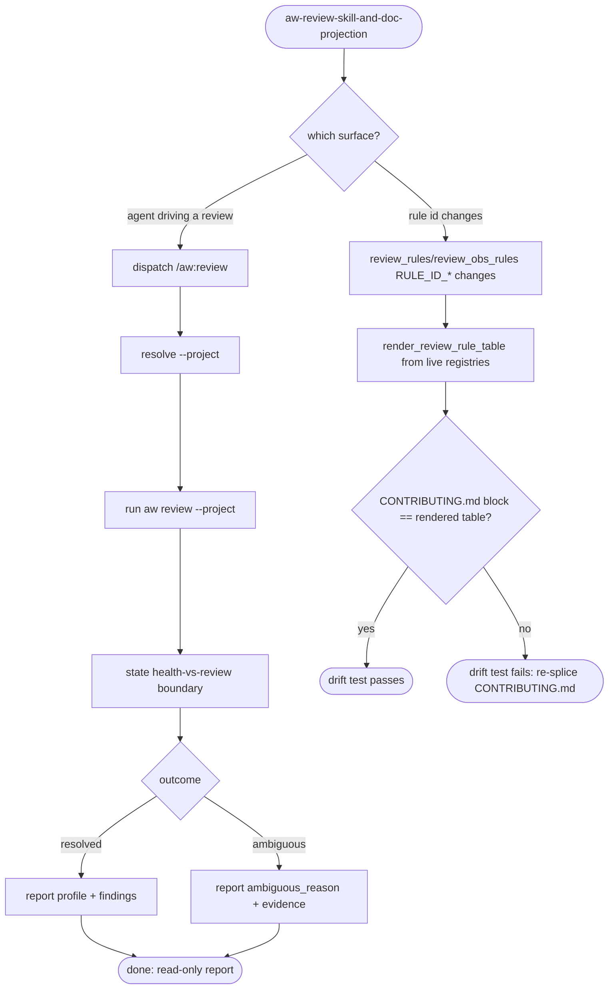

## Logic
<!-- type: logic lang: mermaid -->



The `aw:review` skill (R1) is a thin, read-only dispatcher: it never re-implements profile/rule logic client-side, resolves `--project` the same way the sibling `aw-health`/`aw-goal` skills do (explicit prompt token, else the current `project-<name>` branch, else `aw.toml` `[[projects]].name`/`.aliases` lookup), runs the live `aw review --project <project>` binary, and reads its `aw.cli.v1` envelope as authoritative -- `outcome: "resolved"` reports the resolved `profile` plus every `findings[]` entry's `severity`/`affected_paths`/`remediation`, `outcome: "ambiguous"` reports `ambiguous_reason` and `evidence` without guessing a profile, and `next.kind == "done"` is always the terminal state since `aw review` never mutates or loops. The skill body states the fixed `aw health` (readiness/gates)-vs-`aw review` (architecture/profile+rule conformance) boundary explicitly, mirroring the module doc's own boundary statement, so an agent never routes a readiness/gate question through `aw review` or an architecture/profile question through `aw health`.

The doc/trait projection (R2) keeps the profile/rule registry itself (`review_rules::KIT_RULES` + `RULE_ID_*` negative-assertion consts, `review_obs_rules::RULE_ID_*` obs/raft consts) as the single source of truth. `review_doc_projection::render_review_rule_table()` is a pure function over `review_rules::known_rule_docs()` (shared-kit + negative-assertion `RuleDoc { id, family, description }` rows, reusing each `KitRule.capability`/negative-assertion description text -- no new prose duplicated) and `review_obs_rules::known_rule_docs()` (obs/raft rows), producing the exact markdown table CONTRIBUTING.md's `<!-- aw:review-rule-table:start -->`/`<!-- aw:review-rule-table:end -->` block holds, appended under the existing "The shared service kit" heading. This is the same generated-marker-block shape `doc_mirror::render_trait_table`/`upsert_trait_table` already uses for the trait table (and `meta_docs::render_meta_doc_ownership_table` for the meta-doc matrix) -- reused pattern, not a new mechanism. The drift test `review_doc_projection::tests::contributing_review_rule_table_matches_live_registry` follows the exact precedent of `meta_docs::tests::meta_doc_ownership_contributing_projection_matches_matrix`: it reads the repo-root `CONTRIBUTING.md` from `env!("CARGO_MANIFEST_DIR")`'s repository-root ancestor, slices the marker-delimited block, and asserts it equals `render_review_rule_table()` byte-for-byte (trimmed). Because every rule id used inside a `finding()` call site is a named `RULE_ID_*`/`KitRule.id` constant (never an inline string literal), a rule id can never be added, renamed, or removed in `review_rules.rs`/`review_obs_rules.rs` without also changing the value `known_rule_docs()` returns -- so the drift test is a structural guarantee, not a best-effort string scrape, keeping the profile/rule registry and its CONTRIBUTING.md projection from ever becoming two independently hand-maintained taxonomies.
## Changes
<!-- type: changes lang: yaml -->

```yaml
changes:
  - path: apps/agentic-workflow/src/cli/review_rules.rs
    action: modify
    section: logic
    impl_mode: hand-written
    anchor: apply_conformance_rules
    description: |
      Doc-projection drift-proofing (#2169) for the existing #2166 shared-service-kit and
      negative-assertion rules, additive only -- no rule behavior, finding shape, or existing
      `Finding.id` value changes.

      - Rename `KitRule.rule_id: &'static str` (the bare suffix, e.g. `"server-tcp"`) to
        `KitRule.id: &'static str` holding the already-prefixed full id (e.g.
        `"shared-kit:server-tcp"`), and update the four `KIT_RULES` rows accordingly. Update the
        one call site in `apply_shared_kit_rules` (`format!("shared-kit:{}", rule.rule_id)`) to
        `rule.id.to_string()` -- the emitted `Finding.id` values are byte-identical before and after
        this rename, so every existing `#[cfg(test)]` assertion in this file keeps passing unchanged.
      - Add four named `pub(crate) const` rule-id constants replacing the inline string literals
        currently passed to `finding(...)` inside `pgpool_negative_assertion`,
        `tape_negative_assertion`, `relay_defer_negative_assertion`, and `lumen_negative_assertion`:
        `RULE_ID_PGPOOL_STATEFULSET_SHAPE = "negative-assertion:pgpool:statefulset-shape"`,
        `RULE_ID_TAPE_RAFT_OR_PRIMARY_REPLICA = "negative-assertion:tape:raft-or-primary-replica-signal"`,
        `RULE_ID_RELAY_DEFER_PASSIVE_REPLICA = "negative-assertion:relay-defer:passive-replica-signal"`,
        `RULE_ID_LUMEN_RAFT_LEADER_INGEST = "negative-assertion:lumen:raft-leader-ingest-signal"`. Each
        function's `finding(...)` call site is updated to pass the matching constant instead of the
        literal string -- same id values, no behavior change.
      - Add `pub(crate) struct RuleDoc { pub(crate) id: &'static str, pub(crate) family: &'static str,
        pub(crate) description: &'static str }` and `pub(crate) fn known_rule_docs() -> Vec<RuleDoc>`
        returning one `RuleDoc` per `KIT_RULES` row (`family: "shared-kit"`, `description:
        rule.capability`, reusing the existing human-readable capability text rather than duplicating
        new prose) followed by one `RuleDoc` per negative-assertion constant above (`family:
        "negative-assertion"`, a short description of what the rule flags, mirroring each function's
        existing doc comment). This is the one live registry `review_doc_projection::render_review_rule_table`
        renders from -- because every id it returns is the same named constant/field the `finding()`
        call sites already use, a rule id can never be added, renamed, or removed here without also
        changing what `known_rule_docs()` returns.
      - Widen `scan_src_for_substrings` is already `pub(crate)`; no visibility change needed. No new
        evidence source, no new finding, no severity change.

      gap: review-rule-registry-doc-projection-ids
      tracker: "#2169"

  - path: apps/agentic-workflow/src/cli/review_obs_rules.rs
    action: modify
    section: logic
    impl_mode: hand-written
    anchor: apply_observability_and_raft_rules
    description: |
      Same doc-projection drift-proofing (#2169) for the existing #2167 obs/raft rules, additive
      only -- no rule behavior, finding shape, or existing `Finding.id` value changes.

      - Add eight named `pub(crate) const` rule-id constants replacing the inline string literals
        currently passed to `finding(...)` at each of the eight call sites: `RULE_ID_OBS_STRUCTURED_LOGGING
        = "obs:structured-logging-metrics-adoption"`, `RULE_ID_OBS_W3C_CONTEXT =
        "obs:w3c-context-propagation-adoption"`, `RULE_ID_RAFT_PROPOSAL_ROUTING_TELEMETRY =
        "raft:proposal-routing-telemetry-gap"`, `RULE_ID_RAFT_LEADER_ROUTE_REPLICATION_LAG =
        "raft:leader-route-and-replication-lag-telemetry-gap"`, `RULE_ID_RAFT_HIGH_CARDINALITY_LABEL =
        "raft:high-cardinality-label-antipattern"`, `RULE_ID_RAFT_TRACE_CONTEXT_CONTINUITY =
        "raft:trace-context-continuity-gap"`, `RULE_ID_RAFT_FOLLOWER_LOCAL_MUTATION =
        "raft:follower-local-mutation-outside-consensus"`, `RULE_ID_RAFT_LOSS_OF_LEADER_FAIL_OPEN =
        "raft:loss-of-leader-fail-open-bypass"`. Each call site is updated to pass the matching
        constant instead of the literal string -- same id values, no behavior change, all 33+
        existing `cli::review*` tests keep passing unchanged.
      - Add `pub(crate) fn known_rule_docs() -> Vec<crate::cli::review_rules::RuleDoc>` returning one
        `RuleDoc` per constant above (`family: "obs"` for the two obs constants, `family: "raft"` for
        the six raft constants), each `description` a short one-line restatement of the existing
        module-doc-comment behavior for that rule (no new evidence-gathering logic, no new source of
        truth beyond the module's own existing prose).

      gap: review-obs-raft-rule-registry-doc-projection-ids
      tracker: "#2169"

  - path: apps/agentic-workflow/src/cli/review_doc_projection.rs
    action: create
    section: logic
    impl_mode: hand-written
    description: |
      New module (whole-file hand-written, matching the `review_rules.rs`/`review_obs_rules.rs`
      precedent -- no generator primitive yet renders a live-registry-driven Markdown table into a
      marker-delimited section of a repo-root doc and drift-tests it): the CONTRIBUTING.md
      profile/rule-registry doc-projection producer plus its drift test.

      - `pub(crate) const REVIEW_RULE_TABLE_START: &str = "<!-- aw:review-rule-table:start -->"` and
        `pub(crate) const REVIEW_RULE_TABLE_END: &str = "<!-- aw:review-rule-table:end -->"` -- the
        marker pair spliced into CONTRIBUTING.md, the same opt-in-per-document marker-splice shape
        `doc_mirror::TRAIT_TABLE_START`/`TRAIT_TABLE_END` and `meta_docs::META_DOC_MATRIX_START`/`_END`
        already use (reused pattern, this module intentionally does not register itself as a new
        `meta::MetaDocProducer`/`ProducerKind` variant -- `meta.rs`/`doc_mirror.rs` are
        `SPEC-MANAGED`/`CODEGEN` files outside this hand-written module's scope, and `aw meta sync`
        stays untouched by this change; this projection's own drift test is the enforcement
        mechanism instead).
      - `pub(crate) fn render_review_rule_table() -> String` -- builds a `| Rule ID | Family | Fires
        when |` Markdown table with one row per `review_rules::known_rule_docs()` entry followed by
        one row per `review_obs_rules::known_rule_docs()` entry (fixed insertion order: shared-kit,
        then negative-assertion, then obs, then raft -- deterministic, matches source declaration
        order in each registry), each row rendering `id` in backticks, `family` in backticks, and
        `description` as plain prose.
      - `#[cfg(test)] mod tests` with:
        - `contributing_review_rule_table_matches_live_registry` -- reads the repo-root
          `CONTRIBUTING.md` (via `PathBuf::from(env!("CARGO_MANIFEST_DIR")).parent().and_then(Path::parent)`,
          the exact repository-root resolution `meta_docs::tests::meta_doc_ownership_contributing_projection_matches_matrix`
          already uses), slices the block between `REVIEW_RULE_TABLE_START`/`REVIEW_RULE_TABLE_END`,
          and asserts it equals `render_review_rule_table()` (both `.trim()`-ed) -- the drift test:
          fails the moment a `RULE_ID_*` constant or `KIT_RULES`/`known_rule_docs()` entry is
          added, renamed, or removed in `review_rules.rs`/`review_obs_rules.rs` without CONTRIBUTING.md
          being re-spliced to match.
        - `render_review_rule_table_lists_every_known_rule_id` -- asserts the rendered table string
          contains every id from `review_rules::known_rule_docs()` and `review_obs_rules::known_rule_docs()`
          at least once, each wrapped in backticks.

      gap: review-rule-doc-projection-and-drift-test
      tracker: "#2169"

  - path: apps/agentic-workflow/templates/cli/mainthread/skills/aw-review/SKILL.md
    action: create
    section: cli
    impl_mode: hand-written
    description: |
      New `aw:review` skill template, installed by the existing `crate::cli::init` skill-tree
      projector (`aw_skill_entries()` / `install_claude_skills` / `install_agents_skills`) the same
      way `aw-health`/`aw-goal` are -- this TD's Changes[] deliberately excludes the `init.rs`
      registration wiring and its `tech-design/surface/interfaces/src/init.md` `SPEC-MANAGED`/CODEGEN
      mirror sync, following the exact two-phase precedent #2165 used for `cli/mod.rs` (module/skill
      registration wiring landed as a separate direct commit with `Refs #2169`, not inside a TD
      Changes[] entry).

      Format/tone matches `templates/cli/mainthread/skills/aw-health/SKILL.md` and
      `.../aw-goal/SKILL.md`: YAML frontmatter (`name: aw:review`, `description`, `user-invocable:
      true`), a `# /aw:review` heading, a `## Project Resolution` section (identical resolution order
      to `aw-health`'s: explicit prompt token, else current `project-<name>` branch, else `aw.toml`
      `[[projects]].name`/`.aliases` lookup), a `## Command` section documenting `aw review --project
      <project>` (read-only, never `--json`, `--pretty` only for human-readable debug output) and the
      `aw.cli.v1` envelope's `outcome`/`profile`/`findings`/`ambiguous_reason`/`evidence`/`next` shape
      as authoritative, and a `## Rules` section stating the fixed boundary explicitly: `aw health`
      owns readiness/gates/production-blocker status, `aw review` owns architecture/profile-shape and
      shared-service-kit/negative-assertion/observability/raft rule conformance -- never route a
      readiness question through `aw review` or an architecture/profile question through `aw health`.
      Read-only throughout: no rule in this skill body ever instructs an agent to edit files based on
      an `aw review` finding without the user asking to fix the project (mirrors `aw-health`'s own
      "Health is a measurement surface" rule).

      gap: aw-review-skill-template
      tracker: "#2169"

  - path: CONTRIBUTING.md
    action: modify
    section: schema
    impl_mode: hand-written
    description: |
      Splice a new `review_doc_projection::render_review_rule_table()`-generated table between
      `<!-- aw:review-rule-table:start -->`/`<!-- aw:review-rule-table:end -->` markers, placed
      immediately after the existing "### The shared service kit -- compose these libs, do not
      hand-roll" section (line ~358, right before "### Service workload profiles"), with a one-line
      lead-in sentence: "`aw review --project <project>` checks a served project's adoption of this
      kit plus profile-shape and observability/raft conformance; the table below is generated from
      the live rule registry in `cli::review_rules`/`cli::review_obs_rules` -- do not hand-edit between
      the markers." Same opt-in-per-document marker-splice convention the existing trait table and
      META-doc-matrix sections in this same file already use. Content between the markers is
      byte-identical (trimmed) to `review_doc_projection::render_review_rule_table()`'s output, which
      `contributing_review_rule_table_matches_live_registry` drift-tests on every `cargo test`.

      gap: review-rule-table-contributing-projection
      tracker: "#2169"
```
## Unit Test

```mermaid
---
id: review-skill-doc-trait-projection-with-drift-tests-verification
requirements:
  aw_review_skill_present_in_registry:
    id: R8
    text: "aw_skill_entries() includes an (\"aw-review\", SKILL_REVIEW) entry so install_claude_skills/install_agents_skills project .claude/skills/aw-review/SKILL.md and .agents/skills/aw-review/SKILL.md the same way aw-health and aw-goal are projected."
    kind: functional
    risk: medium
    verify: cli::init::tests::install_claude_skills_writes_aw_review_skill
  aw_review_skill_states_health_boundary:
    id: R9
    text: "The aw-review skill body explicitly states the aw health (readiness/gates) vs aw review (architecture/profile+rule conformance) boundary, matching AC9's requirement that review output/skill states this boundary clearly."
    kind: functional
    risk: low
    verify: cli::init::tests::install_claude_skills_writes_aw_review_skill
  contributing_projection_matches_live_registry:
    id: R7
    text: "The Markdown table spliced into CONTRIBUTING.md between the aw:review-rule-table start/end markers is byte-identical (trimmed) to review_doc_projection::render_review_rule_table()'s live output, so the doc drifts loudly (test failure) the moment a rule id changes without CONTRIBUTING.md being re-spliced."
    kind: regression
    risk: high
    verify: cli::review_doc_projection::tests::contributing_review_rule_table_matches_live_registry
  existing_review_test_battery_stays_green:
    id: R10
    text: "All pre-existing cli::review / cli::review_rules / cli::review_obs_rules tests (profile resolution, shared-kit rule application, negative assertions, obs/raft rules) continue to pass unchanged after the id-rename and const-extraction refactors in this TD."
    kind: regression
    risk: high
    verify: cargo test -p agentic-workflow --lib cli::review
  kit_rules_ids_unchanged_after_rename:
    id: R1
    text: "Renaming KitRule.rule_id to KitRule.id (full prefixed string) and routing apply_shared_kit_rules through rule.id instead of format!(\"shared-kit:{}\", rule.rule_id) must not change any emitted Finding.id value for the four shared-kit rules."
    kind: regression
    risk: high
    verify: cli::review_rules::tests::shared_kit_rule_ids_are_prefixed
  known_rule_docs_covers_obs_and_raft:
    id: R5
    text: "review_obs_rules::known_rule_docs() returns exactly one RuleDoc per obs/raft RULE_ID_* constant, with ids matching those constants byte-for-byte and family set to \"obs\" or \"raft\" correctly."
    kind: functional
    risk: medium
    verify: cli::review_obs_rules::tests::known_rule_docs_ids_match_obs_and_raft_consts
  known_rule_docs_covers_shared_kit_and_negative_assertions:
    id: R3
    text: "review_rules::known_rule_docs() returns exactly one RuleDoc per KIT_RULES row plus one RuleDoc per negative-assertion RULE_ID_* constant, with ids matching those constants byte-for-byte."
    kind: functional
    risk: medium
    verify: cli::review_rules::tests::known_rule_docs_ids_match_shared_kit_and_negative_assertion_consts
  negative_assertion_ids_use_named_consts:
    id: R2
    text: "pgpool_negative_assertion, tape_negative_assertion, relay_defer_negative_assertion, and lumen_negative_assertion must emit findings whose id equals the corresponding RULE_ID_* constant, and existing literal-string assertions in this file's tests keep passing unchanged."
    kind: regression
    risk: high
    verify: cli::review_rules::tests::pgpool_negative_assertion_flags_deployment_shape
  obs_raft_ids_use_named_consts:
    id: R4
    text: "All eight obs/raft finding() call sites in review_obs_rules.rs emit ids equal to their corresponding RULE_ID_* constant, and existing literal-string assertions in this file's tests keep passing unchanged."
    kind: regression
    risk: high
    verify: cli::review_obs_rules::tests::structured_logging_metrics_rule_uses_named_const_id
  render_review_rule_table_lists_every_id:
    id: R6
    text: "review_doc_projection::render_review_rule_table() output contains every id returned by review_rules::known_rule_docs() and review_obs_rules::known_rule_docs(), each wrapped in backticks, in fixed order (shared-kit, negative-assertion, obs, raft)."
    kind: functional
    risk: medium
    verify: cli::review_doc_projection::tests::render_review_rule_table_lists_every_known_rule_id
---
flowchart TD
    r1[R1 kit rules ids unchanged after rename] --> cli_review_rules_tests_shared_kit_rule_ids_are_prefixed[cli::review_rules::tests::shared_kit_rule_ids_are_prefixed]
    r2[R2 negative assertion ids use named consts] --> cli_review_rules_tests_pgpool_negative_assertion_flags_deployment_shape[cli::review_rules::tests::pgpool_negative_assertion_flags_deployment_shape]
    r3[R3 known rule docs covers shared kit and negative assertions] --> cli_review_rules_tests_known_rule_docs_ids_match_shared_kit_and_negative_assertion_consts[cli::review_rules::tests::known_rule_docs_ids_match_shared_kit_and_negative_assertion_consts]
    r4[R4 obs raft ids use named consts] --> cli_review_obs_rules_tests_structured_logging_metrics_rule_uses_named_const_id[cli::review_obs_rules::tests::structured_logging_metrics_rule_uses_named_const_id]
    r5[R5 known rule docs covers obs and raft] --> cli_review_obs_rules_tests_known_rule_docs_ids_match_obs_and_raft_consts[cli::review_obs_rules::tests::known_rule_docs_ids_match_obs_and_raft_consts]
    r6[R6 render review rule table lists every id] --> cli_review_doc_projection_tests_render_review_rule_table_lists_every_known_rule_id[cli::review_doc_projection::tests::render_review_rule_table_lists_every_known_rule_id]
    r7[R7 contributing projection matches live registry] --> cli_review_doc_projection_tests_contributing_review_rule_table_matches_live_registry[cli::review_doc_projection::tests::contributing_review_rule_table_matches_live_registry]
    r8[R8 aw review skill present in registry] --> cli_init_tests_install_claude_skills_writes_aw_review_skill[cli::init::tests::install_claude_skills_writes_aw_review_skill]
    r9[R9 aw review skill states health boundary] --> cli_init_tests_install_claude_skills_writes_aw_review_skill
    r10[R10 existing review test battery stays green] --> cargo_test_p_agentic_workflow_lib_cli_review[cargo test -p agentic-workflow --lib cli::review]
```

<!-- type: unit-test lang: mermaid -->


