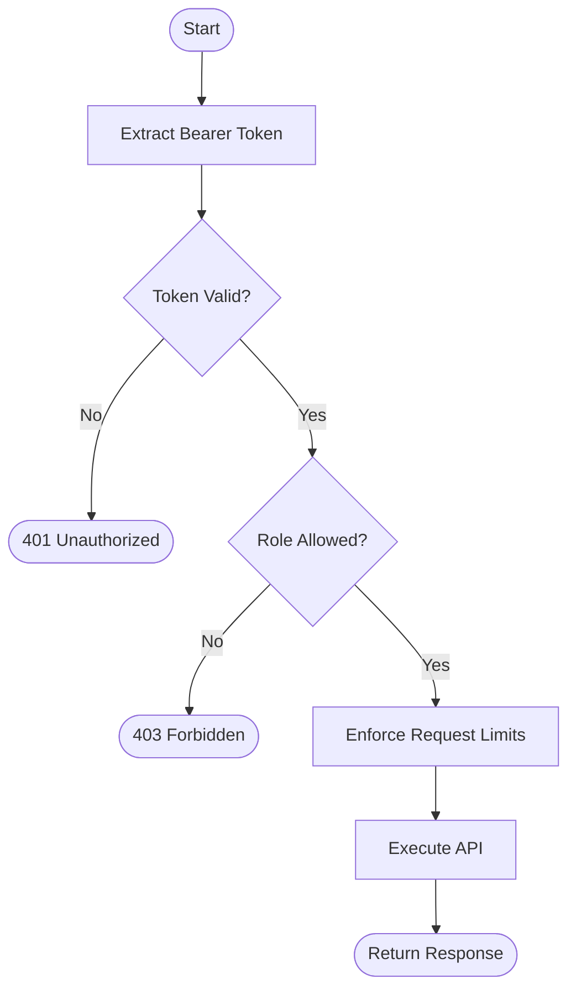
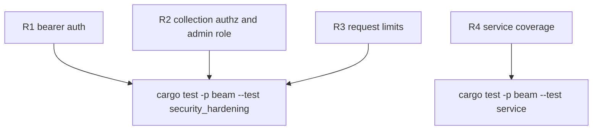

## Logic
<!-- type: logic lang: mermaid -->


## Changes
<!-- type: changes lang: yaml -->

```yaml
changes:
  - path: apps/beam/Cargo.toml
    action: modify
    section: logic
    impl_mode: hand-written
  - path: apps/beam/src/main.rs
    action: modify
    section: logic
    impl_mode: hand-written
    anchor: ServeArgs
  - path: apps/beam/src/service.rs
    action: modify
    section: logic
    impl_mode: hand-written
    anchor: router_with_state
  - path: apps/beam/tests/security_hardening.rs
    action: create
    section: unit-test
    impl_mode: hand-written
  - path: apps/beam/tests/service.rs
    action: modify
    section: unit-test
    impl_mode: hand-written
    anchor: service_end_to_end
```

## Unit Test
<!-- type: unit-test lang: mermaid -->


