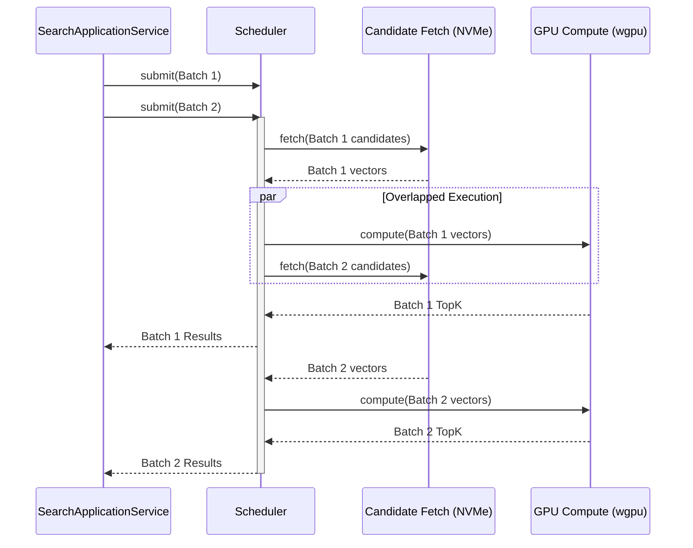
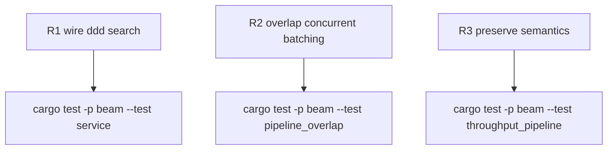

## Logic
<!-- type: logic lang: mermaid -->



## Changes
<!-- type: changes lang: yaml -->

```yaml
changes:
  - path: apps/beam/src/domain/scheduler.rs
    action: modify
    section: logic
    impl_mode: hand-written
    anchor: pub async fn execute_batch
  - path: apps/beam/src/application/search_service.rs
    action: modify
    section: logic
    impl_mode: hand-written
    anchor: pub async fn search
  - path: apps/beam/src/service.rs
    action: modify
    section: logic
    impl_mode: hand-written
    anchor: async fn query_collection
  - path: apps/beam/tests/throughput_pipeline.rs
    action: modify
    section: logic
    impl_mode: hand-written
    anchor: async fn test_r2_r3_infrastructure_and_e2e_pipeline
  - path: apps/beam/tests/service.rs
    action: modify
    section: logic
    impl_mode: hand-written
    anchor: async fn service_end_to_end
  - path: apps/beam/tests/pipeline_overlap.rs
    action: create
    section: logic
    impl_mode: hand-written
```

## Unit Test
<!-- type: unit-test lang: mermaid -->


