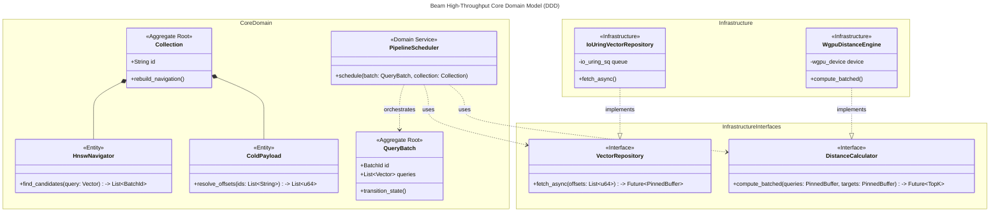
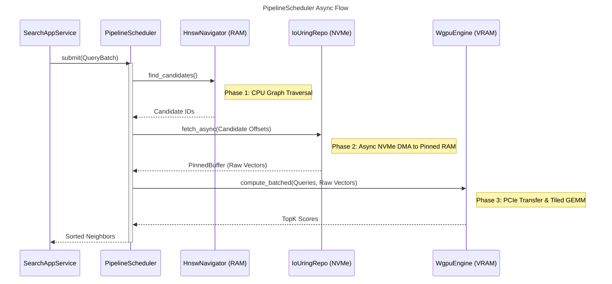
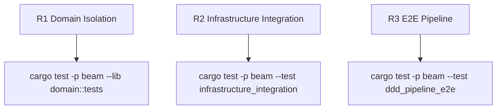

## Logic
<!-- type: logic lang: mermaid -->



<!-- type: logic lang: mermaid -->



## Changes
<!-- type: changes lang: yaml -->

```yaml
changes:
  - path: apps/beam/src/domain/collection.rs
    action: create
    section: logic
    impl_mode: hand-written
    description: "Define Collection Aggregate, HnswNavigator Entity, and ColdPayload Entity. Ensure domain layer contains no hardware-specific dependencies."
  - path: apps/beam/src/domain/scheduler.rs
    action: create
    section: logic
    impl_mode: hand-written
    description: "Implement PipelineScheduler Domain Service to orchestrate QueryBatch state transitions."
  - path: apps/beam/src/domain/ports.rs
    action: create
    section: logic
    impl_mode: hand-written
    description: "Define VectorRepository and DistanceCalculator Hexagonal/DDD ports (Interfaces)."
  - path: apps/beam/src/infrastructure/io_uring_repo.rs
    action: create
    section: logic
    impl_mode: hand-written
    description: "Implement VectorRepository port using Linux io_uring for O_DIRECT NVMe fetching to Pinned Memory."
  - path: apps/beam/src/infrastructure/wgpu_engine.rs
    action: create
    section: logic
    impl_mode: hand-written
    description: "Implement DistanceCalculator port wrapping wgpu Compute Pipelines for Tiled GEMM."
  - path: apps/beam/src/application/search_service.rs
    action: create
    section: logic
    impl_mode: hand-written
    description: "Implement SearchApplicationService to wire HTTP requests to the PipelineScheduler."
```

## Unit Test
<!-- type: unit-test lang: mermaid -->


