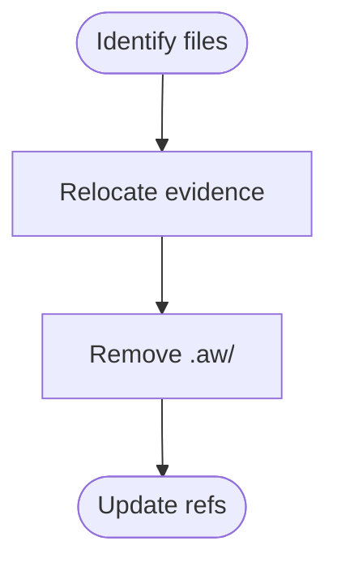
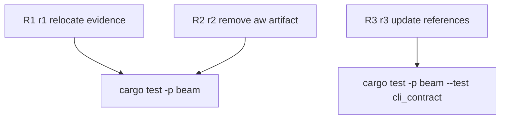

## Logic
<!-- type: logic lang: mermaid -->


## Changes
<!-- type: changes lang: yaml -->

```yaml
changes:
  - path: projects/beam/benchmark/competitor-feature-matrix.md
    action: modify
    section: logic
    impl_mode: hand-written
  - path: projects/beam/benchmark/competitor-performance-baseline.md
    action: modify
    section: logic
    impl_mode: hand-written
  - path: projects/beam/benchmark/competitor_bench.py
    action: modify
    section: logic
    impl_mode: hand-written
  - path: projects/beam/benchmark/dual-platform.md
    action: modify
    section: logic
    impl_mode: hand-written
  - path: apps/beam/benchmark/competitor-feature-matrix.md
    action: create
    section: logic
    impl_mode: hand-written
  - path: apps/beam/benchmark/competitor-performance-baseline.md
    action: create
    section: logic
    impl_mode: hand-written
  - path: apps/beam/benchmark/competitor_bench.py
    action: create
    section: logic
    impl_mode: hand-written
  - path: apps/beam/benchmark/dual-platform.md
    action: create
    section: logic
    impl_mode: hand-written
  - path: apps/beam/README.md
    action: modify
    section: logic
    impl_mode: hand-written
  - path: apps/beam/CAPABILITIES.md
    action: modify
    section: logic
    impl_mode: hand-written
  - path: apps/beam/build.rs
    action: modify
    section: logic
    impl_mode: hand-written
    anchor: main
  - path: apps/beam/src/main.rs
    action: modify
    section: logic
    impl_mode: hand-written
    anchor: TOPICS
  - path: apps/beam/tech-design/interfaces/cli/scaffold-service-crate-and-standard-cli-shell.md
    action: modify
    section: logic
    impl_mode: hand-written
  - path: apps/beam/tests/cli_contract.rs
    action: modify
    section: logic
    impl_mode: hand-written
    anchor: r1_workspace_crate_has_lib_and_bin
  - path: .aw/tech-design/projects/score/logic/scaffold-service-crate-and-standard-cli-shell.md
    action: modify
    section: logic
    impl_mode: hand-written
```

## Unit Test
<!-- type: unit-test lang: mermaid -->


