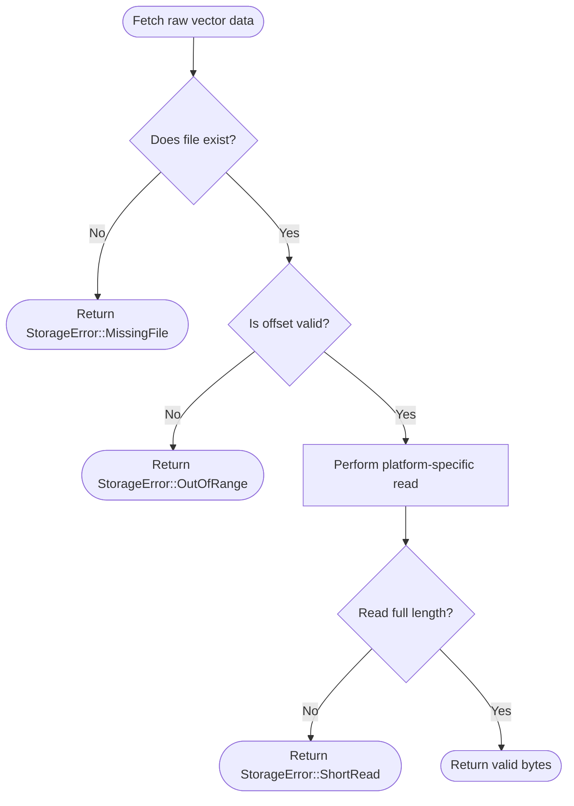
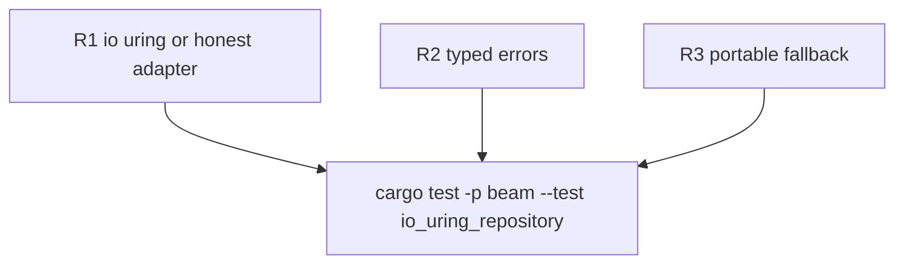

## Logic
<!-- type: logic lang: mermaid -->


## Changes
<!-- type: changes lang: yaml -->

```yaml
changes:
  - path: apps/beam/Cargo.toml
    action: modify
    section: logic
    impl_mode: hand-written
  - path: apps/beam/src/domain/ports.rs
    action: modify
    section: logic
    impl_mode: hand-written
    anchor: "VectorRepository"
  - path: apps/beam/src/infrastructure/io_uring_repo.rs
    action: modify
    section: logic
    impl_mode: hand-written
    anchor: "IoUringVectorRepository"
  - path: apps/beam/tests/io_uring_repository.rs
    action: create
    section: unit-test
    impl_mode: hand-written
```
## Unit Test
<!-- type: unit-test lang: mermaid -->


