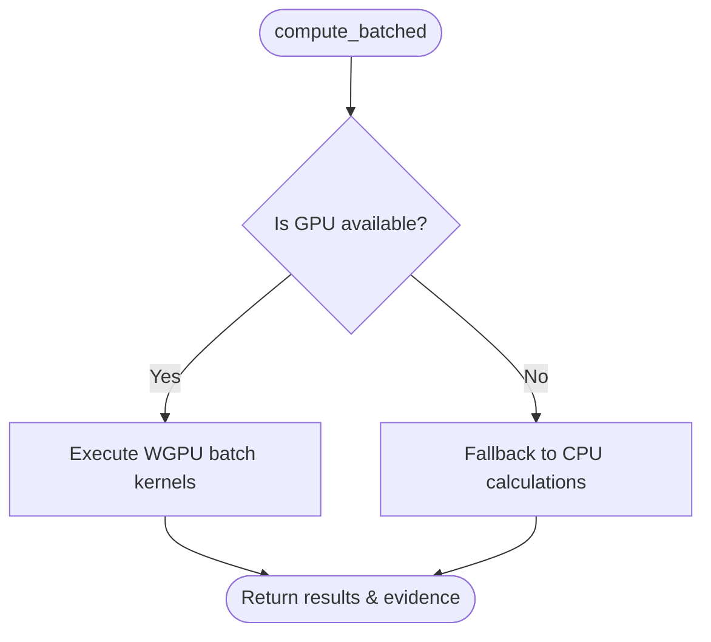

## Logic
<!-- type: logic lang: mermaid -->



## Changes
<!-- type: changes lang: yaml -->

```yaml
changes:
  - path: apps/beam/src/infrastructure/wgpu_engine.rs
    action: modify
    section: wgpu-engine
    impl_mode: hand-written
    anchor: "impl DistanceCalculator for WgpuDistanceEngine"
  - path: apps/beam/src/gpu/mod.rs
    action: modify
    section: gpu-batch-adapter
    impl_mode: hand-written
    anchor: "impl GpuContext"
  - path: apps/beam/tests/wgpu_distance_adapter.rs
    action: create
    section: adapter-tests
    impl_mode: hand-written
```
