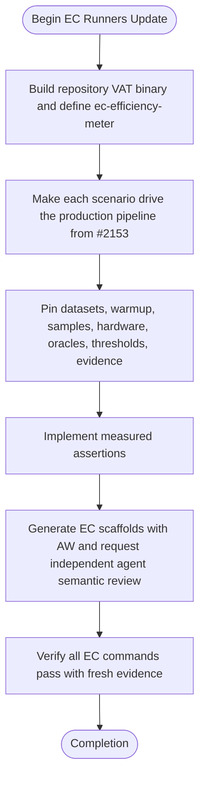

## Logic
<!-- type: logic lang: mermaid -->



## Changes
<!-- type: changes lang: yaml -->

```yaml
changes:
  - path: apps/beam/vat.toml
    action: modify
    section: ec-runners-logic
    impl_mode: hand-written
  - path: apps/beam/meter-search-efficiency-ddd.toml
    action: create
    section: ec-runners-logic
    impl_mode: hand-written
  - path: apps/beam/meter-search-efficiency-gpu.toml
    action: create
    section: ec-runners-logic
    impl_mode: hand-written
  - path: apps/beam/meter-search-efficiency-ooc.toml
    action: create
    section: ec-runners-logic
    impl_mode: hand-written
  - path: apps/beam/meter-search-efficiency-overlap.toml
    action: create
    section: ec-runners-logic
    impl_mode: hand-written
  - path: apps/beam/tests/benchmark_beam_competitor_performance_ddd_overhead.rs
    action: create
    section: ec-runners-logic
    impl_mode: hand-written
  - path: apps/beam/tests/benchmark_beam_competitor_performance_gpu_batching.rs
    action: create
    section: ec-runners-logic
    impl_mode: hand-written
  - path: apps/beam/tests/benchmark_beam_competitor_performance_out_of_core.rs
    action: create
    section: ec-runners-logic
    impl_mode: hand-written
  - path: apps/beam/tests/benchmark_beam_competitor_performance_pipeline_overlap.rs
    action: create
    section: ec-runners-logic
    impl_mode: hand-written
```
