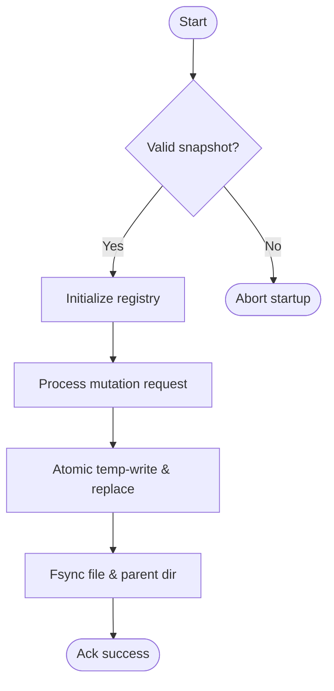
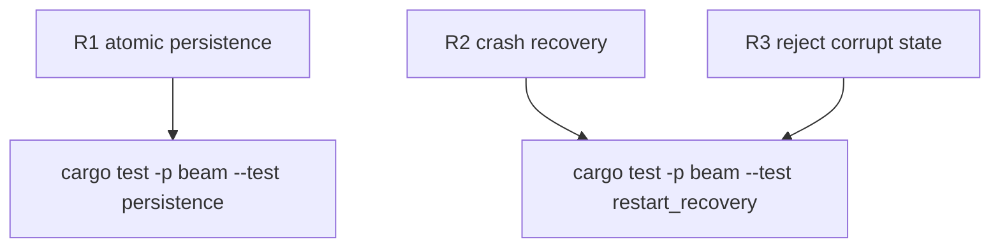

## Logic
<!-- type: logic lang: mermaid -->



## Changes
<!-- type: changes lang: yaml -->

```yaml
changes:
  - path: apps/beam/Cargo.toml
    action: modify
    section: logic
    impl_mode: hand-written
  - path: apps/beam/src/main.rs
    action: modify
    section: logic
    impl_mode: hand-written
    anchor: "struct ServeArgs"
  - path: apps/beam/src/persist.rs
    action: modify
    section: logic
    impl_mode: hand-written
    anchor: "pub fn save_framed"
  - path: apps/beam/src/service.rs
    action: modify
    section: logic
    impl_mode: hand-written
    anchor: "struct AppState"
  - path: apps/beam/tests/persistence.rs
    action: modify
    section: unit-test
    impl_mode: hand-written
    anchor: "fn flat_round_trip_identity_cpu_and_gpu"
  - path: apps/beam/tests/restart_recovery.rs
    action: create
    section: unit-test
    impl_mode: hand-written
```

## Unit Test
<!-- type: unit-test lang: mermaid -->


