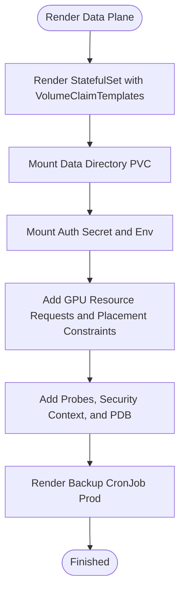
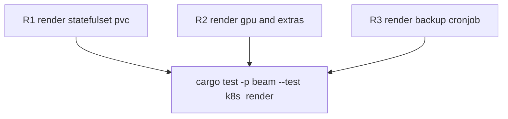

## Logic
<!-- type: logic lang: mermaid -->


## Changes
<!-- type: changes lang: yaml -->

```yaml
changes:
  - path: apps/beam/src/operator/mod.rs
    action: modify
    section: logic
    impl_mode: hand-written
    anchor: "pub struct BeamSpec"
  - path: apps/beam/src/operator/mod.rs
    action: modify
    section: logic
    impl_mode: hand-written
    anchor: "impl ManagedService for Beam"
  - path: apps/beam/src/dx.rs
    action: modify
    section: logic
    impl_mode: hand-written
    anchor: render_instance_yaml
  - path: apps/beam/tests/k8s_render.rs
    action: modify
    section: unit-test
    impl_mode: hand-written
    anchor: "tests"
```
## Unit Test
<!-- type: unit-test lang: mermaid -->


