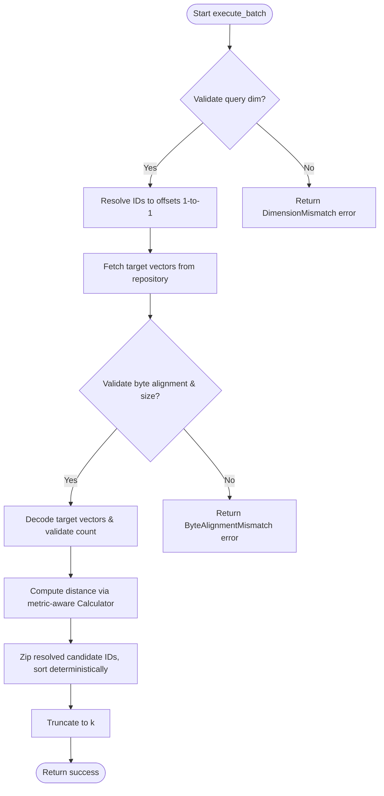
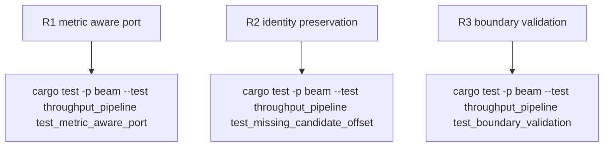

## Logic
<!-- type: logic lang: mermaid -->


## Changes
<!-- type: changes lang: yaml -->

```yaml
changes:
  - path: apps/beam/src/domain/ports.rs
    action: modify
    section: logic
    impl_mode: hand-written
    anchor: "pub trait DistanceCalculator"
    description: "Make compute_batched metric-aware by adding a metric parameter to the port interface."
  - path: apps/beam/src/domain/scheduler.rs
    action: modify
    section: logic
    impl_mode: hand-written
    anchor: "pub struct PipelineScheduler"
    description: "Validate query dimension, alignment, decoded count, and score count; preserve 1-to-1 mapping of candidate ID and offset."
  - path: apps/beam/src/infrastructure/wgpu_engine.rs
    action: modify
    section: logic
    impl_mode: hand-written
    anchor: "impl DistanceCalculator for WgpuDistanceEngine"
    description: "Implement correct L2, Dot, and Cosine metric scoring fallback on the CPU."
  - path: apps/beam/tests/throughput_pipeline.rs
    action: modify
    section: logic
    impl_mode: hand-written
    anchor: "struct MockDistanceCalculator"
    description: "Update MockDistanceCalculator to be metric-aware, and add comprehensive negative/regression tests for dimension validation, metric ordering, and missing candidates."
```

## Unit Test
<!-- type: unit-test lang: mermaid -->


