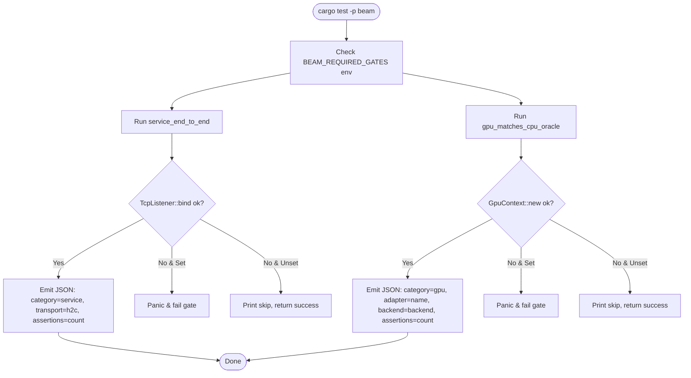
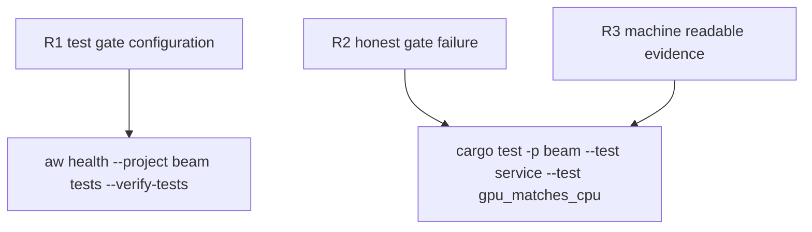

## Logic
<!-- type: logic lang: mermaid -->


## Changes
<!-- type: changes lang: yaml -->

```yaml
changes:
  - path: apps/beam/README.md
    action: modify
    section: logic
    impl_mode: hand-written
    description: "Add the `beam-test-gate-execution-policy` work root under the `long-running-stability` capability."
  - path: apps/beam/aw.toml
    action: modify
    section: logic
    impl_mode: hand-written
    description: "Update the `test_cmd` to run the full test suite with `BEAM_REQUIRED_GATES=1`."
  - path: apps/beam/tests/service.rs
    action: modify
    section: unit-test
    impl_mode: hand-written
    anchor: service_end_to_end
    description: "Panic on socket bind failure when `BEAM_REQUIRED_GATES` is set, and emit JSON evidence."
  - path: apps/beam/tests/gpu_matches_cpu.rs
    action: modify
    section: unit-test
    impl_mode: hand-written
    anchor: gpu_matches_cpu_oracle
    description: "Panic on missing GPU adapter when `BEAM_REQUIRED_GATES` is set, and emit JSON evidence."
```
## Unit Test
<!-- type: unit-test lang: mermaid -->


