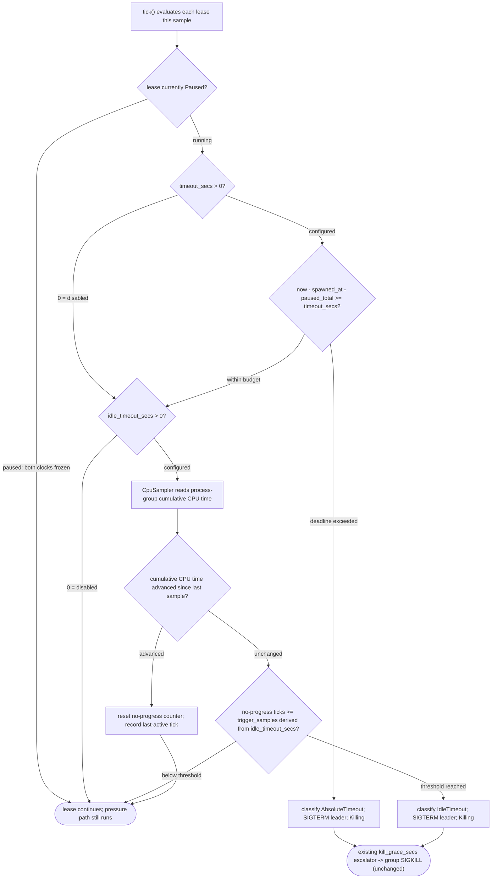

# TD: cap absolute and idle wall-clock lease timeouts

## Logic
<!-- type: logic lang: mermaid -->



Both triggers are new, independent, default-disabled entry points into the
**existing** `Killing` lease state and `kill_grace_secs` SIGTERM -> grace ->
SIGKILL escalation in `throttle.rs::tick()` — no new kill mechanism. They run
alongside (not instead of) the existing memory/CPU pressure pause-kill path
every tick; a lease may still be paused or killed by pressure regardless of
its timeout configuration.

The absolute-timeout clock is `now - spawned_at - paused_total`: elapsed
wall time since the client reported the spawned PID, minus all time the
lease has spent `Paused` (SIGSTOPped by cap's own pressure logic), so cap's
pausing can never spuriously trip a caller's `--timeout`. `paused_total` is
the same field `build_run_record` already uses for the run log; an
in-flight `paused_since` (lease paused right now) is added the same way.

The idle-timeout clock is a debounced no-progress detector, not a raw
silence timer: each tick, a new `CpuSampler` (same shape as `RssSampler`,
added to `sampler.rs`, using `ProcessRefreshKind::new().with_cpu()`) reads
the process group's cumulative CPU time. If it has not advanced since the
last sample, a per-lease no-progress counter increments; `trigger_samples`
for the idle path is derived from `idle_timeout_secs` divided by
`sample_interval_ms` (same debounce shape `pause_used_percent`/
`kill_used_percent` already use via `State`'s `trigger_samples` pattern,
but kept per-lease since idle progress is per-lease, not system-wide). Any
CPU-time advance resets the counter to zero. While a lease is `Paused`, its
idle counter is neither advanced nor reset — the clock is frozen, so a
pressure-paused lease cannot accumulate idle-timeout no-progress ticks
against SIGSTOP time.

Both fire paths reuse the identical `TermedVictim`-style transition already
in `tick()`: SIGTERM the leader (never the process group, matching the
existing `kill_grace_secs > 0` branch), set `state = Killing` and
`kill_started_at`, and store a `KillEnvelope` carrying the new
`KillClassification::AbsoluteTimeout` / `KillClassification::IdleTimeout`
and a matching new `Action` variant distinct from the memory-pressure
`WaitAndRetry`/`ChangeStrategy`/`InspectAndWait` framing — these are not
resource-competition kills, so telling an agent to `cap wait` and retry
would be misleading. The existing grace-period escalator at the top of
`tick()` (oldest expired `Killing` lease -> group `SIGKILL`) requires no
change: it already escalates any `Killing` lease regardless of which path
put it there.
## Unit Test

```mermaid
---
id: cap-lease-wall-clock-and-idle-timeouts-verification
requirements:
  absolute_timeout_excludes_paused_duration:
    id: R2
    text: "Time spent Paused (SIGSTOPped) is excluded from the absolute-timeout elapsed clock, so a lease paused by memory pressure does not spuriously trip --timeout."
    kind: functional
    risk: high
    verify: cargo test -p cap throttle::tests::absolute_timeout_excludes_paused_duration
  absolute_timeout_kills_after_deadline:
    id: R1
    text: "A lease with timeout_secs configured is killed via the existing SIGTERM/kill_grace_secs escalation once now - spawned_at - paused_total exceeds the deadline."
    kind: functional
    risk: high
    verify: cargo test -p cap throttle::tests::absolute_timeout_kills_after_deadline
  absolute_timeout_zero_disabled:
    id: R3
    text: "timeout_secs == 0 (default, unset flag and unset default_timeout_secs) never fires the absolute-timeout trigger regardless of elapsed time."
    kind: regression
    risk: high
    verify: cargo test -p cap throttle::tests::absolute_timeout_zero_never_fires
  acquire_request_carries_timeout_fields:
    id: R10
    text: "AcquireRequest serializes/deserializes new Option<u64> timeout_secs and idle_timeout_secs fields; omitted fields default to None (0/disabled) so existing clients are unaffected."
    kind: regression
    risk: medium
    verify: cargo test -p cap protocol::tests::acquire_request_carries_timeout_fields
  config_default_timeout_fields_default_to_disabled:
    id: R12
    text: "Protect::default() sets default_timeout_secs and default_idle_timeout_secs to 0 (disabled), and existing config.toml files without these keys parse with both fields defaulting to 0."
    kind: regression
    risk: high
    verify: cargo test -p cap config::tests::default_timeout_fields_default_to_disabled
  cpu_sampler_reads_cumulative_cpu_time:
    id: R9
    text: "CpuSampler, same shape as RssSampler, returns cumulative CPU time keyed by pid, refreshed via ProcessRefreshKind::new().with_cpu(), scoped to a caller-provided PID list."
    kind: functional
    risk: medium
    verify: cargo test -p cap sampler::tests::cpu_sampler_reads_cumulative_cpu_time
  idle_timeout_debounces_no_progress:
    id: R4
    text: "A lease whose process-group cumulative CPU time (via CpuSampler) has not advanced across trigger_samples consecutive sampler ticks is killed via the existing escalation; a single stale sample alone does not fire."
    kind: functional
    risk: high
    verify: cargo test -p cap throttle::tests::idle_timeout_debounces_no_progress
  idle_timeout_excludes_paused_duration:
    id: R6
    text: "The idle-timeout no-progress clock is frozen while a lease is Paused (SIGSTOPped): paused ticks are neither counted as progress nor as no-progress, so cap's own pressure pausing cannot spuriously trip --idle-timeout."
    kind: functional
    risk: high
    verify: cargo test -p cap throttle::tests::idle_timeout_excludes_paused_duration
  idle_timeout_resets_on_cpu_progress:
    id: R5
    text: "Any observed advance in process-group cumulative CPU time resets the idle no-progress counter, so intermittent CPU activity never accumulates toward the idle-timeout debounce threshold."
    kind: functional
    risk: high
    verify: cargo test -p cap throttle::tests::idle_timeout_resets_on_cpu_progress
  idle_timeout_zero_disabled:
    id: R7
    text: "idle_timeout_secs == 0 (default, unset flag and unset default_idle_timeout_secs) never fires the idle-timeout trigger regardless of CPU-time stagnation."
    kind: regression
    risk: high
    verify: cargo test -p cap throttle::tests::idle_timeout_zero_never_fires
  kill_envelope_distinguishes_timeout_classifications:
    id: R8
    text: "KillEnvelope.classification is AbsoluteTimeout or IdleTimeout (not Competition/Oversize/External) when either trigger fires, and KillEnvelope.action is a distinct Action variant from the memory-pressure WaitAndRetry/ChangeStrategy/InspectAndWait framing."
    kind: functional
    risk: high
    verify: cargo test -p cap throttle::tests::kill_envelope_distinguishes_timeout_classifications
  run_args_expose_timeout_flags:
    id: R11
    text: "cap run --timeout <secs> and cap run --idle-timeout <secs> parse into RunArgs and are forwarded on AcquireRequest; omitting both flags leaves the fields None and falls back to config defaults."
    kind: functional
    risk: medium
    verify: cargo test -p cap cli::tests::run_args_expose_timeout_flags
---
flowchart TD
    r1[R1 absolute timeout kills after deadline] --> cargo_test_p_cap_throttle_tests_absolute_timeout_kills_after_deadline[cargo test -p cap throttle::tests::absolute_timeout_kills_after_deadline]
    r2[R2 absolute timeout excludes paused duration] --> cargo_test_p_cap_throttle_tests_absolute_timeout_excludes_paused_duration[cargo test -p cap throttle::tests::absolute_timeout_excludes_paused_duration]
    r3[R3 absolute timeout zero disabled] --> cargo_test_p_cap_throttle_tests_absolute_timeout_zero_never_fires[cargo test -p cap throttle::tests::absolute_timeout_zero_never_fires]
    r4[R4 idle timeout debounces no progress] --> cargo_test_p_cap_throttle_tests_idle_timeout_debounces_no_progress[cargo test -p cap throttle::tests::idle_timeout_debounces_no_progress]
    r5[R5 idle timeout resets on cpu progress] --> cargo_test_p_cap_throttle_tests_idle_timeout_resets_on_cpu_progress[cargo test -p cap throttle::tests::idle_timeout_resets_on_cpu_progress]
    r6[R6 idle timeout excludes paused duration] --> cargo_test_p_cap_throttle_tests_idle_timeout_excludes_paused_duration[cargo test -p cap throttle::tests::idle_timeout_excludes_paused_duration]
    r7[R7 idle timeout zero disabled] --> cargo_test_p_cap_throttle_tests_idle_timeout_zero_never_fires[cargo test -p cap throttle::tests::idle_timeout_zero_never_fires]
    r8[R8 kill envelope distinguishes timeout classifications] --> cargo_test_p_cap_throttle_tests_kill_envelope_distinguishes_timeout_classifications[cargo test -p cap throttle::tests::kill_envelope_distinguishes_timeout_classifications]
    r9[R9 cpu sampler reads cumulative cpu time] --> cargo_test_p_cap_sampler_tests_cpu_sampler_reads_cumulative_cpu_time[cargo test -p cap sampler::tests::cpu_sampler_reads_cumulative_cpu_time]
    r10[R10 acquire request carries timeout fields] --> cargo_test_p_cap_protocol_tests_acquire_request_carries_timeout_fields[cargo test -p cap protocol::tests::acquire_request_carries_timeout_fields]
    r11[R11 run args expose timeout flags] --> cargo_test_p_cap_cli_tests_run_args_expose_timeout_flags[cargo test -p cap cli::tests::run_args_expose_timeout_flags]
    r12[R12 config default timeout fields default to disabled] --> cargo_test_p_cap_config_tests_default_timeout_fields_default_to_disabled[cargo test -p cap config::tests::default_timeout_fields_default_to_disabled]
```

<!-- type: unit-test lang: mermaid -->


## Changes
<!-- type: changes lang: yaml -->

```yaml
changes:
  - path: apps/cap/src/throttle.rs
    action: modify
    section: logic
    impl_mode: hand-written
    description: >
      Add `timeout_secs`/`idle_timeout_secs` (registered via `register`/a new
      setter) plus `last_cpu_active`/`idle_no_progress_run` bookkeeping
      fields on `Lease`. `tick()` gains two new per-lease checks, evaluated
      after the existing pause/kill pressure logic: an absolute-deadline
      check (`now - spawned_at - paused_total >= timeout_secs`) and a
      debounced idle no-progress check driven by a new `CpuLookup` closure
      parameter (mirroring `RssLookup`). Both checks are skipped entirely
      while the lease is `Paused`, and both feed the existing SIGTERM /
      `Killing` / `kill_grace_secs` escalation path — no new kill
      mechanism. Add `KillClassification::AbsoluteTimeout` /
      `KillClassification::IdleTimeout` cases to `classify_kill`'s call
      sites (`build_envelope`, `classification_label`, `action_next_step`).

  - path: apps/cap/src/throttle.rs
    action: modify
    section: unit-test
    impl_mode: hand-written
    description: >
      Add tests for: absolute-timeout kill after deadline; absolute-timeout
      Paused-duration exclusion; absolute_timeout_secs == 0 never fires;
      idle-timeout debounced no-progress kill; idle-timeout counter reset
      on CPU progress; idle-timeout Paused-duration exclusion;
      idle_timeout_secs == 0 never fires; KillEnvelope carries
      AbsoluteTimeout/IdleTimeout classification and a distinct Action
      variant. Use `tokio::time::pause`/`advance` (as the existing
      `kill_grace_secs` escalation tests already do) to drive the wall-clock
      deadline deterministically, and a fake `CpuLookup` closure (mirroring
      `NO_RSS`) to script cumulative CPU-time sequences per tick.

  - path: apps/cap/src/sampler.rs
    action: modify
    section: logic
    impl_mode: hand-written
    description: >
      Add `CpuSampler`, same shape as `RssSampler` (a thin `sysinfo::System`
      wrapper scoped to a caller-provided PID list), returning cumulative
      CPU time per pid via `ProcessRefreshKind::new().with_cpu()` and
      `Process::accumulated_cpu_time()` (or the process-group leader's CPU
      time, matching how RSS is read today). Sampled every tick alongside
      the existing `sample_interval_ms` cadence in the daemon's sampler
      loop.

  - path: apps/cap/src/sampler.rs
    action: modify
    section: unit-test
    impl_mode: hand-written
    description: >
      Add a `CpuSampler` test proving it returns cumulative CPU time keyed
      by pid for a real running process (e.g. the test process itself) and
      omits dead/unknown pids, matching `RssSampler`'s existing test shape.

  - path: apps/cap/src/protocol.rs
    action: modify
    section: logic
    impl_mode: hand-written
    description: >
      Add `timeout_secs: Option<u64>` and `idle_timeout_secs: Option<u64>`
      to `AcquireRequest`. Add `KillClassification::AbsoluteTimeout` and
      `KillClassification::IdleTimeout` variants. Add a matching new
      `Action` variant (e.g. `Action::TimedOut { kind, next_step }` or two
      dedicated variants) distinct from `WaitAndRetry`/`ChangeStrategy`/
      `InspectAndWait`, since a timeout kill is not a resource-competition
      diagnosis and should not suggest `cap wait`.

  - path: apps/cap/src/protocol.rs
    action: modify
    section: unit-test
    impl_mode: hand-written
    description: >
      Add a serde round-trip test proving `AcquireRequest` with
      `timeout_secs`/`idle_timeout_secs` omitted deserializes both fields as
      `None`, and a test proving `KillClassification::AbsoluteTimeout` /
      `IdleTimeout` serialize to the expected snake_case tags.

  - path: apps/cap/src/cli.rs
    action: modify
    section: logic
    impl_mode: hand-written
    description: >
      Add `--timeout <secs>` and `--idle-timeout <secs>` (`Option<u64>`,
      `#[arg(long)]`) to `RunArgs`. The run handler forwards both onto
      `AcquireRequest`, falling back to `None` (which the daemon resolves
      against `default_timeout_secs`/`default_idle_timeout_secs`) when
      unset.

  - path: apps/cap/src/cli.rs
    action: modify
    section: unit-test
    impl_mode: hand-written
    description: >
      Add a clap-parsing test proving `cap run --timeout 30 --idle-timeout
      10 -- <cmd>` populates both `RunArgs` fields, and that omitting both
      flags leaves them `None`.

  - path: apps/cap/src/config.rs
    action: modify
    section: logic
    impl_mode: hand-written
    description: >
      Add `default_timeout_secs: u64` and `default_idle_timeout_secs: u64`
      to `Protect`, both defaulting to `0` (disabled) in
      `Protect::default()` and via `#[serde(default)]`, so existing
      `config.toml` files without these keys parse unchanged.

  - path: apps/cap/src/config.rs
    action: modify
    section: unit-test
    impl_mode: hand-written
    description: >
      Add a test proving `Protect::default()` and a config.toml lacking the
      new keys both resolve `default_timeout_secs`/`default_idle_timeout_secs`
      to `0`, matching the existing legacy-key-fallback test pattern.

  - path: apps/cap/src/daemon.rs
    action: modify
    section: logic
    impl_mode: hand-written
    description: >
      At `Request::Acquire` handling, resolve each lease's effective
      `timeout_secs`/`idle_timeout_secs` as `a.timeout_secs.unwrap_or(cfg
      default)` / `a.idle_timeout_secs.unwrap_or(cfg default)` and pass them
      into `throttle.register(...)` (or a follow-up setter call) so `tick()`
      has both values available per lease from the moment it starts running.

  - path: apps/cap/README.md
    action: modify
    section: overview
    impl_mode: hand-written
    description: >
      Document `cap run --timeout`/`--idle-timeout` and
      `default_timeout_secs`/`default_idle_timeout_secs` under the
      Command Lease Throttling capability's promise and gate inventory,
      noting both triggers are default-disabled and reuse the existing
      pause/kill escalation rather than adding a new kill mechanism.
```
