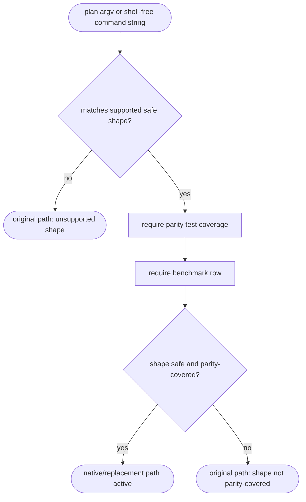

# TD: cap shape-sensitive native command takeover

## Logic
<!-- type: logic lang: mermaid -->


## Unit Test
<!-- type: unit-test lang: mermaid -->

```mermaid
---
id: cap-workload-sensitive-native-gates-contract-tests
requirements:
  planner_safe_subset_native:
    id: R1
    text: "Planner returns native plans for supported safe shell-free command shapes at any size."
    kind: functional
    risk: high
    verify: test
  planner_unsupported_original:
    id: R2
    text: "Planner returns External Original for unsupported flags, stdin-dependent forms, and shell-sensitive shapes."
    kind: functional
    risk: high
    verify: test
  unsupported_errors_fail_open:
    id: R3
    text: "Missing paths where parity is not implemented and unsupported flags fail open to the original command path."
    kind: functional
    risk: high
    verify: test
  run_string_matches_argv:
    id: R4
    text: "Shell-free cap run strings and cap argv entrypoints make the same shape-sensitive decision."
    kind: functional
    risk: high
    verify: test
  benchmark_small_large_rows:
    id: R5
    text: "command_resources benchmark has takeover rows and large resource-gated rows."
    kind: functional
    risk: high
    verify: benchmark
  readme_describes_fast_paths:
    id: R6
    text: "README describes native commands as conservative shape-sensitive takeovers, not a replacement shell."
    kind: functional
    risk: medium
    verify: test
elements:
  planner_takeover_tests:
    kind: test
    type: "cargo test -p cap command_planner"
  run_string_takeover_tests:
    kind: test
    type: "cargo test -p cap command_planner"
  parity_regression:
    kind: test
    type: "cargo test -p cap active_replacements_match_success_and_error_behavior"
  resource_benchmark_matrix:
    kind: benchmark
    type: "cargo bench -p cap --bench command_resources"
  readme_wording_smoke:
    kind: test
    type: "cargo test -p cap docs"
relations:
  - { from: planner_takeover_tests, verifies: planner_safe_subset_native }
  - { from: planner_takeover_tests, verifies: planner_unsupported_original }
  - { from: planner_takeover_tests, verifies: unsupported_errors_fail_open }
  - { from: run_string_takeover_tests, verifies: run_string_matches_argv }
  - { from: parity_regression, verifies: run_string_matches_argv }
  - { from: parity_regression, verifies: unsupported_errors_fail_open }
  - { from: resource_benchmark_matrix, verifies: benchmark_small_large_rows }
  - { from: readme_wording_smoke, verifies: readme_describes_fast_paths }
---
requirementDiagram
    requirement R1 {
      id: R1
      text: "safe shell-free supported shapes use native path at any size"
      risk: high
      verifymethod: test
    }
    requirement R2 {
      id: R2
      text: "unsupported shapes keep original path"
      risk: high
      verifymethod: test
    }
    requirement R3 {
      id: R3
      text: "unsupported flags fail open"
      risk: high
      verifymethod: test
    }
    requirement R4 {
      id: R4
      text: "run string and argv decisions match"
      risk: high
      verifymethod: test
    }
    requirement R5 {
      id: R5
      text: "benchmarks include takeover and gated rows"
      risk: high
      verifymethod: benchmark
    }
    requirement R6 {
      id: R6
      text: "README says shape-sensitive takeovers"
      risk: medium
      verifymethod: test
    }
    element planner_takeover_tests {
      type: "cargo test"
    }
    element run_string_takeover_tests {
      type: "cargo test"
    }
    element parity_regression {
      type: "cargo test"
    }
    element resource_benchmark_matrix {
      type: "cargo bench"
    }
    element readme_wording_smoke {
      type: "cargo test"
    }
```

## Changes
<!-- type: changes lang: yaml -->

```yaml
changes:
  - path: apps/cap/src/command_planner.rs
    action: modify
    section: logic
    impl_mode: hand-written
    description: >
      Add shape-sensitive native planning for safe shell-free same-name
      commands at any size. Unsupported flags, stdin-dependent forms, and shell
      control syntax must return an External Original plan.

  - path: apps/cap/src/cap_fast_frontend.c
    action: modify
    section: logic
    impl_mode: hand-written
    description: >
      Mirror the Rust planner safe-subset rules in the public low-overhead C
      frontend so same-name native fast paths claim both small and large safe
      workloads while unsupported shapes fall through to cap-full.

  - path: apps/cap/src/command_planner.rs
    action: modify
    section: unit-test
    impl_mode: hand-written
    description: >
      Add planner tests proving small safe subsets use the active native or
      replacement path, unsupported options keep the original path, and
      shell-free cap run strings make the same shape-sensitive decision as argv.

  - path: apps/cap/benches/command_resources.rs
    action: modify
    section: e2e-test
    impl_mode: hand-written
    description: >
      Extend the benchmark matrix with takeover rows for tiny primitives and
      representative large rows for resource-gated workloads. Takeover rows are
      measured without CPU/RSS admission failure.

  - path: apps/cap/tests/behavior_cap_command_replacement_parity.rs
    action: modify
    section: e2e-test
    impl_mode: hand-written
    description: >
      Keep active replacement parity coverage for promoted same-name shapes and
      add regression coverage for tiny primitive takeover paths.

  - path: apps/cap/README.md
    action: modify
    section: overview
    impl_mode: hand-written
    description: >
      Reword native command replacement as conservative shape-sensitive
      takeover. Document that unknown or shell-sensitive workloads keep
      original-command behavior.

  - path: apps/cap/BENCHMARKS.md
    action: modify
    section: overview
    impl_mode: hand-written
    description: >
      Document takeover rows versus resource-gated large rows and the
      interpretation that default takeover depends on safe shape and parity,
      while large workloads keep CPU/RSS regression evidence.
```
