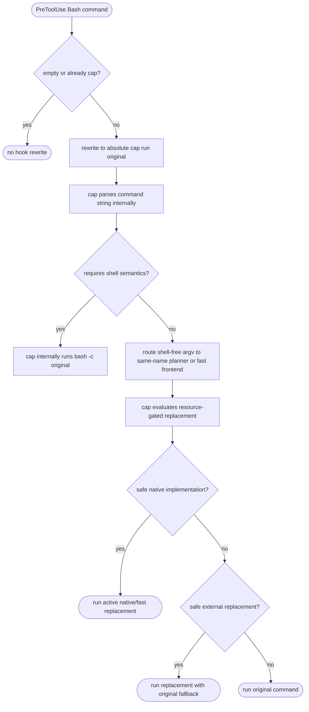

# Cap Same-Name Command Planner

## Logic
<!-- type: logic lang: mermaid -->


## Changes
<!-- type: changes lang: yaml -->

```yaml
changes:
  - path: apps/cap/src/hook.rs
    action: modify
    section: logic
    impl_mode: hand-written
    description: >
      Change the Bash hook rewrite adapter so every non-recursive Bash command
      is wrapped as absolute-path cap run original-command-string. The hook
      stays thin and only owns empty-command handling, cap recursion
      prevention, absolute cap path selection, and safe single-quote escaping.
      It must not decide which commands are replacements.

  - path: apps/cap/src/command_planner.rs
    action: add
    section: logic
    impl_mode: hand-written
    description: >
      Add a cap-side planner for cap <cmd> argv and cap run command strings.
      Shell-free strings are parsed into argv and routed through the same
      replacement planner; strings requiring shell semantics fall back to
      bash -c internally. The planner chooses native implementations for safe
      shell-free command subsets; tiny safe workloads may use the native path
      even when CPU/RSS micro-benchmarks lose to the original command. Resource
      gates remain benchmark regression checks for representative large rows,
      not admission gates for small safe primitives.
      The current native takeover surface includes true, false, pwd, echo,
      narrow printf string forms, narrow integer seq, whoami, narrow id,
      narrow uname, narrow test/bracket predicates, basename, dirname, ls, cat,
      head, tail, mkdir, touch, uniq, find, du, sort, narrow cut, narrow tr, sed, recursive literal
      single-file grep searches, grep -R searches, wc -l regular-file aggregates, narrow awk counts and first-field extraction,
      xargs echo, xargs wc -l, which, command -v, and listed fused pipe shapes including
      yes-to-head, ls pipelines, ls-sort-uniq producer pipelines, tail pipelines, sort pipelines, head producer pipelines,
      tail producer pipelines, cat-head/tail producer pipelines, single-line producer pipelines, sed producer pipelines,
      cat-sed producer pipelines, cat-awk producer pipelines, awk first-field producer pipelines, cut producer pipelines, cat-cut producer pipelines, cat-tr producer pipelines,
      cat-uniq producer pipelines, sort-uniq producer pipelines,
      grep-file pipelines, grep-file-sort-uniq producer pipelines, grep-file-cut producer pipelines, grep-file-awk producer pipelines, find-sort-uniq producer pipelines, printf-sort-uniq producer pipelines,
      printf-grep-sort-uniq producer pipelines, seq-sort-uniq producer pipelines,
      seq-grep-sort-uniq producer pipelines, awk-sort-uniq producer pipelines,
      grep-r-sort-uniq producer pipelines, cat-grep-sort-uniq producer pipelines,
      cat-to-cut, cat-sort,
      tr pipelines, path-lookup pipelines, safe find type/name pipelines, find-default-xargs, find-xargs, find-sort,
      find-sort-uniq, find-sort-xargs, and multi-stage find-sort pipelines.
      Unsupported echo, printf, seq, id, uname, test, cut, tr, awk, xargs, sort, find, which, command,
      and pipe-shaped shell commands keep compatibility fallback.

  - path: apps/cap/src/cli.rs
    action: modify
    section: logic
    impl_mode: hand-written
    description: >
      Route cap passthrough and cap run commands through the planner before
      execution. Add cap explain -- <cmd> to show the original command,
      implementation choice, run command, reason, and fallback.

  - path: apps/cap/src/hook.rs
    action: modify
    section: unit-test
    impl_mode: hand-written
    description: >
      Update hook tests to assert thin cap run original-string wrapping for
      simple takeover commands, scout-only commands, and shell-sensitive commands, with
      no hook-level optimizer behavior.

  - path: apps/cap/src/command_planner.rs
    action: add
    section: unit-test
    impl_mode: hand-written
    description: >
      Add planner tests for shape-sensitive native takeover, original-command
      fallback, and unsupported command fallback.

  - path: apps/cap/src/command_planner.rs
    action: modify
    section: logic
    impl_mode: hand-written
    description: >
      Keep unsupported native candidate code out of the active dispatch path so
      only safe shell-free subsets are claimed.

  - path: apps/cap/src/cap_frontend.c
    action: modify
    section: logic
    impl_mode: hand-written
    description: >
      Preserve original-command error behavior for public frontend direct
      dispatch. Active replacements must return matching nonzero exits and
      useful stderr diagnostics instead of silently failing. Provide a direct
      run-string cat path so hook-emitted cap run cat keeps native takeover.

  - path: apps/cap/src/cap_fast_frontend.c
    action: modify
    section: logic
    impl_mode: hand-written
    description: >
      Preserve success and error behavior for active C replacement paths,
      including missing-path diagnostics, grep no-match exit behavior, and du
      missing-root behavior that reports an error without printing a synthetic
      zero summary. Parse shell-free cap run command strings for active
      replacement commands and dispatch them to the same fast implementation
      family as cap <cmd>.

  - path: apps/cap/Cargo.toml
    action: modify
    section: e2e-test
    impl_mode: hand-written
    description: >
      Register a custom command_resources benchmark target for same-name
      command CPU-time and peak-RSS comparisons.

  - path: apps/cap/benches/command_resources.rs
    action: add
    section: e2e-test
    impl_mode: hand-written
    description: >
      Add a child-rusage benchmark harness that compares the actual cap
      same-name CLI surface and the hook-emitted cap run command-string surface
      against original system commands. Report median user+system CPU time and
      platform-normalized peak RSS, fail when any resource-gated row does not
      satisfy its dual-win, CPU-win, or RSS-fallback policy, and measure takeover rows
      without CPU/RSS admission failure. Candidate rows remain only for
      incomplete command shapes that do not yet have a safe native subset.

  - path: apps/cap/tests/behavior_cap_command_replacement_parity.rs
    action: add
    section: e2e-test
    impl_mode: hand-written
    description: >
      Add an integration parity test that builds the real installed binary
      shape, cap plus cap-fast plus cap-full, and compares active same-name and
      cap run command-string replacements with system commands for stdout, exit
      codes, quiet nonzero cases, and missing-path stderr behavior.

  - path: apps/cap/BENCHMARKS.md
    action: add
    section: e2e-test
    impl_mode: hand-written
    description: >
      Record the latest resource benchmark baseline and call out which
      commands currently win or lose against the bare original-command
      comparison contract.

  - path: apps/cap/README.md
    action: modify
    section: overview
    impl_mode: hand-written
    description: >
      Document same-name cap routing, cap-side planner ownership, native and
      replacement examples, complex-shell fallback, cap explain, and the
      tested-but-not-replaced command list.
```
## E2E Test
<!-- type: e2e-test lang: yaml -->

```yaml
e2e_tests:
  - id: cap-hook-auto-command-optimizer-whitelist
    name: "cap same-name command planner"
    capability_id: agent-hook-installation
    claim_id: hook-payload-rewrite-adapters
    contract_id: hook-payload-rewrite-adapters
    category: behavior
    command: "cargo test -p cap hook -- --nocapture && cargo test -p cap command_planner -- --nocapture && cargo test -p cap active_replacements_match_success_and_error_behavior -- --nocapture && cargo bench -p cap --bench command_resources"
    assertions:
      - "the Bash hook rewrites non-recursive commands to cap run original-command-string and does not expose same-name replacement decisions"
      - "cap run command-string parsing routes shell-free active replacements to the same fast implementation family as cap <cmd>"
      - "complex shell commands keep shell semantics by falling back internally to bash -c original"
      - "safe shell-free same-name subsets, including tiny primitives and large command workloads, route to cap native takeover for both cap <cmd> and cap run command-string surfaces"
      - "active replacements match original-command success output, missing-path error behavior, and quiet nonzero behavior"
      - "find xargs-wc output producer pipe shapes route to active native replacements in the Rust planner and cap-fast frontend for direct, sorted, sorted-unique, and grep-filtered find path streams with supported count/head/tail/sort downstreams"
      - "general finite line producers route xargs-wc output producer pipe shapes to active native replacements for direct cat/sort path lists plus filtered and sorted path-token streams with supported count/head/tail/sort downstreams"
      - "plain echo, narrow printf, narrow seq, whoami, narrow id, narrow uname, narrow test/bracket predicates, narrow cut, narrow tr, single-file grep, narrow awk, xargs echo, xargs wc -l, which, command -v, and listed fused pipe shapes including yes-to-head, ls pipelines, ls-sort-uniq producer pipelines, tail pipelines, sort pipelines, sort-uniq-count, grep-file pipelines, grep-file-sort-uniq producer pipelines, find-sort-uniq producer pipelines, printf-sort-uniq producer pipelines, printf-grep-sort-uniq producer pipelines, seq-sort-uniq producer pipelines, seq-grep-sort-uniq producer pipelines, awk-sort-uniq producer pipelines, grep-r-sort-uniq producer pipelines, cat-grep-sort-uniq producer pipelines, grep-tail, grep-sort, grep-sort-uniq-count, cat-to-cut, cat-sed producer pipelines, cat-awk producer pipelines, cat-head/tail producer pipelines, cat-cut producer pipelines, cat-tr producer pipelines, cat-uniq producer pipelines, sort-uniq producer pipelines, cat-uniq, cat-sort, cat-sort-uniq-count, tr pipelines, path-lookup pipelines, safe find type/name pipelines, find-default-xargs, find-xargs, find-sort, find-sort-uniq, find-sort-uniq-count, find-sort-xargs, and multi-stage find-sort pipelines route to active native replacements while unsupported echo/printf/seq/id/uname/test/cut/tr/awk/xargs/sort/find/which/command/pipe shapes keep compatibility fallback"
      - "grep-file-cut producer pipe shapes route to active native replacements for narrow cut field extraction and supported grep/count/head/tail/sort/xargs downstreams"
      - "grep-file-awk producer pipe shapes route to active native replacements for narrow awk first-field extraction and supported grep/count/head/tail/sort/xargs downstreams"
      - "unfiltered awk first-field producer pipe shapes route to active native replacements for direct awk and cat-to-awk inputs with supported count/head/tail/sort/xargs downstreams"
      - "awk-grep producer pipe shapes route to active native replacements for direct awk and cat-to-awk first-field output with supported grep/count/head/tail/sort/xargs downstreams"
      - "find-grep producer pipe shapes route to active native replacements for literal path filtering and supported count/head/tail/sort/xargs downstreams"
      - "ls-grep producer pipe shapes route to active native replacements for literal entry filtering and supported count/head/tail/sort/xargs downstreams while cwd-sensitive xargs wc stays fallback"
      - "sort-grep producer pipe shapes route to active native replacements for direct sort and cat-to-sort file output with supported grep/count/head/tail/sort/xargs downstreams"
      - "uniq producer pipe shapes route to active native replacements for direct uniq file output with supported count/head/tail/sort/xargs and grep downstreams"
      - "fused pipe replacements preserve Bash default pipeline behavior for covered upstream-error cases"
      - "resource-gated benchmark rows still fail when their dual-win, CPU-win, or RSS-fallback policy is not satisfied, while takeover rows are measured without CPU/RSS admission failure"
```

# Reviews

### Review 1
**Verdict:** approved

- [logic] Contract keeps the hook thin while cap owns command-string parsing, same-name replacement routing, and bash fallback.
- [changes] Contract identifies implementation touch points for hook wrapping, planner dispatch, public fast frontends, tests, benchmarks, and README updates.
- [e2e-test] Focused hook, planner, installed-shape parity, and resource benchmark gates cover the command replacement slice.
