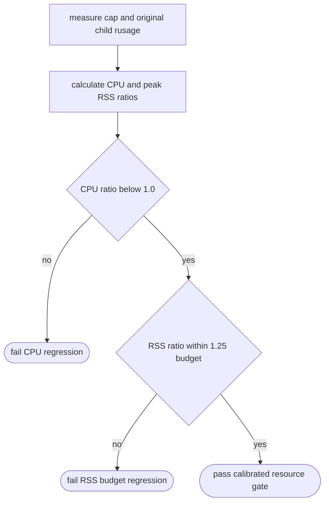
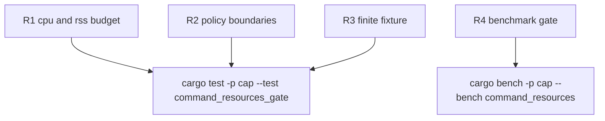

## Logic
<!-- type: logic lang: mermaid -->



Resource-gated rows use strict CPU admission and a calibrated peak-RSS budget. A native cap process carries a stable macOS process floor, so peak RSS must remain observable and bounded but cannot be required to beat every shell utility by an infinitesimal margin.

The policy accepts `cpu_ratio < 1.0` and `rss_ratio <= 1.25`; it fails either boundary violation with a policy-specific diagnostic. The 1.25 ceiling covers the independently reproduced 1.04x--1.18x process-floor range while preserving a tight cap on regressions.

The `xargs -n 1` stdin benchmark uses an independent, fixed-size fixture. It keeps command and pipe behavior in coverage while avoiding the inherited 500,000-line sort fixture that multiplies every benchmark sample into hundreds of thousands of child processes.
## Unit Test
<!-- type: unit-test lang: mermaid -->


## Changes
<!-- type: changes lang: yaml -->

```yaml
changes:
  - path: apps/cap/tech-design/semantic/source/projects-cap-benches-command_resources-rs.md
    action: modify
    section: rust-source-unit
    impl_mode: codegen
    description: Replace the impossible strict dual-win RSS comparison with an explicitly named strict-CPU plus 1.25x-RSS-budget gate, preserve raw measurement reporting, and use a dedicated bounded stdin fixture for the xargs -n 1 scenario.
  - path: apps/cap/benches/command_resources.rs
    action: modify
    section: e2e-test
    impl_mode: codegen
    description: Regenerate the benchmark from the semantic source so the runtime policy, gate label, diagnostic, and bounded xargs fixture are synchronized.
  - path: apps/cap/tests/command_resources_gate.rs
    action: add
    section: unit-test
    impl_mode: hand-written
    description: Test CPU rejection, exact RSS-budget acceptance, above-budget rejection, and the bounded xargs-n1 fixture invariant without executing the full benchmark.
  - path: apps/cap/tech-design/logic/cap-hook-auto-command-optimizer-whitelist.md
    action: modify
    section: e2e-test
    impl_mode: hand-written
    description: Update the resource-gate contract to name the calibrated CPU-plus-RSS budget rather than a strict dual-win requirement.
  - path: apps/cap/BENCHMARKS.md
    action: modify
    section: documentation
    impl_mode: hand-written
    description: Record the macOS process-floor rationale, 1.25x RSS ceiling, and bounded xargs-n1 fixture policy so the threshold is deliberate and auditable.
```
