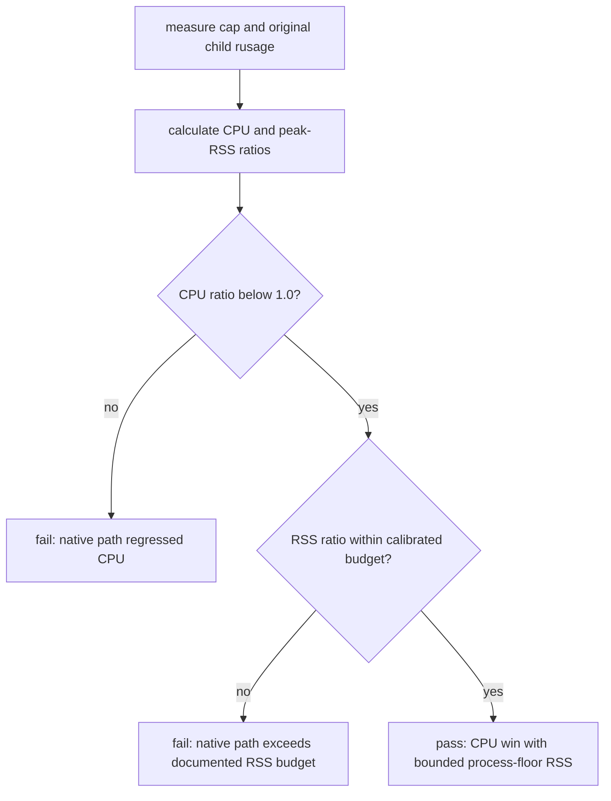
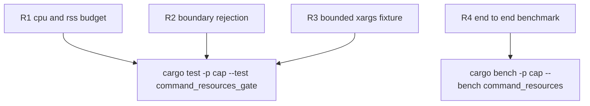

## Logic
<!-- type: logic lang: mermaid -->

The existing `dual-win` gate is unsound for a native `cap` process on macOS: peak RSS includes a stable executable/process floor that is higher than a shell utility even when CPU work is materially lower. The gate must therefore keep CPU as the strict replacement requirement while turning RSS into a bounded regression budget rather than an impossible strict-less-than comparison.

The calibrated budget is `cap_peak_rss / original_peak_rss <= 1.25` for resource-gated rows. This is deliberately narrow: the pre-existing blocking range is 1.04x--1.18x, while rows above 1.25x still fail. The benchmark continues to print both raw measurements and both ratios, so the policy change remains observable.

`command_resources` must expose this policy with an explicit gate name and failure text; it must not retain a `dual-win` label whose semantics no longer match the comparison. Targeted unit tests cover the CPU boundary, the RSS budget boundary, and rejection above either boundary. The checked-in benchmark explanation records the macOS process-floor rationale and the chosen 1.25x limit.

The fixture used by `xargs -n 1` must be bounded independently of broad sort workload fixtures. It currently inherits a 500,000-line input and turns every warmup/sample into 500,000 `echo` processes. A dedicated small deterministic input preserves the `-n 1` planner/parity coverage without making every code-check run millions of child processes. This timing correction changes neither the command's functional assertion nor the resource policy.

## Unit Test
<!-- type: unit-test lang: mermaid -->

