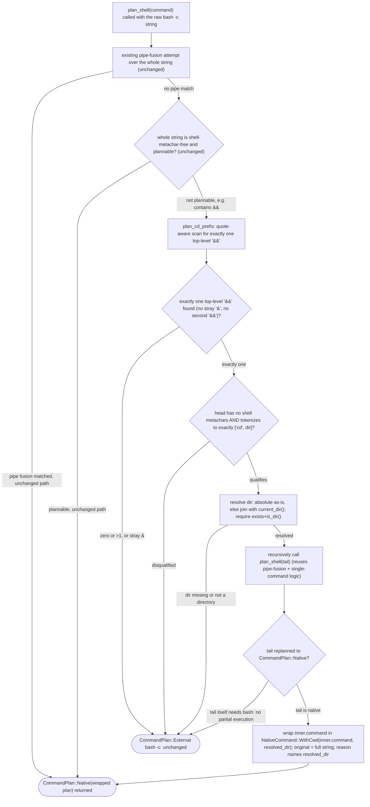

# TD: cap command planner cd-prefix native recognition

## Logic
<!-- type: logic lang: mermaid -->

The recognizer is a pure additive step inserted at the tail of `plan_shell`,
after the existing pipe-fusion attempt and the existing shell-metachar-free
single-command attempt both decline (both are unchanged and take priority,
since neither one currently accepts a string containing `&`). Only when both
decline does `plan_shell` call a new `plan_cd_prefix(original, label)` helper
before constructing its existing final `bash -c <original>` fallback; any
`None` from `plan_cd_prefix` falls straight through to that unchanged bash
construction, so behavior for every command line that is not this exact shape
is provably unaffected (R5).

`plan_cd_prefix` first runs a new quote-aware scanner (same single/double-quote
state-machine shape as the existing `has_shell_control_syntax` /
`split_simple_shell_words`) that looks for exactly one top-level `&&`
substring. A lone `&` not immediately followed by a second `&`, or a second
top-level `&&`, disqualifies the whole line immediately (R4's "more than one
`&&`" and "stray metacharacter" cases) and no split even happens for those
shapes. On exactly one match the string splits into `head` ("`cd `...") and
`tail` (the remainder).

The `head` segment is validated with two checks, both reusing existing
helpers rather than adding new metacharacter logic: `has_shell_control_syntax`
must be false (this alone rejects glob characters, `$` variables, `;`, `|`,
backtick, `~`, and any further `&`/`&&` inside the `cd` segment — exactly the
R4 disqualifier list), and `split_simple_shell_words(head)` must tokenize to
exactly two words with the first equal to the literal `"cd"`. Any failure
here (wrong arity, first word isn't `cd`, unterminated quote) disqualifies the
line and falls back to bash unchanged.

The qualifying `<dir>` token is resolved to an absolute path: used as-is if
already absolute, otherwise joined onto `std::env::current_dir()` (the same
value the resident light-shell session captured as its own `cwd` at session
start, since nothing in cap today mutates the process's actual working
directory — see `resident_shell.rs::ResidentLightShellSession::capture`).
The resolved path must exist and be a directory (`Path::is_dir()`); this
mirrors real `cd`'s failure behavior (`cd` failing means `&&` never runs the
tail) and is itself a planning failure that falls back to bash unchanged
rather than guessing (R3).

The `tail` segment is re-planned by recursively calling the same
`plan_shell(tail, label)` entry point used for top-level commands — this is
the reuse point that gives the recognizer pipe-fusion for free (e.g. `cd
<dir> && cat foo | wc -l`) without duplicating any planning logic. If the
recursive call returns `CommandPlan::External` (tail is not independently
native-plannable, for any reason the existing planner already has), the
recognizer returns `None` and the *original, unmodified* `cd <dir> && <tail>`
string falls back to bash as a whole — never a partial native-tail
execution with a stale `cd` prefix silently dropped (R3).

When the recursive call returns `CommandPlan::Native(inner)`, the recognizer
does not thread a new `cwd` field through the 270+ existing `NativePlan`
construction call sites. Instead it introduces one new recursive
`NativeCommand::WithCwd(Box<NativeCommand>, PathBuf)` variant that wraps
`inner.command` with the resolved directory, and builds the outer
`NativePlan` with `original` set to the *full* `cd <dir> && <tail>` string and
a `reason` that names the resolved absolute directory (satisfying AC1's
"resolved absolute path visible in ... reason"). `run_native_to`'s existing
big dispatch match is refactored (no behavior change to any existing arm)
into a `run_native_command(&NativeCommand, ...)` helper so the new
`WithCwd(inner, dir)` arm can temporarily `std::env::set_current_dir(dir)`,
recursively dispatch `inner` through the same helper, and restore the prior
working directory via an RAII guard before returning — a per-invocation
override of the process's single global cwd, not a persisted session-state
change, matching R2 and the explicit "no stateful cwd change" scope
boundary. Because the resident shell processes one command string at a time,
this transient global-cwd mutation is safe under the session's existing
single-invocation-at-a-time model; it is not safe under concurrent in-process
native execution, and that constraint is documented at the `WithCwd` variant
and the guard type rather than silently assumed.
