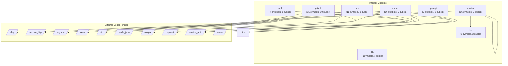

# Dependency Graph: Analyzed Project

## Overview

- **Internal Modules**: 8
- **External Dependencies**: 10
- **Total Relationships**: 22

## Module Graph

## Internal Modules

| Module | Path | Symbols | Public |
|--------|------|---------|--------|
| llm | apps/courier/src/llm.rs | 2 | 2 |
| courier | apps/courier/src/bin/courier.rs | 16 | 0 |
| lib | apps/courier/src/lib.rs | 1 | 1 |
| openapi | apps/courier/src/http/openapi.rs | 3 | 2 |
| auth | apps/courier/src/http/auth.rs | 8 | 8 |
| mod | apps/courier/src/http/mod.rs | 11 | 9 |
| routes | apps/courier/src/http/routes.rs | 10 | 5 |
| github | apps/courier/src/http/github.rs | 15 | 10 |

## External Dependencies

| Dependency |
|------------|
| clap |
| service_http |
| anyhow |
| axum |
| std |
| serde_json |
| utoipa |
| reqwest |
| service_auth |
| serde |

## Dependency Details

| From | To | Type |
|------|-----|------|
| courier | anyhow | import |
| courier | clap | import |
| courier | courier | import |
| courier | llm | import |
| openapi | utoipa | import |
| auth | std | import |
| auth | anyhow | import |
| auth | service_auth | import |
| mod | std | import |
| mod | axum | import |
| mod | service_auth | import |
| mod | service_http | import |
| mod | http | import |
| routes | axum | import |
| routes | serde | import |
| routes | serde_json | import |
| routes | service_auth | import |
| routes | service_http | import |
| routes | http | import |
| github | anyhow | import |
| github | reqwest | import |
| github | serde_json | import |
