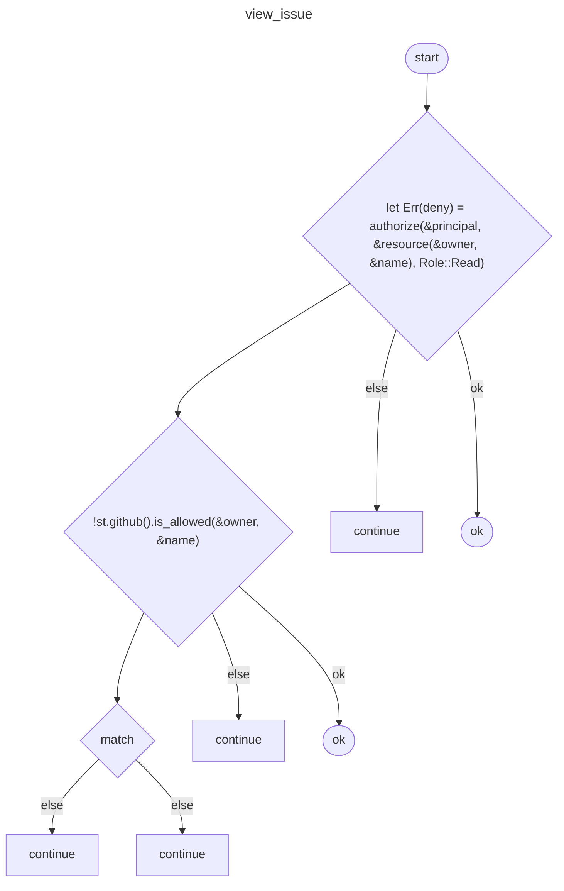
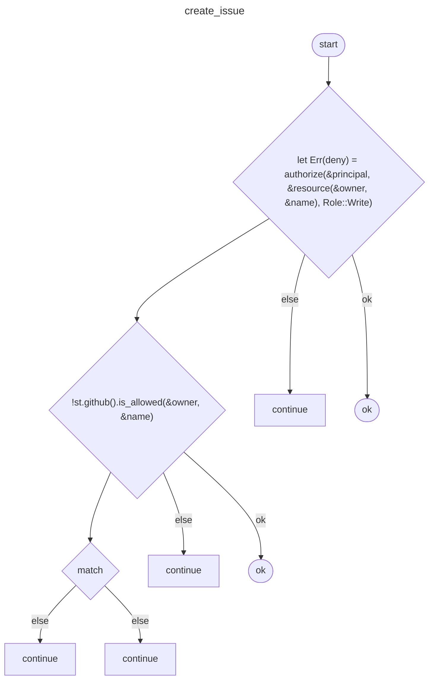

## Overview
<!-- type: overview lang: markdown -->

Module `routes` (Rust) — 10 symbol(s) (5 public). Spec auto-generated by `score fillback`; `impl_mode: hand-written` until extended with proper Schema / Logic sections.

### Symbols

| Name | Kind | Visibility | Line |
|------|------|------------|------|
| `resource` | function | priv | 25 |
| `forbidden_repo` | function | priv | 29 |
| `github_err` | function | priv | 38 |
| `SearchQuery` | struct | pub | 51 |
| `default_state` | function | priv | 59 |
| `default_limit` | function | priv | 63 |
| `search_issues` | function | pub | 79 |
| `view_issue` | function | pub | 113 |
| `create_issue` | function | pub | 143 |
| `comment_issue` | function | pub | 176 |

### Public Signatures

```rust
search_issues(
    State(st): State<AppState>,
    Extension(principal): Extension<RoleMapPrincipal>,
    Path((owner, name)): Path<(String, String)>,
    Query(q): Query<SearchQuery>,
) -> Response

view_issue(
    State(st): State<AppState>,
    Extension(principal): Extension<RoleMapPrincipal>,
    Path((owner, name, number)): Path<(String, String, u64)>,
) -> Response

create_issue(
    State(st): State<AppState>,
    Extension(principal): Extension<RoleMapPrincipal>,
    Path((owner, name)): Path<(String, String)>,
    Json(payload): Json<Value>,
) -> Response

comment_issue(
    State(st): State<AppState>,
    Extension(principal): Extension<RoleMapPrincipal>,
    Path((owner, name, number)): Path<(String, String, u64)>,
    Json(payload): Json<Value>,
) -> Response

```

### Imports

- `axum::extract` (external)
- `axum::http::StatusCode` (external)
- `axum::response` (external)
- `axum::Json` (external)
- `serde::Deserialize` (external)
- `serde_json::Value` (external)
- `service_auth` (external)
- `service_http::ApiErr` (external)
- `crate::http::auth::authorize` (internal)
- `crate::http::github::GithubError` (internal)
- `crate::http::AppState` (internal)

## Schema
<!-- type: schema lang: yaml -->

```yaml
schemas:
  - title: SearchQuery
    type: object
    rust_type: SearchQuery
    required: [state, limit]
    properties:
      state:
        rust_type: "String"
      q:
        rust_type: "Option<String>"
      limit:
        rust_type: "u32"
```

## Logic: search_issues
<!-- type: logic lang: mermaid -->


## Logic: view_issue
<!-- type: logic lang: mermaid -->



## Logic: create_issue
<!-- type: logic lang: mermaid -->



## Logic: comment_issue
<!-- type: logic lang: mermaid -->


## Changes
<!-- type: changes lang: yaml -->

```yaml
changes:
- action: modify
  anchor: search_issues
  impl_mode: hand-written
  path: apps/courier/src/http/routes.rs
  section: schema
- action: annotate
  impl_mode: hand-written
  section: logic
coverage_kind: semantic
```
