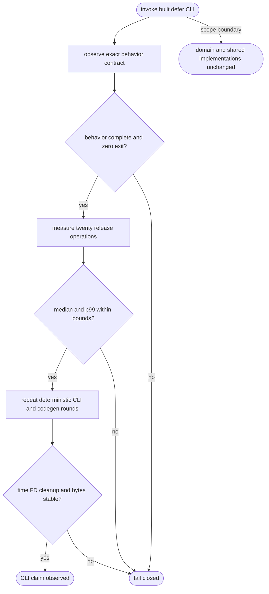

## Logic
<!-- type: logic lang: mermaid -->


## Changes
<!-- type: changes lang: yaml -->

```yaml
changes:
  - path: apps/defer/tests/cli_contract.rs
    action: modify
    section: unit-test
    impl_mode: hand-written
    anchor: help_exposes_standard_and_domain_surfaces
    reason: "Own the fail-closed behavior oracle for exact command grammar, offline llm, exact TypeScript client generation, and deployment-render exit status."
  - path: apps/defer/tests/cli_efficiency.rs
    action: modify
    section: unit-test
    impl_mode: hand-written
    anchor: offline_cli_and_codegen_stay_within_latency_ceiling
    reason: "Own the release-mode non-zero operation count and hard median/p99 CLI efficiency oracle."
  - path: apps/defer/tests/cli_stability.rs
    action: modify
    section: unit-test
    impl_mode: hand-written
    anchor: offline_cli_is_deterministic_and_resource_bounded
    reason: "Own repeated deterministic output, exact codegen cleanup, 60-second bound, and FD plateau evidence."
```
## Unit Test

```mermaid
---
id: defer-cli-interface-verification
requirements:
  bounded_cli_efficiency:
    id: R2
    text: "Twenty non-zero release-mode help, llm, spec, and exact-codegen operations report median, p95, and p99 latency with median no more than 250 ms, p99 no more than 750 ms, and zero errors."
    kind: efficiency
    risk: medium
    verify: cargo test --release -p defer --test cli_efficiency -- --ignored --nocapture
  exact_cli_behavior:
    id: R1
    text: "The built Defer CLI exposes exact standard and domain subcommand grammar, proves llm is offline with a connection trap, emits the live OpenAPI contract, generates the exact TypeScript task client, and checks every deployment renderer exit status before content."
    kind: functional
    risk: high
    verify: cargo test -p defer --test cli_contract -- --nocapture
  generated_ec_inventory:
    id: R4
    text: "The accepted CLI behavior, efficiency, and stability EC cases generate distinct fail-closed Rust wrappers and remain bound to claim defer-cli-convention-and-task-verbs."
    kind: regression
    risk: medium
    verify: aw ec check --project defer
  repeated_cli_stability:
    id: R3
    text: "Sixty-four repeated offline CLI rounds plus sixteen exact-codegen rounds are byte deterministic, clean temporary state, finish within 60 seconds, keep FD growth within eight, and report zero errors."
    kind: stability
    risk: high
    verify: cargo test --release -p defer --test cli_stability -- --ignored --nocapture
---
flowchart TD
    r1[R1 exact cli behavior] --> cargo_test_p_defer_test_cli_contract_nocapture[cargo test -p defer --test cli_contract -- --nocapture]
    r2[R2 bounded cli efficiency] --> cargo_test_release_p_defer_test_cli_efficiency_ignored_nocapture[cargo test --release -p defer --test cli_efficiency -- --ignored --nocapture]
    r3[R3 repeated cli stability] --> cargo_test_release_p_defer_test_cli_stability_ignored_nocapture[cargo test --release -p defer --test cli_stability -- --ignored --nocapture]
    r4[R4 generated ec inventory] --> aw_ec_check_project_defer[aw ec check --project defer]
```

<!-- type: unit-test lang: mermaid -->


