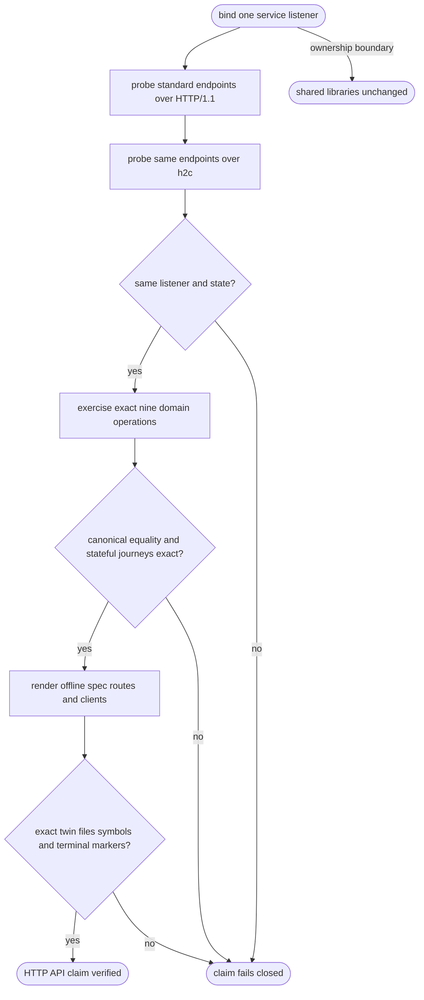

## Logic
<!-- type: logic lang: mermaid -->


## Changes
<!-- type: changes lang: yaml -->

```yaml
changes:
  - path: apps/defer/src/bin/defer.rs
    action: modify
    section: logic
    impl_mode: hand-written
    anchor: spec
    reason: "Own the offline OpenAPI/routes projection and exact nine-operation route twin emitted from the Defer CLI."
  - path: apps/defer/tests/http_api.rs
    action: modify
    section: unit-test
    impl_mode: hand-written
    anchor: h2c_routes_probes_openapi_metrics_dispatch_and_auth_are_live
    reason: "Own the one-listener HTTP/1.1 and h2c probes, canonical served OpenAPI equality, exact nine-operation inventory, stateful route journeys, and backup recovery oracle."
  - path: apps/defer/tests/cli_contract.rs
    action: modify
    section: unit-test
    impl_mode: hand-written
    anchor: offline_spec_and_typed_client_generation_use_one_contract
    reason: "Own semantic equality of offline and canonical OpenAPI, the exact routes twin, and exact TypeScript, Python, and Rust client file and symbol inventories."
```
## Unit Test

```mermaid
---
id: defer-http2-api-contract-verification
requirements:
  exact_live_route_contract:
    id: R2
    text: "Served OpenAPI equals the canonical Defer IR and contains exactly nine method/path operations; real requests exercise every queue, task, dispatch, and backup operation, with backup bytes recovering committed terminal state into a fresh Raft store."
    kind: functional
    risk: high
    verify: cargo test -p defer --test http_api -- --nocapture
  generated_ec_inventory:
    id: R5
    text: "The accepted live one-port and offline codegen EC cases remain generated as separate fail-closed wrappers bound to claim h2c-openapi-route-list."
    kind: regression
    risk: medium
    verify: aw ec check --project defer
  offline_spec_route_twin:
    id: R3
    text: "defer spec emits parseable OpenAPI semantically equal to the canonical IR, an exact nine-operation route twin including batch and backup, and exactly one terminal next marker."
    kind: regression
    risk: high
    verify: cargo test -p defer --test cli_contract offline_spec_and_typed_client_generation_use_one_contract -- --nocapture
  one_port_dual_protocol:
    id: R1
    text: "One bound Defer service URL serves health, readiness, docs, OpenAPI, and metrics with 200 over independent HTTP/1.1 and prior-knowledge h2c clients, and queue state written over h2c is readable over HTTP/1.1."
    kind: functional
    risk: high
    verify: cargo test -p defer --test http_api -- --nocapture
  three_language_codegen:
    id: R4
    text: "TypeScript, Python, and Rust code generation each produces the exact language-specific file inventory and all nine typed operations; Python includes both synchronous and asynchronous h2c clients."
    kind: regression
    risk: high
    verify: cargo test -p defer --test cli_contract offline_spec_and_typed_client_generation_use_one_contract -- --nocapture
---
flowchart TD
    r1[R1 one port dual protocol] --> cargo_test_p_defer_test_http_api_nocapture[cargo test -p defer --test http_api -- --nocapture]
    r2[R2 exact live route contract] --> cargo_test_p_defer_test_http_api_nocapture
    r3[R3 offline spec route twin] --> cargo_test_p_defer_test_cli_contract_offline_spec_and_typed_client_generation_use_one_contract_nocapture[cargo test -p defer --test cli_contract offline_spec_and_typed_client_generation_use_one_contract -- --nocapture]
    r4[R4 three language codegen] --> cargo_test_p_defer_test_cli_contract_offline_spec_and_typed_client_generation_use_one_contract_nocapture
    r5[R5 generated ec inventory] --> aw_ec_check_project_defer[aw ec check --project defer]
```

<!-- type: unit-test lang: mermaid -->


