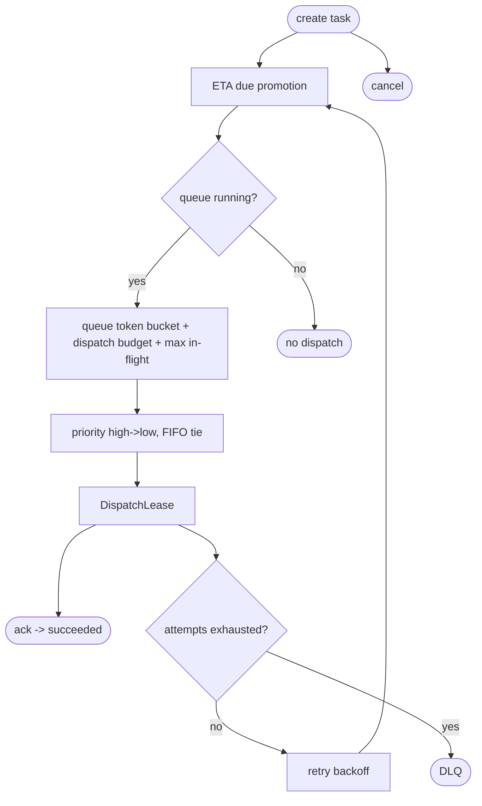

# defer core scheduler priority rate dispatch

## Logic
<!-- type: logic lang: mermaid -->



## Schema
<!-- type: schema lang: yaml -->

```yaml
$schema: "https://json-schema.org/draft/2020-12/schema"
$id: defer-core-scheduler#schema
title: Defer Core Scheduler Types
definitions:
  CreateTask:
    type: object
    required: [task_id, target, schedule_at]
    properties:
      task_id: { type: string }
      target: { $ref: "#/definitions/Target" }
      payload: {}
      schedule_at: { type: string, format: date-time }
      priority:
        type: integer
        minimum: 0
        maximum: 255
        default: 10
        description: "Higher dispatches first after ETA/rate gates."
      max_attempts: { type: integer, minimum: 1, default: 3 }
  Target:
    type: object
    required: [url]
    properties:
      url: { type: string }
      method: { type: string, default: POST }
      headers:
        type: object
        additionalProperties: { type: string }
  QueuePolicy:
    type: object
    required: [max_in_flight, max_dispatch_per_tick, max_dispatches_per_second, max_burst_size, lease_ttl_ms, retry_backoff_ms]
    properties:
      max_in_flight: { type: integer, minimum: 0 }
      max_dispatch_per_tick: { type: integer, minimum: 0 }
      max_dispatches_per_second: { type: integer, minimum: 0 }
      max_burst_size: { type: integer, minimum: 0 }
      lease_ttl_ms: { type: integer, minimum: 1 }
      retry_backoff_ms: { type: integer, minimum: 0 }
  QueueControlState:
    type: string
    enum: [Running, Paused, Disabled]
  QueueSnapshot:
    type: object
    required: [queue, control_state, policy, task_count, scheduled_count, in_flight_count, terminal_count]
    properties:
      queue: { type: string }
      control_state: { $ref: "#/definitions/QueueControlState" }
      policy: { $ref: "#/definitions/QueuePolicy" }
      task_count: { type: integer, minimum: 0 }
      scheduled_count: { type: integer, minimum: 0 }
      in_flight_count: { type: integer, minimum: 0 }
      terminal_count: { type: integer, minimum: 0 }
```

## Unit Test

```mermaid
---
id: defer-core-scheduler-tests
nodes:
  suite: { kind: start, label: "defer core scheduler tests" }
  t_eta: { kind: process, label: "eta_is_checked_before_priority" }
  a_eta: { kind: terminal, label: "future high-priority task cannot preempt a due lower-priority task" }
  t_priority: { kind: process, label: "priority_orders_due_tasks_and_same_priority_uses_creation_fifo" }
  a_priority: { kind: terminal, label: "u8 priority high-to-low and same-priority creation FIFO" }
  t_budget: { kind: process, label: "defer_owns_dispatch_budget_and_concurrency" }
  a_budget: { kind: terminal, label: "max_dispatch_per_tick and max_in_flight cap returned dispatch attempts" }
  t_retry: { kind: process, label: "nack_reschedules_then_dead_letters_after_max_attempts" }
  a_retry: { kind: terminal, label: "retry backoff and DLQ terminal transition" }
  t_cancel: { kind: process, label: "cancel_prevents_dispatch" }
  a_cancel: { kind: terminal, label: "canceled tasks are never dispatched" }
  t_expiry: { kind: process, label: "expired_leases_return_to_scheduler_control" }
  a_expiry: { kind: terminal, label: "lease expiry frees the slot and reschedules through retry backoff" }
  t_bucket: { kind: process, label: "per_queue_rate_bucket_limits_dispatch_over_time" }
  a_bucket: { kind: terminal, label: "max_dispatches_per_second and max_burst_size limit repeated drains" }
  t_control: { kind: process, label: "queue_pause_resume_is_per_queue_control" }
  a_control: { kind: terminal, label: "pause/resume affects one queue without stopping another queue" }
  t_disabled: { kind: process, label: "disabled_queue_rejects_new_tasks_and_stops_dispatch" }
  a_disabled: { kind: terminal, label: "disabled queue accepts no new tasks and emits no dispatch attempts" }
  t_update: { kind: process, label: "updating_one_queue_policy_does_not_change_other_queues" }
  a_update: { kind: terminal, label: "queue policy updates are isolated to the named queue" }
edges:
  - { from: suite, to: t_eta }
  - { from: t_eta, to: a_eta }
  - { from: suite, to: t_priority }
  - { from: t_priority, to: a_priority }
  - { from: suite, to: t_budget }
  - { from: t_budget, to: a_budget }
  - { from: suite, to: t_retry }
  - { from: t_retry, to: a_retry }
  - { from: suite, to: t_cancel }
  - { from: t_cancel, to: a_cancel }
  - { from: suite, to: t_expiry }
  - { from: t_expiry, to: a_expiry }
  - { from: suite, to: t_bucket }
  - { from: t_bucket, to: a_bucket }
  - { from: suite, to: t_control }
  - { from: t_control, to: a_control }
  - { from: suite, to: t_disabled }
  - { from: t_disabled, to: a_disabled }
  - { from: suite, to: t_update }
  - { from: t_update, to: a_update }
---
flowchart TD
    suite([defer core scheduler tests]) --> t_eta[ETA before priority]
    t_eta --> a_eta([future high does not preempt due low])
    suite --> t_priority[priority + FIFO]
    t_priority --> a_priority([u8 high-to-low; FIFO tie])
    suite --> t_budget[dispatch budget + concurrency]
    t_budget --> a_budget([Defer caps dispatch attempts])
    suite --> t_retry[nack retry then DLQ]
    t_retry --> a_retry([backoff then terminal DLQ])
    suite --> t_cancel[cancel]
    t_cancel --> a_cancel([not dispatched])
    suite --> t_expiry[lease expiry reclaim]
    t_expiry --> a_expiry([slot freed and retried])
    suite --> t_bucket[per-queue rate bucket]
    t_bucket --> a_bucket([repeated drains obey rate])
    suite --> t_control[pause/resume]
    t_control --> a_control([one queue control only])
    suite --> t_disabled[disable queue]
    t_disabled --> a_disabled([no new tasks or dispatch])
    suite --> t_update[policy update]
    t_update --> a_update([isolated queue policy])
```

<!-- type: unit-test lang: mermaid -->



## Changes
<!-- type: changes lang: yaml -->

```yaml
changes:
  - path: Cargo.toml
    action: modify
    section: config
    impl_mode: hand-written
    reason: "Add apps/defer as a workspace member so the core scheduler can be tested independently."
  - path: apps/defer/Cargo.toml
    action: create
    section: config
    impl_mode: hand-written
    reason: "Define the standalone Defer crate for main push-queue logic."
  - path: apps/defer/src/types.rs
    action: create
    section: schema
    impl_mode: hand-written
    reason: "Task, target, queue policy, queue control/snapshot, dispatch lease, status, and error types."
  - path: apps/defer/src/scheduler.rs
    action: create
    section: logic
    impl_mode: hand-written
    reason: "In-memory ETA/priority/rate scheduler core with per-queue Cloud Tasks-style controls, ack/nack/retry/DLQ/cancel."
  - path: apps/defer/tests/task_lifecycle.rs
    action: create
    section: unit-test
    impl_mode: hand-written
    reason: "Lifecycle, ETA, priority, retry, DLQ, and cancel conformance tests."
  - path: apps/defer/tests/rate_limits.rs
    action: create
    section: unit-test
    impl_mode: hand-written
    reason: "Dispatch budget, token-bucket rate, max-in-flight, pause/resume/disable, policy update isolation, and lease-expiry reclaim tests."
```
