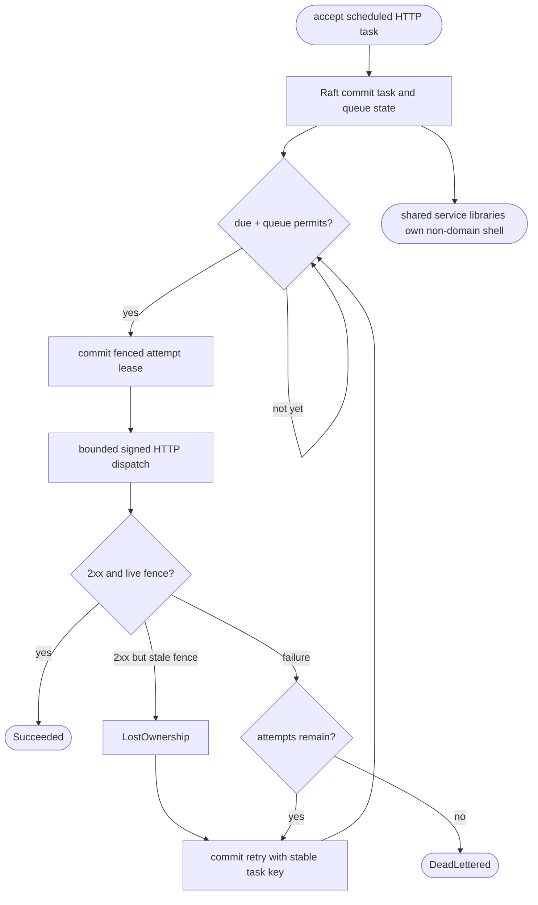

## Logic
<!-- type: logic lang: mermaid -->


## Changes
<!-- type: changes lang: yaml -->

```yaml
changes:
  - path: apps/defer/aw.toml
    action: modify
    section: logic
    impl_mode: hand-written
    reason: "Declare Defer as a Rust workspace with the real cargo test gate so accepted EC sources generate compilable wrappers instead of schema text."
  - path: apps/defer/scripts/soak.sh
    action: modify
    section: unit-test
    impl_mode: hand-written
    reason: "Exercise a fixed successful task and a fixed real-HTTP fault task, require committed retry progress in both steady windows, and retain bounded resource/latency thresholds."
  - path: apps/defer/tests/http_dispatch_signing.rs
    action: modify
    section: unit-test
    impl_mode: hand-written
    anchor: target_oracle_verifies_exact_signature_and_rejects_tampering
    reason: "Independently recompute the length-delimited HMAC at the target and reject field/body tampering, wrong key identity, and wrong secrets across retry attempts."
```

## Unit Test

```mermaid
---
id: defer-delayed-task-dispatch-service-verification
requirements:
  competitor_efficiency_policy:
    id: R3
    text: "The pinned same-host durable lifecycle comparison reports both sides and enforces Defer throughput at no less than 80 percent of Relay without claiming an unmeasured Cloud Tasks win."
    kind: efficiency
    risk: medium
    verify: defer_stays_within_twenty_percent_of_relay_scheduler_ceiling
  generated_external_contract_inventory:
    id: R1
    text: "The accepted Defer HTTP-dispatch EC generates five compilable Rust wrappers bound to real product commands and remains structurally clean."
    kind: regression
    risk: high
    verify: aw ec check --project defer
  push_dispatch_boundary:
    id: R2
    text: "Defer owns scheduled push delivery, committed retries, stable task idempotency, and terminal settlement without absorbing Relay pull-worker semantics."
    kind: functional
    risk: high
    verify: dispatches_real_http_and_retries_with_stable_task_idempotency
  retry_fault_stability:
    id: R5
    text: "A fixed-keyspace real HTTP fault workload makes committed retry progress in both 30-second windows while errors, RSS drift, descriptors, tasks, and p99 remain within declared limits."
    kind: stability
    risk: high
    verify: defer_http_dispatch_retry_soak_stability
  signed_target_integrity:
    id: R4
    text: "A target-side oracle exactly recomputes the length-delimited HMAC and rejects tampered fields or body bytes, wrong key identity, and wrong secrets across a retry."
    kind: security
    risk: high
    verify: target_oracle_verifies_exact_signature_and_rejects_tampering
---
flowchart TD
    r1[R1 generated external contract inventory] --> aw_ec_check_project_defer[aw ec check --project defer]
    r2[R2 push dispatch boundary] --> dispatches_real_http_and_retries_with_stable_task_idempotency[dispatches_real_http_and_retries_with_stable_task_idempotency]
    r3[R3 competitor efficiency policy] --> defer_stays_within_twenty_percent_of_relay_scheduler_ceiling[defer_stays_within_twenty_percent_of_relay_scheduler_ceiling]
    r4[R4 signed target integrity] --> target_oracle_verifies_exact_signature_and_rejects_tampering[target_oracle_verifies_exact_signature_and_rejects_tampering]
    r5[R5 retry fault stability] --> defer_http_dispatch_retry_soak_stability[defer_http_dispatch_retry_soak_stability]
```

<!-- type: unit-test lang: mermaid -->


