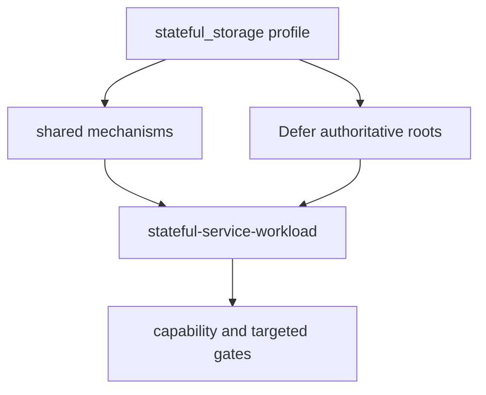
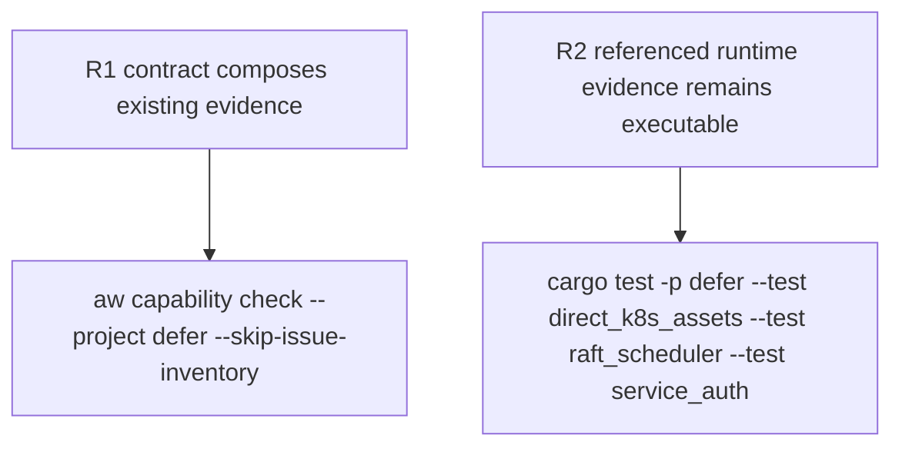

## Logic
<!-- type: logic lang: mermaid -->


## Changes
<!-- type: changes lang: yaml -->

```yaml
changes:
  - path: apps/defer/README.md
    action: modify
    section: logic
    impl_mode: hand-written
    description: Add the field-style stateful-service-workload contract and one work root; reference current shared-library paths and existing Defer domain evidence without duplicating their policies.
```

## Unit Test
<!-- type: unit-test lang: mermaid -->


