## Logic

```mermaid
---
id: defer-cloud-tasks-shaped-contract-verification
entry: parse_matrix
nodes:
  parse_matrix: { kind: start, label: "parse exact managed HTTP push comparison contract" }
  scope_ok: { kind: decision, label: "competitor category exclusions and performance boundary exact?" }
  exercise_lifecycle: { kind: process, label: "run ETA priority retry cancel inspect and terminal-state journey" }
  exercise_limits: { kind: process, label: "drive committed rate burst and in-flight limits through different replicas" }
  failover_ok: { kind: decision, label: "aggregate limits and DeadLettered survive failover and restart?" }
  exercise_target: { kind: process, label: "deliver exact method headers body idempotency and signed retries to real HTTP target" }
  target_ok: { kind: decision, label: "target effects and independent signing negatives exact?" }
  exercise_public_api: { kind: process, label: "create cancel and inspect through authenticated public h2c API" }
  ec_ok: { kind: decision, label: "accepted EC wrappers map every promised row to executing evidence?" }
  fail: { kind: terminal, label: "competitor feature contract fails" }
  verified: { kind: terminal, label: "scoped Defer competitor parity externally verified" }
edges:
  - { from: parse_matrix, to: scope_ok }
  - { from: scope_ok, to: exercise_lifecycle, label: "yes" }
  - { from: scope_ok, to: fail, label: "no" }
  - { from: exercise_lifecycle, to: exercise_limits }
  - { from: exercise_limits, to: failover_ok }
  - { from: failover_ok, to: exercise_target, label: "yes" }
  - { from: failover_ok, to: fail, label: "no" }
  - { from: exercise_target, to: target_ok }
  - { from: target_ok, to: exercise_public_api, label: "yes" }
  - { from: target_ok, to: fail, label: "no" }
  - { from: exercise_public_api, to: ec_ok }
  - { from: ec_ok, to: verified, label: "yes" }
  - { from: ec_ok, to: fail, label: "no" }
---
flowchart TD
    parse_matrix([parse exact comparison contract]) --> scope_ok{scope and boundaries exact?}
    scope_ok -->|yes| exercise_lifecycle[exercise delayed-task lifecycle]
    scope_ok -->|no| fail([contract fails])
    exercise_lifecycle --> exercise_limits[exercise cross-replica aggregate limits]
    exercise_limits --> failover_ok{limits and terminal state durable?}
    failover_ok -->|yes| exercise_target[exercise real HTTP effects and signatures]
    failover_ok -->|no| fail
    exercise_target --> target_ok{target behavior exact?}
    target_ok -->|yes| exercise_public_api[exercise authenticated public API]
    target_ok -->|no| fail
    exercise_public_api --> ec_ok{all accepted EC wrappers execute?}
    ec_ok -->|yes| verified([scoped competitor parity verified])
    ec_ok -->|no| fail
```

<!-- type: logic lang: mermaid -->


## Changes
<!-- type: changes lang: yaml -->

```yaml
changes:
  - path: apps/defer/tests/competitor_feature_matrix.rs
    action: modify
    section: unit-test
    impl_mode: hand-written
    anchor: cloud_tasks_shaped_contract_and_exclusions_are_explicit
    reason: "Own the parsed, duplicate-free 15-row Google Cloud Tasks-shaped comparison, explicit category exclusions, accurate retry-exhaustion semantics, and bounded performance-claim boundary."
  - path: apps/defer/tests/raft_scheduler.rs
    action: modify
    section: unit-test
    impl_mode: hand-written
    anchor: committed_queue_limits_survive_cross_replica_proposals_and_failover
    reason: "Own real three-node proofs that rate, burst, and in-flight limits are one committed aggregate and that DeadLettered converges and survives same-directory restart."
  - path: apps/defer/tests/http_dispatch.rs
    action: modify
    section: unit-test
    impl_mode: hand-written
    anchor: dispatches_real_http_and_retries_with_stable_task_idempotency
    reason: "Own the real target oracle for exact per-task method, header, body, retry identity, stable idempotency, and terminal success."
  - path: apps/defer/tests/http_api.rs
    action: modify
    section: unit-test
    impl_mode: hand-written
    anchor: h2c_routes_probes_openapi_metrics_dispatch_and_auth_are_live
    reason: "Own the authenticated public h2c create, cancel, and terminal inspection journey while preserving tenant isolation."
```

## Unit Test

```mermaid
---
id: defer-cloud-tasks-shaped-contract-verification
requirements:
  delayed_task_lifecycle:
    id: R2
    text: "ETA precedes priority, FIFO breaks equal-priority ties, retries obey backoff and reach explicit DeadLettered at max attempts, cancellation prevents dispatch, and terminal status remains inspectable."
    kind: functional
    risk: high
    verify: cargo test -p defer --test task_lifecycle -- --nocapture
  durable_dead_letter_state:
    id: R4
    text: "A real three-node cluster converges a two-attempt task to DeadLettered, and a killed node restarted from the same durable directory recovers exactly one terminal task with no scheduled or in-flight residue."
    kind: stability
    risk: high
    verify: cargo test -p defer --test raft_scheduler -- --nocapture
  exact_competitor_scope:
    id: R1
    text: "The executable comparison contains exactly 15 unique rows, selects Google Cloud Tasks only for managed HTTP push semantics, excludes worker frameworks by category, records Cloud Tasks retry exhaustion as deletion rather than DLQ, and forbids VAT or Relay evidence from becoming a Cloud Tasks performance claim."
    kind: regression
    risk: high
    verify: cargo test -p defer --test competitor_feature_matrix -- --nocapture
  generated_competitor_ec_inventory:
    id: R7
    text: "All accepted competitor-parity EC cases remain generated as distinct executable wrappers and bound to delayed-task-competitor-feature-matrix without reducing the comparison to prose."
    kind: regression
    risk: medium
    verify: aw ec check --project defer
  public_api_and_target_auth:
    id: R6
    text: "The required-auth public h2c API supports authorized create, cancel, and terminal inspection with tenant isolation and live credential rotation, while an independent HMAC oracle accepts exact signatures and rejects every signed-field, body, key-id, or secret mutation."
    kind: security
    risk: high
    verify: cargo test -p defer --test http_api --test service_auth --test http_dispatch_signing -- --nocapture
  queue_controls_and_replicated_limits:
    id: R3
    text: "Queue-local rate, burst, tick, in-flight, pause, disable, dedupe, and fence rules are deterministic, while different Raft replicas consume one committed aggregate rate and in-flight budget that survives leader loss."
    kind: stability
    risk: high
    verify: cargo test -p defer --test rate_limits --test raft_scheduler -- --nocapture
  real_http_target_delivery:
    id: R5
    text: "A real HTTP target observes exact per-task PATCH method, custom header, JSON body, stable idempotency key, fresh attempt identity, retry after 503, bounded concurrency, and terminal committed success after 204."
    kind: functional
    risk: high
    verify: cargo test -p defer --test http_dispatch -- --nocapture
---
flowchart TD
    r1[R1 exact competitor scope] --> cargo_test_p_defer_test_competitor_feature_matrix_nocapture[cargo test -p defer --test competitor_feature_matrix -- --nocapture]
    r2[R2 delayed task lifecycle] --> cargo_test_p_defer_test_task_lifecycle_nocapture[cargo test -p defer --test task_lifecycle -- --nocapture]
    r3[R3 queue controls and replicated limits] --> cargo_test_p_defer_test_rate_limits_test_raft_scheduler_nocapture[cargo test -p defer --test rate_limits --test raft_scheduler -- --nocapture]
    r4[R4 durable dead letter state] --> cargo_test_p_defer_test_raft_scheduler_nocapture[cargo test -p defer --test raft_scheduler -- --nocapture]
    r5[R5 real http target delivery] --> cargo_test_p_defer_test_http_dispatch_nocapture[cargo test -p defer --test http_dispatch -- --nocapture]
    r6[R6 public api and target auth] --> cargo_test_p_defer_test_http_api_test_service_auth_test_http_dispatch_signing_nocapture[cargo test -p defer --test http_api --test service_auth --test http_dispatch_signing -- --nocapture]
    r7[R7 generated competitor ec inventory] --> aw_ec_check_project_defer[aw ec check --project defer]
```

<!-- type: unit-test lang: mermaid -->


