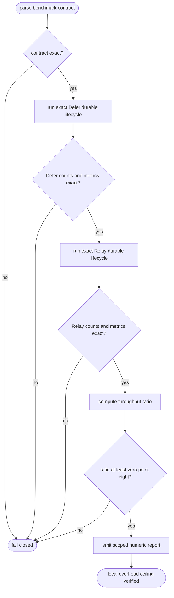

## Logic
<!-- type: logic lang: mermaid -->


## Changes
<!-- type: changes lang: yaml -->

```yaml
changes:
  - path: apps/defer/tests/relay_performance_ceiling.rs
    action: modify
    section: unit-test
    impl_mode: hand-written
    anchor: defer_stays_within_twenty_percent_of_relay_scheduler_ceiling
    reason: "Own the release-mode oracle for exact same-host workload identity, completed-operation cardinality, positive finite metrics, explicit no-overclaim scope, and the hard Defer-to-Relay ratio threshold."
```

## Unit Test

```mermaid
---
id: defer-competitor-performance-ceiling-verification
requirements:
  bounded_scheduler_overhead:
    id: R3
    text: "The measured Defer throughput divided by Relay throughput is finite and at least 0.80 under the identical declared workload."
    kind: efficiency
    risk: high
    verify: cargo test --release -p defer --test relay_performance_ceiling -- --ignored --nocapture
  explicit_scope_boundary:
    id: R4
    text: "A parsed machine contract and emitted report identify Relay as a same-host sibling implementation comparator, mark RSS process-shared, reject dated observations as authoritative, and set Cloud Tasks performance and universal superiority claims to false."
    kind: regression
    risk: high
    verify: cargo test --release -p defer --test relay_performance_ceiling -- --ignored --nocapture
  fail_closed_measurements:
    id: R2
    text: "Every batch and settlement count is exact, and both sides require finite positive throughput, CPU, disk amplification plus non-zero p50, p95, p99, process-shared RSS, and durable disk bytes before emitting zero-error results."
    kind: efficiency
    risk: high
    verify: cargo test --release -p defer --test relay_performance_ceiling -- --ignored --nocapture
  generated_performance_ec:
    id: R5
    text: "The accepted competitor-performance EC remains generated as an explicit efficiency wrapper bound to delayed-task-competitor-performance-baseline."
    kind: regression
    risk: medium
    verify: aw ec check --project defer
  identical_durable_workload:
    id: R1
    text: "Defer and Relay each complete exactly 1,000 operations in ten 100-item batches with the same exactly asserted 128-byte serialized JSON payload, one voter, fsync-always durability, and durable enqueue, committed lease, committed acknowledgement lifecycle."
    kind: efficiency
    risk: high
    verify: cargo test --release -p defer --test relay_performance_ceiling -- --ignored --nocapture
---
flowchart TD
    r1[R1 identical durable workload] --> cargo_test_release_p_defer_test_relay_performance_ceiling_ignored_nocapture[cargo test --release -p defer --test relay_performance_ceiling -- --ignored --nocapture]
    r2[R2 fail closed measurements] --> cargo_test_release_p_defer_test_relay_performance_ceiling_ignored_nocapture
    r3[R3 bounded scheduler overhead] --> cargo_test_release_p_defer_test_relay_performance_ceiling_ignored_nocapture
    r4[R4 explicit scope boundary] --> cargo_test_release_p_defer_test_relay_performance_ceiling_ignored_nocapture
    r5[R5 generated performance ec] --> aw_ec_check_project_defer[aw ec check --project defer]
```

<!-- type: unit-test lang: mermaid -->


