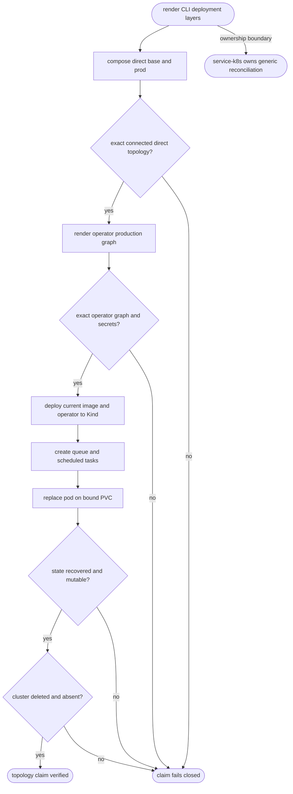

## Logic
<!-- type: logic lang: mermaid -->



## Changes
<!-- type: changes lang: yaml -->

```yaml
changes:
  - path: apps/defer/tests/direct_k8s_assets.rs
    action: modify
    section: unit-test
    impl_mode: hand-written
    anchor: prod_profile_renders_the_connected_security_boundary
    reason: "Own exact named Service and PDB invariants from both composed direct base and production Kustomize resource sets, so disconnected resources fail."
  - path: apps/defer/tests/operator.rs
    action: modify
    section: unit-test
    impl_mode: hand-written
    anchor: production_render_composes_shared_stateful_primitives
    reason: "Own the exact six-object production graph, three-replica StatefulSet relationships, connected security secrets, and backup CronJob oracle."
  - path: apps/defer/scripts/kind-e2e.sh
    action: modify
    section: unit-test
    impl_mode: hand-written
    anchor: assert_operator_topology
    reason: "Own the real disposable Kind topology, PVC-backed pod replacement, recovered task state, post-recovery mutation, and cleanup journey."
```
