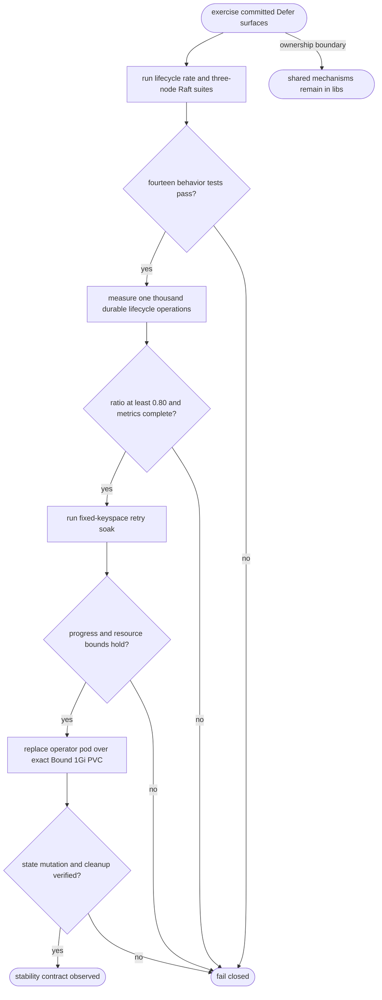

## Logic
<!-- type: logic lang: mermaid -->



## Changes
<!-- type: changes lang: yaml -->

```yaml
changes:
  - path: apps/defer/scripts/soak.sh
    action: modify
    section: e2e-test
    impl_mode: hand-written
    reason: "Make the existing fixed-keyspace retry soak fail closed when the measured operation count is zero while retaining the shared service-observability resource and latency bounds."
  - path: apps/defer/scripts/kind-e2e.sh
    action: modify
    section: e2e-test
    impl_mode: hand-written
    reason: "Require an observed Bound PVC with exact 1Gi request and capacity, and require successful cluster deletion plus absence verification on a successful operator recovery journey."
```
