## Logic

```mermaid
---
id: defer-primary-replicas-raft-backed-task-scheduler-verification
entry: elect_primary
nodes:
  elect_primary: { kind: start, label: "start a three-voter Defer cluster over shared raft runtime and peer transport" }
  commit_task: { kind: process, label: "configure the queue and create a committed scheduled task through the elected primary" }
  follower_lease: { kind: process, label: "lease due work through a follower so the committed attempt records that follower as executor with a fence epoch" }
  first_fence: { kind: decision, label: "does a non-owner ack fail while the committed owner ack succeeds and every replica converges to Succeeded?" }
  lose_primary: { kind: process, label: "lease a second task, lose the active leader with a live lease, and elect a surviving quorum leader" }
  recover_lease: { kind: process, label: "reject the stale ack, reclaim the expired lease, reassign with a higher epoch and new attempt id, and commit the terminal outcome" }
  restart_replica: { kind: process, label: "restart the first failed primary from the same durable directory and wait for committed task-state catch-up before another leader loss" }
  snapshot_recovery: { kind: process, label: "drive retry to DeadLettered and verify every replica reports identical post-restart queue snapshot counts for task, terminal, scheduled, and in-flight state" }
  second_failover: { kind: process, label: "remove the current leader after catch-up and complete another create lease ack lifecycle through the remaining quorum" }
  peer_mtls: { kind: process, label: "replicate scheduler state with trusted peer mTLS material, then present attacker-CA client and server identities" }
  peer_ok: { kind: decision, label: "do trusted peers converge while attacker identities are rejected before the Raft router handles a request?" }
  fail: { kind: terminal, label: "primary-replicas claim fails closed" }
  verified: { kind: terminal, label: "raft-backed task scheduler claim is externally verified" }
edges:
  - { from: elect_primary, to: commit_task }
  - { from: commit_task, to: follower_lease }
  - { from: follower_lease, to: first_fence }
  - { from: first_fence, to: lose_primary, label: "yes" }
  - { from: first_fence, to: fail, label: "no" }
  - { from: lose_primary, to: recover_lease }
  - { from: recover_lease, to: restart_replica }
  - { from: restart_replica, to: snapshot_recovery }
  - { from: snapshot_recovery, to: second_failover }
  - { from: second_failover, to: peer_mtls }
  - { from: peer_mtls, to: peer_ok }
  - { from: peer_ok, to: verified, label: "yes" }
  - { from: peer_ok, to: fail, label: "no" }
---
flowchart TD
    elect_primary([start three-voter Defer cluster]) --> commit_task[commit queue config and first scheduled task]
    commit_task --> follower_lease[follower forwards lease with committed executor fence]
    follower_lease --> first_fence{stale ack rejected and owner ack converges?}
    first_fence -->|yes| lose_primary[lose leader with live lease]
    first_fence -->|no| fail([fail closed])
    lose_primary --> recover_lease[expire reclaim and reassign with higher epoch]
    recover_lease --> restart_replica[restart failed primary from same durable directory]
    restart_replica --> snapshot_recovery[verify dead-letter snapshot counts converge]
    snapshot_recovery --> second_failover[lose a second leader after catch-up]
    second_failover --> peer_mtls[test trusted and attacker-CA peer identities]
    peer_mtls --> peer_ok{replication succeeds only for trusted peers?}
    peer_ok -->|yes| verified([primary-replicas claim externally verified])
    peer_ok -->|no| fail
```

<!-- type: logic lang: mermaid -->


## Changes
<!-- type: changes lang: yaml -->

```yaml
changes:
  - path: apps/defer/tests/raft_scheduler.rs
    action: modify
    section: unit-test
    impl_mode: hand-written
    anchor: committed_scheduler_converges_and_fences_cross_replica_effects
    reason: "Own the primary observable that a follower-forwarded lease records executor identity and epoch, rejects stale settlement, survives leader loss, and completes the committed task lifecycle after reassignment."
  - path: apps/defer/tests/raft_scheduler.rs
    action: modify
    section: unit-test
    impl_mode: hand-written
    anchor: dead_letter_terminal_state_converges_and_survives_restart
    reason: "Own the same-directory restart and snapshot oracle that preserves terminal scheduler state and converged queue counts across replicas."
  - path: apps/defer/tests/raft_peer_mtls.rs
    action: modify
    section: unit-test
    impl_mode: hand-written
    anchor: trusted_defer_peers_replicate_scheduler_state_over_mtls
    reason: "Own the positive peer-identity oracle that trusted Defer voters replicate committed scheduler state over the shared authenticated peer transport."
  - path: apps/defer/tests/raft_peer_mtls.rs
    action: modify
    section: unit-test
    impl_mode: hand-written
    anchor: untrusted_defer_peer_certificate_is_rejected
    reason: "Own the negative client-identity oracle that required peer mTLS rejects an attacker-CA client certificate before the Raft router handles the request."
  - path: apps/defer/tests/raft_peer_mtls.rs
    action: modify
    section: unit-test
    impl_mode: hand-written
    anchor: untrusted_defer_server_certificate_is_rejected
    reason: "Own the negative server-identity oracle that the client side of required peer mTLS rejects an attacker-CA server while the Defer client identity remains otherwise trusted."
```

## Unit Test

```mermaid
---
id: defer-primary-replicas-raft-backed-task-scheduler-verification
requirements:
  attacker_identity_rejected_before_routing:
    id: R6
    text: "Required peer mTLS rejects attacker-CA client and server identities before the Raft router handles the request, even when the legitimate opposite side remains otherwise trusted."
    kind: security
    risk: high
    verify: cargo test -p defer --test raft_peer_mtls -- --nocapture
  committed_executor_fencing:
    id: R1
    text: "A follower may forward the lease proposal, but the committed attempt records that follower as executor, a non-owner ack is rejected, and only the committed owner can settle the task to Succeeded across every replica."
    kind: functional
    risk: high
    verify: cargo test -p defer --test raft_scheduler committed_scheduler_converges_and_fences_cross_replica_effects -- --nocapture
  leader_loss_and_reassignment:
    id: R2
    text: "If the leader dies with a live lease, the new leader preserves the abandoned attempt, rejects stale settlement, reclaims the lease only after expiry, and reassigns it with a higher epoch and new attempt id before the terminal outcome commits."
    kind: stability
    risk: high
    verify: cargo test -p defer --test raft_scheduler committed_scheduler_converges_and_fences_cross_replica_effects -- --nocapture
  restart_catchup_and_second_failover:
    id: R3
    text: "The first failed primary can restart from the same durable directory, catch up to the committed task state before another leader loss, and the surviving quorum still completes another full create-lease-ack lifecycle after the second failover."
    kind: stability
    risk: high
    verify: cargo test -p defer --test raft_scheduler committed_scheduler_converges_and_fences_cross_replica_effects -- --nocapture
  snapshot_terminal_state_recovery:
    id: R4
    text: "A task that retries to DeadLettered survives same-directory restart, and every replica reports identical queue snapshot counts for task, terminal, scheduled, and in-flight state after recovery."
    kind: regression
    risk: high
    verify: cargo test -p defer --test raft_scheduler dead_letter_terminal_state_converges_and_survives_restart -- --nocapture
  trusted_peer_replication:
    id: R5
    text: "Trusted Defer peers replicate committed scheduler state over required peer mTLS using the shared authenticated transport."
    kind: security
    risk: high
    verify: cargo test -p defer --test raft_peer_mtls trusted_defer_peers_replicate_scheduler_state_over_mtls -- --nocapture
---
flowchart TD
    r1[R1 committed executor fencing] --> cargo_test_p_defer_test_raft_scheduler_committed_scheduler_converges_and_fences_cross_replica_effects_nocapture[cargo test -p defer --test raft_scheduler committed_scheduler_converges_and_fences_cross_replica_effects -- --nocapture]
    r2[R2 leader loss and reassignment] --> cargo_test_p_defer_test_raft_scheduler_committed_scheduler_converges_and_fences_cross_replica_effects_nocapture
    r3[R3 restart catchup and second failover] --> cargo_test_p_defer_test_raft_scheduler_committed_scheduler_converges_and_fences_cross_replica_effects_nocapture
    r4[R4 snapshot terminal state recovery] --> cargo_test_p_defer_test_raft_scheduler_dead_letter_terminal_state_converges_and_survives_restart_nocapture[cargo test -p defer --test raft_scheduler dead_letter_terminal_state_converges_and_survives_restart -- --nocapture]
    r5[R5 trusted peer replication] --> cargo_test_p_defer_test_raft_peer_mtls_trusted_defer_peers_replicate_scheduler_state_over_mtls_nocapture[cargo test -p defer --test raft_peer_mtls trusted_defer_peers_replicate_scheduler_state_over_mtls -- --nocapture]
    r6[R6 attacker identity rejected before routing] --> cargo_test_p_defer_test_raft_peer_mtls_nocapture[cargo test -p defer --test raft_peer_mtls -- --nocapture]
```

<!-- type: unit-test lang: mermaid -->


