## Logic

```mermaid
---
id: defer-delayed-task-security-verification
entry: exercise_required_auth
nodes:
  exercise_required_auth: { kind: start, label: "run required-auth h2c queue task admin and probe journey" }
  auth_ok: { kind: decision, label: "queue isolation roles protected routes and tokenless probes exact?" }
  exercise_admission: { kind: process, label: "overflow shared admission and retain probe exemption" }
  exercise_fencing: { kind: process, label: "retry with stable idempotency fresh attempt and lost-owner rejection" }
  signing_ok: { kind: decision, label: "independent exact HMAC oracle accepts valid and rejects every tamper?" }
  peer_mtls: { kind: process, label: "replicate with trusted peers and present attacker-CA client identity" }
  peer_ok: { kind: decision, label: "trusted replication succeeds and attacker identity fails before routing?" }
  rotate_registry: { kind: process, label: "replace registry file on shipped process at production watcher cadence" }
  audit_ok: { kind: decision, label: "new bearer active old bearer rejected and audit logs credential-free?" }
  render_prod: { kind: process, label: "render composed prod Kustomize graph with kubectl" }
  manifest_ok: { kind: decision, label: "restricted contexts secret projection network policy observability and no HPA?" }
  fail: { kind: terminal, label: "security contract fails closed" }
  verified: { kind: terminal, label: "delayed-task security boundary externally verified" }
edges:
  - { from: exercise_required_auth, to: auth_ok }
  - { from: auth_ok, to: exercise_admission, label: "yes" }
  - { from: auth_ok, to: fail, label: "no" }
  - { from: exercise_admission, to: exercise_fencing }
  - { from: exercise_fencing, to: signing_ok }
  - { from: signing_ok, to: peer_mtls, label: "yes" }
  - { from: signing_ok, to: fail, label: "no" }
  - { from: peer_mtls, to: peer_ok }
  - { from: peer_ok, to: rotate_registry, label: "yes" }
  - { from: peer_ok, to: fail, label: "no" }
  - { from: rotate_registry, to: audit_ok }
  - { from: audit_ok, to: render_prod, label: "yes" }
  - { from: audit_ok, to: fail, label: "no" }
  - { from: render_prod, to: manifest_ok }
  - { from: manifest_ok, to: verified, label: "yes" }
  - { from: manifest_ok, to: fail, label: "no" }
---
flowchart TD
    exercise_required_auth([run required-auth h2c journey]) --> auth_ok{auth and isolation exact?}
    auth_ok -->|yes| exercise_admission[overflow shared admission]
    auth_ok -->|no| fail([fail closed])
    exercise_admission --> exercise_fencing[test retry identity and ownership fence]
    exercise_fencing --> signing_ok{exact signing oracle and negatives pass?}
    signing_ok -->|yes| peer_mtls[test trusted and attacker-CA peers]
    signing_ok -->|no| fail
    peer_mtls --> peer_ok{peer boundary exact?}
    peer_ok -->|yes| rotate_registry[rotate projected registry on shipped process]
    peer_ok -->|no| fail
    rotate_registry --> audit_ok{rotation and redacted audit exact?}
    audit_ok -->|yes| render_prod[render composed production overlay]
    audit_ok -->|no| fail
    render_prod --> manifest_ok{rendered security graph exact?}
    manifest_ok -->|yes| verified([security boundary externally verified])
    manifest_ok -->|no| fail
```

<!-- type: logic lang: mermaid -->


## Changes
<!-- type: changes lang: yaml -->

```yaml
changes:
  - path: apps/defer/tests/http_api.rs
    action: modify
    section: unit-test
    impl_mode: hand-written
    anchor: h2c_routes_probes_openapi_metrics_dispatch_and_auth_are_live
    reason: "Own the required-auth h2c oracle for tokenless operational routes, protected task/admin routes, queue-scoped RBAC, and cross-queue tenant denial."
  - path: apps/defer/tests/service_auth.rs
    action: modify
    section: unit-test
    impl_mode: hand-written
    anchor: defer_serve_watches_registry_and_emits_redacted_audit_events
    reason: "Own a shipped-process oracle for the production registry watcher cadence, last-known-good rotation, structured audit emission, and bearer redaction."
  - path: apps/defer/tests/raft_peer_mtls.rs
    action: modify
    section: unit-test
    impl_mode: hand-written
    anchor: untrusted_defer_peer_certificate_is_rejected
    reason: "Own the negative peer-identity oracle that separates a trusted server CA from an attacker-signed client certificate and requires rejection before routing."
  - path: apps/defer/tests/direct_k8s_assets.rs
    action: modify
    section: unit-test
    impl_mode: hand-written
    anchor: prod_profile_renders_the_connected_security_boundary
    reason: "Own direct and rendered Kubernetes security assertions for restricted workloads, read-only Secret projection, NetworkPolicy, observability, durable storage, and voter-safe no-HPA topology."
```
## Unit Test

```mermaid
---
id: defer-delayed-task-security-verification
requirements:
  admission_and_effect_fencing:
    id: R2
    text: "Shared write admission rejects overflow with Retry-After while probes remain exempt, and dispatch retries preserve idempotency while fresh attempt identity and committed ownership fences prevent stale effect settlement."
    kind: functional
    risk: high
    verify: cargo test -p defer --test service_admission --test http_dispatch -- --nocapture
  authenticated_peer_boundary:
    id: R4
    text: "Trusted Defer peers replicate scheduler state over required mTLS, while an attacker-CA client identity that trusts the legitimate server is rejected during handshake before Raft routing."
    kind: security
    risk: high
    verify: cargo test -p defer --test raft_peer_mtls -- --nocapture
  exact_target_signing:
    id: R3
    text: "An independent target oracle recomputes the exact length-delimited HMAC and rejects every signed-field or body mutation, wrong key id, and wrong secret while retry attempt identity changes the signature."
    kind: security
    risk: high
    verify: cargo test -p defer --test http_dispatch_signing -- --nocapture
  generated_security_ec_inventory:
    id: R7
    text: "All accepted security-hardening EC cases remain generated as distinct fail-closed wrappers and bound to claim delayed-task-security-boundary."
    kind: regression
    risk: medium
    verify: aw ec check --project defer
  live_rotation_and_redacted_audit:
    id: R5
    text: "The shipped defer serve process adopts an atomic registry replacement through the production watcher cadence without restart, retains last-known-good state on malformed input, and emits structured reload and denial audit events without bearer bytes."
    kind: stability
    risk: high
    verify: cargo test -p defer --test service_auth -- --nocapture
  rendered_kubernetes_security:
    id: R6
    text: "Direct workloads and the kubectl-rendered production graph use restricted security contexts, a read-only token Secret, connected NetworkPolicy and observability resources, durable storage, and no unsafe voter HorizontalPodAutoscaler."
    kind: security
    risk: high
    verify: cargo test -p defer --test direct_k8s_assets -- --nocapture
  required_auth_and_tenant_isolation:
    id: R1
    text: "A required-auth h2c process leaves health, readiness, docs, OpenAPI, and metrics tokenless; requires credentials for queue, task, and admin routes; enforces queue roles; and denies a jobs-only reader access to another tenant queue."
    kind: security
    risk: high
    verify: cargo test -p defer --test http_api -- --nocapture
---
flowchart TD
    r1[R1 required auth and tenant isolation] --> cargo_test_p_defer_test_http_api_nocapture[cargo test -p defer --test http_api -- --nocapture]
    r2[R2 admission and effect fencing] --> cargo_test_p_defer_test_service_admission_test_http_dispatch_nocapture[cargo test -p defer --test service_admission --test http_dispatch -- --nocapture]
    r3[R3 exact target signing] --> cargo_test_p_defer_test_http_dispatch_signing_nocapture[cargo test -p defer --test http_dispatch_signing -- --nocapture]
    r4[R4 authenticated peer boundary] --> cargo_test_p_defer_test_raft_peer_mtls_nocapture[cargo test -p defer --test raft_peer_mtls -- --nocapture]
    r5[R5 live rotation and redacted audit] --> cargo_test_p_defer_test_service_auth_nocapture[cargo test -p defer --test service_auth -- --nocapture]
    r6[R6 rendered kubernetes security] --> cargo_test_p_defer_test_direct_k8s_assets_nocapture[cargo test -p defer --test direct_k8s_assets -- --nocapture]
    r7[R7 generated security ec inventory] --> aw_ec_check_project_defer[aw ec check --project defer]
```

<!-- type: unit-test lang: mermaid -->


