## Logic

```mermaid
---
id: drop-the-rhs-normalization-purity-gate-evaluation-position-argum
entry: candidate
nodes:
  candidate:               { kind: start,    label: "non-identifier export RHS candidate\n(module_id, key, expr, span) from\ncollect_direct_export_assignments --\nis_js_identifier(expr) already false --\ninto is_shape_normalizable_export_rhs(expr)\n(renamed from is_pure_normalizable_export_rhs,\nscope_hoist_opt.rs:3770, #2161)" }
  comma_check:             { kind: decision, label: "contains_top_level_comma(expr)?\n(existing helper, scope_hoist_opt.rs:3887 --\nnow applied UNCONDITIONALLY to every\ncandidate, not only inside\nis_bare_arrow_function_expression's\nexpression-body branch, :3879)" }
  excluded_comma:          { kind: terminal, label: "excluded -- sequence-expression-disguised-\nas-RHS: var __jx = a, b; would silently\nbecome a second var declarator, a different\nExpression boundary than a var initializer\naccepts (pre-existing risk class, #2161)\nstats.rhs_skipped_shape += 1" }
  chain_check:             { kind: decision, label: "NEW contains_top_level_assignment_operator(expr)?\ndepth-0 bare `=` / compound-assign byte,\nexcluding `==` `===` `!=` `!==` `<=` `>=` `=>`\n(comparison/arrow) -- same paren/bracket/brace\n+ quote/template/comment skip skeleton as\ncontains_top_level_comma" }
  excluded_chain:          { kind: terminal, label: "excluded -- chained assignment\n(exports.a = exports.b = X) is a different\nSTATEMENT SHAPE, not just a different RHS\nvalue (WI #2168 Scope) -- kept outside the\nmechanism's proven single-assignment claim\nstats.rhs_skipped_shape += 1" }
  await_yield_check:       { kind: decision, label: "NEW contains_top_level_await_or_yield_keyword(expr)?\ndepth-0 whole-word `await`/`yield` token\n(word-boundary via is_id_cont_byte) -- defensive:\nflat-region export-assignment statements are\nnever themselves inside an async-function/\ngenerator body, so this is believed structurally\nunreachable on real input (WI #2168: assert/skip)" }
  excluded_await_yield:    { kind: terminal, label: "excluded defensively -- documented invariant,\nnot an observed real-corpus case\nstats.rhs_skipped_shape += 1" }
  accept_and_hoist:        { kind: process,  label: "ACCEPTED (was: only bare-literal /\nfunction-expression / arrow-function shapes;\nnow also: call, member-chain, new, conditional,\ntemplate-literal, object-literal, array-literal,\nasync/generator function-expression RHS) --\nnormalize_pure_export_rhs_unvalidated splices\nexpr VERBATIM (no rewrite of expr's own internal\nreferences) into\nvar __jx_<m>_<key> = <expr>;\n<exports_obj>.key = __jx_<m>_<key>;\nstats.normalized += 1 (-> rhs_normalized)" }
  downstream_rungs:        { kind: process,  label: "elide_same_chunk_export_bindings_unvalidated\nruns UNCHANGED on the normalized, now-identifier-\nRHS binding -- block-scope / namespace / registry /\nstring-indexed / barrel-glue consumer-safety rungs\nstill decide keep vs elide; a normalized-then-kept\nkey is expected (counted under the same kept_*\nbucket as before, just one hop further through __jx)" }
  reparse_safety_net:      { kind: process,  label: "convert_and_elide_flat_region's existing\nreparse-validate-and-degrade net (unchanged,\n#2132/#2133, scope_hoist_opt.rs:7526-7599):\njs_parses_without_errors on the combined output;\non failure, retry with normalization alone dropped\n-- never regresses below the pre-#2161 baseline.\nBackstops any shape the predicate misclassifies;\nthe 3 exclusion checks exist to prevent SILENT\nsemantic drift (e.g. a syntactically-valid-but-\nwrong second var declarator) this net cannot\ncatch by itself, not because the net is missing" }
edges:
  - { from: candidate,            to: comma_check }
  - { from: comma_check,          to: excluded_comma,       label: "yes" }
  - { from: comma_check,          to: chain_check,          label: "no" }
  - { from: chain_check,          to: excluded_chain,       label: "yes" }
  - { from: chain_check,          to: await_yield_check,    label: "no" }
  - { from: await_yield_check,    to: excluded_await_yield, label: "yes (defensive, unreachable expected)" }
  - { from: await_yield_check,    to: accept_and_hoist,     label: "no -- the overwhelming real-corpus case" }
  - { from: accept_and_hoist,     to: downstream_rungs }
  - { from: downstream_rungs,     to: reparse_safety_net }
---
flowchart TD
    candidate(["non-identifier export RHS candidate\n(module_id, key, expr, span) from\ncollect_direct_export_assignments --\nis_js_identifier(expr) already false --\ninto is_shape_normalizable_export_rhs(expr)\n(renamed from is_pure_normalizable_export_rhs,\nscope_hoist_opt.rs:3770, #2161)"]) --> comma_check{"contains_top_level_comma(expr)?\n(existing helper, scope_hoist_opt.rs:3887 --\nnow applied UNCONDITIONALLY to every\ncandidate, not only inside\nis_bare_arrow_function_expression's\nexpression-body branch, :3879)"}
    comma_check -->|yes| excluded_comma(["excluded -- sequence-expression-disguised-\nas-RHS: var __jx = a, b; would silently\nbecome a second var declarator, a different\nExpression boundary than a var initializer\naccepts (pre-existing risk class, #2161)\nstats.rhs_skipped_shape += 1"])
    comma_check -->|no| chain_check{"NEW contains_top_level_assignment_operator(expr)?\ndepth-0 bare `=` / compound-assign byte,\nexcluding `==` `===` `!=` `!==` `<=` `>=` `=>`\n(comparison/arrow) -- same paren/bracket/brace\n+ quote/template/comment skip skeleton as\ncontains_top_level_comma"}
    chain_check -->|yes| excluded_chain(["excluded -- chained assignment\n(exports.a = exports.b = X) is a different\nSTATEMENT SHAPE, not just a different RHS\nvalue (WI #2168 Scope) -- kept outside the\nmechanism's proven single-assignment claim\nstats.rhs_skipped_shape += 1"])
    chain_check -->|no| await_yield_check{"NEW contains_top_level_await_or_yield_keyword(expr)?\ndepth-0 whole-word `await`/`yield` token\n(word-boundary via is_id_cont_byte) -- defensive:\nflat-region export-assignment statements are\nnever themselves inside an async-function/\ngenerator body, so this is believed structurally\nunreachable on real input (WI #2168: assert/skip)"}
    await_yield_check -->|yes, defensive, unreachable expected| excluded_await_yield(["excluded defensively -- documented invariant,\nnot an observed real-corpus case\nstats.rhs_skipped_shape += 1"])
    await_yield_check -->|no -- the overwhelming real-corpus case| accept_and_hoist["ACCEPTED (was: only bare-literal /\nfunction-expression / arrow-function shapes;\nnow also: call, member-chain, new, conditional,\ntemplate-literal, object-literal, array-literal,\nasync/generator function-expression RHS) --\nnormalize_pure_export_rhs_unvalidated splices\nexpr VERBATIM (no rewrite of expr's own internal\nreferences) into\nvar __jx_<m>_<key> = <expr>;\n<exports_obj>.key = __jx_<m>_<key>;\nstats.normalized += 1 (-> rhs_normalized)"]
    accept_and_hoist --> downstream_rungs["elide_same_chunk_export_bindings_unvalidated\nruns UNCHANGED on the normalized, now-identifier-\nRHS binding -- block-scope / namespace / registry /\nstring-indexed / barrel-glue consumer-safety rungs\nstill decide keep vs elide; a normalized-then-kept\nkey is expected (counted under the same kept_*\nbucket as before, just one hop further through __jx)"]
    downstream_rungs --> reparse_safety_net["convert_and_elide_flat_region's existing\nreparse-validate-and-degrade net (unchanged,\n#2132/#2133, scope_hoist_opt.rs:7526-7599):\njs_parses_without_errors on the combined output;\non failure, retry with normalization alone dropped\n-- never regresses below the pre-#2161 baseline.\nBackstops any shape the predicate misclassifies;\nthe 3 exclusion checks exist to prevent SILENT\nsemantic drift (e.g. a syntactically-valid-but-\nwrong second var declarator) this net cannot\ncatch by itself, not because the net is missing"]
```

<!-- type: logic lang: mermaid -->



Current state (v1, #2161, landed 4b517f8fa): `is_pure_normalizable_export_rhs` (`scope_hoist_opt.rs:3770`) is an ALLOW-LIST of exactly three shapes -- `is_inlineable_literal_export_expr` (bare literals), `is_bare_function_expression` (`:3783`), and `is_bare_arrow_function_expression` (`:3825`, which internally calls `contains_top_level_comma` at `:3879` only for its expression-body case). Every other non-identifier RHS -- call results, member chains, `new` expressions, conditionals, template/object/array literals -- falls through to `stats.skipped_impure += 1` inside `normalize_pure_export_rhs_unvalidated` (`:3968-3971`), surfacing as `ExportElisionStats::rhs_skipped_impure` (`:3635`) once `convert_and_elide_flat_region` merges the counters (`:7561-7562`) and printed via the two `[bundle-timing]` eprintln sites in `bundler/mod.rs` (`:3989-4000` generate/export-elision, `:4313-4324` entry-flatten/export-elision). On the reference corpus this v1 ladder passes only 12 of 548 `ComplexRhs` candidates (#2161 AC3 verdict): `rhs_normalized=12`, `rhs_skipped_impure=536` (~13.7KB estimated, #2139's ranking: `other:complex_rhs` is the single largest kept-key bucket at 548 keys / ~13.9KB, dwarfing `block_scoped` at 342/~7.1KB) -- dominated by the modern app-code export idiom (`create(...)`, `styled(...)`, `React.memo(...)`, `forwardRef(...)`) that the v1 ladder was never designed to reach.

The evaluation-position argument (#2161's closing comment, quoted verbatim -- this is the design's correctness core): "this normalization never moves, duplicates, or delays RHS evaluation — the RHS still evaluates exactly once, at exactly the same statement position, in the same order (`exports.k = f();` → `var __jx = f(); exports.k = __jx;`). Purity gates are required only for transforms that can reorder/duplicate/skip evaluation; this one cannot." (#2161's comment names "Successor #2163" as the follow-up WI; #2163 was independently claimed by an unrelated epic before this WI was filed, so the actual successor landed as #2139 -- the ComplexRhs byte-stake attribution that motivated filing this WI -- followed by this WI, #2168.) The rewrite is a fixed textual template, `<exports_obj>.key = <RHS>;` -> `var __jx = <RHS>; <exports_obj>.key = __jx;`: `<RHS>` is spliced verbatim into the `var` initializer at the exact same position it already occupied, so it evaluates exactly once, synchronously, in original source order, with the same `this` (`undefined`, since neither position is a call/member-expression receiver). Even the self-referential shape `exports.k = wrap(exports.k)` preserves this: the synthetic initializer reads the module's *current* `exports.k` (via the verbatim-spliced `wrap(exports.k)` text) before the follow-up statement overwrites it, identical read-before-write order to the original single statement. Because the mechanism's safety never depended on what `<RHS>` computes or how many side effects it has -- only on the fact that hoisting never changes *when* or *how many times* it runs -- restricting `<RHS>` to a hand-picked allow-list of "provably side-effect-free" shapes was solving a problem this transform does not have.

Fix: rename `is_pure_normalizable_export_rhs` to `is_shape_normalizable_export_rhs` (`scope_hoist_opt.rs:3770`) and invert it from a 3-shape allow-list to a 3-check deny-list -- accept every RHS `expr` unless `contains_top_level_comma(expr)` (existing helper, now called unconditionally instead of only from inside the old arrow-body branch), the new `contains_top_level_assignment_operator(expr)` (chained-assignment guard), or the new `contains_top_level_await_or_yield_keyword(expr)` (defensive, believed-unreachable guard) is true. `is_bare_function_expression` and `is_bare_arrow_function_expression` become dead code once the ladder is replaced (their only caller was the old predicate) and are deleted along with their direct unit tests; `is_inlineable_literal_export_expr` is NOT touched -- it has a second, unrelated caller (`inline_direct_literal_export_reads`, `:384-394`) outside this WI's scope. `RhsNormalizationStats::skipped_impure` (`:3758`) and `ExportElisionStats::rhs_skipped_impure` (`:3635`) rename to `skipped_shape`/`rhs_skipped_shape`, matching the sibling `FnDeclConversionStats::skipped_shape` naming already established in this same file (`bundler/mod.rs:3982-3983`) for an analogous "predicate declined due to statement shape" counter -- honest naming now that shape, not purity, is the criterion. Both `[bundle-timing]` eprintln sites in `bundler/mod.rs` update their format-string token (`rhs_skipped_impure=` -> `rhs_skipped_shape=`) and interpolation argument to match. `normalize_pure_export_rhs_unvalidated`'s splice logic (`:3956-3993`), `convert_and_elide_flat_region`'s reparse-validate-and-degrade pipeline (`:7526-7599`), the `JET_NO_RHS_NORMALIZE` escape hatch (`:7547`), and every downstream consumer-safety rung in `elide_same_chunk_export_bindings_unvalidated` are unchanged -- this WI only widens which candidates reach the existing splice, it does not touch what happens after.

## Changes
<!-- type: changes lang: yaml -->

```yaml
changes:
  - path: apps/jet/src/bundler/scope_hoist_opt.rs
    action: modify
    section: logic
    impl_mode: hand-written
    anchor: ExportElisionStats
  - path: apps/jet/src/bundler/scope_hoist_opt.rs
    action: modify
    section: logic
    impl_mode: hand-written
    anchor: RhsNormalizationStats
  - path: apps/jet/src/bundler/scope_hoist_opt.rs
    action: modify
    section: logic
    impl_mode: hand-written
    anchor: is_pure_normalizable_export_rhs
  - path: apps/jet/src/bundler/scope_hoist_opt.rs
    action: modify
    section: logic
    impl_mode: hand-written
    anchor: is_bare_function_expression
  - path: apps/jet/src/bundler/scope_hoist_opt.rs
    action: modify
    section: logic
    impl_mode: hand-written
    anchor: is_bare_arrow_function_expression
  - path: apps/jet/src/bundler/scope_hoist_opt.rs
    action: create
    section: logic
    impl_mode: hand-written
    anchor: contains_top_level_comma
  - path: apps/jet/src/bundler/scope_hoist_opt.rs
    action: create
    section: logic
    impl_mode: hand-written
    anchor: contains_top_level_assignment_operator
  - path: apps/jet/src/bundler/scope_hoist_opt.rs
    action: modify
    section: logic
    impl_mode: hand-written
    anchor: normalize_pure_export_rhs_unvalidated
  - path: apps/jet/src/bundler/mod.rs
    action: modify
    section: logic
    impl_mode: hand-written
    anchor: generate_bundle
  - path: apps/jet/src/bundler/mod.rs
    action: modify
    section: logic
    impl_mode: hand-written
    anchor: generate_split_bundle
  - path: apps/jet/src/bundler/scope_hoist_opt.rs
    action: modify
    section: unit-test
    impl_mode: hand-written
    anchor: purity_ladder_rejects_member_chains
  - path: apps/jet/src/bundler/scope_hoist_opt.rs
    action: modify
    section: unit-test
    impl_mode: hand-written
    anchor: purity_ladder_rejects_call_expressions
  - path: apps/jet/src/bundler/scope_hoist_opt.rs
    action: modify
    section: unit-test
    impl_mode: hand-written
    anchor: purity_ladder_rejects_async_and_generator_functions
  - path: apps/jet/src/bundler/scope_hoist_opt.rs
    action: modify
    section: unit-test
    impl_mode: hand-written
    anchor: purity_ladder_rejects_sequence_expression_disguised_as_an_arrow_body
  - path: apps/jet/src/bundler/scope_hoist_opt.rs
    action: create
    section: unit-test
    impl_mode: hand-written
    anchor: purity_ladder_rejects_sequence_expression_disguised_as_an_arrow_body
  - path: apps/jet/src/bundler/scope_hoist_opt.rs
    action: create
    section: unit-test
    impl_mode: hand-written
    anchor: normalize_rewrites_arrow_function_export_to_synthetic_var
  - path: apps/jet/src/bundler/scope_hoist_opt.rs
    action: modify
    section: unit-test
    impl_mode: hand-written
    anchor: normalize_counts_skipped_impure_candidates
  - path: apps/jet/src/bundler/scope_hoist_opt.rs
    action: modify
    section: unit-test
    impl_mode: hand-written
    anchor: combined_pipeline_normalizes_then_elides_an_arrow_function_export
  - path: apps/jet/src/bundler/scope_hoist_opt.rs
    action: modify
    section: unit-test
    impl_mode: hand-written
    anchor: combined_pipeline_normalized_then_still_kept_key_is_fine
```

## Unit Test

```mermaid
---
id: drop-the-rhs-normalization-purity-gate-evaluation-position-argum-verification
requirements:
  accept_matrix_async_and_generator_function_expressions:
    id: R4
    text: "is_shape_normalizable_export_rhs accepts an async function expression (`async function() {...}` / `async () => {...}`) and a generator function expression (`function*() {...}`) as export RHS -- previously rejected wholesale by purity_ladder_rejects_async_and_generator_functions. Constructing the function VALUE has no top-level await/yield token (any await/yield inside the function body is at brace depth 1, not depth 0), so contains_top_level_await_or_yield_keyword correctly returns false and the shape normalizes; this inverts the pre-#2168 test's assertion."
    kind: functional
    risk: medium
    verify: cargo test -p jet --lib bundler::scope_hoist_opt::rhs_normalization_tests::purity_ladder_accepts_async_and_generator_functions
  accept_matrix_call_and_new_expressions_now_normalize:
    id: R2
    text: "is_shape_normalizable_export_rhs accepts a call-expression export RHS (e.g. `fn(x, y)`) and a new-expression export RHS (e.g. `new Foo(x)`) -- both previously rejected. Neither shape contains a top-level (depth-0) comma, bare assignment operator, or await/yield keyword, so both pass all three exclusion checks and are hoisted into a synthetic var exactly like the pre-existing literal/function/arrow cases."
    kind: functional
    risk: high
    verify: cargo test -p jet --lib bundler::scope_hoist_opt::rhs_normalization_tests::purity_ladder_accepts_call_expressions
  accept_matrix_conditional_template_object_and_array_expressions:
    id: R3
    text: "is_shape_normalizable_export_rhs accepts the remaining WI #2168 accept-matrix shapes: a conditional (ternary) expression `a ? b : c`, a template literal `` `${a}-${b}` `` (scanned via the existing scan_template_literal_expr_ranges depth-tracking so its interior `${...}` holes never trip the top-level comma/assignment checks), an object literal `{ a: 1, b: 2 }` (top-level commas are inside the outer `{}` depth, not depth-0), and an array literal `[1, 2, 3]` (top-level commas inside the outer `[]` depth). All four must normalize (stats.normalized) rather than being excluded."
    kind: functional
    risk: medium
    verify: cargo test -p jet --lib bundler::scope_hoist_opt::rhs_normalization_tests::purity_ladder_accepts_conditional_template_object_and_array_expressions
  accept_matrix_member_chain_expressions_now_normalize:
    id: R1
    text: "is_shape_normalizable_export_rhs (renamed from is_pure_normalizable_export_rhs, #2168) accepts a member-chain export RHS such as `a.b.c` or `obj[computed].prop` -- previously rejected by the purity ladder's function/literal-only allow-list. normalize_pure_export_rhs_unvalidated must rewrite `exports.k = a.b.c;` to `var __jx_..._k = a.b.c;\\nexports.k = __jx_..._k;` (verbatim RHS splice, evaluation position preserved) and increment stats.normalized, not stats.skipped_shape."
    kind: functional
    risk: high
    verify: cargo test -p jet --lib bundler::scope_hoist_opt::rhs_normalization_tests::purity_ladder_accepts_member_chains
  exclusion_chained_assignment_target_kept_as_is:
    id: R5
    text: "A chained-assignment export RHS (e.g. `exports.a = exports.b = X;`, where collect_direct_export_assignments captures the whole nested assignment text `exports.b = X` as the outer statement's expr) is excluded by the new contains_top_level_assignment_operator check and must NOT normalize: stats.skipped_shape increments, the statement is left byte-identical, and downstream elision behavior for both the outer and inner assignment targets is unchanged from pre-#2168 behavior. This is a statement-shape exclusion (WI #2168 Scope), not a claim that the evaluation-position argument fails for this shape."
    kind: regression
    risk: high
    verify: cargo test -p jet --lib bundler::scope_hoist_opt::rhs_normalization_tests::purity_ladder_rejects_chained_assignment_target
  exclusion_top_level_comma_sequence_expression_still_rejected:
    id: R6
    text: "A sequence expression disguised as an arrow body or bare RHS (e.g. `(a, b)`) continues to be excluded post-#2168 by contains_top_level_comma -- now applied unconditionally to every non-identifier candidate (previously only reachable inside is_bare_arrow_function_expression's expression-body branch) rather than being retired alongside the deleted is_bare_function_expression / is_bare_arrow_function_expression helpers. stats.skipped_shape increments; `var __jx = a, b;` (a silent second var declarator) must never be emitted."
    kind: regression
    risk: medium
    verify: cargo test -p jet --lib bundler::scope_hoist_opt::rhs_normalization_tests::purity_ladder_rejects_sequence_expression_disguised_as_an_arrow_body
  order_preservation_self_referencing_export_read_before_write:
    id: R7
    text: "The evaluation-position argument's own regression proof: for a self-referencing export RHS such as `exports.k = wrap(exports.k);` (now normalizable -- `wrap(exports.k)` is a call expression), the rewrite `var __jx_..._k = wrap(exports.k);\\nexports.k = __jx_..._k;` must read the PRE-mutation value of exports.k as wrap's argument (the var initializer evaluates before the following assignment statement executes), byte-for-byte preserving the original single-statement's evaluation order -- the rewrite never moves, duplicates, delays, or skips RHS evaluation relative to the original `exports.k = wrap(exports.k);` statement."
    kind: functional
    risk: high
    verify: cargo test -p jet --lib bundler::scope_hoist_opt::rhs_normalization_tests::normalize_preserves_self_referencing_read_before_write_evaluation_order
  rename_consistency_combined_pipeline_kept_key_counters:
    id: R10
    text: "combined_pipeline_normalized_then_still_kept_key_is_fine continues to assert the full ExportElisionStats counter set (including the renamed rhs_skipped_shape field) end-to-end for a normalized-then-kept key, pinning that downstream elision-rung accounting (kept/kept_registry/kept_cross_chunk/etc.) is unaffected by the predicate relaxation and the field rename is consistent across every counter read site."
    kind: regression
    risk: low
    verify: cargo test -p jet --lib bundler::scope_hoist_opt::rhs_normalization_tests::combined_pipeline_normalized_then_still_kept_key_is_fine
  rename_consistency_combined_pipeline_normalized_counter:
    id: R9
    text: "combined_pipeline_normalizes_then_elides_an_arrow_function_export continues to assert ExportElisionStats::rhs_normalized end-to-end through convert_and_elide_flat_region after the field renames land, pinning that the normalized-count side of the counter pair is unaffected by the skipped_impure -> skipped_shape rename (only the skip-side field and its debug-eprintln label in bundler/mod.rs's generate_bundle and generate_split_bundle change)."
    kind: regression
    risk: low
    verify: cargo test -p jet --lib bundler::scope_hoist_opt::rhs_normalization_tests::combined_pipeline_normalizes_then_elides_an_arrow_function_export
  rename_consistency_skipped_impure_to_skipped_shape_stats_field:
    id: R8
    text: "RhsNormalizationStats::skipped_impure is renamed to skipped_shape (and ExportElisionStats::rhs_skipped_impure to rhs_skipped_shape) throughout normalize_pure_export_rhs_unvalidated and its call site in convert_and_elide_flat_region. normalize_counts_skipped_shape_candidates (renamed from normalize_counts_skipped_impure_candidates) must exercise genuinely-excluded-post-#2168 fixtures (chained assignment / top-level comma; the fixture's prior call/member-chain examples are no longer valid negative cases since #2168 accepts them) and assert against the renamed field name."
    kind: regression
    risk: low
    verify: cargo test -p jet --lib bundler::scope_hoist_opt::rhs_normalization_tests::normalize_counts_skipped_shape_candidates
---
flowchart TD
    r1[R1 accept matrix member chain expressions now normalize] --> cargo_test_p_jet_lib_bundler_scope_hoist_opt_rhs_normalization_tests_purity_ladder_accepts_member_chains[cargo test -p jet --lib bundler::scope_hoist_opt::rhs_normalization_tests::purity_ladder_accepts_member_chains]
    r2[R2 accept matrix call and new expressions now normalize] --> cargo_test_p_jet_lib_bundler_scope_hoist_opt_rhs_normalization_tests_purity_ladder_accepts_call_expressions[cargo test -p jet --lib bundler::scope_hoist_opt::rhs_normalization_tests::purity_ladder_accepts_call_expressions]
    r3[R3 accept matrix conditional template object and array expressions] --> cargo_test_p_jet_lib_bundler_scope_hoist_opt_rhs_normalization_tests_purity_ladder_accepts_conditional_template_object_and_array_expressions[cargo test -p jet --lib bundler::scope_hoist_opt::rhs_normalization_tests::purity_ladder_accepts_conditional_template_object_and_array_expressions]
    r4[R4 accept matrix async and generator function expressions] --> cargo_test_p_jet_lib_bundler_scope_hoist_opt_rhs_normalization_tests_purity_ladder_accepts_async_and_generator_functions[cargo test -p jet --lib bundler::scope_hoist_opt::rhs_normalization_tests::purity_ladder_accepts_async_and_generator_functions]
    r5[R5 exclusion chained assignment target kept as is] --> cargo_test_p_jet_lib_bundler_scope_hoist_opt_rhs_normalization_tests_purity_ladder_rejects_chained_assignment_target[cargo test -p jet --lib bundler::scope_hoist_opt::rhs_normalization_tests::purity_ladder_rejects_chained_assignment_target]
    r6[R6 exclusion top level comma sequence expression still rejected] --> cargo_test_p_jet_lib_bundler_scope_hoist_opt_rhs_normalization_tests_purity_ladder_rejects_sequence_expression_disguised_as_an_arrow_body[cargo test -p jet --lib bundler::scope_hoist_opt::rhs_normalization_tests::purity_ladder_rejects_sequence_expression_disguised_as_an_arrow_body]
    r7[R7 order preservation self referencing export read before write] --> cargo_test_p_jet_lib_bundler_scope_hoist_opt_rhs_normalization_tests_normalize_preserves_self_referencing_read_before_write_evaluation_order[cargo test -p jet --lib bundler::scope_hoist_opt::rhs_normalization_tests::normalize_preserves_self_referencing_read_before_write_evaluation_order]
    r8[R8 rename consistency skipped impure to skipped shape stats field] --> cargo_test_p_jet_lib_bundler_scope_hoist_opt_rhs_normalization_tests_normalize_counts_skipped_shape_candidates[cargo test -p jet --lib bundler::scope_hoist_opt::rhs_normalization_tests::normalize_counts_skipped_shape_candidates]
    r9[R9 rename consistency combined pipeline normalized counter] --> cargo_test_p_jet_lib_bundler_scope_hoist_opt_rhs_normalization_tests_combined_pipeline_normalizes_then_elides_an_arrow_function_export[cargo test -p jet --lib bundler::scope_hoist_opt::rhs_normalization_tests::combined_pipeline_normalizes_then_elides_an_arrow_function_export]
    r10[R10 rename consistency combined pipeline kept key counters] --> cargo_test_p_jet_lib_bundler_scope_hoist_opt_rhs_normalization_tests_combined_pipeline_normalized_then_still_kept_key_is_fine[cargo test -p jet --lib bundler::scope_hoist_opt::rhs_normalization_tests::combined_pipeline_normalized_then_still_kept_key_is_fine]
```

<!-- type: unit-test lang: mermaid -->


