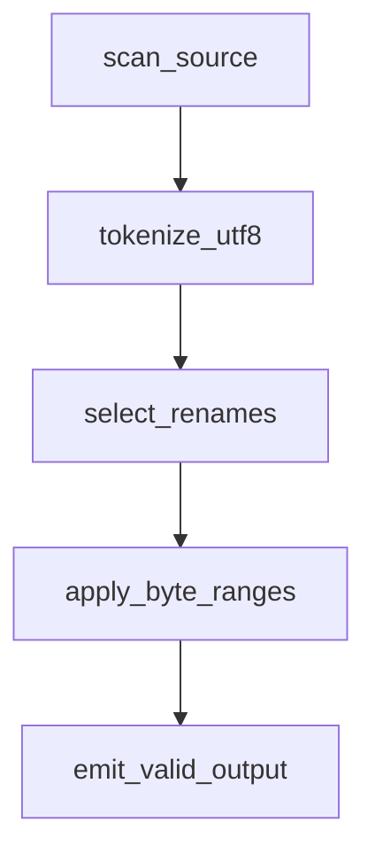
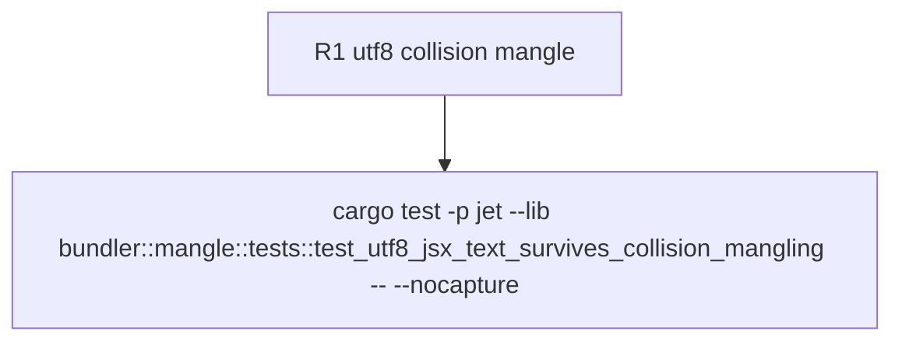

## Logic
<!-- type: logic lang: mermaid -->


## Changes
<!-- type: changes lang: yaml -->

```yaml
changes:
  - path: "apps/jet/src/bundler/mangle.rs"
    action: "modify"
    section: "logic"
    impl_mode: "hand-written"
    description: "Advance non-ASCII punctuation by its UTF-8 codepoint width so every token range remains a valid byte slice, then assert collision-renamed JSX text remains intact."
```
## Unit Test
<!-- type: unit-test lang: mermaid -->


