# jet CSS parser fails to parse Tailwind CSS v4 @layer directives

## Logic
<!-- type: logic lang: mermaid -->

```mermaid
---
id: jet-css-layer-statement-form-flow
entry: css_reaches_pipeline
nodes:
  css_reaches_pipeline:
    kind: start
    label: "CSS source enters process_directives()\n(directives.rs), e.g. Tailwind v4 output\nstarting with @layer theme, base,\ncomponents, utilities;"
  scan_layer_token:
    kind: process
    label: "process_layer_directives() scans for\nthe next '@layer ' occurrence\n(existing remaining.find(\"@layer \") loop)"
  found_layer:
    kind: decision
    label: "Another '@layer ' occurrence found?"
  classify_form:
    kind: decision
    label: "After the layer name token, does the\nnext non-whitespace char open a block\n('{') or does the clause instead\ncontinue as a comma-separated name list\nterminated by ';' before any '{'?"
  handle_block_form:
    kind: process
    label: "Block form: consume '{ ... }' via\nfind_matching_close_brace, route body\nto base/components/utilities additions\nand inline it into css (unchanged\nexisting behavior)"
  handle_statement_form:
    kind: process
    label: "Statement form: consume through the\nterminating ';' (the whole\n'@layer a, b, c;' order-declaration) and\ndrop it from css -- jet's pipeline does\nnot need cascade-layer priority ordering\npreserved across its own block-form\ninlining, so no replacement text is\nemitted"
  continue_scan:
    kind: process
    label: "Resume scanning `remaining` for the\nnext '@layer ' occurrence"
  no_more_layers:
    kind: process
    label: "No more '@layer ' occurrences --\nappend the rest of `remaining` to css\nunchanged"
  pipeline_returns:
    kind: process
    label: "process_directives() returns css with\nno unstripped '@layer' at-rules of\neither form"
  lightningcss_parse:
    kind: process
    label: "apply_lightningcss() (mod.rs) calls\nStyleSheet::parse on the returned css"
  parse_succeeds:
    kind: terminal
    label: "StyleSheet::parse succeeds -- no\n'CSS parse error: Unexpected token\nAtKeyword(\"layer\")' (AC1)"
edges:
  - { from: css_reaches_pipeline, to: scan_layer_token }
  - { from: scan_layer_token, to: found_layer }
  - { from: found_layer, to: classify_form, label: "yes" }
  - { from: found_layer, to: no_more_layers, label: "no" }
  - { from: classify_form, to: handle_block_form, label: "block ('{')" }
  - { from: classify_form, to: handle_statement_form, label: "statement (';' before '{')" }
  - { from: handle_block_form, to: continue_scan }
  - { from: handle_statement_form, to: continue_scan }
  - { from: continue_scan, to: scan_layer_token }
  - { from: no_more_layers, to: pipeline_returns }
  - { from: pipeline_returns, to: lightningcss_parse }
  - { from: lightningcss_parse, to: parse_succeeds }
---
flowchart TD
    css_reaches_pipeline([CSS source enters process_directives, e.g. Tailwind v4 leading @layer statement]) --> scan_layer_token[process_layer_directives scans for next '@layer ' occurrence]
    scan_layer_token --> found_layer{Another '@layer ' occurrence found?}
    found_layer -->|yes| classify_form{Next token opens a block '{' or is a comma-separated name list terminated by ';'?}
    found_layer -->|no| no_more_layers[Append remainder of source to css unchanged]
    classify_form -->|block| handle_block_form[Block form: consume matching braces, route body to layer additions, inline into css]
    classify_form -->|statement| handle_statement_form[Statement form: consume through terminating ';' and drop it -- no replacement emitted]
    handle_block_form --> continue_scan[Resume scanning remaining for next '@layer ']
    handle_statement_form --> continue_scan
    continue_scan --> scan_layer_token
    no_more_layers --> pipeline_returns[process_directives returns css with no unstripped @layer at-rules]
    pipeline_returns --> lightningcss_parse[apply_lightningcss calls StyleSheet::parse]
    lightningcss_parse --> parse_succeeds([StyleSheet::parse succeeds -- AC1 satisfied])
```
## Config
<!-- type: config lang: yaml -->

```yaml
css_layer_statement_form_fix:
  target: "projects/jet/src/css/directives.rs"
  function: "process_layer_directives"
  problem: "the existing scan loop consumes '@layer ' then unconditionally expects the next non-whitespace token to be '{'; when it is not (the bare 'name, name, ...;' order-statement form), the loop falls into its malformed-input fallback (re-emits the literal '@layer ' and continues scanning from the SAME position), leaving the untouched statement form in the returned css string, which then fails lightningcss's StyleSheet::parse with 'CSS parse error: Unexpected token AtKeyword(\"layer\")'"
  fix_approach: "after locating the layer-name-list token (remaining up to the first '{' or whitespace-delimited stop, matching the existing name_end scan), classify the clause by which terminator appears first: '{' (block form, existing behavior unchanged) or ';' before any '{' (bare statement form). For the statement form, consume through and including the terminating ';' and do NOT copy that consumed span into the css output buffer -- i.e. strip the whole '@layer <name>(, <name>)*;' statement. No layer_name matching against base/components/utilities/unknown is needed for the statement form since it carries no body to route."
  edge_cases:
    - "multiple comma-separated names: '@layer theme, base, components, utilities;' -- the terminator classification only needs to find whichever of '{' or ';' occurs first after '@layer '; commas inside the name list do not require special handling since scanning continues past them to the terminator"
    - "a leading statement form followed later in the same source by block-form '@layer base { ... }' rules -- the fix must not disturb the existing while-loop's re-entry into remaining after the statement is stripped, so subsequent '@layer ' occurrences (block form) still route through the unchanged block-handling branch"
    - "malformed input that is neither '{' nor ';'-terminated before EOF (existing 'Malformed — keep as-is' fallback) -- preserved unchanged for any input that is not classified as either recognized form, avoiding an infinite loop by keeping the existing re-emit-and-continue behavior for that residual case"
  non_goals:
    - "preserving cascade-layer runtime priority order semantics of the stripped statement -- out of scope per WI #1377 Out of Scope; jet's own block-form inlining already does not preserve @layer priority ordering"
    - "the @import \"tailwindcss\" directory-resolution failure tracked separately as #1375"
    - "any lightningcss version change"
regression_test:
  target: "projects/jet/src/css/directives.rs"
  location: "#[cfg(test)] mod tests, alongside the existing '── @layer routing ──' test group"
  test_name: "process_layer_directives_strips_bare_statement_form_alongside_block_form"
  input: "'@layer theme, base, components, utilities;\n@layer base { h1 { margin: 0; } }'"
  assertions:
    - "result.css does not contain the substring '@layer theme, base, components, utilities;' (the bare statement is stripped)"
    - "result.css does not contain the substring 'AtKeyword' by construction (no unstripped at-rule token reaches the output)"
    - "result.base_additions and result.css both still contain 'h1' (existing block-form '@layer base { ... }' inlining is unaffected, matching the existing process_layer_directives_extracts_base_rules assertion shape)"
  parse_proof_test:
    location: "projects/jet/src/css/mod.rs, alongside apply_lightningcss's existing test coverage"
    test_name: "apply_lightningcss_accepts_stripped_layer_statement_form_output"
    input: "the process_layer_directives output for '@layer theme, base, components, utilities;\n@layer base { h1 { margin: 0; } }'"
    assertion: "apply_lightningcss(...) returns Ok(..), proving AC1: no 'CSS parse error: Unexpected token AtKeyword' is raised"
verification_commands:
  - "cargo test -p jet --lib css::directives -- --nocapture"
  - "cargo test -p jet --lib css:: -- --nocapture"
```
## Unit Test

```mermaid
---
id: jet-css-layer-statement-form-verification
requirements:
  block_form_layer_inlining_not_regressed:
    id: AC3
    text: "Existing block-form @layer name { ... } inlining (base/components/utilities routing and css.contains(name) assertions) is unchanged by the statement-form fix."
    kind: regression
    risk: medium
    verify: cargo test -p jet --lib css::directives
  directives_suite_stays_green:
    id: R2
    text: "The full css::directives test suite (including all pre-existing @tailwind/@apply/@layer block-form tests) remains green after the statement-form fix lands."
    kind: regression
    risk: low
    verify: cargo test -p jet --lib css::directives
  regression_test_covers_statement_plus_block_form:
    id: AC2
    text: "A new regression test exercises the statement form combined with at least one block-form @layer rule and passes."
    kind: functional
    risk: medium
    verify: cargo test -p jet --lib css::directives::tests::process_layer_directives_strips_bare_statement_form_alongside_block_form -- --nocapture
  statement_and_block_form_combined_parses_via_lightningcss:
    id: AC1
    text: "CSS containing a leading @layer theme, base, components, utilities; statement combined with a block-form @layer rule compiles through apply_lightningcss without raising \"CSS parse error: Unexpected token AtKeyword\"."
    kind: functional
    risk: high
    verify: cargo test -p jet --lib css::apply_lightningcss_accepts_stripped_layer_statement_form_output
  statement_form_stripped_before_lightningcss:
    id: R1
    text: "The bare @layer <name>, <name>, ...; cascade-layer order statement is recognized and removed from the CSS by process_layer_directives before the final lightningcss parse step, so process_directives never returns an unstripped statement-form @layer at-rule."
    kind: functional
    risk: high
    verify: cargo test -p jet --lib css::directives::tests::process_layer_directives_strips_bare_statement_form_alongside_block_form
---
flowchart TD
    ac1[AC1 statement and block form combined parses via lightningcss] --> cargo_test_p_jet_lib_css_apply_lightningcss_accepts_stripped_layer_statement_form_output[cargo test -p jet --lib css::apply_lightningcss_accepts_stripped_layer_statement_form_output]
    r1[R1 statement form stripped before lightningcss] --> cargo_test_p_jet_lib_css_directives_tests_process_layer_directives_strips_bare_statement_form_alongside_block_form[cargo test -p jet --lib css::directives::tests::process_layer_directives_strips_bare_statement_form_alongside_block_form]
    ac2[AC2 regression test covers statement plus block form] --> cargo_test_p_jet_lib_css_directives_tests_process_layer_directives_strips_bare_statement_form_alongside_block_form_nocapture[cargo test -p jet --lib css::directives::tests::process_layer_directives_strips_bare_statement_form_alongside_block_form -- --nocapture]
    r2[R2 directives suite stays green] --> cargo_test_p_jet_lib_css_directives[cargo test -p jet --lib css::directives]
    ac3[AC3 block form layer inlining not regressed] --> cargo_test_p_jet_lib_css_directives
```

<!-- type: unit-test lang: mermaid -->


## Changes
<!-- type: changes lang: yaml -->

```yaml
changes:
  - path: projects/jet/src/css/directives.rs
    action: update
    section: config
    impl_mode: hand-written
    reason: "Extend process_layer_directives' '@layer ' scan loop to classify each occurrence by whichever terminator ('{' or ';') appears first after the layer-name-list token: keep the existing block-form handling (find_matching_close_brace, base/components/utilities routing) unchanged, and add a new statement-form branch that consumes through the terminating ';' and drops the whole '@layer <name>(, <name>)*;' clause from the returned css without emitting replacement text -- fixing R1/AC1 while leaving AC3's existing block-form tests green."
  - path: projects/jet/src/css/directives.rs
    action: update
    section: unit-test
    impl_mode: hand-written
    reason: "Add process_layer_directives_strips_bare_statement_form_alongside_block_form to the existing '── @layer routing ──' test group: input combines a leading '@layer theme, base, components, utilities;' statement with a block-form '@layer base { h1 { margin: 0; } }' rule; asserts the statement substring is stripped from result.css while result.base_additions/result.css still contain the block-form h1 rule (AC2, R1)."
  - path: projects/jet/src/css/mod.rs
    action: update
    section: unit-test
    impl_mode: hand-written
    reason: "Add apply_lightningcss_accepts_stripped_layer_statement_form_output alongside apply_lightningcss's existing test coverage: runs process_layer_directives' output for the combined statement+block-form input through apply_lightningcss and asserts Ok(..), proving the un-stripped-statement 'CSS parse error: Unexpected token AtKeyword(\"layer\")' no longer occurs end-to-end through the real parse step (AC1)."
  - path: projects/jet/README.md
    action: update
    section: config
    impl_mode: hand-written
    reason: "Register the 'Fix CSS Layer Statement Form Parse Error' work-root row (WI #1377) under the bundler-production-build capability's work-root table so this TD's capability_refs gap/claim id (fix-css-layer-statement-form-parse-error) resolves; landed as a prep commit ahead of this TD's section authoring so `aw td` content validation could resolve the capability id."
```
