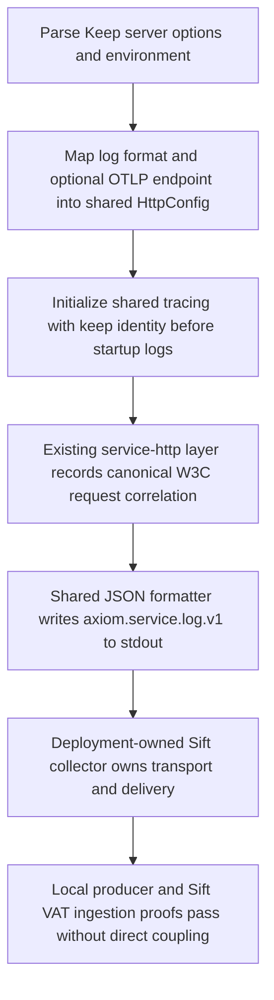

## Logic
<!-- type: logic lang: mermaid -->


## Changes
<!-- type: changes lang: yaml -->

```yaml
changes:
  - path: apps/keep/Cargo.toml
    action: modify
    section: logic
    impl_mode: hand-written
    description: Add an opt-in otel feature forwarding only to service-http/otlp, preserving logging-only default builds.
  - path: apps/keep/src/bin/keep.rs
    action: modify
    section: logic
    impl_mode: hand-written
    anchor: ServeArgs
    description: Add pretty/json log-format and optional OTLP endpoint settings under Keep-owned flags and environment names.
  - path: apps/keep/src/bin/keep.rs
    action: modify
    section: logic
    impl_mode: hand-written
    anchor: serve_main
    description: Map parsed Keep observability settings into service_http::HttpConfig and ServiceIdentity, and initialize shared tracing before startup logs replace the local fmt subscriber.
  - path: apps/keep/src/bin/keep.rs
    action: modify
    section: logic
    impl_mode: hand-written
    anchor: run_operator
    description: Initialize the controller with the same shared producer contract from KEEP_LOG_LEVEL, KEEP_LOG_FORMAT, and KEEP_OTLP_ENDPOINT environment settings.
  - path: apps/keep/k8s/base/configmap.yaml
    action: modify
    section: logic
    impl_mode: hand-written
    description: Declare KEEP_LOG_FORMAT=json as the deployed server default while retaining overlay control over the existing config map.
  - path: apps/keep/k8s/base/statefulset.yaml
    action: modify
    section: logic
    impl_mode: hand-written
    description: Project KEEP_LOG_FORMAT from keep-config into every serving pod so the deployment stdout is collector-compatible.
  - path: apps/keep/k8s/operator/deployment.yaml
    action: modify
    section: logic
    impl_mode: hand-written
    description: Set KEEP_LOG_FORMAT=json for the controller process, which uses the same shared observability initialization as the server.
  - path: apps/keep/src/operator/render.rs
    action: modify
    section: logic
    impl_mode: hand-written
    anchor: configmap
    description: Include KEEP_LOG_FORMAT=json in operator-rendered serving ConfigMaps.
  - path: apps/keep/src/operator/render.rs
    action: modify
    section: logic
    impl_mode: hand-written
    anchor: statefulset
    description: Project KEEP_LOG_FORMAT from the rendered ConfigMap into all operator-rendered StatefulSet pods.
  - path: apps/keep/tests/structured_stdout_traceparent.rs
    action: create
    section: unit-test
    impl_mode: hand-written
    description: Spawn the compiled Keep server with JSON logging, exercise valid invalid and absent W3C traceparent requests, and assert schema identity correlation and Sift agnosticism from captured stdout.
  - path: apps/keep/tests/operator.rs
    action: modify
    section: unit-test
    impl_mode: hand-written
    anchor: render_emits_downward_api_statefulset
    description: Assert operator-rendered ConfigMap and StatefulSet preserve the JSON logging key and environment projection.
  - path: apps/keep/README.md
    action: modify
    section: logic
    impl_mode: hand-written
    description: Document standard producer controls and state that Sift collector transport configuration remains deployment-owned rather than a Keep setting.
```
## Unit Test

```mermaid
---
id: keep-sift-operational-telemetry-contract-verification
requirements:
  collector_ingest:
    id: R6
    text: "The Sift-owned VAT operational-log integration starts a real Keep process and queries its accepted durable records by stable keep identity without rejected events."
    kind: e2e
    risk: high
    verify: cargo test -p sift --test vat_service_observability_e2e
  deployment_json:
    id: R5
    text: "Base Kubernetes manifests and operator-rendered StatefulSet configuration choose KEEP_LOG_FORMAT=json for all deployed Keep service roles."
    kind: deployment
    risk: high
    verify: cargo test -p keep --test operator --features operator
  invalid_or_missing_w3c:
    id: R3
    text: "Invalid or absent traceparent input keeps request behavior successful and emits an independent nonzero correlation context."
    kind: regression
    risk: medium
    verify: cargo test -p keep --test structured_stdout_traceparent
  sift_agnostic:
    id: R4
    text: "Keep exposes standard producer controls only and contains no direct Sift crate dependency or Sift endpoint credential or transport configuration."
    kind: boundary
    risk: high
    verify: cargo test -p keep --test structured_stdout_traceparent
  structured_stdout:
    id: R1
    text: "A real default Keep server started with --log-format json writes only axiom.service.log.v1 records to stdout with service.name=keep."
    kind: functional
    risk: medium
    verify: cargo test -p keep --test structured_stdout_traceparent
  valid_w3c:
    id: R2
    text: "A valid W3C traceparent sent to Keep's HTTP data plane preserves trace id parent span id and flags in the correlated structured request event."
    kind: functional
    risk: medium
    verify: cargo test -p keep --test structured_stdout_traceparent
---
flowchart TD
    r1[R1 structured stdout] --> cargo_test_p_keep_test_structured_stdout_traceparent[cargo test -p keep --test structured_stdout_traceparent]
    r2[R2 valid w3c] --> cargo_test_p_keep_test_structured_stdout_traceparent
    r3[R3 invalid or missing w3c] --> cargo_test_p_keep_test_structured_stdout_traceparent
    r4[R4 sift agnostic] --> cargo_test_p_keep_test_structured_stdout_traceparent
    r5[R5 deployment json] --> cargo_test_p_keep_test_operator_features_operator[cargo test -p keep --test operator --features operator]
    r6[R6 collector ingest] --> cargo_test_p_sift_test_vat_service_observability_e2e[cargo test -p sift --test vat_service_observability_e2e]
```

<!-- type: unit-test lang: mermaid -->


