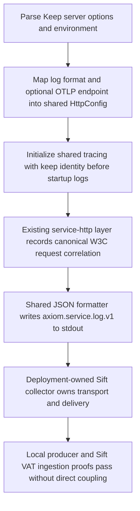

## Logic
<!-- type: logic lang: mermaid -->


## Changes
<!-- type: changes lang: yaml -->

```yaml
changes:
  - path: apps/keep/Cargo.toml
    action: modify
    section: logic
    impl_mode: hand-written
    description: Add Keep's opt-in otel feature as a thin forwarding feature to service-http/otlp; the default build stays structured-log-only.
  - path: apps/keep/src/bin/keep.rs
    action: modify
    section: logic
    impl_mode: hand-written
    anchor: ServeArgs
    description: Add KEEP_LOG_FORMAT and KEEP_OTLP_ENDPOINT CLI/environment configuration, map Keep's values to service_http::HttpConfig and ServiceIdentity, and replace the local tracing-subscriber initialization in the default server path with shared observability initialization.
  - path: apps/keep/tests/structured_stdout_traceparent.rs
    action: create
    section: unit-test
    impl_mode: hand-written
    description: Start the compiled Keep server with JSON logging, issue valid, invalid, and absent traceparent HTTP requests, capture stdout, and assert axiom.service.log.v1 identity, W3C correlation behavior, and no Sift dependency.
  - path: apps/keep/README.md
    action: modify
    section: logic
    impl_mode: hand-written
    description: Document the standard --log-format and optional KEEP_OTLP_ENDPOINT operating controls, while stating that Sift collector endpoint, credentials, and delivery policy remain deployment-owned.
```

## Unit Test

```mermaid
---
id: keep-sift-operational-telemetry-verification
requirements:
  collector_ingest:
    id: R5
    text: "The Sift-owned VAT operational-log integration starts a real Keep process and can query its accepted durable records by the stable keep identity without rejected events."
    kind: e2e
    risk: high
    verify: cargo test -p sift --test vat_service_observability_e2e
  invalid_or_missing_w3c:
    id: R3
    text: "Invalid or missing traceparent input remains available as a fresh nonzero correlation context and does not fail a Keep HTTP request."
    kind: regression
    risk: medium
    verify: cargo test -p keep --test structured_stdout_traceparent
  sift_agnostic:
    id: R4
    text: "Keep exposes standard producer controls only and has no direct Sift crate dependency or Sift endpoint, credential, or transport configuration."
    kind: boundary
    risk: high
    verify: cargo test -p keep --test structured_stdout_traceparent
  structured_stdout:
    id: R1
    text: "A real default Keep server started with --log-format json writes only axiom.service.log.v1 records to stdout with service.name=keep."
    kind: functional
    risk: medium
    verify: cargo test -p keep --test structured_stdout_traceparent
  valid_w3c:
    id: R2
    text: "A valid W3C traceparent sent to Keep's HTTP data plane preserves its trace id, parent span id, and flags in the correlated structured request event."
    kind: functional
    risk: medium
    verify: cargo test -p keep --test structured_stdout_traceparent
---
flowchart TD
    r1[R1 structured stdout] --> cargo_test_p_keep_test_structured_stdout_traceparent[cargo test -p keep --test structured_stdout_traceparent]
    r2[R2 valid w3c] --> cargo_test_p_keep_test_structured_stdout_traceparent
    r3[R3 invalid or missing w3c] --> cargo_test_p_keep_test_structured_stdout_traceparent
    r4[R4 sift agnostic] --> cargo_test_p_keep_test_structured_stdout_traceparent
    r5[R5 collector ingest] --> cargo_test_p_sift_test_vat_service_observability_e2e[cargo test -p sift --test vat_service_observability_e2e]
```

<!-- type: unit-test lang: mermaid -->


