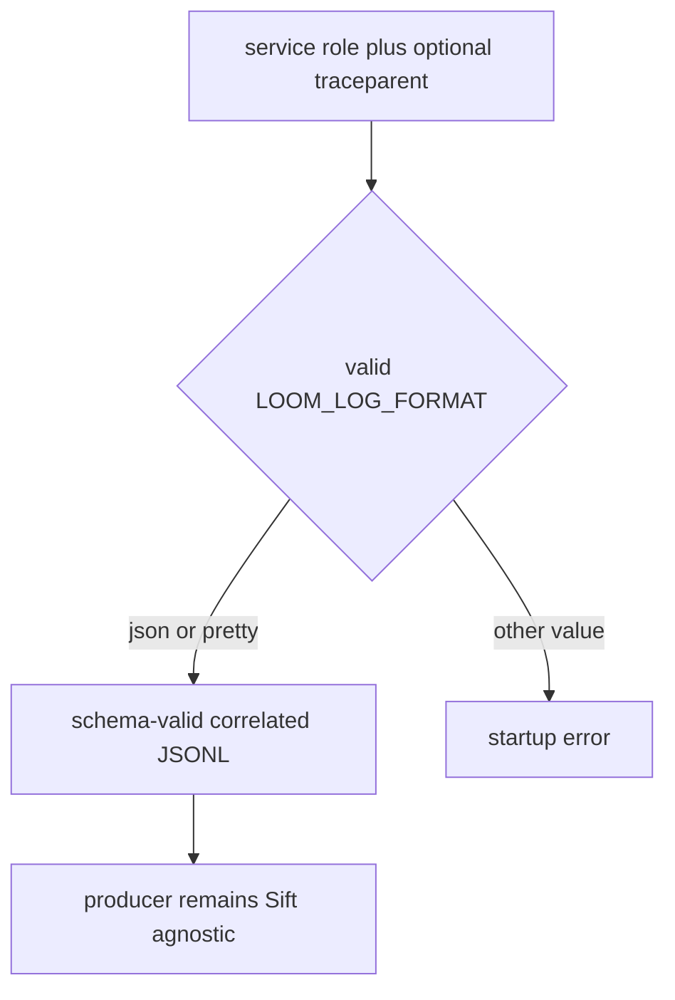

## Logic
<!-- type: logic lang: mermaid -->



The contract is stable across Loom roles. JSON mode produces axiom.service.log.v1 records with service.name=loom; every HTTP response yields one shared http_request_complete event after the response. Valid W3C input preserves trace_id, parent_span_id, and trace_flags while creating a local span id; missing or malformed input yields a valid root record. Pretty mode retains human local logs. Invalid logging format is rejected before a role starts. Optional OTLP is configured only through the shared initializer.

The negative contract is equally important: Loom has no Sift crate dependency and accepts no Sift URL, token, header, or collector configuration. JSONL stays on normal process stdout for a collector supplied and operated by Sift. Replica count, raft state, workflow dispatch, payload ownership, and controller routes are unchanged.
## Changes
<!-- type: changes lang: yaml -->

```yaml
changes:
  - path: libs/service-http/src/transport.rs
    action: modify
    section: logic
    impl_mode: hand-written
    anchor: trace_layer
    description: Specify the response-completion event as the shared HTTP contract used by Loom.
  - path: apps/loom/src/main.rs
    action: modify
    section: logic
    impl_mode: hand-written
    anchor: main
    description: Enforce logging configuration validation and shared identity initialization at long-running role entry.
  - path: apps/loom/src/operator/render.rs
    action: modify
    section: logic
    impl_mode: hand-written
    anchor: extra_env
    description: Preserve the production JSON logging contract in rendered workloads.
  - path: apps/loom/k8s/base/statefulset.yaml
    action: modify
    section: logic
    impl_mode: hand-written
    description: Preserve the production JSON logging contract in checked-in workloads.
  - path: apps/loom/tests/structured_stdout_traceparent.rs
    action: create
    section: unit-test
    impl_mode: hand-written
    description: Verify response JSONL schema, W3C handling, no-Sift boundary, and workload configuration from a real process.
```
## Unit Test

```mermaid
---
id: loom-telemetry-contract-verification
requirements:
  fallback_contract:
    id: R2
    text: "Missing and malformed traceparent values do not crash Loom and produce independent valid local correlation roots."
    kind: negative
    risk: medium
    verify: apps/loom/tests/structured_stdout_traceparent.rs::real_loom_controller_correlates_structured_stdout
  jsonl_contract:
    id: R1
    text: "A valid W3C request to a real Loom controller produces a schema-valid completion record with Loom identity, inherited trace id, parent span id, flags, and a distinct local span."
    kind: functional
    risk: high
    verify: apps/loom/tests/structured_stdout_traceparent.rs::real_loom_controller_correlates_structured_stdout
  rendered_json_contract:
    id: R4
    text: "The controller static and operator-rendered workloads select JSON logging without modifying scale or state inputs."
    kind: regression
    risk: medium
    verify: apps/loom/tests/structured_stdout_traceparent.rs::loom_workloads_request_json_logging
  sift_boundary_contract:
    id: R3
    text: "The producer does not acquire a direct Sift linkage while the future external collector can consume stdout unchanged."
    kind: negative
    risk: high
    verify: apps/loom/tests/structured_stdout_traceparent.rs::loom_remains_sift_agnostic
---
flowchart TD
    r1[R1 jsonl contract] --> apps_loom_tests_structured_stdout_traceparent_rs_real_loom_controller_correlates_structured_stdout[apps/loom/tests/structured_stdout_traceparent.rs::real_loom_controller_correlates_structured_stdout]
    r2[R2 fallback contract] --> apps_loom_tests_structured_stdout_traceparent_rs_real_loom_controller_correlates_structured_stdout
    r3[R3 sift boundary contract] --> apps_loom_tests_structured_stdout_traceparent_rs_loom_remains_sift_agnostic[apps/loom/tests/structured_stdout_traceparent.rs::loom_remains_sift_agnostic]
    r4[R4 rendered json contract] --> apps_loom_tests_structured_stdout_traceparent_rs_loom_workloads_request_json_logging[apps/loom/tests/structured_stdout_traceparent.rs::loom_workloads_request_json_logging]
```

<!-- type: unit-test lang: mermaid -->


